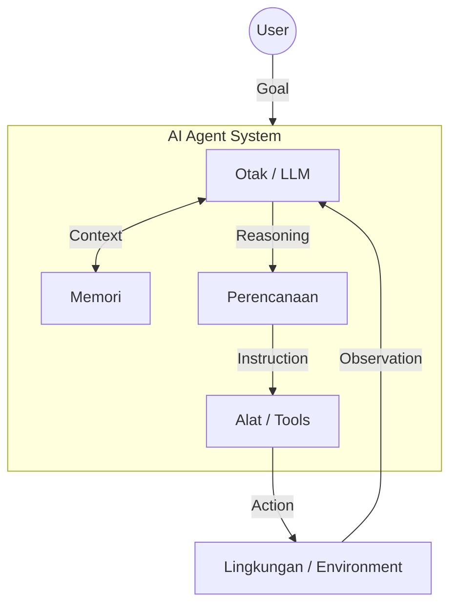

## Pengantar: Evolusi dari "Mulut" ke "Tangan"

Jika [[LLM]] (Large Language Model) adalah **otak** yang sangat cerdas namun terkurung dalam toples kaca—hanya bisa berpikir dan berbicara—maka **AI Agent** adalah otak tersebut yang telah diberikan **tubuh, tangan, dan indera**.

Bayangkan seorang profesor jenius (LLM) yang terkunci di ruang kosong. Dia bisa menjawab pertanyaan apa pun tentang fisika, tapi dia tidak bisa menyeduh kopi atau memperbaiki mobil karena dia tidak memiliki akses fisik ke dunia. AI Agent adalah momen ketika kita memberikan profesor tersebut akses ke internet, kemampuan menjalankan kode, dan hak untuk menggunakan aplikasi lain. Dia bertransformasi dari sekadar **pemberi saran** menjadi **pekerja otonom** yang dapat menyelesaikan tugas.

## Anatomi Agen: Formula Lilian Weng

Berdasarkan definisi fundamental dari **Lilian Weng** (OpenAI), sebuah agen otonom dapat dirumuskan sebagai:

$$ \text{Agent} = \text{LLM} + \text{Planning} + \text{Memory} + \text{Tool Use} $$

Berikut adalah bedah komponennya:

### 1. Otak (The Brain)
Inti pemrosesan (misal: GPT-5, Claude 4.5 Opus/Sonnet). Bertugas melakukan **penalaran (reasoning)** dan pengambilan keputusan.

### 2. Perencanaan (The Strategy)
Kemampuan untuk memecah tujuan besar menjadi langkah-langkah kecil (*Task Decomposition*).
-   **Chain of Thought**: Berpikir langkah demi langkah.
-   **Reflection**: Mengkritik dan memperbaiki rencana sendiri ("Apakah langkah ini berhasil? Jika tidak, apa yang harus diubah?").

### 3. Memori (The Notebook)
-   **Short-term**: Konteks percakapan saat ini (In-context learning).
-   **Long-term**: Penyimpanan informasi persisten menggunakan **Vector Database** (RAG), memungkinkan agen "mengingat" interaksi masa lalu.

### 4. Alat (The Hands)
Antarmuka untuk berinteraksi dengan dunia luar.
-   **Function Calling**: Memanggil API eksternal.
-   **Code Execution**: Menjalankan skrip Python (seperti di [[E2B]]).
-   **MCP (Model Context Protocol)**: Standar baru untuk menghubungkan AI dengan data lokal dan tools secara aman.

## Spektrum Otonomi: Workflows vs Agents

Menurut riset **Anthropic (2024)**, penting untuk membedakan antara "Workflows" dan "Agents":

| Fitur | Workflows | Agents |
|-------|-----------|--------|
| **Kontrol** | Manusia mendefinisikan jalur kode (Code-driven). | LLM menentukan jalur sendiri (Model-driven). |
| **Prediktabilitas** | Tinggi (Deterministik). | Rendah (Probabilistik/Kreatif). |
| **Fleksibilitas** | Kaku, hanya menangani kasus yang diprogram. | Tinggi, dapat beradaptasi dengan situasi baru. |
| **Use Case** | Data processing rutin, migrasi data. | Riset terbuka, coding kompleks, customer support. |

## Pola Arsitektur (Architectural Patterns)

### 1. ReAct (Reason + Act)
Pola paling dasar di mana agen melakukan siklus: **Pikirkan** apa yang harus dilakukan -> **Lakukan** aksi -> **Observasi** hasilnya -> Ulangi.

### 2. Plan-and-Execute
Memisahkan proses menjadi dua tahap:
1.  **Planner**: Membuat daftar langkah lengkap di awal.
2.  **Executor**: Menjalankan langkah satu per satu.
Cocok untuk tugas kompleks yang butuh strategi jangka panjang.

### 3. Multi-Agent Orchestration (Supervisor Pattern)
Alih-alih satu agen super, kita menggunakan tim agen spesialis yang dikoordinasi oleh satu "Supervisor".
-   **Supervisor**: "Tolong buatkan game Snake."
-   **Coder Agent**: Menulis kode Python.
-   **Reviewer Agent**: Menjalankan kode dan melaporkan error.
-   **Supervisor**: Melihat error, meminta Coder memperbaiki.

## Tantangan dan Tren 2025

### Simplicity over Complexity
Meskipun framework seperti **LangGraph** atau **CrewAI** populer, tren terbaru menyarankan untuk memulai dengan **pola sederhana** (simple patterns) menggunakan kode reguler, dan hanya beralih ke framework kompleks jika benar-benar diperlukan.

### Agentic Reliability
Tantangan terbesar adalah konsistensi. Agen sering terjebak dalam "loop" atau mengalami kegagalan beruntun. Solusinya adalah:
-   **Evaluation**: Testing ketat pada setiap sub-tugas.
-   **Human-in-the-loop**: Meminta konfirmasi manusia untuk langkah kritis.

## Refleksi

Transisi dari Chatbot ke AI Agent adalah lompatan dari **informasi** ke **aksi**. Kita tidak lagi bertanya "Bagaimana cara melakukan X?" kepada komputer, melainkan berkata "Tolong kerjakan X untukku," dan komputer itu benar-benar menyelesaikannya—terkadang dengan cara yang mengejutkan kita sendiri.
