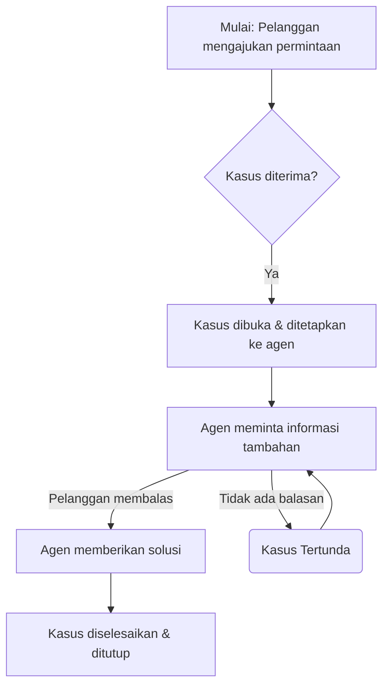

Alur kerja, pada intinya, adalah cara kita menyelesaikan pekerjaan, langkah demi langkah, dari awal hingga akhir. Ini adalah urutan tugas dan kondisi yang berulang, sebuah peta jalan yang memandu proses. Baik itu dalam skala besar di sistem komputasi _cloud_ atau dalam rutinitas harian kita sendiri, alur kerja menjelaskan bagaimana sesuatu bergerak dari satu keadaan ke keadaan berikutnya hingga selesai.

Melihat suatu pekerjaan sebagai sebuah alur kerja membantu kita memecahnya menjadi bagian-bagian yang lebih kecil dan dapat dikelola. Ini bukan sekadar daftar tugas, melainkan pemahaman tentang ketergantungan antar langkah, siapa yang bertanggung jawab, dan apa yang memicu pergerakan selanjutnya. Dengan memvisualisasikan alur kerja—mungkin dalam diagram sederhana—kita bisa mengidentifikasi di mana letak potensi hambatan, redundansi, atau area yang bisa dioptimalkan.

Sebagai contoh sederhana, bayangkan alur kerja permintaan dukungan pelanggan:
Tentu, ini adalah kode Mermaid yang digunakan dalam contoh alur kerja dukungan pelanggan sebelumnya:

Manfaatnya terasa signifikan: alur kerja yang terdefinisi dengan baik meningkatkan keandalan, menyederhanakan kompleksitas, dan memungkinkan skalabilitas. Ia memisahkan logika kendali proses dari logika bisnis inti, artinya kita bisa mengubah "apa yang kita lakukan" tanpa merombak total "bagaimana kita melakukannya." Ini mengurangi potensi kesalahan manusia dan membebaskan kita dari tugas-tugas berulang, memberi ruang untuk fokus pada pemikiran yang lebih kreatif atau tugas yang lebih penting.

Dari dukungan pelanggan, pemenuhan pesanan _e-commerce_, hingga _onboarding_ karyawan baru, setiap proses yang memiliki langkah berulang dapat dianggap sebagai alur kerja. Bahkan dalam ranah pribadi, kita memiliki alur kerja untuk belajar, menulis, atau merencanakan. Memahami dan mengoptimalkan alur kerja ini bukan hanya tentang efisiensi mesin, tetapi juga tentang bagaimana kita mengatur pikiran dan tindakan kita sendiri untuk mencapai hasil yang lebih baik dan lebih konsisten. Ini adalah cara untuk membawa kesadaran pada setiap langkah proses.