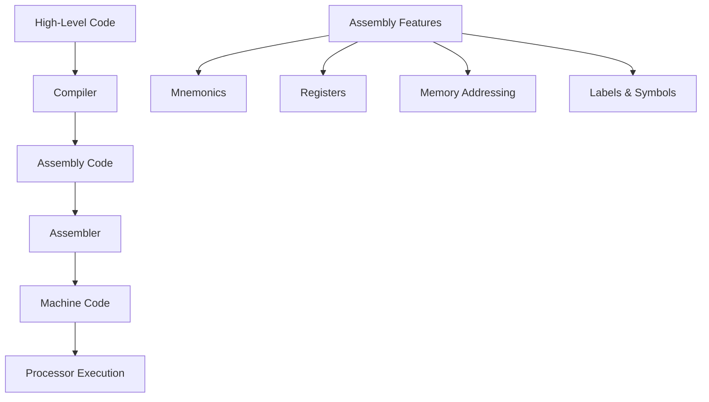
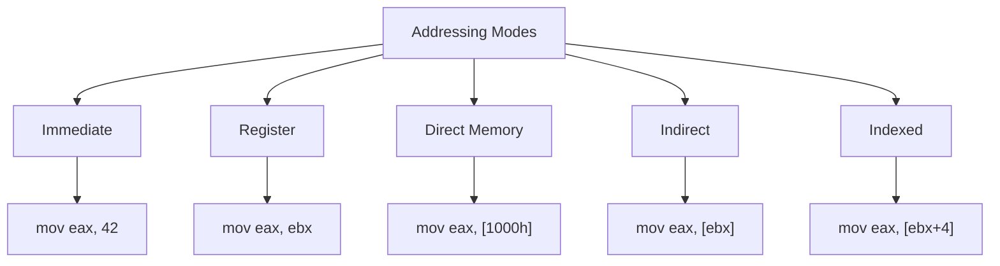
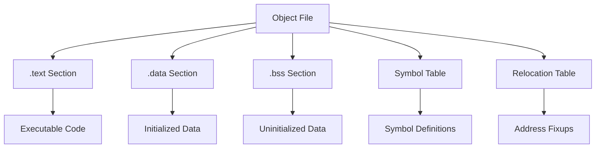
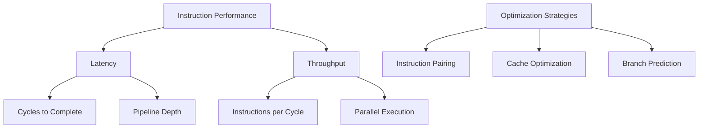

## Pengantar: Penerjemah Tingkat Rendah

Assembler adalah **tukang las digital yang menyelesaikan pekerjaan akhir**. Ia mengubah instruksi assembly (human-readable) menjadi machine code (binary) yang dapat dieksekusi langsung oleh processor, seperti tukang las yang menyatukan semua komponen menjadi produk final yang siap pakai.

## Konsep Fundamental: From Mnemonics to Machine Code

### Assembly Language - Bahasa Perantara
Assembly language seperti **bahasa isyarat yang dipahami programmer dan mesin** - lebih readable daripada binary, tapi masih sangat dekat dengan hardware.



### Instruction Set Architecture (ISA)
| Architecture | Characteristics | Common Instructions |
|--------------|----------------|-------------------|
| **x86-64** | CISC, variable length | MOV, ADD, JMP, CALL |
| **ARM** | RISC, fixed length | LDR, STR, ADD, B |
| **RISC-V** | Open RISC, modular | ADDI, LW, SW, BEQ |
| **MIPS** | Academic RISC | LW, SW, ADD, BEQ |

## Assembler Process: Translation Pipeline

### Two-Pass Assembly
Assembler bekerja seperti **editor yang membaca naskah dua kali** - pass pertama untuk memahami struktur, pass kedua untuk finalisasi.

```
Pass 1: Symbol Table Construction
- Scan source code
- Build symbol table (labels, variables)
- Calculate addresses
- Handle forward references

Pass 2: Code Generation  
- Generate machine code
- Resolve symbol references
- Apply relocations
- Output object file
```

### Symbol Resolution
```assembly
; Forward reference example
main:
    call function_a     ; Forward reference
    mov eax, variable   ; Variable reference
    ret

function_a:             ; Symbol definition
    mov eax, 42
    ret

variable: dd 100        ; Data symbol
```

## Assembly Language Syntax: Grammar Mesin

### Intel vs AT&T Syntax
```assembly
; Intel syntax (destination, source)
mov eax, ebx           ; Move ebx to eax
add eax, 10            ; Add 10 to eax
mov [eax], ebx         ; Move ebx to memory at eax

; AT&T syntax (source, destination)  
movl %ebx, %eax        ; Move ebx to eax
addl $10, %eax         ; Add 10 to eax
movl %ebx, (%eax)      ; Move ebx to memory at eax
```

### Addressing Modes - Cara Akses Data


## Modern Assembler Features

### Macro System - Template Expansion
```assembly
; Macro definition
%macro PRINT_NUM 1
    mov eax, %1
    call print_integer
%endmacro

; Macro usage
PRINT_NUM 42           ; Expands to mov eax, 42; call print_integer
PRINT_NUM variable     ; Expands to mov eax, variable; call print_integer
```

### Conditional Assembly
```assembly
%ifdef DEBUG
    call debug_print
%endif

%if PLATFORM == WINDOWS
    call windows_function
%elif PLATFORM == LINUX  
    call linux_function
%endif
```

### Advanced Directives
| Directive | Purpose | Example |
|-----------|---------|---------|
| **SECTION** | Define code/data sections | `section .text` |
| **ALIGN** | Memory alignment | `align 16` |
| **TIMES** | Repeat instruction/data | `times 10 db 0` |
| **INCBIN** | Include binary file | `incbin "data.bin"` |

## Object File Generation: Structured Output

### Object File Sections


### Relocation Types
- **Absolute**: Direct address reference
- **Relative**: PC-relative addressing (jumps, calls)
- **GOT**: Global Offset Table (shared libraries)
- **PLT**: Procedure Linkage Table (dynamic linking)

## Cross-Platform Assembly: Architecture Differences

### x86-64 Assembly
```assembly
; System call example (Linux)
section .data
    msg db 'Hello, World!', 0xA
    msg_len equ $ - msg

section .text
    global _start

_start:
    ; write system call
    mov rax, 1          ; sys_write
    mov rdi, 1          ; stdout
    mov rsi, msg        ; message
    mov rdx, msg_len    ; length
    syscall
    
    ; exit system call
    mov rax, 60         ; sys_exit
    mov rdi, 0          ; status
    syscall
```

### ARM Assembly
```assembly
.section .data
msg:    .ascii "Hello, World!\n"
msg_len = . - msg

.section .text
.global _start

_start:
    @ write system call
    mov r7, #4          @ sys_write
    mov r0, #1          @ stdout
    ldr r1, =msg        @ message
    mov r2, #msg_len    @ length
    swi 0               @ system call
    
    @ exit system call
    mov r7, #1          @ sys_exit
    mov r0, #0          @ status
    swi 0               @ system call
```

## Optimization dalam Assembly

### Instruction Scheduling
```assembly
; Poor scheduling - pipeline stalls
mov eax, [memory1]
add eax, 10            ; Depends on previous instruction
mov [memory2], eax     ; Depends on previous instruction

; Better scheduling - hide latency
mov eax, [memory1]     ; Load starts
mov ebx, [memory3]     ; Independent load
add eax, 10            ; eax ready by now
mov [memory2], eax     ; Store result
```

### Register Allocation
| Strategy | Approach | Benefit |
|----------|----------|---------|
| **Manual** | Programmer controls | Optimal for critical code |
| **Compiler-Generated** | Automated allocation | Consistent, less error-prone |
| **Mixed** | Critical parts manual | Balance of control and productivity |

## Debugging Assembly Code

### Debug Information
```assembly
; DWARF debug info generation
section .debug_info
    ; Debug information entries
    
section .debug_line
    ; Line number information
    
section .debug_frame
    ; Call frame information
```

### Common Debugging Techniques
- **Single-stepping** through instructions
- **Register inspection** at breakpoints
- **Memory dumps** untuk data analysis
- **Disassembly** dari optimized code

## Modern Assembler Tools

### GNU Assembler (GAS)
```bash
# Assemble and link
as -64 program.s -o program.o
ld program.o -o program

# With debugging information
as -64 --gstabs program.s -o program.o
```

### NASM (Netwide Assembler)
```bash
# Assemble for different formats
nasm -f elf64 program.asm -o program.o    # Linux 64-bit
nasm -f win64 program.asm -o program.obj  # Windows 64-bit
nasm -f macho64 program.asm -o program.o  # macOS 64-bit
```

### Inline Assembly
```c
// GCC inline assembly
int add_asm(int a, int b) {
    int result;
    asm volatile (
        "addl %1, %2\n\t"
        "movl %2, %0"
        : "=r" (result)           // Output
        : "r" (a), "r" (b)        // Input
        : "cc"                    // Clobbered
    );
    return result;
}
```

## Performance Considerations

### Instruction Latency dan Throughput


### Cache-Friendly Assembly
- **Code locality**: Keep related code together
- **Data alignment**: Align data to cache line boundaries
- **Prefetching**: Use prefetch instructions for predictable access
- **Loop unrolling**: Reduce branch overhead

## Security Considerations

### Assembly-Level Vulnerabilities
| Vulnerability | Description | Mitigation |
|---------------|-------------|------------|
| **Buffer Overflow** | Stack/heap corruption | Stack canaries, ASLR |
| **ROP/JOP** | Return/Jump-oriented programming | CFI, CET |
| **Side-Channel** | Timing/cache attacks | Constant-time algorithms |
| **Speculative Execution** | Spectre/Meltdown | Microcode updates, barriers |

### Secure Coding Practices
```assembly
; Clear sensitive data
mov eax, 0
mov [password_buffer], eax
mov [password_buffer+4], eax
; ... clear entire buffer

; Constant-time comparison
xor eax, eax               ; result = 0
mov ecx, password_len
cmp_loop:
    mov bl, [input + ecx - 1]
    xor bl, [stored + ecx - 1]
    or al, bl              ; accumulate differences
    loop cmp_loop
; eax == 0 if passwords match
```

## Future of Assembly Programming

### Modern Use Cases
- **Embedded systems** dengan resource constraints
- **Cryptographic implementations** untuk constant-time operations
- **High-performance computing** untuk critical kernels
- **System programming** untuk OS kernels dan drivers
- **Reverse engineering** dan security research

### WebAssembly (WASM)
```wat
;; WebAssembly Text Format
(module
  (func $add (param $a i32) (param $b i32) (result i32)
    local.get $a
    local.get $b
    i32.add
  )
  (export "add" (func $add))
)
```

---

*Catatan ini mengeksplorasi Assembler sebagai bridge fundamental antara human-readable code dan machine execution, covering traditional assembly programming hingga modern applications.*