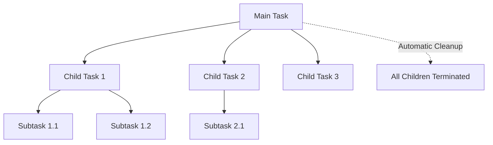
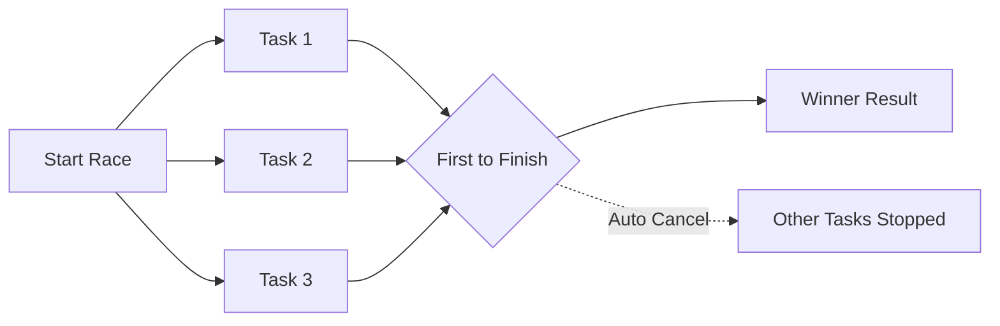
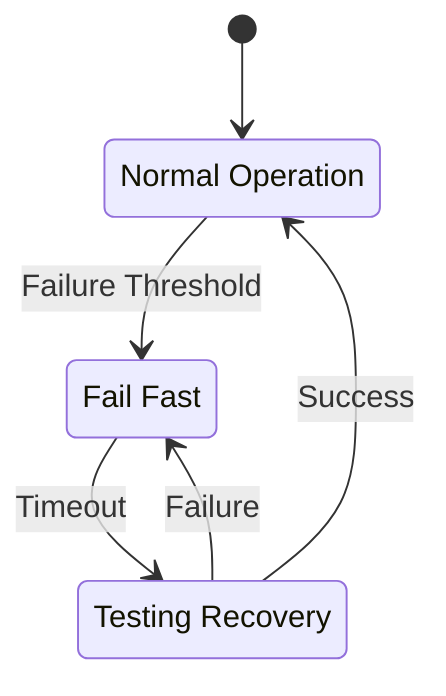
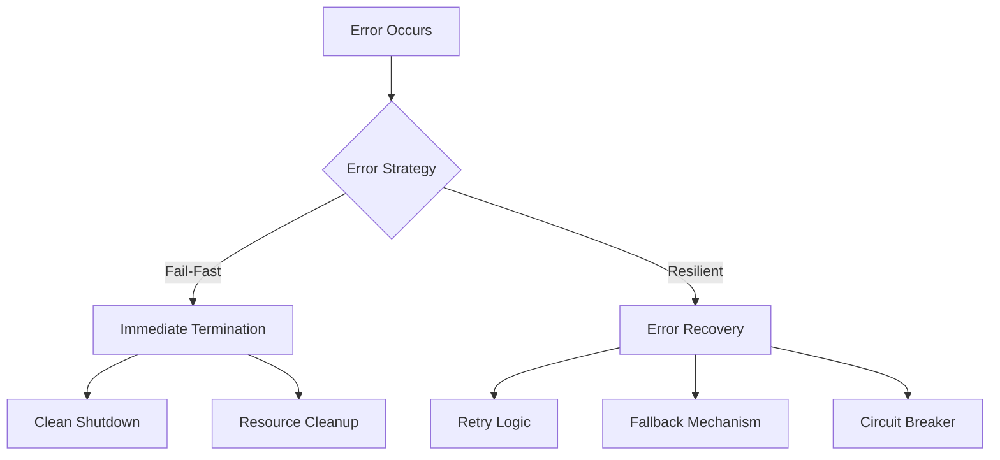

## Pengantar: Seni Koordinasi Paralel

Concurrency Patterns adalah **seni koordinasi orkestra paralel** di mana multiple tasks bekerja bersamaan tanpa chaos. Seperti konduktor yang mengatur musisi untuk bermain harmonis, patterns ini mengatur concurrent operations untuk mencapai tujuan bersama dengan efisien dan aman.

## Structured Concurrency: Fondasi Organisasi

### Hierarchical Task Management
Structured concurrency seperti **sistem manajemen perusahaan yang terorganisir** di mana setiap task memiliki parent-child relationship yang jelas. Parent task bertanggung jawab untuk lifecycle semua child tasks.



### Guaranteed Cleanup
- **Automatic resource management** ketika parent completes
- Exception propagation yang predictable
- No orphaned tasks atau resource leaks
- Deterministic program behavior

## Core Concurrency Patterns

### 1. Fork-Join Pattern - Tim Kerja Terbagi

| Aspect | Description | Use Case |
|--------|-------------|----------|
| **Fork** | Split work into parallel tasks | Data processing, parallel algorithms |
| **Join** | Wait for all tasks to complete | Aggregating results, synchronization |
| **Benefits** | Utilizes multiple cores efficiently | CPU-intensive computations |

```typescript
// Structured concurrency example
await main(function*() {
  const results = yield* all([
    processChunk(data.slice(0, 1000)),
    processChunk(data.slice(1000, 2000)),
    processChunk(data.slice(2000, 3000))
  ]);
  
  return combineResults(results);
});
```

### 2. Producer-Consumer Pattern - Pabrik Assembly Line
- **Producer** generates data seperti mesin produksi
- **Consumer** processes data seperti quality control
- **Buffer/Queue** sebagai conveyor belt yang mengatur flow
- Decoupling untuk independent scaling

### 3. Race Pattern - Kompetisi Kecepatan


## Advanced Patterns

### 4. Pipeline Pattern - Jalur Produksi Bertahap
- **Sequential stages** dengan parallel processing dalam stage
- Each stage specialized untuk specific operation
- Throughput optimization melalui overlapping execution
- Backpressure handling untuk flow control

### 5. Scatter-Gather Pattern - Distribusi dan Koleksi
- **Scatter**: Distribute work across multiple workers
- **Gather**: Collect dan combine results
- Load balancing untuk optimal resource utilization
- Fault tolerance dengan redundant processing

### 6. Circuit Breaker Pattern - Sistem Proteksi Otomatis


## Synchronization Primitives

### Mutex - Exclusive Access Guardian
- **Mutual exclusion** untuk critical sections
- Prevents race conditions dalam shared resources
- Deadlock prevention strategies
- Performance considerations untuk contention

### Semaphore - Resource Counter
- **Counting semaphore** untuk limited resources
- Binary semaphore sebagai mutex alternative
- Resource pool management
- Rate limiting applications

### Condition Variables - Event Coordination
| Pattern | Use Case | Benefit |
|---------|----------|---------|
| **Wait/Notify** | Thread coordination | Efficient blocking |
| **Broadcast** | Multiple waiters | Bulk notification |
| **Spurious Wakeup** | Robust waiting | Defensive programming |

## Message Passing Patterns

### Actor Model - Autonomous Entities
- **Isolated actors** dengan private state
- Message-based communication only
- Location transparency untuk distributed systems
- Fault isolation dan supervision trees

### Channel-Based Communication
- **Type-safe message passing** antar goroutines/tasks
- Synchronous vs asynchronous channels
- Select operations untuk multiplexing
- Buffering strategies untuk performance

## Error Handling dalam Concurrency

### Fail-Fast vs Resilience


### Supervision Strategies
- **One-for-one**: Restart failed task only
- **One-for-all**: Restart all related tasks
- **Rest-for-one**: Restart failed task dan dependents
- **Escalation**: Delegate to parent supervisor

## Performance Considerations

### Scalability Patterns
- **Work-stealing** untuk load balancing
- Lock-free algorithms untuk reduced contention
- NUMA-aware scheduling untuk modern hardware
- Adaptive concurrency berdasarkan system load

### Anti-Patterns to Avoid
| Anti-Pattern | Problem | Solution |
|--------------|---------|----------|
| **Shared Mutable State** | Race conditions | Immutable data + message passing |
| **Blocking in Async** | Thread starvation | Non-blocking alternatives |
| **Excessive Locking** | Poor performance | Lock-free data structures |
| **Unstructured Spawning** | Resource leaks | Structured concurrency |

## Testing Concurrent Code

### Deterministic Testing
- **Controlled scheduling** untuk reproducible tests
- Mock time untuk timeout testing
- Stress testing dengan high concurrency
- Property-based testing untuk race conditions

### Debugging Techniques
- **Happens-before analysis** untuk ordering bugs
- Deadlock detection tools
- Performance profiling untuk bottlenecks
- Visualization tools untuk understanding flow

## Modern Frameworks dan Libraries

### Language-Specific Implementations
- **Go**: Goroutines + channels
- **Rust**: async/await + tokio
- **JavaScript**: Promises + async/await
- **Java**: CompletableFuture + virtual threads
- **Erlang/Elixir**: Actor model + OTP

### Cross-Platform Solutions
- **gRPC**: Service-to-service communication
- **Apache Kafka**: Event streaming platform
- **Redis**: In-memory data structure store
- **RabbitMQ**: Message broker patterns

---

*Catatan ini mengeksplorasi Concurrency Patterns sebagai fundamental building blocks untuk reliable parallel programming, berdasarkan best practices dari berbagai languages dan frameworks.*