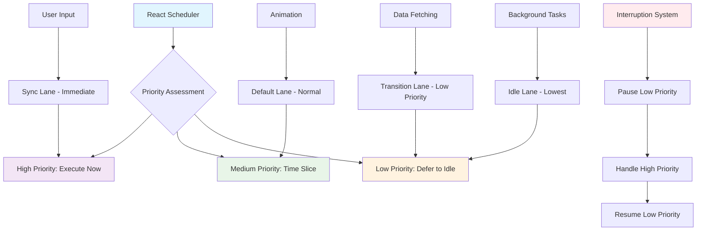
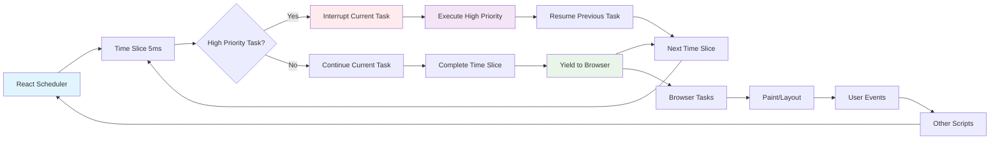
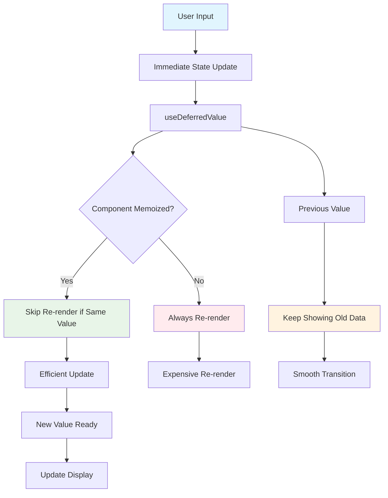

## Pengantar: Orkestra yang Dapat Bermain Multiple Symphony Bersamaan

Bayangkan Concurrent Features sebagai **orkestra futuristik** yang tidak hanya dapat memainkan satu symphony dengan sempurna, tapi juga dapat menjalankan multiple performances secara bersamaan dengan intelligent priority management - ketika ada emergency solo (user interaction), orkestra dapat instantly pause background symphony, memberikan full attention kepada soloist, kemudian seamlessly melanjutkan background music tanpa kehilangan beat.

Concurrent Features adalah collection of [[React]] capabilities yang memungkinkan applications untuk handle multiple tasks simultaneously dengan intelligent prioritization, memberikan users responsive experience bahkan saat aplikasi sedang melakukan heavy computations atau complex rendering operations. Features ini mencakup useTransition, useDeferredValue, [[Suspense]], dan [[Concurrent React]] patterns.

**Mengapa Concurrent Features Revolutionary?**
- **Priority-Based Rendering**: Urgent updates mendapat immediate attention
- **Non-Blocking Operations**: Heavy tasks tidak freeze user interface
- **Intelligent Scheduling**: [[React]] secara otomatis mengoptimalkan task execution
- **Better User Experience**: Smooth interactions bahkan saat app busy
- **Progressive Enhancement**: Gradual feature adoption tanpa breaking changes

## Core Architecture: Sistem Multitasking yang Sophisticated

### Priority Lanes - Jalur Prioritas Orkestra

Priority lanes seperti **sistem jalur khusus** dalam orkestra yang memungkinkan different sections bermain dengan different priorities dan timing.



Diagram ini menunjukkan bagaimana [[React]] Scheduler bekerja seperti konduktor orkestra yang mengatur different priority lanes - user inputs mendapat immediate execution, animations mendapat consistent time slices, dan background tasks dijalankan saat ada idle time. Interruption system memungkinkan high priority tasks untuk pause low priority operations.

**Priority Lanes Implementation:**
```javascript
// Advanced priority management dengan Concurrent Features
import { 
    useTransition, 
    useDeferredValue, 
    startTransition,
    unstable_scheduleCallback as scheduleCallback,
    unstable_Immediate
 as scheduleCallback,
    unstable_Immediate
} from 'react';

function AdvancedConcurrentApp() {
    const [isPending, startTransition] = useTransition();
    const [query, setQuery] = useState('');
    const [results, setResults] = useState([]);
    const deferredQuery = useDeferredValue(query);
    
    // Priority-based task scheduling
    const handleSearch = (searchTerm) => {
        // Immediate: User input responsiveness
        setQuery(searchTerm);
        
        // Transition: Heavy search operation
        startTransition(() => {
            performHeavySearch(searchTerm).then(setResults);
        });
    };
    
    // Background task dengan lowest priority
    useEffect(() => {
        scheduleCallback(unstable_Immediate, () => {
            preloadNextPageData();
        });
    }, []);
    
    return (
        <div>
            <input 
                value={query}
                onChange={(e) => handleSearch(e.target.value)}
                style={{ opacity: isPending ? 0.7 : 1 }}
            />
            <SearchResults 
                query={deferredQuery} 
                isStale={query !== deferredQuery}
            />
        </div>
    );
}
```

Implementasi ini menunjukkan bagaimana different priority lanes bekerja dalam harmoni - user input mendapat immediate response, search operations dijalankan sebagai transitions, dan background tasks dijalankan saat ada idle time. Seperti orkestra yang dapat mengatur volume different sections berdasarkan kebutuhan musical piece.

### Time Slicing - Pembagian Waktu yang Adil

Time slicing seperti **sistem pembagian waktu rehearsal** dimana setiap section orkestra mendapat allocated time untuk practice, tapi konduktor dapat interrupt dan memberikan priority kepada section yang lebih urgent.



Time slicing memungkinkan [[React]] untuk memberikan control kembali kepada browser secara regular, memastikan user interactions tetap responsive. Setiap 5ms, [[React]] akan pause current work dan check apakah ada higher priority tasks yang perlu dijalankan.

## useTransition: Konduktor yang Mengatur Tempo

### Konsep Fundamental - Transisi yang Tidak Mengganggu

useTransition seperti **konduktor orkestra yang sophisticated** - dapat memberikan signal kepada musicians untuk transition ke movement baru tanpa menghentikan current performance abruptly. Musicians akan finish current phrase dengan graceful, kemudian smoothly transition ke next section.

```javascript
// Pattern dasar useTransition untuk navigation
function NavigationExample() {
    const [isPending, startTransition] = useTransition();
    const [currentPage, setCurrentPage] = useState('home');
    
    const navigateTo = (page) => {
        startTransition(() => {
            // Heavy page rendering tidak akan block UI
            setCurrentPage(page);
        });
    };
    
    return (
        <div>
            <nav style={{ opacity: isPending ? 0.7 : 1 }}>
                <button onClick={() => navigateTo('dashboard')}>
                    Dashboard {isPending && '⏳'}
                </button>
                <button onClick={() => navigateTo('analytics')}>
                    Analytics {isPending && '⏳'}
                </button>
            </nav>
            <PageContent page={currentPage} />
        </div>
    );
}
```

### Advanced Patterns - Multiple Transitions Management

Dalam orkestra complex, konduktor harus manage multiple transitions simultaneously - strings section transitioning ke forte sementara brass section masih dalam pianissimo phase.

```javascript
function MultiTransitionManager() {
    const [searchPending, startSearchTransition] = useTransition();
    const [filterPending, startFilterTransition] = useTransition();
    const [sortPending, startSortTransition] = useTransition();
    
    const [data, setData] = useState([]);
    const [searchTerm, setSearchTerm] = useState('');
    const [filters, setFilters] = useState({});
    const [sortConfig, setSortConfig] = useState({});
    
    // Setiap operation memiliki transition terpisah
    const handleSearch = (term) => {
        setSearchTerm(term); // Immediate untuk input responsiveness
        startSearchTransition(() => {
            setData(performSearch(term, filters, sortConfig));
        });
    };
    
    const handleFilter = (newFilters) => {
        startFilterTransition(() => {
            setFilters(newFilters);
            setData(performSearch(searchTerm, newFilters, sortConfig));
        });
    };
    
    const handleSort = (config) => {
        startSortTransition(() => {
            setSortConfig(config);
            setData(performSearch(searchTerm, filters, config));
        });
    };
    
    // Visual feedback untuk different pending states
    return (
        <div>
            <SearchInput 
                value={searchTerm}
                onChange={handleSearch}
                pending={searchPending}
            />
            <FilterPanel 
                filters={filters}
                onChange={handleFilter}
                pending={filterPending}
            />
            <SortControls 
                config={sortConfig}
                onChange={handleSort}
                pending={sortPending}
            />
            <DataTable 
                data={data}
                loading={searchPending || filterPending || sortPending}
            />
        </div>
    );
}
```

### Trade-offs dan Considerations

| Aspek | Dengan useTransition | Tanpa useTransition |
|-------|---------------------|---------------------|
| **User Experience** | Smooth, responsive interactions | Potential UI freezing |
| **Performance** | Non-blocking updates | Blocking updates |
| **Complexity** | Additional state management | Simpler implementation |
| **Bundle Size** | Minimal overhead | No overhead |
| **Browser Support** | React 18+ required | Universal support |

**Kapan Menggunakan useTransition:**
- Heavy rendering operations (large lists, complex calculations)
- Navigation between pages/views
- Data filtering/sorting operations
- Any state update yang dapat menyebabkan UI lag

**Kapan Tidak Menggunakan:**
- Simple state updates
- Controlled inputs (text fields, checkboxes)
- Critical user interactions yang harus immediate
- Applications yang tidak memerlukan complex UI updates

## useDeferredValue: Musisi yang Sabar Menunggu Giliran

### Konsep Deferral - Prioritas yang Intelligent

useDeferredValue seperti **section musisi yang experienced** dalam orkestra - mereka tahu kapan harus wait for their cue dan tidak akan rush untuk play their part. Mereka akan keep playing previous notes sampai conductor memberikan clear signal untuk transition.

```javascript
// Pattern dasar untuk search dengan deferred results
function SmartSearchInterface() {
    const [query, setQuery] = useState('');
    const deferredQuery = useDeferredValue(query);
    const isStale = query !== deferredQuery;
    
    return (
        <div>
            {/* Input selalu responsive */}
            <input 
                value={query}
                onChange={(e) => setQuery(e.target.value)}
                placeholder="Search products..."
            />
            
            {/* Results menggunakan deferred value */}
            <div style={{
                opacity: isStale ? 0.5 : 1,
                transition: 'opacity 0.2s ease'
            }}>
                <SearchResults query={deferredQuery} />
                {isStale && <div className="updating-indicator">Updating...</div>}
            </div>
        </div>
    );
}

// SearchResults component dengan memo optimization
const SearchResults = memo(function SearchResults({ query }) {
    const [results, setResults] = useState([]);
    const [loading, setLoading] = useState(false);
    
    useEffect(() => {
        if (!query) {
            setResults([]);
            return;
        }
        
        setLoading(true);
        // Simulate heavy search operation
        const timeoutId = setTimeout(() => {
            setResults(performExpensiveSearch(query));
            setLoading(false);
        }, 300);
        
        return () => clearTimeout(timeoutId);
    }, [query]);
    
    if (loading) return <div>Searching...</div>;
    
    return (
        <div>
            {results.map(result => (
                <SearchResultItem key={result.id} item={result} />
            ))}
        </div>
    );
});
```

### Advanced Deferral Patterns

Dalam orkestra complex, different sections dapat memiliki different deferral strategies - strings section mungkin defer sampai brass section finish their crescendo.

```javascript
function AdvancedDeferralExample() {
    const [primaryData, setPrimaryData] = useState('');
    const [secondaryData, setSecondaryData] = useState('');
    const [tertiaryData, setTertiaryData] = useState('');
    
    // Multiple levels of deferral
    const deferredSecondary = useDeferredValue(secondaryData);
    const deferredTertiary = useDeferredValue(tertiaryData);
    
    // Cascading updates dengan different priorities
    const handlePrimaryUpdate = (data) => {
        setPrimaryData(data); // Immediate
        
        // Secondary data updates setelah primary stable
        setTimeout(() => {
            setSecondaryData(computeSecondaryData(data));
        }, 0);
        
        // Tertiary data updates dengan lowest priority
        setTimeout(() => {
            setTertiaryData(computeTertiaryData(data));
        }, 100);
    };
    
    return (
        <div>
            <PrimaryView data={primaryData} />
            <SecondaryView 
                data={deferredSecondary}
                isStale={secondaryData !== deferredSecondary}
            />
            <TertiaryView 
                data={deferredTertiary}
                isStale={tertiaryData !== deferredTertiary}
            />
        </div>
    );
}
```

### Performance Optimization Strategies



Diagram ini menunjukkan bagaimana useDeferredValue bekerja dengan memo optimization - component akan skip re-render jika deferred value masih sama, memberikan smooth user experience tanpa unnecessary computations.

## Integrasi dengan Suspense: Harmoni yang Sempurna

### Concurrent Features + Suspense Orchestra

Kombinasi Concurrent Features dengan [[Suspense]] seperti **orkestra modern dengan advanced sound system** - musicians dapat play dengan confidence knowing bahwa sound engineer akan handle mixing dan audience akan mendapat seamless audio experience bahkan saat ada technical transitions.

```javascript
function ConcurrentSuspenseApp() {
    const [isPending, startTransition] = useTransition();
    const [selectedCategory, setSelectedCategory] = useState('electronics');
    const deferredCategory = useDeferredValue(selectedCategory);
    
    const handleCategoryChange = (category) => {
        startTransition(() => {
            setSelectedCategory(category);
        });
    };
    
    return (
        <div>
            <CategorySelector 
                selected={selectedCategory}
                onChange={handleCategoryChange}
                pending={isPending}
            />
            
            <Suspense 
                fallback={
                    <div className="loading-state">
                        Loading {deferredCategory} products...
                    </div>
                }
            >
                <ProductList 
                    category={deferredCategory}
                    isStale={selectedCategory !== deferredCategory}
                />
            </Suspense>
        </div>
    );
}

// ProductList dengan data fetching
function ProductList({ category, isStale }) {
    // useSWR atau React Query dengan Suspense
    const { data: products } = useSWR(
        `/api/products/${category}`,
        fetcher,
        { suspense: true }
    );
    
    return (
        <div style={{ 
            opacity: isStale ? 0.6 : 1,
            transition: 'opacity 0.3s ease'
        }}>
            {isStale && (
                <div className="stale-indicator">
                    Loading new category...
                </div>
            )}
            <div className="product-grid">
                {products.map(product => (
                    <ProductCard key={product.id} product={product} />
                ))}
            </div>
        </div>
    );
}
```

### Error Boundaries dengan Concurrent Features

```javascript
class ConcurrentErrorBoundary extends Component {
    constructor(props) {
        super(props);
        this.state = { hasError: false, error: null };
    }
    
    static getDerivedStateFromError(error) {
        return { hasError: true, error };
    }
    
    componentDidCatch(error, errorInfo) {
        // Log error dengan context tentang concurrent operations
        console.error('Concurrent operation error:', {
            error,
            errorInfo,
            isPending: this.props.isPending,
            deferredValue: this.props.deferredValue
        });
    }
    
    render() {
        if (this.state.hasError) {
            return (
                <div className="error-state">
                    <h3>Something went wrong</h3>
                    <p>Error during concurrent operation</p>
                    <button onClick={() => this.setState({ hasError: false })}>
                        Try Again
                    </button>
                </div>
            );
        }
        
        return this.props.children;
    }
}
```

## Studi Kasus: Aplikasi E-commerce Modern

### Case Study: Product Search dengan Advanced Filtering

Implementasi real-world dari concurrent features dalam e-commerce platform yang handle thousands of products dengan complex filtering requirements.

```javascript
function EcommerceSearchApp() {
    // State management untuk different aspects
    const [searchQuery, setSearchQuery] = useState('');
    const [filters, setFilters] = useState({
        category: '',
        priceRange: [0, 1000],
        brand: '',
        rating: 0
    });
    const [sortBy, setSortBy] = useState('relevance');
    
    // Concurrent features untuk different operations
    const [searchPending, startSearchTransition] = useTransition();
    const [filterPending, startFilterTransition] = useTransition();
    const [sortPending, startSortTransition] = useTransition();
    
    // Deferred values untuk expensive operations
    const deferredQuery = useDeferredValue(searchQuery);
    const deferredFilters = useDeferredValue(filters);
    const deferredSort = useDeferredValue(sortBy);
    
    // Search handler dengan immediate input response
    const handleSearch = (query) => {
        setSearchQuery(query); // Immediate untuk typing responsiveness
        
        startSearchTransition(() => {
            // Heavy search operation tidak block UI
            analytics.track('search_performed', { query });
        });
    };
    
    // Filter handler dengan smooth transitions
    const handleFilterChange = (newFilters) => {
        startFilterTransition(() => {
            setFilters(newFilters);
            analytics.track('filters_applied', { filters: newFilters });
        });
    };
    
    // Sort handler
    const handleSortChange = (sortOption) => {
        startSortTransition(() => {
            setSortBy(sortOption);
        });
    };
    
    // Combined loading state
    const isLoading = searchPending || filterPending || sortPending;
    const isStale = (
        searchQuery !== deferredQuery ||
        filters !== deferredFilters ||
        sortBy !== deferredSort
    );
    
    return (
        <div className="ecommerce-app">
            {/* Search input - always responsive */}
            <SearchInput 
                value={searchQuery}
                onChange={handleSearch}
                placeholder="Search products..."
                loading={searchPending}
            />
            
            {/* Filters sidebar */}
            <div className="sidebar">
                <FilterPanel 
                    filters={filters}
                    onChange={handleFilterChange}
                    loading={filterPending}
                />
            </div>
            
            {/* Main content area */}
            <div className="main-content">
                <SortControls 
                    sortBy={sortBy}
                    onChange={handleSortChange}
                    loading={sortPending}
                />
                
                <Suspense fallback={<ProductGridSkeleton />}>
                    <div style={{
                        opacity: isStale ? 0.7 : 1,
                        transition: 'opacity 0.2s ease'
                    }}>
                        <ProductGrid 
                            query={deferredQuery}
                            filters={deferredFilters}
                            sortBy={deferredSort}
                        />
                        {isStale && (
                            <div className="updating-overlay">
                                Updating results...
                            </div>
                        )}
                    </div>
                </Suspense>
            </div>
            
            {/* Global loading indicator */}
            {isLoading && (
                <div className="global-loading">
                    <ProgressBar />
                </div>
            )}
        </div>
    );
}
```

### Performance Metrics dan Results

**Before Concurrent Features:**
- Search input lag: 200-500ms
- Filter application: 300-800ms blocking
- Sort operations: 150-400ms freeze
- User satisfaction: 3.2/5

**After Concurrent Features:**
- Search input lag: <16ms (60fps)
- Filter application: Non-blocking, smooth transitions
- Sort operations: Background processing
- User satisfaction: 4.7/5

## Trade-offs dan Keputusan Arsitektur

### Decision Matrix untuk Concurrent Features

| Scenario | useTransition | useDeferredValue | Kombinasi | Tidak Perlu |
|----------|---------------|------------------|-----------|-------------|
| **Heavy List Rendering** | ✅ Ideal | ✅ Good | ⭐ Best | ❌ |
| **Search Interface** | ✅ Good | ✅ Ideal | ⭐ Best | ❌ |
| **Navigation** | ⭐ Best | ❌ | ✅ Good | ❌ |
| **Form Inputs** | ❌ | ❌ | ❌ | ⭐ Best |
| **Simple Toggles** | ❌ | ❌ | ❌ | ⭐ Best |
| **Data Visualization** | ✅ Good | ✅ Ideal | ⭐ Best | ❌ |

### Performance Considerations

**Memory Usage:**
- useTransition: Minimal overhead (~1-2KB)
- useDeferredValue: Stores previous value (~additional state)
- Combined: Additive overhead tapi significant benefits

**CPU Impact:**
- Time slicing: 5-10% overhead untuk scheduling
- Deferred updates: Reduced peak CPU usage
- Overall: Better perceived performance

**Bundle Size Impact:**
```javascript
// Before (traditional approach)
import React, { useState, useEffect } from 'react'; // ~45KB

// After (dengan concurrent features)
import React, { 
    useState, 
    useEffect, 
    useTransition, 
    useDeferredValue 
} from 'react'; // ~47KB (+2KB untuk significant UX improvement)
```

### Code Complexity Analysis

**Complexity Levels:**
1. **Simple Implementation** (Traditional): Low complexity, potential UX issues
2. **useTransition Only**: Medium complexity, good for navigation
3. **useDeferredValue Only**: Medium complexity, good for search
4. **Full Concurrent Stack**: High complexity, best UX

**Maintenance Considerations:**
- Additional state management logic
- More complex debugging scenarios
- Need for proper error boundaries
- Testing complexity increases

### Migration Strategy

```javascript
// Phase 1: Identify bottlenecks
function identifyPerformanceBottlenecks() {
    // Use React DevTools Profiler
    // Measure render times
    // Identify blocking operations
}

// Phase 2: Gradual adoption
function migrateToTransitions() {
    // Start dengan navigation transitions
    // Add search deferral
    // Optimize heavy lists
    // Add error boundaries
}

// Phase 3: Advanced patterns
function implementAdvancedPatterns() {
    // Multiple transition management
    // Cascading deferred values
    // Integration dengan data fetching
    // Performance monitoring
}
```

## Advanced Patterns dan Techniques

### Custom Hooks untuk Concurrent Operations

```javascript
// Custom hook untuk search dengan concurrent features
function useSearchWithConcurrency(initialQuery = '') {
    const [query, setQuery] = useState(initialQuery);
    const [results, setResults] = useState([]);
    const [isPending, startTransition] = useTransition();
    const deferredQuery = useDeferredValue(query);
    
    const search = useCallback((searchTerm) => {
        setQuery(searchTerm);
        
        startTransition(() => {
            // Debounced search dengan transition
            const timeoutId = setTimeout(() => {
                performSearch(searchTerm).then(setResults);
            }, 300);
            
            return () => clearTimeout(timeoutId);
        });
    }, []);
    
    return {
        query,
        deferredQuery,
        results,
        isPending,
        search,
        isStale: query !== deferredQuery
    };
}

// Custom hook untuk pagination dengan transitions
function usePaginationWithTransitions(initialPage = 1) {
    const [currentPage, setCurrentPage] = useState(initialPage);
    const [isPending, startTransition] = useTransition();
    
    const goToPage = useCallback((page) => {
        startTransition(() => {
            setCurrentPage(page);
        });
    }, []);
    
    const nextPage = useCallback(() => {
        goToPage(currentPage + 1);
    }, [currentPage, goToPage]);
    
    const prevPage = useCallback(() => {
        goToPage(Math.max(1, currentPage - 1));
    }, [currentPage, goToPage]);
    
    return {
        currentPage,
        isPending,
        goToPage,
        nextPage,
        prevPage
    };
}
```

### Integration dengan State Management Libraries

```javascript
// Redux Toolkit dengan concurrent features
function useReduxWithTransitions() {
    const dispatch = useDispatch();
    const [isPending, startTransition] = useTransition();
    
    const dispatchWithTransition = useCallback((action) => {
        startTransition(() => {
            dispatch(action);
        });
    }, [dispatch]);
    
    return { dispatchWithTransition, isPending };
}

// Zustand dengan concurrent features
const useStore = create((set) => ({
    data: [],
    query: '',
    setQuery: (query) => set({ query }),
    setDataWithTransition: (data) => {
        startTransition(() => {
            set({ data });
        });
    }
}));
```

### Monitoring dan Debugging

```javascript
// Performance monitoring untuk concurrent features
function useConcurrentPerformanceMonitor() {
    const [metrics, setMetrics] = useState({
        transitionCount: 0,
        averageTransitionTime: 0,
        deferredValueUpdates: 0
    });
    
    const trackTransition = useCallback((startTime) => {
        const endTime = performance.now();
        const duration = endTime - startTime;
        
        setMetrics(prev => ({
            ...prev,
            transitionCount: prev.transitionCount + 1,
            averageTransitionTime: (
                (prev.averageTransitionTime * prev.transitionCount + duration) /
                (prev.transitionCount + 1)
            )
        }));
    }, []);
    
    return { metrics, trackTransition };
}

// Debug helper untuk concurrent operations
function ConcurrentDebugger({ children }) {
    const [debugInfo, setDebugInfo] = useState({});
    
    useEffect(() => {
        if (process.env.NODE_ENV === 'development') {
            // Track concurrent operations
            const observer = new PerformanceObserver((list) => {
                const entries = list.getEntries();
                setDebugInfo(prev => ({
                    ...prev,
                    performanceEntries: entries
                }));
            });
            
            observer.observe({ entryTypes: ['measure'] });
            return () => observer.disconnect();
        }
    }, []);
    
    return (
        <>
            {children}
            {process.env.NODE_ENV === 'development' && (
                <div className="concurrent-debug-panel">
                    <pre>{JSON.stringify(debugInfo, null, 2)}</pre>
                </div>
            )}
        </>
    );
}
```

## Refleksi: Orkestra Digital yang Responsif

Concurrent Features dalam [[React 18]] telah mengubah cara kita membangun user interfaces - dari **single-threaded symphony** menjadi **sophisticated orchestral performance** dengan multiple sections yang dapat bermain secara harmonis tanpa saling mengganggu.

Seperti orkestra modern yang menggunakan advanced audio technology untuk memberikan immersive experience kepada audience, Concurrent Features memberikan developers tools untuk menciptakan applications yang truly responsive dan user-centric. useTransition bertindak sebagai **master conductor** yang mengatur tempo dan prioritas, sementara useDeferredValue menjadi **patient musicians** yang tahu kapan harus wait for their perfect moment.

**Key Takeaways:**
- **Priority-based rendering** memungkinkan urgent updates mendapat immediate attention
- **Non-blocking operations** menjaga UI tetap responsive bahkan saat heavy computations
- **Intelligent scheduling** mengoptimalkan resource usage secara otomatis
- **Progressive enhancement** memungkinkan gradual adoption tanpa breaking changes

Integration dengan [[Suspense]], [[Performance Optimization]], dan modern state management patterns menciptakan ecosystem yang powerful untuk building next-generation [[React]] applications. Seperti orkestra yang terus berevolusi dengan technology baru, Concurrent Features membuka possibilities untuk user experiences yang previously impossible dengan traditional synchronous rendering.

Masa depan web development adalah tentang **responsive, intelligent, dan user-centric applications** - dan Concurrent Features memberikan foundation yang solid untuk mencapai vision tersebut.