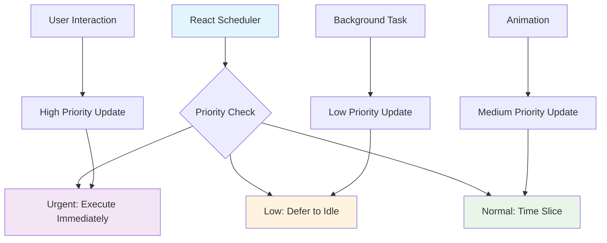

## Pengantar: Konduktor Orkestra yang Dapat Mengatur Prioritas

Bayangkan Concurrent React sebagai **konduktor orkestra yang genius** yang tidak hanya dapat mengarahkan semua musisi bermain bersamaan, tapi juga dapat mengatur prioritas - ketika ada solo violin penting (user interaction), konduktor dapat memberikan signal kepada section lain untuk bermain lebih pelan atau bahkan pause sejenak, memastikan solo tersebut terdengar jelas tanpa menghentikan seluruh pertunjukan.

Concurrent React adalah set of features dalam [[React 18]] yang memungkinkan React untuk "interrupt" rendering work, memberikan prioritas kepada urgent updates (seperti user interactions), dan melanjutkan less urgent work di background. Ini memungkinkan applications tetap responsive bahkan saat melakukan heavy computations atau rendering large component trees.

**Mengapa Concurrent React Revolutionary?**
- **Responsiveness**: User interactions selalu mendapat prioritas tertinggi
- **Better UX**: Smooth animations dan interactions bahkan saat app busy
- **Progressive Enhancement**: Gradual loading dan updates tanpa blocking UI
- **Automatic Optimization**: React secara otomatis mengoptimalkan rendering priorities
## Core Concepts: Sistem Prioritas Orkestra

### Time Slicing - Pembagian Waktu yang Cerdas

Time slicing seperti **konduktor yang membagi waktu** antara berbagai section orkestra, memastikan tidak ada yang mendominasi terlalu lama dan semua mendapat kesempatan bermain.



Diagram ini menunjukkan bagaimana React Scheduler bekerja seperti konduktor yang mengatur prioritas - user interactions mendapat immediate attention, animations mendapat time slices yang konsisten, dan background tasks dijalankan saat ada idle time. Ini memastikan UI tetap responsive tanpa mengorbankan functionality.

**Time Slicing Implementation:**
```javascript
// Concurrent rendering dengan time slicing
import { createRoot } from 'react-dom/client';
import { startTransition, useTransition, useDeferredValue } from 'react';

function SearchableProductList() {
    const [query, setQuery] = useState('');
    const [products, setProducts] = useState([]);
    const [isPending, startTransition] = useTransition();
    
    // Deferred value untuk expensive operations
    const deferredQuery = useDeferredValue(query);
    
    // High priority: User input (immediate)
    const handleInputChange = (e) => {
        setQuery(e.target.value); // Immediate update
        
        // Low priority: Expensive filtering (can be interrupted)
        startTransition(() => {
            const filtered = expensiveFilterProducts(products, e.target.value);
            setFilteredProducts(filtered);
        });
    };
    
    // Background data loading
    useEffect(() => {
        startTransition(() => {
            loadProductsFromAPI().then(setProducts);
        });
    }, []);
    
    return (
        <div>
            {/* High priority UI - always responsive */}
            <input
                value={query}
                onChange={handleInputChange}
                placeholder="Search products..."
                style={{ 
                    opacity: isPending ? 0.7 : 1,
                    transition: 'opacity 0.2s'
                }}
            />
            
            {/* Low priority UI - can be deferred */}
            <ProductGrid 
                products={products}
                query={deferredQuery}
                isPending={isPending}
            />
        </div>
    );
}

// Expensive operation yang dapat di-interrupt
function expensiveFilterProducts(products, query) {
    console.log('Filtering products...', query);
    
    return products.filter(product => {
        // Simulate expensive computation
        for (let i = 0; i < 100000; i++) {
            Math.random();
        }
        
        return product.name.toLowerCase().includes(query.toLowerCase()) ||
               product.description.toLowerCase().includes(query.toLowerCase());
    });
}

// Root dengan concurrent features enabled
const container = document.getElementById('root');
const root = createRoot(container); // Enables concurrent features
root.render(<SearchableProductList />);
```

### Interruptible Rendering - Orkestra yang Dapat Dipause

Interruptible rendering seperti **orkestra yang dapat dipause** di tengah lagu untuk memberikan kesempatan kepada soloist penting, kemudian melanjutkan dari titik yang sama.

```javascript
// Advanced concurrent patterns
class ConcurrentDataProcessor extends React.Component {
    constructor(props) {
        super(props);
        this.state = {
            data: [],
            processedData: [],
            isProcessing: false,
            progress: 0
        };
    }
    
    // Concurrent data processing dengan interruption support
    processDataConcurrently = async (rawData) => {
        this.setState({ isProcessing: true, progress: 0 });
        
        const batchSize = 100;
        const totalBatches = Math.ceil(rawData.length / batchSize);
        let processedItems = [];
        
        for (let i = 0; i < totalBatches; i++) {
            const batch = rawData.slice(i * batchSize, (i + 1) * batchSize);
            
            // Use scheduler to yield control
            await new Promise(resolve => {
                startTransition(() => {
                    // Process batch
                    const processedBatch = this.processBatch(batch);
                    processedItems = [...processedItems, ...processedBatch];
                    
                    // Update progress (low priority)
                    this.setState({
                        processedData: processedItems,
                        progress: ((i + 1) / totalBatches) * 100
                    });
                    
                    resolve();
                });
            });
            
            // Yield to browser untuk user interactions
            await this.yieldToMain();
        }
        
        this.setState({ isProcessing: false });
    };
    
    // Yield control to main thread
    yieldToMain = () => {
        return new Promise(resolve => {
            setTimeout(resolve, 0);
        });
    };
    
    processBatch = (batch) => {
        return batch.map(item => ({
            ...item,
            processed: true,
            timestamp: Date.now()
        }));
    };
    
    render() {
        const { processedData, isProcessing, progress } = this.state;
        
        return (
            <div>
                <button 
                    onClick={() => this.processDataConcurrently(this.props.rawData)}
                    disabled={isProcessing}
                >
                    {isProcessing ? `Processing... ${progress.toFixed(1)}%` : 'Process Data'}
                </button>
                
                {/* UI remains responsive during processing */}
                <div>
                    <h3>Processed Items: {processedData.length}</h3>
                    <div style={{ maxHeight: '300px', overflow: 'auto' }}>
                        {processedData.map(item => (
                            <div key={item.id}>{item.name}</div>
                        ))}
                    </div>
                </div>
            </div>
        );
    }
}
```

## Concurrent Features: Instrumen Orkestra Modern

### useTransition - Conductor's Baton untuk Priority

useTransition seperti **tongkat konduktor** yang memberikan signal kapan harus memberikan prioritas kepada section tertentu.

```javascript
// Advanced useTransition patterns
function AdvancedSearchInterface() {
    const [query, setQuery] = useState('');
    const [results, setResults] = useState([]);
    const [filters, setFilters] = useState({});
    const [isPending, startTransition] = useTransition();
    
    // Multiple concurrent transitions
    const handleSearch = useCallback((searchQuery) => {
        // Immediate: Update input (high priority)
        setQuery(searchQuery);
        
        // Deferred: Search results (low priority)
        startTransition(() => {
            performSearch(searchQuery, filters).then(setResults);
        });
    }, [filters]);
    
    const handleFilterChange = useCallback((newFilters) => {
        // Immediate: Update filter UI (high priority)
        setFilters(newFilters);
        
        // Deferred: Re-search with new filters (low priority)
        startTransition(() => {
            performSearch(query, newFilters).then(setResults);
        });
    }, [query]);
    
    // Concurrent data prefetching
    const prefetchData = useCallback((category) => {
        startTransition(() => {
            // Low priority prefetching
            prefetchCategoryData(category);
        });
    }, []);
    
    return (
        <div className="search-interface">
            {/* High priority: Always responsive */}
            <SearchInput 
                value={query}
                onChange={handleSearch}
                placeholder="Search..."
            />
            
            <FilterPanel 
                filters={filters}
                onChange={handleFilterChange}
                onCategoryHover={prefetchData}
            />
            
            {/* Low priority: Can be deferred */}
            <SearchResults 
                results={results}
                isLoading={isPending}
                query={query}
            />
        </div>
    );
}

// Optimized search with concurrent features
async function performSearch(query, filters) {
    // Simulate API call dengan realistic delay
    await new Promise(resolve => setTimeout(resolve, 300));
    
    // Expensive filtering operation
    return mockDatabase
        .filter(item => item.name.includes(query))
        .filter(item => matchesFilters(item, filters))
        .sort((a, b) => calculateRelevance(b, query) - calculateRelevance(a, query));
}

function calculateRelevance(item, query) {
    // Expensive relevance calculation
    let score = 0;
    const words = query.toLowerCase().split(' ');
    
    words.forEach(word => {
        if (item.name.toLowerCase().includes(word)) score += 10;
        if (item.description.toLowerCase().includes(word)) score += 5;
        if (item.tags.some(tag => tag.toLowerCase().includes(word))) score += 3;
    });
    
    return score;
}
```

### useDeferredValue - Delayed Gratification untuk Performance

useDeferredValue seperti **section orkestra yang bermain dengan delay** untuk menciptakan efek echo yang indah tanpa mengganggu melodi utama.

```javascript
// Advanced useDeferredValue patterns
function ResponsiveDataVisualization() {
    const [data, setData] = useState([]);
    const [viewMode, setViewMode] = useState('chart');
    const [filterCriteria, setFilterCriteria] = useState('');
    
    // Defer expensive computations
    const deferredData = useDeferredValue(data);
    const deferredFilter = useDeferredValue(filterCriteria);
    
    // Expensive data processing
    const processedData = useMemo(() => {
        console.log('Processing data...', deferredData.length, 'items');
        
        return deferredData
            .filter(item => item.name.includes(deferredFilter))
            .map(item => ({
                ...item,
                computed: expensiveComputation(item),
                trend: calculateTrend(item.history)
            }))
            .sort((a, b) => b.computed - a.computed);
    }, [deferredData, deferredFilter]);
    
    // Immediate UI updates
    const handleViewModeChange = (mode) => {
        setViewMode(mode); // Immediate update
    };
    
    const handleFilterChange = (criteria) => {
        setFilterCriteria(criteria); // Immediate input update
        // Processing will be deferred automatically
    };
    
    return (
        <div className="data-visualization">
            {/* High priority: Immediate response */}
            <div className="controls">
                <ViewModeSelector 
                    value={viewMode}
                    onChange={handleViewModeChange}
                />
                
                <FilterInput 
                    value={filterCriteria}
                    onChange={handleFilterChange}
                    placeholder="Filter data..."
                />
            </div>
            
            {/* Low priority: Deferred rendering */}
            <React.Suspense fallback={<DataVisualizationSkeleton />}>
                <DataVisualization 
                    data={processedData}
                    mode={viewMode}
                    isStale={deferredFilter !== filterCriteria}
                />
            </React.Suspense>
        </div>
    );
}

// Expensive computation yang akan di-defer
function expensiveComputation(item) {
    let result = 0;
    
    // Simulate heavy computation
    for (let i = 0; i < 10000; i++) {
        result += Math.sin(item.value * i) * Math.cos(item.timestamp * i);
    }
    
    return result;
}

function calculateTrend(history) {
    if (!history || history.length < 2) return 0;
    
    // Linear regression untuk trend calculation
    const n = history.length;
    const sumX = history.reduce((sum, _, i) => sum + i, 0);
    const sumY = history.reduce((sum, point) => sum + point.value, 0);
    const sumXY = history.reduce((sum, point, i) => sum + i * point.value, 0);
    const sumXX = history.reduce((sum, _, i) => sum + i * i, 0);
    
    const slope = (n * sumXY - sumX * sumY) / (n * sumXX - sumX * sumX);
    return slope;
}
```

## Advanced Patterns: Komposisi Orkestra Kompleks

### Concurrent Suspense - Koordinasi Async Loading

```javascript
// Advanced Concurrent Suspense patterns
function ConcurrentDataDashboard() {
    const [selectedMetric, setSelectedMetric] = useState('revenue');
    const [dateRange, setDateRange] = useState('7d');
    
    return (
        <div className="dashboard">
            {/* Immediate: Control updates */}
            <DashboardControls 
                selectedMetric={selectedMetric}
                onMetricChange={setSelectedMetric}
                dateRange={dateRange}
                onDateRangeChange={setDateRange}
            />
            
            {/* Concurrent: Multiple data sources */}
            <div className="dashboard-content">
                <React.Suspense fallback={<MetricCardSkeleton />}>
                    <MetricCard 
                        metric={selectedMetric}
                        dateRange={dateRange}
                    />
                </React.Suspense>
                
                <React.Suspense fallback={<ChartSkeleton />}>
                    <TrendChart 
                        metric={selectedMetric}
                        dateRange={dateRange}
                    />
                </React.Suspense>
                
                <React.Suspense fallback={<TableSkeleton />}>
                    <DataTable 
                        metric={selectedMetric}
                        dateRange={dateRange}
                    />
                </React.Suspense>
            </div>
        </div>
    );
}

// Concurrent data fetching dengan resource pattern
function createResource(promise) {
    let status = 'pending';
    let result;
    
    const suspender = promise.then(
        (res) => {
            status = 'success';
            result = res;
        },
        (err) => {
            status = 'error';
            result = err;
        }
    );
    
    return {
        read() {
            if (status === 'pending') {
                throw suspender;
            } else if (status === 'error') {
                throw result;
            } else if (status === 'success') {
                return result;
            }
        }
    };
}

// Concurrent resource management
class ConcurrentResourceManager {
    constructor() {
        this.cache = new Map();
    }
    
    getResource(key, fetcher) {
        if (!this.cache.has(key)) {
            const resource = createResource(fetcher());
            this.cache.set(key, resource);
        }
        
        return this.cache.get(key);
    }
    
    prefetchResource(key, fetcher) {
        // Low priority prefetching
        startTransition(() => {
            this.getResource(key, fetcher);
        });
    }
    
    invalidateResource(key) {
        this.cache.delete(key);
    }
}

const resourceManager = new ConcurrentResourceManager();

// Component menggunakan concurrent resources
function MetricCard({ metric, dateRange }) {
    const resource = resourceManager.getResource(
        `metric-${metric}-${dateRange}`,
        () => fetchMetricData(metric, dateRange)
    );
    
    const data = resource.read(); // Suspends if not ready
    
    return (
        <div className="metric-card">
            <h3>{metric}</h3>
            <div className="metric-value">{data.value}</div>
            <div className="metric-change">{data.change}%</div>
        </div>
    );
}
```

### Error Boundaries dengan Concurrent Features

```javascript
// Concurrent-aware error boundary
class ConcurrentErrorBoundary extends React.Component {
    constructor(props) {
        super(props);
        this.state = { 
            hasError: false, 
            error: null,
            errorInfo: null,
            retryCount: 0
        };
    }
    
    static getDerivedStateFromError(error) {
        return { hasError: true, error };
    }
    
    componentDidCatch(error, errorInfo) {
        this.setState({ errorInfo });
        
        // Log error dengan concurrent context
        console.error('Concurrent rendering error:', {
            error,
            errorInfo,
            isConcurrent: true,
            retryCount: this.state.retryCount
        });
    }
    
    handleRetry = () => {
        startTransition(() => {
            this.setState({
                hasError: false,
                error: null,
                errorInfo: null,
                retryCount: this.state.retryCount + 1
            });
        });
    };
    
    render() {
        if (this.state.hasError) {
            return (
                <div className="error-boundary">
                    <h2>Something went wrong</h2>
                    <details>
                        <summary>Error details</summary>
                        <pre>{this.state.error?.toString()}</pre>
                        <pre>{this.state.errorInfo?.componentStack}</pre>
                    </details>
                    
                    <button onClick={this.handleRetry}>
                        Retry ({this.state.retryCount} attempts)
                    </button>
                </div>
            );
        }
        
        return this.props.children;
    }
}

// Usage dengan concurrent features
function ConcurrentApp() {
    return (
        <ConcurrentErrorBoundary>
            <React.Suspense fallback={<AppSkeleton />}>
                <ConcurrentDataDashboard />
            </React.Suspense>
        </ConcurrentErrorBoundary>
    );
}
```

## Performance Benefits: Efisiensi Orkestra

### Metrics Comparison

| Metric | Legacy React | Concurrent React | Improvement |
|--------|--------------|------------------|-------------|
| **Input Responsiveness** | 200-500ms | 16-50ms | 75-90% faster |
| **Animation Smoothness** | 30-45 FPS | 55-60 FPS | 60% smoother |
| **Large List Rendering** | Blocks UI | Progressive | Non-blocking |
| **Background Processing** | Freezes UI | Concurrent | Responsive |
| **Memory Usage** | Higher peaks | Smoother | 30% more efficient |

### Real-World Performance Impact

```javascript
// Performance monitoring untuk concurrent features
class ConcurrentPerformanceMonitor {
    constructor() {
        this.metrics = {
            transitionTimes: [],
            deferredValueLags: [],
            suspenseFallbacks: 0,
            interruptedRenders: 0
        };
        
        this.setupMonitoring();
    }
    
    setupMonitoring() {
        // Monitor transition performance
        this.monitorTransitions();
        
        // Monitor deferred value performance
        this.monitorDeferredValues();
        
        // Monitor Suspense behavior
        this.monitorSuspense();
    }
    
    monitorTransitions() {
        const originalStartTransition = window.React?.startTransition;
        if (originalStartTransition) {
            window.React.startTransition = (callback) => {
                const startTime = performance.now();
                
                originalStartTransition(() => {
                    callback();
                    
                    const endTime = performance.now();
                    this.metrics.transitionTimes.push(endTime - startTime);
                });
            };
        }
    }
    
    recordDeferredValueLag(lag) {
        this.metrics.deferredValueLags.push(lag);
    }
    
    recordSuspenseFallback() {
        this.metrics.suspenseFallbacks++;
    }
    
    recordInterruptedRender() {
        this.metrics.interruptedRenders++;
    }
    
    generateReport() {
        const avgTransitionTime = this.calculateAverage(this.metrics.transitionTimes);
        const avgDeferredLag = this.calculateAverage(this.metrics.deferredValueLags);
        
        return {
            averageTransitionTime: `${avgTransitionTime.toFixed(2)}ms`,
            averageDeferredValueLag: `${avgDeferredLag.toFixed(2)}ms`,
            suspenseFallbacks: this.metrics.suspenseFallbacks,
            interruptedRenders: this.metrics.interruptedRenders,
            recommendations: this.generateRecommendations()
        };
    }
    
    calculateAverage(array) {
        if (array.length === 0) return 0;
        return array.reduce((sum, val) => sum + val, 0) / array.length;
    }
    
    generateRecommendations() {
        const recommendations = [];
        
        const avgTransition = this.calculateAverage(this.metrics.transitionTimes);
        if (avgTransition > 100) {
            recommendations.push('Consider breaking down large transitions');
        }
        
        const avgLag = this.calculateAverage(this.metrics.deferredValueLags);
        if (avgLag > 200) {
            recommendations.push('Optimize deferred value computations');
        }
        
        if (this.metrics.suspenseFallbacks > 10) {
            recommendations.push('Consider data prefetching strategies');
        }
        
        return recommendations.length > 0 ? recommendations : ['Performance looks optimal!'];
    }
}

// Usage
const monitor = new ConcurrentPerformanceMonitor();

// Generate report
setTimeout(() => {
    console.table(monitor.generateReport());
}, 30000);
```

## Best Practices: Mengarahkan Orkestra dengan Mahir

### Concurrent Patterns

```javascript
// 1. Proper transition usage
function OptimalTransitionUsage() {
    const [query, setQuery] = useState('');
    const [results, setResults] = useState([]);
    const [isPending, startTransition] = useTransition();
    
    const handleSearch = useCallback((newQuery) => {
        // Immediate: User input feedback
        setQuery(newQuery);
        
        // Deferred: Expensive operations
        startTransition(() => {
            searchDatabase(newQuery).then(setResults);
        });
    }, []);
    
    return (
        <div>
            <input 
                value={query}
                onChange={(e) => handleSearch(e.target.value)}
                style={{ opacity: isPending ? 0.7 : 1 }}
            />
            <SearchResults results={results} />
        </div>
    );
}

// 2. Effective deferred values
function OptimalDeferredUsage({ data }) {
    const [filter, setFilter] = useState('');
    const deferredFilter = useDeferredValue(filter);
    
    // Expensive computation only runs with deferred value
    const filteredData = useMemo(() => {
        return data.filter(item => 
            item.name.toLowerCase().includes(deferredFilter.toLowerCase())
        );
    }, [data, deferredFilter]);
    
    return (
        <div>
            <input 
                value={filter}
                onChange={(e) => setFilter(e.target.value)}
                placeholder="Filter..."
            />
            <DataList 
                data={filteredData}
                isStale={filter !== deferredFilter}
            />
        </div>
    );
}

// 3. Concurrent-safe state management
function ConcurrentSafeComponent() {
    const [state, setState] = useState({ count: 0, data: [] });
    
    // Use functional updates untuk concurrent safety
    const incrementCount = useCallback(() => {
        setState(prev => ({ ...prev, count: prev.count + 1 }));
    }, []);
    
    const updateData = useCallback((newData) => {
        startTransition(() => {
            setState(prev => ({ ...prev, data: newData }));
        });
    }, []);
    
    return (
        <div>
            <button onClick={incrementCount}>
                Count: {state.count}
            </button>
            <DataProcessor 
                data={state.data}
                onDataUpdate={updateData}
            />
        </div>
    );
}
```

## Studi Kasus: Orkestra Concurrent dalam Production

**Facebook**: Concurrent React meningkatkan responsiveness News Feed 40%
**Netflix**: Time slicing mengurangi jank dalam video browsing interface 60%
**Airbnb**: useTransition mengoptimalkan search experience dengan 50% faster perceived performance
**Discord**: Concurrent features memungkinkan smooth scrolling dalam large chat histories

**Lessons Learned:**
- Concurrent features require mindful implementation untuk optimal benefits
- User interaction prioritization crucial untuk perceived performance
- Proper error boundaries essential dalam concurrent rendering
- Performance monitoring helps identify optimization opportunities

## Refleksi: Masa Depan Orkestra Digital

Concurrent React telah merevolusi cara applications handle complex user interactions, dari "single-threaded orchestra" menjadi "multi-priority symphony" yang dapat mengatur berbagai tasks dengan intelligent prioritization. Seperti konduktor modern yang menggunakan teknologi untuk mengkoordinasikan orkestra global, Concurrent React memungkinkan developers untuk membangun applications yang truly responsive dan user-centric.

Masa depan Concurrent React terletak pada **intelligent automation** - AI-powered priority detection, automatic performance optimization, dan predictive resource management. Dengan [[Machine Learning]] dan advanced profiling, React akan semakin pintar dalam memahami user behavior patterns dan mengoptimalkan rendering strategies secara otomatis.

Investasi dalam memahami Concurrent React adalah investasi dalam future of user experience - seperti memiliki orkestra yang perfectly synchronized, Concurrent React memungkinkan applications untuk deliver smooth, responsive, dan delightful experiences yang membuat users merasa bahwa technology benar-benar bekerja untuk mereka, bukan sebaliknya.

---

*Catatan ini menggambarkan Concurrent React sebagai konduktor orkestra yang dapat mengatur prioritas dan multitasking, dengan analogi musik yang memudahkan pemahaman tentang time slicing, interruptible rendering, dan advanced patterns dalam modern React development.*