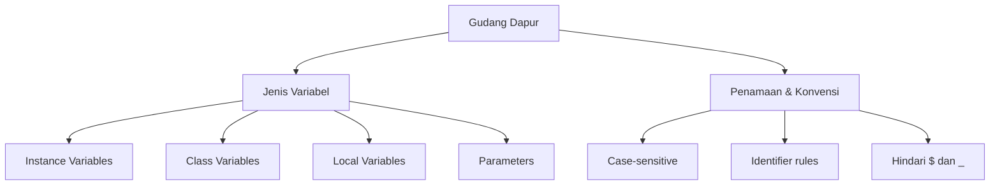

## Pengantar: Gudang Dapur
- Bayangkan variabel seperti wadah di gudang dapur: tiap wadah diberi label yang jelas agar bahan tersusun rapi, mudah ditemukan, dan tidak tertukar saat memasak.
- Di Java, ada beberapa jenis "wadah" dengan karakteristik berbeda: milik objek (instance), milik kelas (static), milik metode (local), dan parameter.
- Untuk konteks eksekusi dan memori, lihat [[JVM]]; untuk desain tipe dan enkapsulasi, rujuk [[Object-Oriented Programming|OOP]]; untuk struktur data yang menyimpan koleksi bahan, lihat [[Java Collections]].
- Break Point Analysis: tidak seperti gudang nyata, wadah (variabel) dapat diduplikasi tanpa kehilangan bahan, dan label (nama variabel) tidak mempengaruhi kinerja secara langsung, tetapi mempengaruhi keterbacaan dan perawatan kode.



- Diagram menampilkan hierarki topik: dari metafora gudang ke empat jenis variabel, lalu cabang aturan penamaan. Baca dari atas ke bawah untuk memahami struktur dan detail yang perlu diperhatikan.

## Jenis Variabel: Wadah di Gudang
### Instance Variables (Non-Static Fields)
- Milik tiap objek; setiap "kotak bahan" unik per objek.
- Dideklarasikan tanpa `static` dan umumnya berakses melalui instance.
- Default value berlaku untuk tipe primitif/objek saat menjadi field.

```java
class Bicycle {
  int cadence = 0;   // instance variable
  int speed = 0;     // instance variable
  int gear = 1;      // instance variable
}
```

### Class Variables (Static Fields)
- Milik kelas; satu "rak bersama" untuk semua objek.
- Dideklarasikan dengan `static`; dapat ditambah `final` untuk nilai konstan.

```java
class Bicycle {
  static int numGears = 6;      // class variable
  static final double PI = 3.14; // class constant
}
```

### Local Variables
- Milik metode; "wadah sementara" di dalam langkah resep.
- Hanya terlihat di blok tempat deklarasi; tidak memiliki default value, harus diinisialisasi sebelum dipakai.

```java
void bake() {
  int count = 0; // local variable
  count++;
}
```

### Parameters
- Nilai masuk ke metode/konstruktor/penanganan exception; selalu diklasifikasikan sebagai variabel, bukan field.

```java
public static void main(String[] args) { // parameter: args
  System.out.println(args.length);
}
```

## Penamaan Variabel: Label Wadah
### Aturan dasar identifier
- Nama variabel peka huruf besar/kecil (case-sensitive).
- Boleh menggunakan huruf Unicode, digit, diawali huruf, `$`, atau `_`.
- Konvensi: mulai dengan huruf; hindari `$` dan `_` untuk nama yang dibuat sendiri.

### Gaya penulisan
- Satu kata: semua huruf kecil, mis. `count`.
- Lebih dari satu kata: gunakan camelCase, mis. `gearRatio`, `currentGear`.
- Konstanta: kapital semua huruf dengan underscore, mis. `NUM_GEARS`.
- Hindari penggunaan kata kunci atau reserved word sebagai nama variabel.

### Konvensi keterbacaan
- Gunakan kata lengkap yang deskriptif (mis. `currentSpeed`, `totalPrice`).
- Hindari singkatan kabur; pilih nama yang membuat kode "self-documenting".
- Konsisten dengan gaya penamaan proyek dan idiom Java.

## Terminologi: Field vs Variable
- Istilah "field" biasanya merujuk ke anggota tipe yang bukan lokal/parameter.
- Istilah "variable" dapat mencakup semua jenis: instance, class, local, parameter.
- Kadang terdengar "member" untuk menyebut gabungan field, method, dan nested types.

## Scope, Lifetime, dan Default Value

| Jenis | Kata Kunci | Lokasi Deklarasi | Scope | Lifetime | Default Value |
|---|---|---|---|---|---|
| Instance | (none) | Di dalam kelas, tanpa `static` | Per instance | Selama instance hidup | Ada (ditetapkan oleh JVM) |
| Class | `static` | Di dalam kelas | Global per kelas | Selama kelas dimuat | Ada |
| Local | (none) | Di dalam metode/blok | Terbatas ke blok | Selama eksekusi blok | Tidak ada (wajib inisialisasi) |
| Parameter | (none) | Tanda tangan metode/konstruktor | Terbatas ke metode | Selama eksekusi metode | Nilai dari pemanggil |

## Hubungan ke Topik Lain
- Variabel menyimpan state yang berinteraksi erat dengan [[Object-Oriented Programming|OOP]] (enkapsulasi dan invariants).
- Pemilihan tipe bahan (nilai) berkaitan dengan [[Creating Primitive Type Variables in Your Programs]].
- Ketika wadah perlu menyimpan banyak item, gunakan struktur di [[Java Collections]].
- Catatan induk ringkasnya ada di [[Java Language Basics]].

## Refleksi: Gudang yang Tertata
- Dengan metafora gudang, kita menekankan pentingnya jenis wadah (variabel) dan label (nama) agar seluruh proses memasak (program) berjalan rapi dan bisa dirawat.
- Batas metafora: label tidak memengaruhi performa, dan wadah bisa berjumlah sangat banyak tanpa ruang fisik; berbeda dengan gudang nyata.
