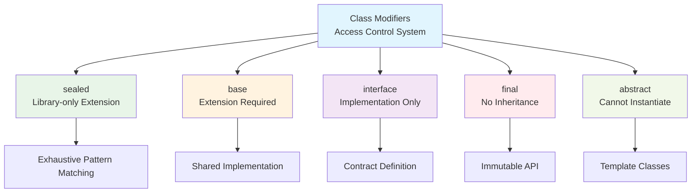

## Pengantar: Bahasa yang Menjembatani Semua Platform

Bayangkan sebuah pabrik multinasional yang beroperasi di berbagai negara dengan budaya dan sistem yang berbeda. Untuk memastikan komunikasi yang efektif, pabrik ini menggunakan bahasa universal yang mudah dipelajari, dilengkapi dengan translator pintar yang bisa beradaptasi dengan kebutuhan lokal. Translator ini bisa bekerja dalam dua mode: mempersiapkan manual lengkap sebelum produksi (AOT) atau menerjemahkan secara real-time saat dibutuhkan (JIT). Inilah [[Dart]] - bahasa pemrograman yang menjadi tulang punggung [[Flutter]] dan ekosistem Google yang lebih luas.

Dart adalah bahasa pemrograman modern yang dirancang untuk membangun aplikasi berkualitas tinggi di berbagai platform - mobile, desktop, web, dan backend. Seperti bahasa universal pabrik kita, Dart memiliki syntax yang familiar dan mudah dipelajari, namun dilengkapi dengan fitur-fitur canggih yang memungkinkan pengembangan aplikasi yang robust dan performant. Yang membuatnya istimewa adalah fleksibilitas compilation: bisa dikompilasi menjadi native machine code untuk performa maksimal, atau JavaScript untuk kompatibilitas web.

Mengapa Dart penting? Dalam era digital yang menuntut aplikasi cross-platform dengan performa tinggi, Dart menawarkan solusi yang elegant. Framework seperti [[Flutter]] membuktikan bahwa Dart mampu menghasilkan aplikasi mobile yang smooth dan responsive. Fitur-fitur modern seperti null safety, pattern matching, dan records membuat Dart tidak hanya powerful, tetapi juga safe dan productive untuk development skala besar. Google menggunakan Dart untuk berbagai produk internal, membuktikan maturity dan reliability bahasa ini.

## Fondasi Keamanan: Grammar Checker yang Mencegah Kesalahan Fatal

Dalam komunikasi pabrik, kesalahan interpretasi bisa berakibat fatal - dari kecelakaan kerja hingga produk cacat. Dart mengatasi masalah serupa dalam programming dengan sound null safety, seperti grammar checker canggih yang mencegah kesalahan komunikasi yang bisa menyebabkan crash aplikasi.

### Sound Null Safety: Perlindungan Komprehensif

Sound null safety Dart adalah sistem type yang memastikan tidak ada null reference errors pada runtime, kecuali jika developer secara eksplisit mengizinkannya. Seperti grammar checker yang memastikan setiap kalimat memiliki subjek dan predikat yang jelas.

```dart
// Sebelum null safety - berbahaya seperti komunikasi ambigu
String? name; // Bisa null
int length = name.length; // Runtime error potensial!

// Dengan null safety - komunikasi yang aman dan jelas
String? nullableName; // Explicitly nullable
String nonNullName = 'Dart'; // Guaranteed non-null

// Compiler memaksa null check
if (nullableName != null) {
  int length = nullableName.length; // Safe access
}

// Atau gunakan null-aware operators
int length = nullableName?.length ?? 0; // Elegant handling
```

Null safety membagi universe types menjadi dua kategori yang jelas:

| Type Category | Analogi Pabrik | Karakteristik | Contoh |
|---------------|----------------|---------------|---------|
| **Non-nullable** | Instruksi wajib | Tidak pernah null | `String`, `int`, `List<String>` |
| **Nullable** | Instruksi opsional | Bisa berisi null | `String?`, `int?`, `List<String>?` |
| **Late** | Instruksi tertunda | Diinisialisasi kemudian | `late String config` |
| **Required** | Parameter wajib | Harus disediakan | `required String name` |

### Flow Analysis: Sistem Deteksi Konteks Cerdas

Dart compiler menggunakan flow analysis untuk memahami konteks kode, seperti supervisor pabrik yang memahami situasi berdasarkan alur kerja:

```dart
String? getMessage(bool hasError) {
  String? result;
  
  if (hasError) {
    result = 'Error occurred';
  } else {
    result = 'Success';
  }
  
  // Compiler tahu result pasti non-null di sini
  return result.toUpperCase(); // No null check needed!
}

// Pattern matching dengan null safety
void processUser(User? user) {
  switch (user) {
    case User(name: var userName, age: var userAge):
      print('Processing $userName, age $userAge');
    case null:
      print('No user to process');
  }
}
```

Flow analysis memungkinkan Dart compiler memahami bahwa setelah null check, variable tersebut guaranteed non-null dalam scope tertentu. Ini seperti supervisor yang tahu bahwa setelah quality check passed, produk pasti memenuhi standar.

## Fitur Modern: Vocabulary yang Kaya dan Ekspresif

Dart 3.0 memperkenalkan fitur-fitur modern yang memperkaya "vocabulary" bahasa, memungkinkan ekspresi yang lebih natural dan powerful dalam komunikasi antara developer dan komputer.

### Pattern Matching: Smart Parser untuk Struktur Kompleks

Pattern matching adalah sistem parsing cerdas yang memungkinkan destructuring dan matching values dengan cara yang elegant, seperti parser yang bisa memahami struktur kalimat kompleks secara otomatis:

```dart
// Destructuring records dengan pattern matching
(String, int) getUserInfo() => ('Alice', 25);

void processUser() {
  var (name, age) = getUserInfo();
  print('User: $name, Age: $age');
}

// Pattern matching dalam switch expressions
String getStatusMessage(int code) => switch (code) {
  200 => 'Success',
  404 => 'Not Found', 
  >= 500 => 'Server Error',
  _ => 'Unknown Status'
};

// Complex pattern matching dengan objects
sealed class Shape {}
class Circle extends Shape {
  final double radius;
  Circle(this.radius);
}
class Rectangle extends Shape {
  final double width, height;
  Rectangle(this.width, this.height);
}

double calculateArea(Shape shape) => switch (shape) {
  Circle(radius: var r) => 3.14 * r * r,
  Rectangle(width: var w, height: var h) => w * h,
};
```

### Records: Sistem Packaging yang Efisien

Records adalah type baru yang memungkinkan bundling multiple values tanpa perlu membuat class terpisah, seperti sistem packaging yang efisien untuk mengirim multiple items sekaligus:

```dart
// Function yang return multiple values
(String, int, bool) validateUser(String email) {
  bool isValid = email.contains('@');
  int score = email.length;
  String message = isValid ? 'Valid email' : 'Invalid email';
  
  return (message, score, isValid);
}

// Named records untuk clarity
({String name, int age, String city}) getUserProfile() {
  return (name: 'Alice', age: 25, city: 'Jakarta');
}

// Destructuring records
void processValidation() {
  var (message, score, isValid) = validateUser('user@example.com');
  
  if (isValid) {
    print('$message with score $score');
  }
  
  // Named record destructuring
  var profile = getUserProfile();
  print('${profile.name} from ${profile.city}');
}

// Records dalam collections
List<(String, double)> coordinates = [
  ('A', 10.5),
  ('B', 20.3),
  ('C', 15.7),
];
```

### Class Modifiers: Kontrol Akses yang Granular

Class modifiers memberikan kontrol yang lebih granular terhadap bagaimana classes digunakan, seperti sistem authorization yang menentukan siapa bisa mengakses area tertentu di pabrik:

```dart
// Sealed classes - hanya bisa diextend dalam library yang sama
sealed class Result<T> {}
class Success<T> extends Result<T> {
  final T value;
  Success(this.value);
}
class Error<T> extends Result<T> {
  final String message;
  Error(this.message);
}

// Base classes - harus diextend, tidak bisa diimplement
base class Vehicle {
  void startEngine() => print('Engine started');
}
class Car extends Vehicle {} // ✓ Allowed
// class Boat implements Vehicle {} // ✗ Compile error

// Interface classes - hanya bisa diimplement
interface class Drawable {
  void draw();
}
class Circle implements Drawable {
  void draw() => print('Drawing circle');
}

// Final classes - tidak bisa diextend atau diimplement
final class DatabaseConnection {
  void connect() => print('Connected to database');
}
```



Diagram ini menunjukkan hierarki class modifiers dalam Dart, seperti sistem authorization pabrik yang memiliki level akses berbeda. Sealed classes memungkinkan exhaustive pattern matching, base classes memastikan shared implementation, interface classes mendefinisikan contracts, final classes menjaga API immutability, dan abstract classes berfungsi sebagai templates.

## Sistem Kompilasi: Translator Multi-Mode yang Fleksibel

Dart compiler adalah translator pintar yang bisa bekerja dalam berbagai mode sesuai kebutuhan, seperti sistem translation pabrik yang bisa real-time atau pre-prepared tergantung situasi.

### AOT Compilation: Manual Lengkap Sebelum Produksi

Ahead-of-Time compilation menghasilkan native machine code yang dioptimasi sebelum aplikasi dijalankan, seperti mempersiapkan manual instruksi lengkap dalam bahasa lokal sebelum produksi dimulai:

```bash
# Compile ke executable untuk production
$ dart compile exe bin/myapp.dart
$ ./bin/myapp.exe  # Fast startup, optimized performance

# Compile ke AOT snapshot untuk deployment
$ dart compile aot-snapshot bin/myapp.dart
$ dartaotruntime bin/myapp.aot  # Requires separate runtime

# Cross-platform compilation
$ dart compile exe --target-os=linux bin/myapp.dart
$ dart compile exe --target-os=windows bin/myapp.dart
```

AOT compilation memberikan keuntungan:
- **Fast startup time**: Tidak ada compilation overhead
- **Optimized performance**: Native machine code execution
- **Smaller runtime footprint**: No JIT compiler needed
- **Predictable performance**: No compilation jank

### JIT Compilation: Translation Real-Time yang Adaptif

Just-in-Time compilation memungkinkan development yang rapid dengan hot reload, seperti translator real-time yang bisa langsung mengadaptasi perubahan instruksi:

```bash
# Development mode dengan JIT
$ dart run bin/myapp.dart  # Hot reload enabled

# JIT snapshot untuk faster subsequent runs
$ dart compile jit-snapshot bin/myapp.dart
$ dart run bin/myapp.jit  # Faster startup than source

# Development dengan debugging
$ dart --observe run bin/myapp.dart  # Observatory debugging
```

JIT compilation memberikan fleksibilitas:
- **Hot reload**: Instant code changes without restart
- **Dynamic debugging**: Runtime inspection dan profiling
- **Faster iteration**: No compilation step needed
- **Development productivity**: Immediate feedback loop

### JavaScript Compilation: Universal Translation

Dart-to-JavaScript compilation memungkinkan aplikasi berjalan di web browser, seperti universal translator yang mengkonversi ke bahasa yang dipahami semua platform:

```bash
# Compile untuk web deployment
$ dart compile js -O2 web/main.dart  # Optimized for production
$ dart compile js --no-minify web/main.dart  # Readable for debugging

# Development server dengan hot reload
$ dart run build_runner serve  # Live development server
```

### Performance Comparison: Efisiensi Mode Berbeda

| Compilation Mode | Startup Time | Runtime Performance | Development Speed | Use Case |
|------------------|--------------|-------------------|------------------|----------|
| **AOT** | Fastest (~100ms) | Excellent | Slow (rebuild needed) | Production mobile/desktop |
| **JIT** | Medium (~300ms) | Good | Fastest (hot reload) | Development |
| **JavaScript** | Slow (~500ms) | Good | Medium | Web deployment |
| **JIT Snapshot** | Fast (~150ms) | Good | Medium | Testing/staging |

## Developer Experience: Lingkungan Kerja yang Produktif

Dart menyediakan developer experience yang exceptional, seperti pabrik modern yang dilengkapi dengan tools dan automation untuk memaksimalkan produktivitas pekerja.

### Hot Reload: Live Updates Tanpa Gangguan

Hot reload memungkinkan perubahan kode langsung terlihat tanpa restart aplikasi, seperti kemampuan mengupdate instruksi kerja secara live tanpa menghentikan produksi:

```dart
// Original code
class CounterApp extends StatefulWidget {
  @override
  _CounterAppState createState() => _CounterAppState();
}

class _CounterAppState extends State<CounterApp> {
  int _counter = 0;
  
  @override
  Widget build(BuildContext context) {
    return Scaffold(
      body: Center(
        child: Text('Counter: $_counter'), // Change this...
      ),
      floatingActionButton: FloatingActionButton(
        onPressed: () => setState(() => _counter++),
        child: Icon(Icons.add),
      ),
    );
  }
}

// After hot reload - state preserved, UI updated
// Text('Counter: $_counter', style: TextStyle(fontSize: 24))
```

Hot reload mempertahankan application state sambil mengupdate UI, memungkinkan iterasi design yang sangat cepat tanpa kehilangan context.

### Tooling Ecosystem: Peralatan Lengkap

Dart menyediakan tooling ecosystem yang comprehensive:

```bash
# Package management
$ dart pub get          # Install dependencies
$ dart pub upgrade      # Update packages
$ dart pub publish      # Publish to pub.dev

# Code analysis dan formatting
$ dart analyze          # Static analysis
$ dart format .         # Code formatting
$ dart fix --apply      # Auto-fix issues

# Testing dan debugging
$ dart test            # Run unit tests
$ dart run --observe   # Debug mode with observatory
$ dart doc             # Generate documentation
```

### Language Server: Intelligent Code Assistance

Dart Language Server menyediakan IDE support yang powerful:
- **IntelliSense**: Auto-completion dengan type information
- **Real-time error detection**: Immediate feedback pada syntax errors
- **Refactoring tools**: Safe code transformations
- **Go to definition**: Navigation ke source code
- **Find references**: Track usage across codebase

## Performance dan Trade-offs: Efisiensi vs Fleksibilitas

Dart menawarkan balance yang baik antara performance dan developer productivity, namun seperti setiap bahasa, ada trade-offs yang perlu dipahami untuk membuat keputusan arsitektur yang tepat.

### Memory Management: Garbage Collection yang Efisien

Dart menggunakan generational garbage collector yang dioptimasi untuk aplikasi UI-intensive:

```dart
// Efficient memory usage patterns
class DataProcessor {
  final List<String> _cache = <String>[];
  
  // Object pooling untuk mengurangi GC pressure
  final Queue<WorkItem> _itemPool = Queue<WorkItem>();
  
  WorkItem getWorkItem() {
    if (_itemPool.isNotEmpty) {
      return _itemPool.removeFirst()..reset();
    }
    return WorkItem();
  }
  
  void releaseWorkItem(WorkItem item) {
    _itemPool.add(item);
  }
  
  // Streaming untuk large datasets
  Stream<ProcessedData> processLargeDataset(Stream<RawData> input) async* {
    await for (final data in input) {
      yield processData(data);
      // Automatic memory cleanup per iteration
    }
  }
}
```

### Performance Characteristics: Benchmarking Real-World

| Metric | Dart AOT | Dart JIT | JavaScript V8 | Java | Go |
|--------|----------|----------|---------------|------|-----|
| **Cold Startup** | 100ms | 300ms | 200ms | 500ms | 50ms |
| **Hot Startup** | 50ms | 150ms | 100ms | 200ms | 20ms |
| **Throughput** | High | Medium | High | High | Very High |
| **Memory Usage** | Low | Medium | Medium | High | Low |
| **GC Pause** | <1ms | <5ms | <10ms | 10-50ms | <1ms |

### Trade-offs Analysis: Kapan Memilih Dart

**Pilih Dart ketika**:
- **Cross-platform development**: Single codebase untuk mobile, web, desktop
- **UI-heavy applications**: Flutter ecosystem dan widget system
- **Rapid prototyping**: Hot reload dan fast iteration cycles
- **Type safety important**: Sound null safety dan strong typing
- **Google ecosystem**: Integration dengan Firebase, Google Cloud

**Pertimbangkan alternatif ketika**:
- **Performance critical**: Sistem yang membutuhkan maximum throughput
- **Existing ecosystem**: Large codebase dalam bahasa lain
- **Specialized domains**: Machine learning (Python), sistem programming (Rust/C++)
- **Team expertise**: Strong background dalam bahasa tertentu
- **Legacy integration**: Complex integration dengan sistem existing

### Studi Kasus: Google Ads Performance

Google menggunakan Dart untuk Google Ads web application dengan hasil impressive:

**Challenges Solved**:
- **Large codebase**: Millions of lines of code
- **Complex UI**: Rich interactive interfaces
- **Performance requirements**: Sub-second response times
- **Developer productivity**: Large team collaboration

**Results Achieved**:
- **40% faster** development cycles dengan hot reload
- **25% reduction** dalam bugs berkat null safety
- **Consistent performance** across different browsers
- **Improved maintainability** dengan strong typing

**Technical Decisions**:
- Dart-to-JavaScript compilation untuk web deployment
- Incremental compilation untuk faster build times
- Custom linting rules untuk code consistency
- Automated testing dengan dart test framework

## Refleksi: Bahasa Universal untuk Era Digital

Dart telah membuktikan dirinya sebagai "bahasa universal pabrik" yang mampu menjembatani berbagai platform dan kebutuhan development modern. Seperti bahasa universal yang memungkinkan komunikasi efektif di pabrik multinasional, Dart menyediakan syntax yang familiar namun powerful, dilengkapi dengan "translator pintar" yang bisa beradaptasi dengan berbagai target platform.

Kekuatan utama Dart terletak pada balance yang tepat antara simplicity dan power. Sound null safety memberikan foundation yang solid untuk aplikasi yang reliable, sementara fitur-fitur modern seperti pattern matching dan records membuat kode lebih ekspresif dan maintainable. Fleksibilitas compilation - dari AOT untuk performance hingga JIT untuk development productivity - memungkinkan Dart melayani berbagai use cases dengan optimal.

Ekosistem Dart, terutama dengan [[Flutter]], telah menciptakan paradigma baru dalam cross-platform development. Hot reload yang instant, widget system yang composable, dan tooling yang comprehensive membuat development experience yang exceptional. Google's commitment terhadap Dart, terbukti dari penggunaan internal yang extensive dan investment berkelanjutan dalam language evolution.

Namun, Dart bukan silver bullet untuk semua masalah programming. Untuk aplikasi yang membutuhkan maximum performance atau integration mendalam dengan sistem existing, bahasa lain mungkin lebih tepat. Keputusan untuk mengadopsi Dart harus mempertimbangkan trade-offs antara development speed, performance requirements, dan team expertise.

Masa depan Dart terlihat cerah dengan roadmap yang fokus pada performance improvements, platform expansion, dan developer experience enhancements. Sebagai bahasa yang designed for modern application development, Dart positioned dengan baik untuk menghadapi tantangan era digital yang semakin kompleks, di mana aplikasi harus berjalan seamlessly across multiple platforms dengan user experience yang consistent dan performance yang excellent.

---

*Catatan ini disusun berdasarkan dokumentasi resmi Dart dan analisis mendalam menggunakan Sequential Thinking methodology untuk memberikan pemahaman komprehensif tentang bahasa pemrograman yang menjadi foundation dari ekosistem Flutter dan Google's modern application development.*