## Pengantar: Memperluas Realitas

Bayangkan seorang pilot yang hanya belajar terbang saat cuaca cerah, tanpa angin, dan di siang hari bolong. Apa yang terjadi saat dia menghadapi badai pertamanya? Dia akan panik dan jatuh (gagal).

**Data Augmentation** adalah proses menciptakan **"Simulator Penerbangan"** yang ekstrem untuk model [[Machine Learning]]. Kita tidak memiliki anggaran untuk menerbangkan pesawat sungguhan di 1000 kondisi cuaca berbeda (mengumpulkan data nyata itu mahal). Jadi, kita **memalsukannya**.

Kita mengambil data yang sudah ada (penerbangan cerah), lalu secara digital menambahkan hujan, memutar cakrawala, atau menggelapkan langit. Bagi model, ini adalah pengalaman "baru" yang memaksanya untuk menjadi pilot yang tangguh.

## Mengapa Kita Perlu Memalsukan Data?

Masalah utamanya adalah kelangkaan. Model Deep Learning ([[Neural Networks]]) adalah monster yang lapar data.

1.  **Mencegah [[Overfitting]]**: Jika model melihat gambar kucing yang sama 1000 kali, dia akan menghafal pixelnya. Jika dia melihat kucing yang diputar, digeser, dan diwarnai ulang, dia dipaksa belajar *konsep* kucing.
2.  **Invariansi**: Mengajarkan model bahwa "Kucing Terbalik" tetaplah seekor kucing.

## Teknik: Menu di Simulator

### 1. Manipulasi Geometri (Posisi)
Ini seperti mengubah posisi kursi pilot atau mengguncang pesawat.
*   **Rotation**: Memutar gambar. (Dunia tidak selalu tegak lurus).
*   **Flip**: Mencerminkan gambar. (Kucing menghadap kiri = Kucing menghadap kanan).
*   **Crop & Resize**: Zoom in ke bagian tertentu. (Fokus pada telinga, bukan latar belakang).

### 2. Manipulasi Fotometrik (Suasana)
Ini seperti mengubah cuaca di luar jendela kokpit.
*   **Brightness/Contrast**: Terbang saat senja atau di bawah terik matahari.
*   **Noise Injection**: Menambahkan bintik-bintik "semut" (seperti kamera CCTV buram).
*   **Color Jitter**: Mengubah rona warna sedikit (apel merah muda vs apel merah tua).

### 3. Teknik Lanjutan: Mimpi Surrealis
Di sinilah simulator menjadi aneh demi performa maksimal.

#### a. MixUp (Fotografi Ganda)
Menggabungkan dua gambar menjadi satu dengan transparansi 50%.
*   **Contoh**: Gambar "Anjing" ditumpuk dengan gambar "Kucing".
*   **Label**: Model diajarkan untuk bilang "Ini 50% Anjing, 50% Kucing".
*   **Logika**: Mencegah model terlalu percaya diri (overconfident) dan menghaluskan batas antar kelas.

#### b. CutMix (Kolase Frankenstein)
Memotong bagian dari satu gambar dan menempelkannya ke gambar lain.
*   **Contoh**: Menempelkan kepala anjing di atas badan pesawat terbang.
*   **Logika**: Memaksa model untuk tidak hanya melihat satu fitur dominan (misal: sayap), tapi memperhatikan seluruh bagian gambar.

```mermaid
graph LR
    A[Original Image] --> B{Augmentation Pipeline}
    
    B --> C[Rotate 15°]
    B --> D[Flip Horizontal]
    B --> E[Add Noise]
    B --> F[MixUp]
    
    C --> G[Augmented Data Batch]
    D --> G
    E --> G
    F --> G
    
    G --> H[Model Training]
    
    style A fill:#f9f,stroke:#333
    style H fill:#ccffcc,stroke:#333
```

> **Diagram**: Pipa produksi data. Dari satu gambar asli (A), kita bisa menghasilkan lusinan variasi (G) yang membuat model (H) merasa seolah-olah dia telah melihat dunia yang jauh lebih luas dari aslinya.

## Augmentation di Luar Gambar

Konsep simulator ini tidak terbatas pada [[Computer Vision]]:

*   **NLP ([[Natural Language Processing]])**:
    *   **Synonym Replacement**: Mengganti "senang" dengan "bahagia".
    *   **Back Translation**: Menerjemahkan Indo -> Inggris -> Indo. Hasilnya seringkali memiliki struktur kalimat berbeda tapi makna sama.
*   **Audio**:
    *   **Pitch Shifting**: Mengubah suara menjadi seperti tupai (chipmunk) atau raksasa.
    *   **Background Noise**: Menambahkan suara hujan atau keramaian kafe di latar belakang percakapan.

## Refleksi: Guru yang Kreatif

Data Augmentation mengajarkan kita bahwa **kreativitas** adalah kunci efisiensi. Kita tidak selalu perlu mencari lebih banyak sumber daya (data baru); terkadang kita hanya perlu melihat apa yang sudah kita miliki dari sudut pandang yang berbeda.

Model yang dilatih dengan augmentasi yang baik adalah seperti petarung yang sudah berlatih dengan mata tertutup, di dalam air, dan di atas es. Saat pertarungan nyata tiba, tidak ada yang bisa mengejutkannya.

---
**Lihat juga**:
*   [[Regularization]] - Augmentation adalah bentuk implisit dari regularisasi.
*   [[Generalization]] - Tujuan akhir dari semua manipulasi ini.
*   [[Synthetic Data]] - Langkah selanjutnya: menciptakan data dari nol, bukan hanya memodifikasi.
