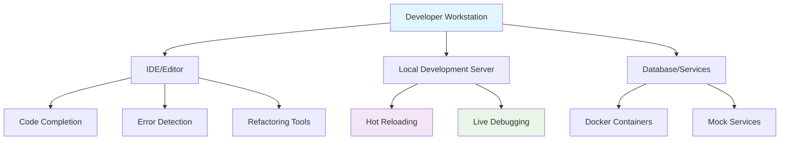

## Pengantar: Jalur Cepat Menuju Produktivitas Maksimal

Bayangkan developer velocity sebagai **sistem transportasi cepat di kota metropolitan** - kombinasi infrastruktur yang efisien, tools yang tepat, dan proses yang streamlined yang memungkinkan developer "berpindah" dari ide ke working software dengan kecepatan maksimal. Seperti sistem MRT yang menghubungkan berbagai distrik kota dengan cepat dan efisien, developer velocity menghubungkan berbagai tahap development lifecycle dengan minimal friction.

Developer velocity bukan sekadar "coding faster" - ini adalah kemampuan tim development untuk menghasilkan value secara konsisten dan sustainable. Velocity yang tinggi berarti shorter feedback loops, faster time-to-market, dan kemampuan untuk merespons perubahan requirements dengan agile.

**Mengapa Developer Velocity Krusial?**
- **Competitive Advantage**: Faster feature delivery = market leadership
- **Developer Satisfaction**: Reduced frustration dari slow, manual processes
- **Business Impact**: Shorter time-to-value untuk customer features
- **Innovation Enablement**: More time untuk creative problem-solving, less untuk toil

## Infrastruktur Velocity: Fondasi Jalur Cepat

### Development Environment - Terminal Ekspres

Development environment yang optimal seperti **terminal ekspres** - semua yang dibutuhkan developer tersedia dengan akses cepat dan reliable.



**Karakteristik Environment Berkualitas:**
```yaml
# docker-compose.yml - Consistent Development Environment
version: '3.8'
services:
  app:
    build: .
    ports:
      - "3000:3000"
    volumes:
      - .:/app
      - /app/node_modules
    environment:
      - NODE_ENV=development
    depends_on:
      - database
      - redis
    
  database:
    image: postgres:14
    environment:
      POSTGRES_DB: myapp_dev
      POSTGRES_USER: developer
      POSTGRES_PASSWORD: password
    ports:
      - "5432:5432"
    volumes:
      - postgres_data:/var/lib/postgresql/data
  
  redis:
    image: redis:7-alpine
    ports:
      - "6379:6379"

volumes:
  postgres_data:
```

```javascript
// Hot Reloading Configuration
// webpack.config.js
module.exports = {
  mode: 'development',
  devServer: {
    hot: true,
    liveReload: true,
    open: true,
    port: 3000,
    historyApiFallback: true,
  },
  plugins: [
    new webpack.HotModuleReplacementPlugin(),
  ],
  module: {
    rules: [
      {
        test: /\.(js|jsx|ts|tsx)$/,
        exclude: /node_modules/,
        use: {
          loader: 'babel-loader',
          options: {
            plugins: ['react-hot-loader/babel'],
          },
        },
      },
    ],
  },
};
```

### CI/CD Pipeline - Jalur Otomatis Menuju Production

CI/CD pipeline seperti **sistem conveyor belt otomatis** yang membawa code dari development ke production dengan quality checks di setiap station.

```yaml
# .github/workflows/ci-cd.yml
name: CI/CD Pipeline

on:
  push:
    branches: [main, develop]
  pull_request:
    branches: [main]

jobs:
  test:
    runs-on: ubuntu-latest
    steps:
      - uses: actions/checkout@v3
      
      - name: Setup Node.js
        uses: actions/setup-node@v3
        with:
          node-version: '18'
          cache: 'npm'
      
      - name: Install dependencies
        run: npm ci
      
      - name: Run linting
        run: npm run lint
      
      - name: Run type checking
        run: npm run type-check
      
      - name: Run tests
        run: npm run test:coverage
      
      - name: Upload coverage
        uses: codecov/codecov-action@v3
  
  build:
    needs: test
    runs-on: ubuntu-latest
    steps:
      - uses: actions/checkout@v3
      
      - name: Build application
        run: npm run build
      
      - name: Build Docker image
        run: docker build -t myapp:${{ github.sha }} .
      
      - name: Push to registry
        if: github.ref == 'refs/heads/main'
        run: |
          docker tag myapp:${{ github.sha }} registry.com/myapp:latest
          docker push registry.com/myapp:latest
  
  deploy:
    needs: build
    if: github.ref == 'refs/heads/main'
    runs-on: ubuntu-latest
    steps:
      - name: Deploy to staging
        run: |
          kubectl set image deployment/myapp myapp=registry.com/myapp:latest
          kubectl rollout status deployment/myapp
      
      - name: Run smoke tests
        run: npm run test:smoke
      
      - name: Deploy to production
        if: success()
        run: |
          kubectl set image deployment/myapp-prod myapp=registry.com/myapp:latest
          kubectl rollout status deployment/myapp-prod
```

## Tools dan Automation: Kendaraan Berkecepatan Tinggi

### Code Generation - Pabrik Otomatis

Code generation seperti **pabrik otomatis** yang menghasilkan boilerplate code berkualitas tinggi dengan konsistensi sempurna.


```typescript
// Code generation with Plop.js
// plopfile.js
module.exports = function (plop) {
  // Component generator
  plop.setGenerator('component', {
    description: 'Create a new React component',
    prompts: [
      {
        type: 'input',
        name: 'name',
        message: 'Component name:',
      },
      {
        type: 'confirm',
        name: 'withTests',
        message: 'Include test file?',
        default: true,
      },
    ],
    actions: [
      {
        type: 'add',
        path: 'src/components/{{pascalCase name}}/{{pascalCase name}}.tsx',
        templateFile: 'templates/component.hbs',
      },
      {
        type: 'add',
        path: 'src/components/{{pascalCase name}}/index.ts',
        templateFile: 'templates/index.hbs',
      },
      {
        type: 'add',
        path: 'src/components/{{pascalCase name}}/{{pascalCase name}}.test.tsx',
        templateFile: 'templates/component.test.hbs',
        skip: (data) => !data.withTests,
      },
    ],
  });

  // API endpoint generator
  plop.setGenerator('api', {
    description: 'Create API endpoint with validation',
    prompts: [
      {
        type: 'input',
        name: 'resource',
        message: 'Resource name (e.g., user, product):',
      },
      {
        type: 'checkbox',
        name: 'methods',
        message: 'HTTP methods:',
        choices: ['GET', 'POST', 'PUT', 'DELETE'],
        default: ['GET', 'POST'],
      },
    ],
    actions: function (data) {
      const actions = [];
      
      actions.push({
        type: 'add',
        path: 'src/api/{{camelCase resource}}.ts',
        templateFile: 'templates/api-endpoint.hbs',
      });
      
      actions.push({
        type: 'add',
        path: 'src/types/{{camelCase resource}}.ts',
        templateFile: 'templates/api-types.hbs',
      });
      
      return actions;
    },
  });
};
```


### Automated Testing - Quality Assurance Express

Automated testing seperti **sistem quality control otomatis** yang memastikan setiap "produk" (feature) memenuhi standar kualitas sebelum "dikirim" ke customer.

```typescript
// Comprehensive test setup
// jest.config.js
module.exports = {
  preset: 'ts-jest',
  testEnvironment: 'jsdom',
  setupFilesAfterEnv: ['<rootDir>/src/test/setup.ts'],
  collectCoverageFrom: [
    'src/**/*.{ts,tsx}',
    '!src/**/*.d.ts',
    '!src/test/**',
  ],
  coverageThreshold: {
    global: {
      branches: 80,
      functions: 80,
      lines: 80,
      statements: 80,
    },
  },
  testMatch: [
    '<rootDir>/src/**/__tests__/**/*.{ts,tsx}',
    '<rootDir>/src/**/*.{test,spec}.{ts,tsx}',
  ],
};

// Test utilities for velocity
// src/test/utils.tsx
import { render, RenderOptions } from '@testing-library/react';
import { ReactElement } from 'react';
import { Provider } from 'react-redux';
import { BrowserRouter } from 'react-router-dom';
import { store } from '../store';

const AllTheProviders = ({ children }: { children: React.ReactNode }) => {
  return (
    <Provider store={store}>
      <BrowserRouter>
        {children}
      </BrowserRouter>
    </Provider>
  );
};

const customRender = (
  ui: ReactElement,
  options?: Omit<RenderOptions, 'wrapper'>
) => render(ui, { wrapper: AllTheProviders, ...options });

// Factory functions for test data
export const createMockUser = (overrides = {}) => ({
  id: '1',
  name: 'John Doe',
  email: 'john@example.com',
  isActive: true,
  ...overrides,
});

export const createMockApiResponse = <T>(data: T, overrides = {}) => ({
  data,
  status: 'success' as const,
  message: 'Operation successful',
  ...overrides,
});

export * from '@testing-library/react';
export { customRender as render };
```

### Development Scripts - Toolkit Otomatis

```json
{
  "scripts": {
    "dev": "concurrently \"npm run dev:server\" \"npm run dev:client\"",
    "dev:server": "nodemon --exec ts-node src/server/index.ts",
    "dev:client": "vite",
    
    "build": "npm run build:client && npm run build:server",
    "build:client": "vite build",
    "build:server": "tsc -p tsconfig.server.json",
    
    "test": "jest",
    "test:watch": "jest --watch",
    "test:coverage": "jest --coverage",
    "test:e2e": "playwright test",
    
    "lint": "eslint src --ext .ts,.tsx",
    "lint:fix": "eslint src --ext .ts,.tsx --fix",
    "type-check": "tsc --noEmit",
    
    "db:migrate": "prisma migrate dev",
    "db:seed": "ts-node prisma/seed.ts",
    "db:reset": "prisma migrate reset --force",
    
    "generate": "plop",
    "generate:component": "plop component",
    "generate:api": "plop api",
    
    "deploy:staging": "npm run build && docker build -t myapp:staging . && kubectl apply -f k8s/staging/",
    "deploy:prod": "npm run build && docker build -t myapp:prod . && kubectl apply -f k8s/production/"
  }
}
```

## Team Velocity: Orkestra Produktivitas

### Code Review Process - Quality Gate Ekspres

Code review yang efisien seperti **quality gate ekspres** - thorough tapi tidak menjadi bottleneck.

```yaml
# .github/pull_request_template.md
## Description
Brief description of changes

## Type of Change
- [ ] Bug fix (non-breaking change which fixes an issue)
- [ ] New feature (non-breaking change which adds functionality)
- [ ] Breaking change (fix or feature that would cause existing functionality to not work as expected)
- [ ] Documentation update

## Testing
- [ ] Unit tests pass
- [ ] Integration tests pass
- [ ] Manual testing completed
- [ ] Performance impact assessed

## Checklist
- [ ] Code follows style guidelines
- [ ] Self-review completed
- [ ] Code is commented where necessary
- [ ] Documentation updated
- [ ] No new warnings introduced

## Screenshots (if applicable)
[Add screenshots here]

## Related Issues
Closes #[issue number]
```

```typescript
// Automated code quality checks
// .eslintrc.js
module.exports = {
  extends: [
    '@typescript-eslint/recommended',
    'plugin:react/recommended',
    'plugin:react-hooks/recommended',
    'prettier',
  ],
  rules: {
    // Velocity-focused rules
    'no-console': 'warn',
    'prefer-const': 'error',
    'no-unused-vars': 'error',
    '@typescript-eslint/no-explicit-any': 'warn',
    'react/prop-types': 'off', // Using TypeScript
    
    // Complexity limits for maintainability
    'complexity': ['error', 10],
    'max-lines-per-function': ['error', 50],
    'max-depth': ['error', 4],
  },
};
```

### Documentation as Code - Knowledge Highway

Documentation yang hidup seperti **sistem informasi highway** yang selalu up-to-date dan mudah diakses.

```typescript
// API documentation with OpenAPI
// src/api/swagger.ts
import swaggerJSDoc from 'swagger-jsdoc';

const options = {
  definition: {
    openapi: '3.0.0',
    info: {
      title: 'MyApp API',
      version: '1.0.0',
      description: 'API documentation for MyApp',
    },
    servers: [
      {
        url: 'http://localhost:3000/api',
        description: 'Development server',
      },
    ],
  },
  apis: ['./src/routes/*.ts'], // Path to the API files
};

export const specs = swaggerJSDoc(options);

// Usage in route files
/**
 * @swagger
 * /users:
 *   get:
 *     summary: Get all users
 *     tags: [Users]
 *     parameters:
 *       - in: query
 *         name: page
 *         schema:
 *           type: integer
 *         description: Page number
 *     responses:
 *       200:
 *         description: List of users
 *         content:
 *           application/json:
 *             schema:
 *               type: object
 *               properties:
 *                 users:
 *                   type: array
 *                   items:
 *                     $ref: '#/components/schemas/User'
 */
```

## Measurement dan Optimization: Dashboard Kecepatan

### Velocity Metrics - Speedometer Digital

```typescript
// Velocity tracking system
interface VelocityMetrics {
  // Development metrics
  deploymentFrequency: number; // Deployments per day
  leadTime: number; // Hours from commit to production
  changeFailureRate: number; // Percentage of deployments causing failures
  recoveryTime: number; // Hours to recover from failures
  
  // Code quality metrics
  codeReviewTime: number; // Hours from PR creation to merge
  testCoverage: number; // Percentage of code covered by tests
  technicalDebtRatio: number; // Percentage of development time spent on tech debt
  
  // Team metrics
  cycleTime: number; // Hours from start to completion of work item
  throughput: number; // Work items completed per sprint
  blockerResolutionTime: number; // Hours to resolve blockers
}

class VelocityTracker {
  async calculateDeploymentFrequency(timeRange: DateRange): Promise<number> {
    const deployments = await this.getDeployments(timeRange);
    const days = this.getDaysBetween(timeRange.start, timeRange.end);
    return deployments.length / days;
  }
  
  async calculateLeadTime(commits: Commit[]): Promise<number> {
    const leadTimes = await Promise.all(
      commits.map(async (commit) => {
        const deployment = await this.findDeploymentForCommit(commit);
        return deployment.timestamp - commit.timestamp;
      })
    );
    
    return this.calculateMedian(leadTimes);
  }
  
  async generateVelocityReport(): Promise<VelocityReport> {
    const metrics = await this.collectMetrics();
    
    return {
      summary: this.generateSummary(metrics),
      trends: this.analyzeTrends(metrics),
      recommendations: this.generateRecommendations(metrics),
      actionItems: this.identifyActionItems(metrics),
    };
  }
}
```

### Performance Monitoring - Real-time Speed Tracking

```typescript
// Application performance monitoring
class PerformanceMonitor {
  // Core Web Vitals tracking
  trackWebVitals() {
    // Largest Contentful Paint
    new PerformanceObserver((list) => {
      for (const entry of list.getEntries()) {
        if (entry.entryType === 'largest-contentful-paint') {
          this.reportMetric('LCP', entry.startTime);
        }
      }
    }).observe({ entryTypes: ['largest-contentful-paint'] });
    
    // First Input Delay
    new PerformanceObserver((list) => {
      for (const entry of list.getEntries()) {
        if (entry.entryType === 'first-input') {
          this.reportMetric('FID', entry.processingStart - entry.startTime);
        }
      }
    }).observe({ entryTypes: ['first-input'] });
    
    // Cumulative Layout Shift
    let clsValue = 0;
    new PerformanceObserver((list) => {
      for (const entry of list.getEntries()) {
        if (!entry.hadRecentInput) {
          clsValue += entry.value;
        }
      }
      this.reportMetric('CLS', clsValue);
    }).observe({ entryTypes: ['layout-shift'] });
  }
  
  // API performance tracking
  trackApiPerformance(endpoint: string, duration: number, status: number) {
    this.reportMetric('api_duration', duration, {
      endpoint,
      status: status.toString(),
    });
    
    if (duration > 1000) {
      this.alertSlowApi(endpoint, duration);
    }
  }
  
  // Bundle size monitoring
  async trackBundleSize() {
    const bundleStats = await this.getBundleStats();
    
    this.reportMetric('bundle_size_js', bundleStats.javascript);
    this.reportMetric('bundle_size_css', bundleStats.css);
    this.reportMetric('bundle_size_total', bundleStats.total);
    
    if (bundleStats.total > this.BUNDLE_SIZE_THRESHOLD) {
      this.alertLargeBundle(bundleStats);
    }
  }
}
```

## Trade-offs dan Best Practices: Optimizing the Fast Lane

### Velocity vs Quality Balance

| Aspect | High Velocity | High Quality | Balanced Approach |
|--------|---------------|--------------|-------------------|
| **Release Frequency** | Daily | Monthly | Weekly |
| **Test Coverage** | 60% | 95% | 80% |
| **Code Review Time** | 30 min | 4 hours | 2 hours |
| **Technical Debt** | High | Low | Managed |
| **Feature Complexity** | Simple | Complex | Incremental |

### Velocity Anti-Patterns - Traffic Jams to Avoid

```typescript
// Anti-pattern: Over-engineering for velocity
// ❌ Bad: Complex abstraction that slows down simple changes
class OverEngineeredUserService {
  constructor(
    private repository: IUserRepository,
    private validator: IUserValidator,
    private transformer: IUserTransformer,
    private notifier: IUserNotifier,
    private logger: ILogger,
    private metrics: IMetrics,
    private cache: ICache
  ) {}
  
  async createUser(userData: CreateUserRequest): Promise<UserResponse> {
    // 50 lines of abstraction for simple user creation
  }
}

// ✅ Good: Simple, direct implementation
class UserService {
  async createUser(userData: CreateUserData): Promise<User> {
    // Validate input
    if (!userData.email || !userData.name) {
      throw new ValidationError('Email and name are required');
    }
    
    // Create user
    const user = await db.users.create({
      data: {
        email: userData.email,
        name: userData.name,
        createdAt: new Date(),
      },
    });
    
    // Send welcome email
    await emailService.sendWelcome(user.email);
    
    return user;
  }
}
```

### Velocity Best Practices

```typescript
// 1. Fail Fast Principle
function validateUserInput(input: unknown): UserInput {
  const schema = z.object({
    email: z.string().email(),
    name: z.string().min(1),
    age: z.number().min(0).max(150),
  });
  
  try {
    return schema.parse(input);
  } catch (error) {
    // Fail fast with clear error message
    throw new ValidationError(`Invalid input: ${error.message}`);
  }
}

// 2. Progressive Enhancement
function enhanceUserExperience() {
  // Start with basic functionality
  const basicFeatures = initializeBasicFeatures();
  
  // Add enhancements progressively
  if (supportsAdvancedFeatures()) {
    addAdvancedFeatures();
  }
  
  if (supportsExperimentalFeatures()) {
    addExperimentalFeatures();
  }
}

// 3. Feature Flags for Safe Velocity
class FeatureFlags {
  isEnabled(flag: string, userId?: string): boolean {
    const config = this.getFeatureConfig(flag);
    
    if (config.enabled === false) return false;
    if (config.enabled === true) return true;
    
    // Gradual rollout
    if (config.rolloutPercentage) {
      return this.isInRollout(userId, config.rolloutPercentage);
    }
    
    return false;
  }
}

// Usage
if (featureFlags.isEnabled('new-checkout-flow', user.id)) {
  return <NewCheckoutFlow />;
} else {
  return <LegacyCheckoutFlow />;
}
```

## Studi Kasus: Velocity Champions

**Netflix**: Microservices architecture memungkinkan 1000+ deployments per hari
**Amazon**: Two-pizza teams dengan full ownership meningkatkan velocity 300%
**Spotify**: Squad model dan feature flags memungkinkan rapid experimentation
**GitHub**: Automated testing dan deployment pipeline mengurangi lead time dari weeks ke hours

**Lessons Learned:**
- Automation investment pays off exponentially dalam jangka panjang
- Team autonomy crucial untuk sustainable velocity
- Monitoring dan feedback loops essential untuk continuous improvement
- Technical debt harus dimanage secara proaktif, bukan reactive

## Refleksi: Masa Depan Kecepatan Development

Developer velocity telah berevolusi dari "individual coding speed" menjadi "team delivery capability" yang comprehensive. Seperti sistem transportasi kota yang terus berkembang dari jalan raya sederhana menjadi network multi-modal yang sophisticated, development velocity kini melibatkan orchestration berbagai tools, processes, dan practices.

Masa depan velocity terletak pada **intelligent automation** - AI-powered code generation, predictive testing, dan self-healing systems. Dengan [[Machine Learning]] dan [[DevOps]] evolution, developer akan semakin fokus pada creative problem-solving sementara routine tasks diotomatisasi.

Investasi dalam developer velocity adalah investasi dalam competitive advantage - seperti membangun infrastructure transportation yang excellent, menciptakan development velocity yang tinggi memungkinkan organisasi untuk bergerak cepat, adapt dengan perubahan market, dan deliver value secara konsisten kepada users.

---

*Catatan ini menggambarkan developer velocity sebagai sistem transportasi cepat yang menghubungkan berbagai tahap development lifecycle, dengan analogi infrastructure kota yang memudahkan pemahaman tentang tools, processes, dan practices yang diperlukan untuk mencapai produktivitas maksimal.*