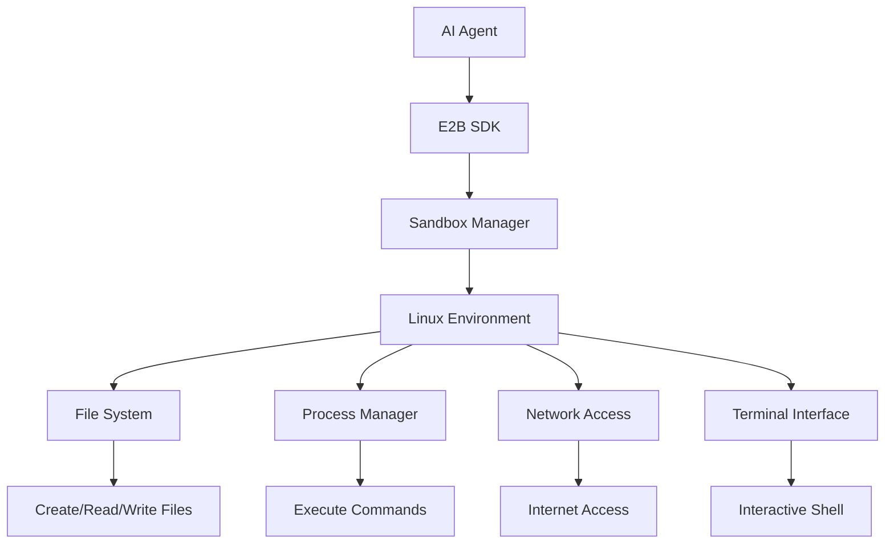
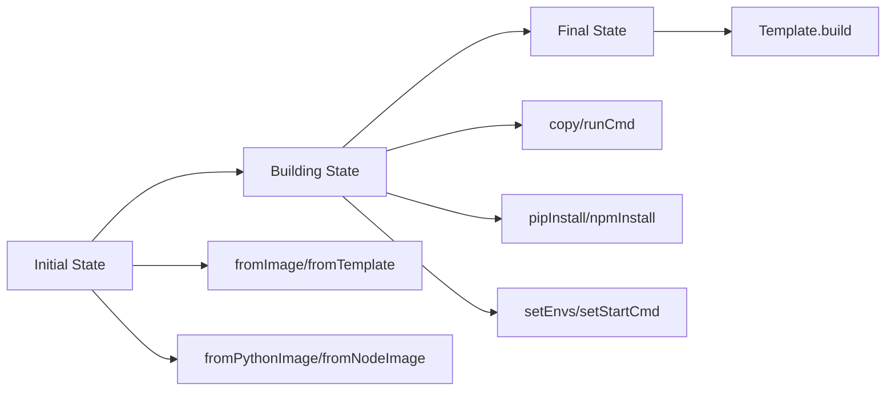
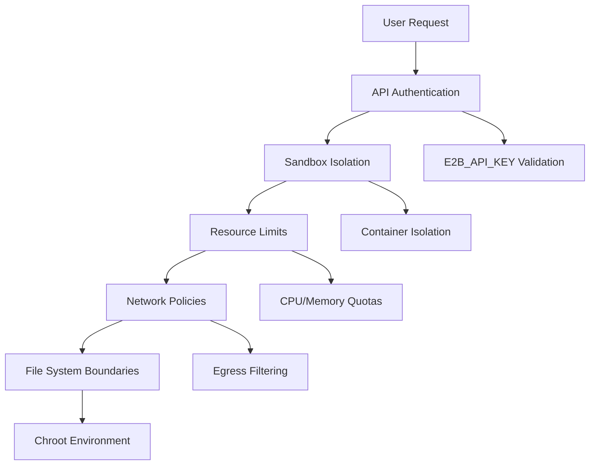
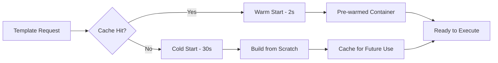

## Pengantar: Laboratorium Virtual yang Aman

Bayangkan sebuah **laboratorium virtual** di mana AI agent dapat melakukan eksperimen kode dengan bebas tanpa khawatir merusak sistem utama. E2B (Execute to Build) adalah infrastruktur cloud yang menyediakan sandbox terisolasi untuk menjalankan kode yang dihasilkan AI dengan aman. Seperti laboratorium kimia yang memiliki ruang khusus untuk eksperimen berbahaya, E2B memberikan lingkungan Linux yang terkontrol di mana AI dapat menulis, menguji, dan menjalankan kode tanpa risiko.

Platform ini menjadi jembatan penting antara kemampuan generatif AI dan eksekusi kode praktis, memungkinkan [[AI Agent]] untuk tidak hanya menghasilkan kode tetapi juga menjalankannya dalam lingkungan yang aman dan terprediksi.

## Arsitektur Sandbox: Ruang Kerja Terisolasi

### Komponen Utama Sandbox

E2B sandbox beroperasi seperti **workstation virtual** yang lengkap dengan berbagai fasilitas:



Setiap sandbox menyediakan:
- **Akses Linux OS**: Lingkungan Ubuntu yang bersih dan terisolasi
- **File System Operations**: Kemampuan CRUD untuk file dan direktori
- **Command Execution**: Menjalankan perintah shell dan proses
- **Internet Access**: Koneksi keluar untuk mengunduh dependencies
- **Pseudo-terminal (PTY)**: Interface terminal interaktif

### Model Komunikasi Berlapis

E2B menggunakan arsitektur komunikasi **dual-layer** yang efisien:

| Layer | Protocol | Fungsi | Analogi |
|-------|----------|--------|---------|
| **Lifecycle Management** | REST API | Create, Connect, Kill sandbox | Resepsionis hotel yang mengelola check-in/out |
| **Runtime Operations** | gRPC/Connect | File ops, commands, PTY | Concierge yang membantu aktivitas sehari-hari |

Pemisahan ini memungkinkan optimasi performa - operasi berat seperti transfer file menggunakan gRPC yang lebih efisien, sementara manajemen lifecycle menggunakan REST yang lebih sederhana.

## SDK dan Integrasi: Toolkit untuk Developer

### JavaScript/TypeScript SDK

```javascript
import { Sandbox } from '@e2b/code-interpreter'

// Membuat sandbox baru
const sandbox = await Sandbox.create()

// Menjalankan kode Python
await sandbox.runCode('x = 1')
const execution = await sandbox.runCode('x += 1; x')
console.log(execution.text) // Output: 2

// Operasi file system
await sandbox.filesystem.write('/app.py', 'print("Hello from AI!")')
const proc = await sandbox.process.start({
  cmd: 'python /app.py',
  onStdout: (data) => console.log(data.line)
})

await proc.wait()
await sandbox.close()
```

### Python SDK

```python
from e2b_code_interpreter import Sandbox

# Context manager untuk auto-cleanup
with Sandbox.create() as sandbox:
    # Eksekusi kode dengan state preservation
    sandbox.run_code("import pandas as pd")
    sandbox.run_code("df = pd.DataFrame({'a': [1,2,3]})")
    result = sandbox.run_code("df.describe()")
    print(result.text)
    
    # File operations
    sandbox.filesystem.write('/data.csv', csv_content)
    sandbox.run_code("df = pd.read_csv('/data.csv')")
```

Kedua SDK menyediakan API yang konsisten dengan pola **[[synchronous]]** dan **[[asynchronous]]** untuk fleksibilitas maksimal.

## Template System: Blueprint Lingkungan Kustom

### Fluent Builder Pattern

E2B menggunakan **builder pattern** yang intuitif untuk membuat template kustom:

```typescript
const template = Template()
  .fromPythonImage('3.11')
  .copy('requirements.txt', '/app/')
  .pipInstall()
  .runCmd('apt-get update && apt-get install -y postgresql-client')
  .setEnvs({ DATABASE_URL: 'postgresql://...' })
  .setStartCmd('python app.py', waitForPort(8000))

await Template.build(template, { 
  alias: 'ml-pipeline',
  cpuCount: 4,
  memoryMB: 8192
})
```

### Template States dan Lifecycle



Template system beroperasi dalam tiga tahap yang jelas:
1. **Initial**: Memilih base image atau template existing
2. **Building**: Menambahkan kustomisasi dan dependencies
3. **Final**: Deploy template ke infrastruktur E2B

### Optimasi dan Caching

Template builder menggunakan **hash-based caching** yang cerdas:
- File contents, destination path, permissions, dan owner di-hash
- Unchanged files tidak di-upload ulang
- Registry authentication untuk private Docker images
- Stack trace collection untuk debugging yang efektif

## Integrasi AI Agent: Model Context Protocol

### MCP Server Integration

E2B terintegrasi dengan **Model Context Protocol (MCP)** untuk komunikasi yang seamless dengan AI models:

```python
from e2b import McpServer

# Available MCP servers
mcp_servers = {
    'codeInterpreter': 'Python execution mimicking Jupyter',
    'e2b': 'Direct E2B integration for LLMs',
    'cockroachdb': 'Database management',
    'duckduckgo': 'Web search capabilities',
    'semgrep': 'Code security scanning'
}

# AI agent dapat mengakses multiple tools
sandbox = Sandbox.create()
mcp_token = sandbox.betaGetMcpToken()
mcp_url = sandbox.betaGetMcpUrl()
```

### Code Interpreter Features

E2B code interpreter beroperasi seperti **Jupyter notebook di cloud** dengan fitur:

| Feature | Deskripsi | Use Case |
|---------|-----------|----------|
| **State Preservation** | Variables dan imports tersimpan antar eksekusi | Iterative data analysis |
| **Multi-language Support** | Python, JS, TS, R, Java, Bash | Polyglot development |
| **Internet Access** | Download datasets dan libraries | Real-world data processing |
| **File Persistence** | Files tersimpan selama session | Complex workflows |

### Practical AI Integration Example

```python
# AI agent workflow dengan E2B
class AIDataAnalyst:
    def __init__(self):
        self.sandbox = Sandbox.create()
    
    def analyze_data(self, dataset_url, analysis_prompt):
        # Download dan prepare data
        self.sandbox.run_code(f"""
        import pandas as pd
        import matplotlib.pyplot as plt
        
        df = pd.read_csv('{dataset_url}')
        print(f"Dataset shape: {{df.shape}}")
        """)
        
        # AI generates analysis code based on prompt
        analysis_code = self.generate_analysis_code(analysis_prompt)
        
        # Execute AI-generated analysis
        result = self.sandbox.run_code(analysis_code)
        
        # Save visualizations
        self.sandbox.run_code("""
        plt.savefig('/analysis_result.png')
        """)
        
        return result.text
    
    def generate_analysis_code(self, prompt):
        # LLM generates appropriate pandas/matplotlib code
        return llm_generate_code(prompt)
```

## Security dan Isolation: Benteng Digital

### Multi-layer Security

E2B mengimplementasikan **defense-in-depth** security model:



### Authentication dan Access Control

- **API Key Management**: E2B_API_KEY untuk lifecycle operations
- **EnvD Access Token**: Auto-managed untuk runtime operations
- **Registry Authentication**: Support untuk private Docker registries
- **Template Validation**: Hash verification untuk integrity

### Resource Management

| Resource | Default Limit | Customizable | Purpose |
|----------|---------------|--------------|---------|
| **CPU** | 1 vCPU | ✅ | Compute capacity |
| **Memory** | 512 MB | ✅ | RAM allocation |
| **Storage** | 1 GB | ✅ | File system space |
| **Network** | Egress only | ❌ | Internet access |
| **Session Time** | 1 hour | ✅ | Sandbox lifetime |

## Performance dan Optimasi: Kecepatan Eksekusi

### Cold Start vs Warm Start

E2B mengoptimalkan **startup time** melalui berbagai strategi:



### Caching Strategies

- **Template Caching**: Pre-built images untuk common stacks
- **File Hash Caching**: Incremental uploads untuk large files
- **Dependency Caching**: Package installations di-cache
- **Container Warm-up**: Pre-warmed containers untuk popular templates

### Monitoring dan Observability

```python
# Built-in performance monitoring
execution = sandbox.run_code("""
import time
start = time.time()
# Heavy computation here
end = time.time()
print(f"Execution time: {end - start:.2f}s")
""")

# Resource usage tracking
stats = sandbox.get_resource_usage()
print(f"CPU: {stats.cpu_percent}%, Memory: {stats.memory_mb}MB")
```

## Use Cases dan Aplikasi Praktis

### 1. AI Code Interpreter

**Scenario**: AI assistant yang dapat menjalankan dan debug kode

```python
class AICodeAssistant:
    def __init__(self):
        self.sandbox = Sandbox.create()
    
    def debug_code(self, buggy_code):
        # Try original code
        result = self.sandbox.run_code(buggy_code)
        
        if result.error:
            # AI analyzes error and suggests fix
            fixed_code = self.ai_fix_code(buggy_code, result.error)
            return self.sandbox.run_code(fixed_code)
        
        return result
```

### 2. Data Analysis Pipeline

**Scenario**: Automated data processing dengan AI-generated scripts

```python
# AI generates analysis pipeline
pipeline_code = """
import pandas as pd
import numpy as np
from sklearn.model_selection import train_test_split
from sklearn.ensemble import RandomForestClassifier

# Load and preprocess data
df = pd.read_csv('/data/dataset.csv')
X = df.drop('target', axis=1)
y = df['target']

# Train model
X_train, X_test, y_train, y_test = train_test_split(X, y, test_size=0.2)
model = RandomForestClassifier()
model.fit(X_train, y_train)

# Evaluate
score = model.score(X_test, y_test)
print(f"Model accuracy: {score:.3f}")
"""

sandbox.run_code(pipeline_code)
```

### 3. Educational Code Playground

**Scenario**: Interactive learning environment untuk programming

```javascript
// Student submits code for evaluation
const studentCode = `
def fibonacci(n):
    if n <= 1:
        return n
    return fibonacci(n-1) + fibonacci(n-2)

print(fibonacci(10))
`

// Auto-grading system
const result = await sandbox.runCode(studentCode)
const testCases = await sandbox.runCode(`
# Test cases
assert fibonacci(0) == 0
assert fibonacci(1) == 1
assert fibonacci(10) == 55
print("All tests passed!")
`)
```

## Refleksi: Masa Depan Eksekusi Kode AI

E2B merepresentasikan evolusi penting dalam **AI-human collaboration**. Seperti laboratorium yang memungkinkan ilmuwan melakukan eksperimen dengan aman, E2B memberikan AI kemampuan untuk tidak hanya "berpikir" tentang kode, tetapi juga menjalankannya dalam lingkungan yang terkontrol.

Platform ini mengatasi gap fundamental antara **generative AI** dan **practical execution**, membuka jalan untuk AI agent yang lebih autonomous dan capable. Dengan security model yang robust dan performance yang optimal, E2B menjadi foundation untuk generasi baru aplikasi AI yang dapat berinteraksi langsung dengan sistem dan data real-world.

Ke depan, kita dapat mengharapkan integrasi yang lebih dalam dengan [[LLM]], support untuk lebih banyak bahasa pemrograman, dan optimasi performance yang memungkinkan real-time code execution untuk aplikasi AI yang lebih responsif dan interaktif.