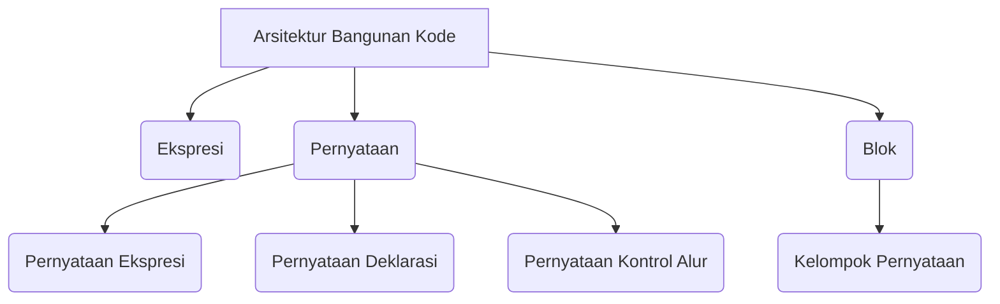

## Pengantar: Arsitektur Bangunan Kode

Bayangkan sebuah program Java sebagai bangunan yang kokoh, di mana setiap komponen memiliki peran struktural yang jelas. [[Ekspresi|ekspresi]] adalah batu bata dasar yang menyusun setiap bagian, [[Pernyataan|pernyataan]] adalah dinding yang membentuk ruang eksekusi, dan [[Blok|blok]] adalah ruangan yang mengelompokkan dinding-dinding tersebut. Memahami hubungan antara ketiganya adalah kunci untuk membangun kode yang terstruktur dan mudah dipelihara, seperti halnya arsitek yang memahami bagaimana batu bata, dinding, dan ruangan membentuk bangunan yang stabil. Konten ini akan menjelaskan ketiga komponen tersebut berdasarkan panduan dari [[Dev.java|sumber resmi Java]].

## Ekspresi: Batu Bata Dasar

Ekspresi adalah konstruksi yang terdiri dari [[Variabel|variabel]], [[Operator|operator]], dan pemanggilan metode, yang mengevaluasi ke satu nilai.

### Karakteristik Ekspresi
- Tipe data hasil evaluasi bergantung pada elemen yang digunakan (misal: `cadence = 0` mengembalikan `int`)
- Dapat dibentuk menjadi ekspresi majemuk dengan menggabungkan ekspresi kecil (misal: `1 * 2 * 3`)
- Urutan evaluasi ditentukan oleh preseden operator atau tanda kurung (`(x + y) / 100`)

### Contoh Ekspresi
```java
int result = 1 + 2; // Ekspresi majemuk
boolean isEqual = (value1 == value2); // Ekspresi perbandingan
```

## Aritmatika Titik Mengambang: Keunikan Batu Bata

Aritmatika titik mengambang memiliki perilaku tak terduga karena cara pembulatan yang digunakan, seperti batu bata yang memiliki ukuran tidak seragam.

### Contoh Perilaku Tak Terduga

```java
double d1 = 0.1 + 0.1 + 0.1 + 0.1 + 0.1 + 0.1 + 0.1 + 0.1 + 0.1 + 0.1;
System.out.println("d1 == 1 ? " + (d1 == 1.0)); // Output: false
```


## Pernyataan: Dinding yang Membentuk Eksekusi

Pernyataan adalah unit eksekusi lengkap, setara dengan kalimat dalam bahasa alami. Dapat dibentuk dari ekspresi dengan menambahkan titik koma (`;`).

### Jenis Pernyataan
- Pernyataan ekspresi: Berasal dari ekspresi (penugasan, `++`, `--`, pemanggilan metode, pembuatan objek)
- Pernyataan deklarasi: Mendeklarasikan variabel (misal: `double aValue = 8933.234;`)
- Pernyataan kontrol alur: Mengatur urutan eksekusi (misal: `if`, `for`, `while`)

### Contoh Pernyataan Ekspresi
```java
aValue = 8933.234; // Penugasan
IO.println("Hello World!"); // Pemanggilan metode
Bicycle myBike = new Bicycle(); // Pembuatan objek
```

## Blok: Ruangan yang Mengelompokkan Dinding

Blok adalah kelompok pernyataan di antara kurung kurawal, dapat digunakan di mana saja pernyataan tunggal diizinkan.

### Contoh Blok

```java
class BlockDemo {
     public static void main(String[] args) {
          boolean condition = true;
          if (condition) { // Awal blok 1
               IO.println("Condition is true.");
          } // Akhir blok 1
          else { // Awal blok 2
               IO.println("Condition is false.");
          } // Akhir blok 2
     }
}
```


## Diagram: Hierarki Arsitektur Bangunan Kode

Berikut adalah diagram yang memvisualisasikan hubungan antara ekspresi, pernyataan, dan blok dalam arsitektur bangunan kode:


Diagram di atas menunjukkan hierarki komponen kode: Arsitektur Bangunan Kode sebagai kategori induk yang mencakup Ekspresi (batu bata), Pernyataan (dinding), dan Blok (ruangan). Pernyataan sendiri terbagi menjadi tiga jenis, sementara Blok berfungsi sebagai kelompok pernyataan. Panah menunjukkan hubungan ketergantungan antar komponen.

## Refleksi: Bangunan Kode yang Kokoh

Seperti arsitek yang memastikan setiap batu bata, dinding, dan ruangan terpasang dengan benar, programmer yang memahami ekspresi, pernyataan, dan blok dapat membangun kode yang stabil dan mudah dipelihara. Ekspresi sebagai batu bata menyediakan dasar data, pernyataan sebagai dinding mengatur eksekusi, dan blok sebagai ruangan mengelompokkan logika yang terkait. Dengan memahami [[Arsitektur Bangunan Kode|metafora ini]], kita dapat menghindari kesalahan seperti ekspresi ambigu dan pernyataan yang tidak lengkap, serta meningkatkan keterbacaan kode dalam perjalanan [[Belajar Pemrograman|pemrograman]] kita.
