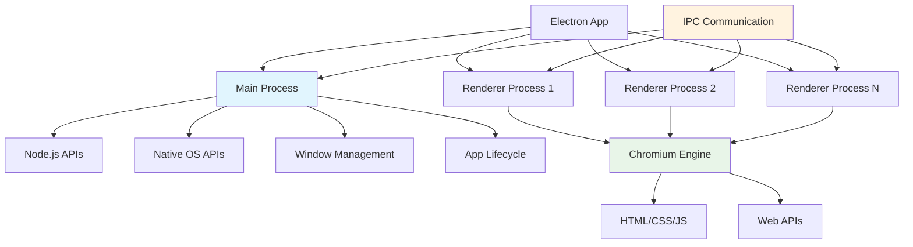

## Pengantar: Transformer yang Mengubah Web App Menjadi Desktop Native

Bayangkan Electron sebagai **transformer canggih** yang dapat mengubah web application menjadi desktop application yang fully functional - seperti robot transformer yang dapat berubah dari mobil menjadi robot, Electron memungkinkan [[JavaScript]], HTML, dan CSS berubah dari web app menjadi native desktop app yang dapat berjalan di Windows, macOS, dan Linux tanpa perlu rewrite code.

Electron adalah framework yang memungkinkan developers membangun cross-platform desktop applications menggunakan web technologies. Dengan menggabungkan Chromium rendering engine dan [[Node.js]] runtime, Electron menciptakan environment di mana web applications dapat berjalan sebagai native desktop applications dengan akses penuh ke operating system APIs.

**Mengapa Electron Revolutionary?**
- **Write Once, Run Everywhere**: Satu codebase untuk multiple desktop platforms
- **Web Technology Leverage**: Menggunakan existing [[HTML]], CSS, [[JavaScript]] skills
- **Rich Ecosystem**: Akses ke [[NPM]] packages dan web libraries
- **Native Integration**: Full access ke OS APIs dan native features
- **Rapid Development**: Faster development cycle dibanding native desktop development

## Core Architecture: Hybrid Engine yang Powerful

### Main Process vs Renderer Process

Electron menggunakan **multi-process architecture** yang memisahkan main process (backend) dan renderer processes (frontend):



Diagram ini menunjukkan bagaimana Electron memisahkan concerns - main process menangani native operations sementara renderer processes menangani UI, dengan IPC (Inter-Process Communication) sebagai bridge untuk communication.

### Basic Electron Application Structure

```javascript
// main.js - Main process
const { app, BrowserWindow, Menu, ipcMain } = require('electron');
const path = require('path');
const isDev = require('electron-is-dev');

class ElectronApp {
    constructor() {
        this.mainWindow = null;
        this.setupEventHandlers();
    }
    
    setupEventHandlers() {
        // App event handlers
        app.whenReady().then(() => {
            this.createMainWindow();
            this.setupMenu();
            this.setupIPC();
        });
        
        app.on('window-all-closed', () => {
            if (process.platform !== 'darwin') {
                app.quit();
            }
        });
        
        app.on('activate', () => {
            if (BrowserWindow.getAllWindows().length === 0) {
                this.createMainWindow();
            }
        });
    }
    
    createMainWindow() {
        // Create browser window dengan native integration
        this.mainWindow = new BrowserWindow({
            width: 1200,
            height: 800,
            webPreferences: {
                nodeIntegration: false, // Security best practice
                contextIsolation: true, // Security best practice
                preload: path.join(__dirname, 'preload.js')
            },
            titleBarStyle: 'hiddenInset', // macOS native look
            show: false // Prevent flash of unstyled content
        });
        
        // Load application
        const startUrl = isDev 
            ? 'http://localhost:3000' 
            : `file://${path.join(__dirname, '../build/index.html')}`;
            
        this.mainWindow.loadURL(startUrl);
        
        // Show window when ready
        this.mainWindow.once('ready-to-show', () => {
            this.mainWindow.show();
            
            // Open DevTools in development
            if (isDev) {
                this.mainWindow.webContents.openDevTools();
            }
        });
    }
    
    setupMenu() {
        // Native menu setup
        const template = [
            {
                label: 'File',
                submenu: [
                    {
                        label: 'New',
                        accelerator: 'CmdOrCtrl+N',
                        click: () => this.createNewDocument()
                    },
                    {
                        label: 'Open',
                        accelerator: 'CmdOrCtrl+O',
                        click: () => this.openDocument()
                    },
                    { type: 'separator' },
                    {
                        label: 'Quit',
                        accelerator: process.platform === 'darwin' ? 'Cmd+Q' : 'Ctrl+Q',
                        click: () => app.quit()
                    }
                ]
            },
            {
                label: 'Edit',
                submenu: [
                    { role: 'undo' },
                    { role: 'redo' },
                    { type: 'separator' },
                    { role: 'cut' },
                    { role: 'copy' },
                    { role: 'paste' }
                ]
            }
        ];
        
        const menu = Menu.buildFromTemplate(template);
        Menu.setApplicationMenu(menu);
    }
    
    setupIPC() {
        // IPC handlers untuk communication dengan renderer
        ipcMain.handle('get-app-version', () => {
            return app.getVersion();
        });
        
        ipcMain.handle('show-save-dialog', async () => {
            const { dialog } = require('electron');
            const result = await dialog.showSaveDialog(this.mainWindow, {
                filters: [
                    { name: 'JSON Files', extensions: ['json'] },
                    { name: 'All Files', extensions: ['*'] }
                ]
            });
            return result;
        });
    }
}

// Initialize application
new ElectronApp();
```

### Preload Script - Secure Bridge

```javascript
// preload.js - Secure bridge antara main dan renderer
const { contextBridge, ipcRenderer } = require('electron');

// Expose safe APIs ke renderer process
contextBridge.exposeInMainWorld('electronAPI', {
    // App information
    getAppVersion: () => ipcRenderer.invoke('get-app-version'),
    
    // File operations
    showSaveDialog: () => ipcRenderer.invoke('show-save-dialog'),
    
    // Window operations
    minimizeWindow: () => ipcRenderer.invoke('minimize-window'),
    maximizeWindow: () => ipcRenderer.invoke('maximize-window'),
    closeWindow: () => ipcRenderer.invoke('close-window'),
    
    // Event listeners
    onWindowStateChange: (callback) => {
        ipcRenderer.on('window-state-changed', callback);
    },
    
    // Remove listeners
    removeAllListeners: (channel) => {
        ipcRenderer.removeAllListeners(channel);
    }
});
```

## Integration dengan Modern Web Frameworks

### Electron dengan React

Electron seamlessly integrates dengan [[React]] applications:

```javascript
// React component dengan Electron integration
import React, { useState, useEffect } from 'react';

function ElectronReactApp() {
    const [appVersion, setAppVersion] = useState('');
    const [isElectron, setIsElectron] = useState(false);
    
    useEffect(() => {
        // Check if running dalam Electron
        setIsElectron(window.electronAPI !== undefined);
        
        if (window.electronAPI) {
            // Get app version dari main process
            window.electronAPI.getAppVersion()
                .then(version => setAppVersion(version));
        }
    }, []);
    
    const handleSaveFile = async () => {
        if (window.electronAPI) {
            const result = await window.electronAPI.showSaveDialog();
            if (!result.canceled) {
                console.log('Save to:', result.filePath);
                // Implement save logic
            }
        }
    };
    
    return (
        <div className="electron-app">
            <header className="app-header">
                <h1>Electron + React App</h1>
                {isElectron && (
                    <p>Running in Electron v{appVersion}</p>
                )}
            </header>
            
            <main className="app-content">
                <button onClick={handleSaveFile}>
                    Save File
                </button>
                
                {/* Native-like UI components */}
                <div className="native-controls">
                    <button onClick={() => window.electronAPI?.minimizeWindow()}>
                        Minimize
                    </button>
                    <button onClick={() => window.electronAPI?.maximizeWindow()}>
                        Maximize
                    </button>
                    <button onClick={() => window.electronAPI?.closeWindow()}>
                        Close
                    </button>
                </div>
            </main>
        </div>
    );
}

export default ElectronReactApp;
```

### Build Configuration

```json
// package.json untuk Electron + React
{
    "name": "electron-react-app",
    "version": "1.0.0",
    "main": "public/main.js",
    "homepage": "./",
    "scripts": {
        "start": "react-scripts start",
        "build": "react-scripts build",
        "electron": "electron .",
        "electron-dev": "ELECTRON_IS_DEV=true electron .",
        "build-electron": "npm run build && electron-builder",
        "dist": "npm run build && electron-builder --publish=never"
    },
    "dependencies": {
        "react": "^18.2.0",
        "react-dom": "^18.2.0",
        "electron-is-dev": "^2.0.0"
    },
    "devDependencies": {
        "electron": "^22.0.0",
        "electron-builder": "^23.6.0",
        "react-scripts": "5.0.1"
    },
    "build": {
        "appId": "com.mycompany.electronapp",
        "productName": "My Electron App",
        "directories": {
            "output": "dist"
        },
        "files": [
            "build/**/*",
            "public/main.js",
            "public/preload.js"
        ],
        "mac": {
            "category": "public.app-category.productivity"
        },
        "win": {
            "target": "nsis"
        },
        "linux": {
            "target": "AppImage"
        }
    }
}
```

## Advanced Features dan Native Integration

### Native OS Integration

```javascript
// Advanced native features
const { 
    app, 
    BrowserWindow, 
    Notification, 
    Tray, 
    Menu,
    globalShortcut,
    powerMonitor,
    shell
} = require('electron');
const path = require('path');

class AdvancedElectronFeatures {
    constructor() {
        this.tray = null;
        this.setupAdvancedFeatures();
    }
    
    setupAdvancedFeatures() {
        // System tray integration
        this.createTray();
        
        // Global shortcuts
        this.setupGlobalShortcuts();
        
        // System notifications
        this.setupNotifications();
        
        // Power management
        this.setupPowerManagement();
        
        // Protocol handling
        this.setupProtocolHandling();
    }
    
    createTray() {
        this.tray = new Tray(path.join(__dirname, 'assets/tray-icon.png'));
        
        const contextMenu = Menu.buildFromTemplate([
            {
                label: 'Show App',
                click: () => this.showMainWindow()
            },
            {
                label: 'Quit',
                click: () => app.quit()
            }
        ]);
        
        this.tray.setToolTip('My Electron App');
        this.tray.setContextMenu(contextMenu);
    }
    
    setupGlobalShortcuts() {
        // Register global shortcuts
        globalShortcut.register('CommandOrControl+Shift+K', () => {
            this.showMainWindow();
        });
        
        globalShortcut.register('CommandOrControl+Shift+H', () => {
            this.hideMainWindow();
        });
    }
    
    setupNotifications() {
        // System notifications
        if (Notification.isSupported()) {
            const notification = new Notification({
                title: 'Electron App',
                body: 'Application started successfully!',
                icon: path.join(__dirname, 'assets/notification-icon.png')
            });
            
            notification.show();
            
            notification.on('click', () => {
                this.showMainWindow();
            });
        }
    }
    
    setupPowerManagement() {
        // Power management events
        powerMonitor.on('suspend', () => {
            console.log('System is going to sleep');
            // Save application state
        });
        
        powerMonitor.on('resume', () => {
            console.log('System resumed from sleep');
            // Restore application state
        });
        
        powerMonitor.on('on-ac', () => {
            console.log('System plugged in');
        });
        
        powerMonitor.on('on-battery', () => {
            console.log('System on battery');
            // Enable power saving mode
        });
    }
    
    setupProtocolHandling() {
        // Custom protocol handling
        app.setAsDefaultProtocolClient('myelectronapp');
        
        // Handle protocol URLs
        app.on('open-url', (event, url) => {
            event.preventDefault();
            console.log('Protocol URL:', url);
            // Handle custom protocol
        });
    }
}
```

### File System Integration

```javascript
// File system operations dengan native dialogs
const { dialog, shell } = require('electron');
const fs = require('fs').promises;
const path = require('path');

class FileSystemManager {
    constructor(mainWindow) {
        this.mainWindow = mainWindow;
        this.setupFileHandlers();
    }
    
    setupFileHandlers() {
        // File operation handlers
        ipcMain.handle('open-file-dialog', this.openFileDialog.bind(this));
        ipcMain.handle('save-file-dialog', this.saveFileDialog.bind(this));
        ipcMain.handle('read-file', this.readFile.bind(this));
        ipcMain.handle('write-file', this.writeFile.bind(this));
        ipcMain.handle('show-in-folder', this.showInFolder.bind(this));
    }
    
    async openFileDialog() {
        const result = await dialog.showOpenDialog(this.mainWindow, {
            properties: ['openFile', 'multiSelections'],
            filters: [
                { name: 'Text Files', extensions: ['txt', 'md'] },
                { name: 'JSON Files', extensions: ['json'] },
                { name: 'All Files', extensions: ['*'] }
            ]
        });
        
        return result;
    }
    
    async saveFileDialog() {
        const result = await dialog.showSaveDialog(this.mainWindow, {
            defaultPath: 'untitled.txt',
            filters: [
                { name: 'Text Files', extensions: ['txt'] },
                { name: 'JSON Files', extensions: ['json'] }
            ]
        });
        
        return result;
    }
    
    async readFile(filePath) {
        try {
            const content = await fs.readFile(filePath, 'utf8');
            return { success: true, content };
        } catch (error) {
            return { success: false, error: error.message };
        }
    }
    
    async writeFile(filePath, content) {
        try {
            await fs.writeFile(filePath, content, 'utf8');
            return { success: true };
        } catch (error) {
            return { success: false, error: error.message };
        }
    }
    
    showInFolder(filePath) {
        shell.showItemInFolder(filePath);
    }
}
```

## Performance Optimization untuk Electron

### Memory Management

```javascript
// Memory optimization strategies
class ElectronMemoryManager {
    constructor() {
        this.memoryThreshold = 500 * 1024 * 1024; // 500MB
        this.startMonitoring();
    }
    
    startMonitoring() {
        setInterval(() => {
            this.checkMemoryUsage();
        }, 30000); // Check every 30 seconds
    }
    
    checkMemoryUsage() {
        const memoryUsage = process.memoryUsage();
        
        if (memoryUsage.heapUsed > this.memoryThreshold) {
            console.warn('High memory usage detected:', {
                heapUsed: Math.round(memoryUsage.heapUsed / 1024 / 1024) + 'MB',
                heapTotal: Math.round(memoryUsage.heapTotal / 1024 / 1024) + 'MB'
            });
            
            // Trigger garbage collection
            if (global.gc) {
                global.gc();
            }
            
            // Notify renderer processes to cleanup
            BrowserWindow.getAllWindows().forEach(window => {
                window.webContents.send('memory-pressure');
            });
        }
    }
    
    // Optimize renderer process memory
    optimizeRenderer(webContents) {
        // Clear cache periodically
        webContents.session.clearCache();
        
        // Clear storage data
        webContents.session.clearStorageData({
            storages: ['cookies', 'filesystem', 'indexdb', 'localstorage', 'shadercache', 'websql']
        });
    }
}
```

### Bundle Size Optimization

```javascript
// Webpack configuration untuk Electron
const path = require('path');

module.exports = {
    target: 'electron-renderer',
    entry: './src/index.js',
    output: {
        path: path.resolve(__dirname, 'build'),
        filename: 'bundle.js'
    },
    optimization: {
        splitChunks: {
            chunks: 'all',
            cacheGroups: {
                vendor: {
                    test: /[\\/]node_modules[\\/]/,
                    name: 'vendors',
                    chunks: 'all'
                }
            }
        }
    },
    externals: {
        // Exclude Electron modules dari bundle
        'electron': 'require("electron")',
        'fs': 'require("fs")',
        'path': 'require("path")'
    }
};
```

## Security Best Practices

### Secure Configuration

```javascript
// Security-focused Electron configuration
const secureElectronApp = {
    webPreferences: {
        // Disable Node.js integration dalam renderer
        nodeIntegration: false,
        
        // Enable context isolation
        contextIsolation: true,
        
        // Disable remote module
        enableRemoteModule: false,
        
        // Use preload script untuk safe API exposure
        preload: path.join(__dirname, 'preload.js'),
        
        // Disable web security (only untuk development)
        webSecurity: !isDev,
        
        // Disable experimental features
        experimentalFeatures: false,
        
        // Sandbox renderer process
        sandbox: true
    }
};

// Content Security Policy
const csp = `
    default-src 'self';
    script-src 'self' 'unsafe-inline';
    style-src 'self' 'unsafe-inline';
    img-src 'self' data: https:;
    connect-src 'self' https:;
`;
```

## Real-World Applications

### Popular Electron Applications

| Application | Use Case | Key Features |
|-------------|----------|--------------|
| **Visual Studio Code** | Code Editor | Extensions, integrated terminal |
| **Discord** | Communication | Real-time messaging, voice chat |
| **Slack** | Team Collaboration | Notifications, file sharing |
| **WhatsApp Desktop** | Messaging | Cross-platform sync |
| **Figma Desktop** | Design Tool | [[Native Performance]], file access |

### Case Study: Code Editor Implementation

```javascript
// Simplified code editor dengan Electron
class CodeEditor {
    constructor() {
        this.setupEditor();
        this.setupFileWatching();
        this.setupAutoSave();
    }
    
    setupEditor() {
        // Monaco Editor integration
        require.config({ paths: { 'vs': 'node_modules/monaco-editor/min/vs' }});
        require(['vs/editor/editor.main'], () => {
            this.editor = monaco.editor.create(document.getElementById('editor'), {
                value: '',
                language: 'javascript',
                theme: 'vs-dark'
            });
        });
    }
    
    setupFileWatching() {
        // Watch file changes dengan chokidar
        const chokidar = require('chokidar');
        this.watcher = chokidar.watch(this.currentFilePath);
        
        this.watcher.on('change', (path) => {
            // Reload file if changed externally
            this.reloadFile(path);
        });
    }
    
    setupAutoSave() {
        // Auto-save functionality
        setInterval(() => {
            if (this.hasUnsavedChanges) {
                this.saveFile();
            }
        }, 30000); // Auto-save every 30 seconds
    }
}
```

## Trade-offs dan Considerations

### Electron vs Native Development

| Aspect | Electron | Native |
|--------|----------|--------|
| **Development Speed** | Fast (web technologies) | Slower (platform-specific) |
| **Performance** | Good (some overhead) | Excellent |
| **Bundle Size** | Large (100MB+) | Small |
| **Memory Usage** | High | Low |
| **Platform Integration** | Good | Excellent |
| **[[Developer Experience]]** | Excellent | Platform-dependent |

### When to Choose Electron

**Good Fit:**
- Cross-platform desktop applications
- Leveraging existing web development skills
- Rapid prototyping dan development
- Applications dengan complex UI requirements

**Consider Alternatives:**
- Performance-critical applications
- System-level utilities
- Applications dengan minimal UI
- Resource-constrained environments

## Refleksi: Democratizing Desktop Development

Electron telah **democratized desktop application development** dengan memungkinkan web developers membangun native desktop applications menggunakan familiar technologies. Seperti transformer yang membuka possibilities baru, Electron memungkinkan [[JavaScript]], [[React]], dan web technologies untuk beroperasi di desktop environment dengan [[Native Performance]] yang acceptable.

Integration dengan modern development tools, [[NPM]] ecosystem, dan frameworks seperti [[React]] menciptakan development experience yang powerful dan efficient. Meskipun ada trade-offs dalam terms of performance dan resource usage, Electron menyediakan path yang viable untuk building cross-platform desktop applications dengan rapid development cycles.

Masa depan Electron terletak pada continued improvements dalam [[Performance Optimization]], security enhancements, dan better integration dengan native OS features. Investasi dalam Electron adalah investasi dalam unified development approach yang memungkinkan teams untuk leverage web technologies untuk building desktop applications yang truly cross-platform dan maintainable.