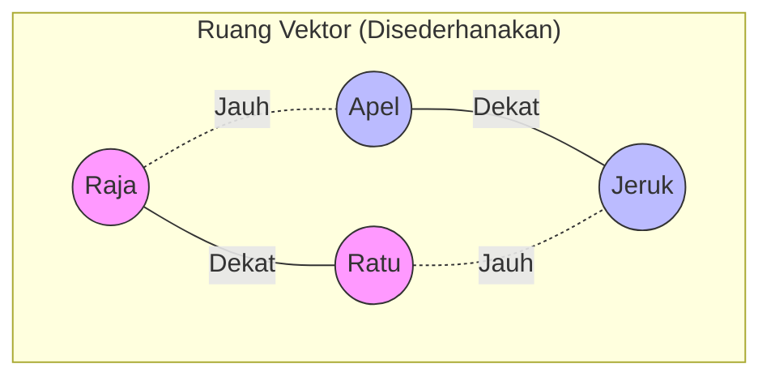

## Pengantar: Bahasa Komputer adalah Angka

Komputer sebenarnya "buta huruf". Mereka tidak mengerti apa itu "Cinta", "Apel", atau "Raja". Bagi komputer, semua hanyalah deretan bit. Lalu, bagaimana **[[Artificial Intelligence]]** bisa memahami nuansa bahasa manusia?

Jawabannya adalah **Embeddings**.

Bayangkan **Embeddings** sebagai **Sistem GPS untuk Kata**. Jika di dunia nyata kita menggunakan koordinat Garis Lintang dan Bujur (Latitude/Longitude) untuk menemukan lokasi, dalam dunia AI, kita menggunakan deretan angka (vektor) untuk menemukan **posisi makna** sebuah kata.

## Konsep: Peta Multidimensi

### Dari Kata ke Koordinat
Dalam peta konvensional (2D), lokasi ditentukan oleh 2 angka: `[x, y]`.
Dalam Embeddings, lokasi sebuah kata ditentukan oleh ratusan bahkan ribuan angka: `[0.12, -0.59, 0.88, ...]`.

Setiap angka dalam deretan tersebut mewakili "dimensi makna" yang abstrak, seperti:
*   Dimensi 1: Seberapa "biologis" benda ini?
*   Dimensi 2: Seberapa "kerajaan" benda ini?
*   Dimensi 3: Seberapa "feminin" benda ini?

### Contoh Klasik: Raja dan Ratu
Mari kita lihat operasi matematika yang terkenal dalam dunia embeddings:

> **Raja - Pria + Wanita = Ratu**

Secara vektor, ini terjadi karena posisi kata "Raja" dikurangi fitur "Pria" dan ditambah fitur "Wanita" akan menggeser titik koordinatnya mendekati lokasi kata "Ratu".

## Visualisasi: Menghitung Jarak

Jarak antar titik dalam ruang vektor disebut **Cosine Similarity**. Semakin dekat jaraknya, semakin mirip maknanya.

*Penjelasan: Kata-kata dengan konteks serupa (Raja & Ratu) akan berkumpul di satu area ("Cluster"), terpisah jauh dari kata dengan konteks berbeda (Apel & Jeruk).*

## Mekanisme: Penerjemahan Data

Bagaimana proses perubahan ini terjadi?

### 1. Input Data
Anda memasukkan kalimat: *"Saya suka makan nasi goreng."*

### 2. Embedding Model
Data ini masuk ke **Embedding Model** (seperti `text-embedding-3-small` dari OpenAI atau `Bert`). Model ini adalah "Kartografer" (pembuat peta) yang sangat cerdas.

### 3. Output Vektor
Model mengeluarkan daftar angka: `[0.002, -0.015, 0.921, ...]`.
Inilah "alamat GPS" dari makna kalimat Anda.

## Evolusi: Boneka Matryoshka (Matryoshka Embeddings)

Salah satu inovasi terbaru (2024) dalam dunia embeddings adalah **Matryoshka Representation Learning (MRL)**, yang digunakan pada model seperti `text-embedding-3-small` milik OpenAI.

Bayangkan ini seperti **Boneka Matryoshka (Rusia)**:
*   Boneka terbesar (Full Dimensions) berisi detail paling lengkap.
*   Jika Anda membuka dan mengambil boneka yang lebih kecil (Truncated Dimensions), bentuknya **masih sama**, hanya lebih sederhana.

### Mengapa ini penting?
Dulu, vektor bersifat kaku (misal: harus 1536 dimensi). Sekarang, Anda bisa "memotong" ujung vektor untuk menghemat tempat tanpa kehilangan makna intinya.

| Dimensi | Metafora | Akurasi | Biaya Storage |
| :--- | :--- | :--- | :--- |
| **3072 (Full)** | Foto Resolusi 4K | Sangat Tinggi | Mahal |
| **1024** | Foto Resolusi 1080p | Tinggi | Sedang |
| **256 (Truncated)** | Foto Resolusi 480p | Cukup Baik | Sangat Murah |

Teknologi ini memungkinkan **[[Vector Database]]** menjadi jauh lebih hemat dan cepat.

## Kegunaan: Mengapa Ini Penting?

Embeddings adalah pondasi dari banyak teknologi modern:

| Fitur | Fungsi Embeddings |
| :--- | :--- |
| **[[Semantic Search]]** | Mencari dokumen bukan berdasarkan kata kunci persis, tapi berdasarkan *maksud* (misal: cari "Smartphone", ketemu "iPhone"). |
| **[[RAG]]** | Membantu sistem menemukan referensi yang relevan di **[[Vector Database]]** untuk menjawab pertanyaan. |
| **Rekomendasi** | Jika Anda menyukai film A, sistem mencari film B yang lokasi vektornya "dekat" dengan film A. |

## Refleksi: Matematika Bahasa

**Embeddings** mengajarkan kita bahwa bahasa, dengan segala keindahannya, ternyata memiliki struktur matematis yang tersembunyi. Dengan mengubah kata menjadi angka, kita memberikan komputer "indra perasa" untuk memahami konteks, sentimen, dan hubungan antar konsep yang sebelumnya hanya dimengerti oleh manusia.
