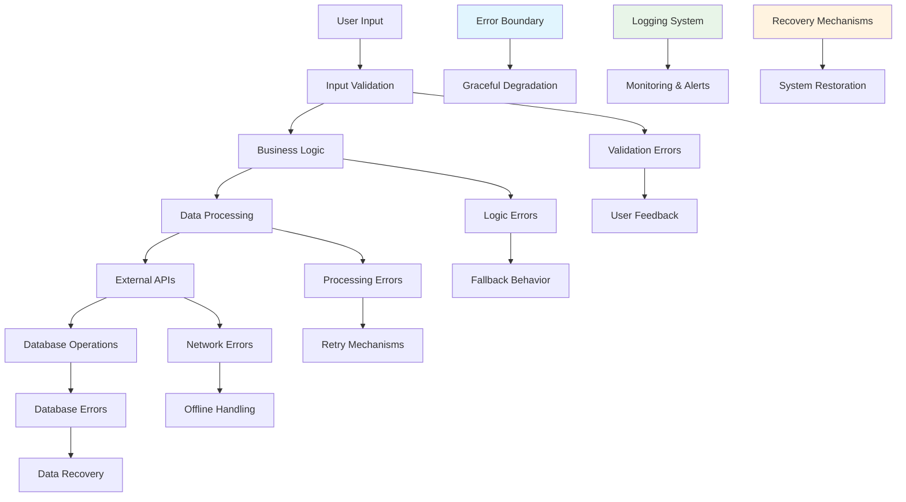

## Pengantar: Sistem Keamanan Pesawat untuk Aplikasi Digital

Bayangkan Error Handling sebagai **sistem keamanan pesawat terbang** yang sophisticated - multiple layers of safety mechanisms yang dapat mendeteksi masalah, memberikan warning kepada pilot, mengaktifkan backup systems, dan bahkan melakukan emergency landing dengan selamat jika diperlukan. Seperti pesawat modern yang memiliki redundant systems dan automatic recovery procedures, error handling yang baik memastikan aplikasi dapat gracefully handle unexpected situations dan tetap memberikan user experience yang acceptable.

Error Handling adalah systematic approach untuk anticipating, catching, dan managing errors yang dapat terjadi dalam software applications. Ini melibatkan proactive error prevention, graceful error recovery, meaningful error reporting, dan user-friendly error communication untuk memastikan application reliability dan [[Developer Experience]] yang optimal.

**Mengapa Error Handling Critical?**
- **System Reliability**: Prevents application crashes dan data corruption
- **User Experience**: Graceful degradation instead of broken interfaces
- **Debugging Efficiency**: Clear error information untuk faster problem resolution
- **Security**: Prevents information leakage melalui error messages
- **Maintainability**: Easier troubleshooting dan system monitoring
## Core Principles: Sistem Keamanan Berlapis

### Defense in Depth - Multiple Safety Layers

Error handling yang effective menggunakan **multiple layers of protection** seperti sistem keamanan pesawat:



### JavaScript Error Types dan Handling

```javascript
// Comprehensive error handling dalam JavaScript
class ErrorHandler {
    constructor() {
        this.setupGlobalHandlers();
        this.errorLog = [];
    }
    
    setupGlobalHandlers() {
        // Catch unhandled JavaScript errors
        window.addEventListener('error', (event) => {
            this.handleError({
                type: 'JavaScript Error',
                message: event.message,
                filename: event.filename,
                lineno: event.lineno,
                colno: event.colno,
                error: event.error
            });
        });
        
        // Catch unhandled promise rejections
        window.addEventListener('unhandledrejection', (event) => {
            this.handleError({
                type: 'Unhandled Promise Rejection',
                message: event.reason?.message || 'Unknown promise rejection',
                promise: event.promise,
                reason: event.reason
            });
        });
        
        // [[Node.js]] process error handling
        if (typeof process !== 'undefined') {
            process.on('uncaughtException', (error) => {
                this.handleCriticalError(error);
            });
            
            process.on('unhandledRejection', (reason, promise) => {
                this.handleError({
                    type: 'Node.js Unhandled Rejection',
                    reason,
                    promise
                });
            });
        }
    }
    
    // Centralized error handling
    handleError(errorInfo) {
        // Log error dengan context
        this.logError(errorInfo);
        
        // Send to monitoring service
        this.reportError(errorInfo);
        
        // Determine recovery strategy
        this.attemptRecovery(errorInfo);
    }
    
    // Try-catch wrapper dengan retry logic
    async executeWithRetry(operation, maxRetries = 3, delay = 1000) {
        for (let attempt = 1; attempt <= maxRetries; attempt++) {
            try {
                return await operation();
            } catch (error) {
                if (attempt === maxRetries) {
                    throw new Error(`Operation failed after ${maxRetries} attempts: ${error.message}`);
                }
                
                // Exponential backoff
                await this.delay(delay * Math.pow(2, attempt - 1));
            }
        }
    }
    
    delay(ms) {
        return new Promise(resolve => setTimeout(resolve, ms));
    }
}
```

## React Error Boundaries: Safety Net untuk Components

### Advanced Error Boundary Implementation

```javascript
// Comprehensive React Error Boundary
import React from 'react';

class AdvancedErrorBoundary extends React.Component {
    constructor(props) {
        super(props);
        this.state = {
            hasError: false,
            error: null,
            errorInfo: null,
            errorId: null,
            retryCount: 0
        };
    }
    
    static getDerivedStateFromError(error) {
        // Update state untuk show fallback UI
        return {
            hasError: true,
            error,
            errorId: this.generateErrorId()
        };
    }
    
    componentDidCatch(error, errorInfo) {
        // Log error dengan detailed information
        this.setState({ errorInfo });
        
        // Report ke error tracking service
        this.reportError(error, errorInfo);
        
        // Analytics tracking
        if (window.gtag) {
            window.gtag('event', 'exception', {
                description: error.message,
                fatal: false
            });
        }
    }
    
    static generateErrorId() {
        return `error_${Date.now()}_${Math.random().toString(36).substr(2, 9)}`;
    }
    
    reportError(error, errorInfo) {
        // Send to monitoring service (Sentry, LogRocket, etc.)
        if (window.Sentry) {
            window.Sentry.withScope((scope) => {
                scope.setTag('component', 'ErrorBoundary');
                scope.setLevel('error');
                scope.setContext('errorInfo', errorInfo);
                window.Sentry.captureException(error);
            });
        }
        
        // Custom error reporting
        fetch('/api/errors', {
            method: 'POST',
            headers: { 'Content-Type': 'application/json' },
            body: JSON.stringify({
                error: error.message,
                stack: error.stack,
                componentStack: errorInfo.componentStack,
                timestamp: new Date().toISOString(),
                userAgent: navigator.userAgent,
                url: window.location.href
            })
        }).catch(reportingError => {
            console.error('Failed to report error:', reportingError);
        });
    }
    
    handleRetry = () => {
        this.setState(prevState => ({
            hasError: false,
            error: null,
            errorInfo: null,
            retryCount: prevState.retryCount + 1
        }));
    };
    
    render() {
        if (this.state.hasError) {
            // Custom fallback UI berdasarkan error type
            return this.renderErrorFallback();
        }
        
        return this.props.children;
    }
    
    renderErrorFallback() {
        const { error, errorId, retryCount } = this.state;
        const { fallback: CustomFallback } = this.props;
        
        // Use custom fallback jika provided
        if (CustomFallback) {
            return (
                <CustomFallback 
                    error={error}
                    errorId={errorId}
                    onRetry={this.handleRetry}
                    retryCount={retryCount}
                />
            );
        }
        
        // Default fallback UI
        return (
            <div className="error-boundary">
                <div className="error-content">
                    <h2>Oops! Something went wrong</h2>
                    <p>We're sorry for the inconvenience. The error has been reported.</p>
                    
                    {process.env.NODE_ENV === 'development' && (
                        <details className="error-details">
                            <summary>Error Details (Development)</summary>
                            <pre>{error?.stack}</pre>
                        </details>
                    )}
                    
                    <div className="error-actions">
                        <button onClick={this.handleRetry}>
                            Try Again
                        </button>
                        <button onClick={() => window.location.reload()}>
                            Refresh Page
                        </button>
                    </div>
                    
                    <p className="error-id">Error ID: {errorId}</p>
                </div>
            </div>
        );
    }
}

// Usage dengan custom fallback
function CustomErrorFallback({ error, onRetry, retryCount }) {
    return (
        <div className="custom-error-fallback">
            <h3>Unable to load this section</h3>
            <p>Please try again or contact support if the problem persists.</p>
            
            {retryCount < 3 && (
                <button onClick={onRetry}>Retry</button>
            )}
            
            {retryCount >= 3 && (
                <p>Multiple retry attempts failed. Please refresh the page.</p>
            )}
        </div>
    );
}
```

## Async Error Handling: Managing Promise Rejections

### Robust Async Operations

```javascript
// Advanced async error handling patterns
class AsyncErrorHandler {
    constructor() {
        this.pendingRequests = new Map();
        this.retryConfig = {
            maxRetries: 3,
            baseDelay: 1000,
            maxDelay: 10000
        };
    }
    
    // Wrapper untuk fetch dengan comprehensive error handling
    async safeFetch(url, options = {}) {
        const requestId = this.generateRequestId();
        
        try {
            // Add request ke tracking
            this.pendingRequests.set(requestId, { url, startTime: Date.now() });
            
            const response = await this.fetchWithRetry(url, options);
            
            // Validate response
            if (!response.ok) {
                throw new HTTPError(response.status, response.statusText, url);
            }
            
            const data = await response.json();
            return { success: true, data };
            
        } catch (error) {
            return this.handleFetchError(error, url, options);
        } finally {
            this.pendingRequests.delete(requestId);
        }
    }
    
    async fetchWithRetry(url, options, attempt = 1) {
        try {
            const controller = new AbortController();
            const timeoutId = setTimeout(() => controller.abort(), 10000);
            
            const response = await fetch(url, {
                ...options,
                signal: controller.signal
            });
            
            clearTimeout(timeoutId);
            return response;
            
        } catch (error) {
            if (attempt < this.retryConfig.maxRetries && this.isRetryableError(error)) {
                const delay = Math.min(
                    this.retryConfig.baseDelay * Math.pow(2, attempt - 1),
                    this.retryConfig.maxDelay
                );
                
                await this.delay(delay);
                return this.fetchWithRetry(url, options, attempt + 1);
            }
            
            throw error;
        }
    }
    
    handleFetchError(error, url, options) {
        let errorType = 'Unknown';
        let userMessage = 'An unexpected error occurred';
        let shouldRetry = false;
        
        if (error instanceof TypeError) {
            errorType = 'Network';
            userMessage = 'Network connection problem. Please check your internet connection.';
            shouldRetry = true;
        } else if (error.name === 'AbortError') {
            errorType = 'Timeout';
            userMessage = 'Request timed out. Please try again.';
            shouldRetry = true;
        } else if (error instanceof HTTPError) {
            errorType = 'HTTP';
            userMessage = this.getHTTPErrorMessage(error.status);
            shouldRetry = error.status >= 500; // Retry server errors
        }
        
        // Log error untuk debugging
        console.error(`${errorType} Error:`, {
            url,
            error: error.message,
            options,
            timestamp: new Date().toISOString()
        });
        
        return {
            success: false,
            error: {
                type: errorType,
                message: userMessage,
                originalError: error,
                shouldRetry
            }
        };
    }
    
    isRetryableError(error) {
        // Network errors, timeouts, dan server errors dapat di-retry
        return (
            error instanceof TypeError ||
            error.name === 'AbortError' ||
            (error instanceof HTTPError && error.status >= 500)
        );
    }
    
    getHTTPErrorMessage(status) {
        const messages = {
            400: 'Invalid request. Please check your input.',
            401: 'Authentication required. Please log in.',
            403: 'Access denied. You don\'t have permission.',
            404: 'The requested resource was not found.',
            429: 'Too many requests. Please wait and try again.',
            500: 'Server error. Please try again later.',
            502: 'Service temporarily unavailable.',
            503: 'Service temporarily unavailable.'
        };
        
        return messages[status] || `Server returned error ${status}`;
    }
    
    generateRequestId() {
        return `req_${Date.now()}_${Math.random().toString(36).substr(2, 9)}`;
    }
    
    delay(ms) {
        return new Promise(resolve => setTimeout(resolve, ms));
    }
}

// Custom error classes
class HTTPError extends Error {
    constructor(status, statusText, url) {
        super(`HTTP ${status}: ${statusText}`);
        this.name = 'HTTPError';
        this.status = status;
        this.statusText = statusText;
        this.url = url;
    }
}

// Usage dalam React components
function DataFetchingComponent() {
    const [data, setData] = useState(null);
    const [loading, setLoading] = useState(false);
    const [error, setError] = useState(null);
    const errorHandler = new AsyncErrorHandler();
    
    const fetchData = async () => {
        setLoading(true);
        setError(null);
        
        const result = await errorHandler.safeFetch('/api/data');
        
        if (result.success) {
            setData(result.data);
        } else {
            setError(result.error);
        }
        
        setLoading(false);
    };
    
    const handleRetry = () => {
        if (error?.shouldRetry) {
            fetchData();
        }
    };
    
    if (loading) return <div>Loading...</div>;
    
    if (error) {
        return (
            <div className="error-state">
                <p>{error.message}</p>
                {error.shouldRetry && (
                    <button onClick={handleRetry}>Try Again</button>
                )}
            </div>
        );
    }
    
    return <div>{/* Render data */}</div>;
}
```

## Integration dengan Modern Frameworks

### Error Handling dalam React dengan Suspense

```javascript
// Error handling dengan [[Suspense]] dan [[Concurrent Features]]
import { Suspense } from 'react';
import { ErrorBoundary } from 'react-error-boundary';

function SuspenseErrorHandling() {
    return (
        <ErrorBoundary
            FallbackComponent={ErrorFallback}
            onError={(error, errorInfo) => {
                console.error('Suspense Error:', error, errorInfo);
            }}
        >
            <Suspense fallback={<LoadingSpinner />}>
                <DataComponent />
            </Suspense>
        </ErrorBoundary>
    );
}

// Error fallback dengan recovery options
function ErrorFallback({ error, resetErrorBoundary }) {
    return (
        <div className="error-fallback">
            <h2>Something went wrong:</h2>
            <pre>{error.message}</pre>
            <button onClick={resetErrorBoundary}>Try again</button>
        </div>
    );
}
```

## Refleksi: Sistem Keamanan yang Comprehensive

Error Handling yang effective adalah **foundation dari reliable software systems**, seperti sistem keamanan pesawat yang memastikan safe flight experience. Integration dengan modern technologies seperti [[React]], [[JavaScript]], [[Suspense]], dan [[Performance Optimization]] tools menciptakan robust applications yang dapat gracefully handle unexpected situations.

Investasi dalam comprehensive error handling adalah investasi dalam user trust dan system reliability - seperti memiliki sistem keamanan yang perfect, error handling yang baik memungkinkan applications untuk deliver consistent, reliable experiences bahkan dalam challenging conditions.