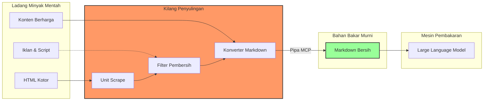

## Pengantar: Ladang Minyak Lepas Pantai
Bayangkan internet sebagai **Ladang Minyak Lepas Pantai** yang sangat luas namun kacau. Di dalamnya terdapat jutaan galon "minyak mentah" (data dalam bentuk HTML yang berantakan, penuh iklan, dan skrip pelacak).

Mesin canggih kita, yaitu **[[Large Language Models|LLM]]**, tidak bisa berjalan dengan minyak mentah ini. Jika kita memaksakan memasukkan HTML mentah ke dalam mesin AI, "mesin" tersebut akan tersedak, kehilangan konteks, atau mengalami halusinasi karena kotoran data.

**Firecrawl** bertindak sebagai **Kilang Minyak Terapung** (Floating Refinery). Ia menyedot minyak mentah dari lautan web, memisahkan lumpur (tag HTML, CSS, JS), dan menyulingnya menjadi bahan bakar murni berkualitas tinggi: **[[Markdown]]**. Bahan bakar inilah yang kemudian dialirkan melalui pipa khusus bernama **[[Model Context Protocol|MCP]]** langsung ke ruang bakar AI.

## Komponen Utama Kilang
Kilang Firecrawl memiliki beberapa unit pemrosesan utama yang masing-masing memiliki fungsi spesifik dalam mengubah data mentah menjadi informasi yang dapat dikonsumsi.

### 1. Unit Pengeboran Presisi (Scrape)
Ini adalah bor laser yang ditargetkan ke satu titik koordinat spesifik.
*   **Fungsi**: Mengambil satu URL dan mengekstrak isinya menjadi Markdown yang bersih.
*   **Analogi**: Seperti menyedot satu sumur minyak hingga kering dan langsung memurnikannya.
*   **Kegunaan**: Saat Anda membutuhkan konten spesifik dari satu halaman dokumentasi atau artikel berita.

### 2. Unit Eksplorasi Bawah Laut (Crawl)
Unit ini menyebarkan ribuan robot penyelam kecil (crawler) yang menelusuri gua-gua bawah laut yang saling terhubung.
*   **Fungsi**: Memasuki URL utama, lalu mengikuti semua tautan (sub-link) untuk memetakan dan mengambil data dari seluruh situs web.
*   **Analogi**: Memetakan seluruh reservoir minyak di bawah dasar laut, bukan hanya satu sumur.
*   **Kegunaan**: Mengunduh seluruh dokumentasi teknis atau blog arsip untuk dijadikan basis pengetahuan (**[[RAG]]**).

### 3. Unit Sonar & Prospeksi (Search)
Sebelum mengebor, kita perlu tahu di mana minyaknya. Unit ini menggunakan sonar canggih.
*   **Fungsi**: Mencari web untuk topik tertentu, mendapatkan hasil teratas, dan kemudian mengekstrak isinya.
*   **Analogi**: Mengirim kapal survei untuk menemukan ladang minyak baru yang belum dipetakan.
*   **Kegunaan**: Riset pasar atau mencari informasi terkini yang belum ada dalam memori pelatihan AI.

## Protokol Pipa Distribusi (MCP Server)
Tanpa pipa yang standar, kita harus mengangkut bahan bakar menggunakan ember (copy-paste manual). **[[Model Context Protocol]] (MCP)** adalah sistem perpipaan standar industri.

`firecrawl-mcp-server` adalah katup penghubung yang memungkinkan AI (seperti Claude atau Trae) untuk "memutar keran" sendiri. AI tidak perlu meminta manusia untuk mengambilkan data; ia memiliki kontrol langsung atas kilang minyak tersebut.

### Diagram Alir Penyulingan
Berikut adalah visualisasi bagaimana data mentah diubah menjadi bahan bakar siap pakai:



## Konfigurasi Pipa (Instalasi)
Untuk membangun saluran pipa ini di mesin lokal Anda, Anda memerlukan kunci akses (API Key) untuk mengoperasikan kilang tersebut.

### Persyaratan
*   **Bahan Bakar Awal**: API Key dari Firecrawl.
*   **Konektor**: Node.js atau Docker.

### Contoh Konfigurasi (JSON)
Berikut adalah cetak biru untuk menghubungkan kilang ini ke pusat kontrol Anda (misalnya di `claude_desktop_config.json`):


```json
{
  "mcpServers": {
    "firecrawl": {
      "command": "npx",
      "args": [
        "-y",
        "firecrawl-mcp"
      ],
      "env": {
        "FIRECRAWL_API_KEY": "fc-..."
      }
    }
  }
}
```


## Refleksi: Kualitas Bahan Bakar
Dalam dunia AI, pepatah "Garbage In, Garbage Out" adalah hukum mutlak. Firecrawl bukan sekadar alat pengambil data; ia adalah penjamin kualitas bahan bakar.

Dengan mengubah web yang kaotis menjadi **[[Markdown]]** yang terstruktur, kita memastikan bahwa "mesin" kecerdasan kita dapat beroperasi pada efisiensi puncak, tanpa tersedak oleh polusi digital yang tidak perlu. Ini adalah langkah krusial dalam membangun **[[Knowledge Graph]]** yang bersih dan dapat diandalkan.
