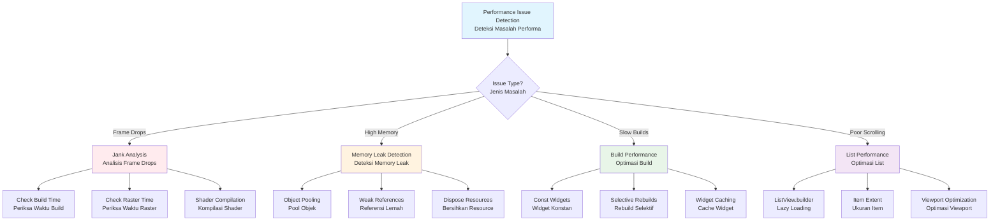

## Pengantar: Dashboard Monitoring untuk Pabrik Digital

Bayangkan sebuah pabrik modern yang beroperasi dengan presisi tinggi, menghasilkan 60 produk per detik secara konsisten tanpa pernah meleset dari target. Pabrik ini dilengkapi dengan sistem monitoring canggih yang memantau setiap aspek operasional - dari kecepatan jalur produksi, efisiensi penggunaan material, hingga kualitas output. Dashboard control room menampilkan real-time metrics: production rate, inventory levels, waste management, dan bottleneck detection. Ketika ada penurunan performa, sistem langsung mengidentifikasi root cause dan memberikan rekomendasi optimization. Inilah Flutter Performance - sistem monitoring dan tuning yang memastikan aplikasi berjalan dengan smooth, responsive, dan efficient seperti pabrik yang beroperasi pada peak performance.

Flutter Performance adalah aspek critical yang menentukan user experience dan success aplikasi mobile. Seperti pabrik yang harus maintain production rate yang konsisten untuk memenuhi demand, aplikasi [[Flutter]] harus deliver frame rate yang stable (60fps atau 120fps) untuk memberikan pengalaman yang smooth dan responsive. Performance bukan hanya tentang kecepatan, tetapi juga tentang consistency, efficiency, dan sustainability - aplikasi harus tetap performant bahkan setelah digunakan dalam jangka waktu lama dengan data yang kompleks.

Mengapa Flutter Performance penting? Dalam era digital yang competitive, user expectations semakin tinggi terhadap app quality. Aplikasi yang lag, jank, atau consume memory berlebihan akan ditinggalkan user dan mendapat rating buruk di app store. Google research menunjukkan bahwa 53% user akan abandon aplikasi yang loading lebih dari 3 detik. Flutter Performance optimization bukan luxury, tetapi necessity untuk survival di market yang competitive. Mastery performance techniques memungkinkan developer membangun aplikasi yang tidak hanya functional, tetapi juga delightful untuk digunakan, memberikan competitive advantage yang significant dalam user retention dan app store rankings.

## Rendering Performance: Jalur Produksi Utama

Rendering performance adalah jalur produksi utama dalam pabrik aplikasi Flutter, seperti assembly line yang harus beroperasi dengan timing yang presisi untuk menghasilkan frame berkualitas tinggi secara konsisten. Setiap frame adalah produk yang harus diselesaikan dalam waktu yang sangat terbatas - 16.67ms untuk 60fps atau 8.33ms untuk 120fps.

### Frame Timing: Siklus Produksi yang Ketat

Frame timing dalam Flutter seperti siklus produksi yang harus diselesaikan dalam deadline yang ketat. Setiap frame melewati pipeline yang terdiri dari build, layout, paint, dan compositing phases:

```dart
// Monitoring frame timing untuk performance analysis
class FrameTimingMonitor {
  final List<FrameTiming> _frameTimings = [];
  late PerformanceMonitor _monitor;
  
  void startMonitoring() {
    _monitor = PerformanceMonitor();
    
    // Collect frame timing data
    WidgetsBinding.instance.addTimingsCallback((List<FrameTiming> timings) {
      _frameTimings.addAll(timings);
      _analyzeFramePerformance(timings);
    });
  }
  
  void _analyzeFramePerformance(List<FrameTiming> timings) {
    for (final timing in timings) {
      final buildTime = timing.buildDuration.inMicroseconds / 1000.0; // ms
      final rasterTime = timing.rasterDuration.inMicroseconds / 1000.0; // ms
      final totalTime = timing.totalSpan.inMicroseconds / 1000.0; // ms
      
      // Target: 16.67ms for 60fps, 8.33ms for 120fps
      final targetFrameTime = 16.67; // 60fps
      
      if (totalTime > targetFrameTime) {
        _reportJank(timing, buildTime, rasterTime, totalTime);
      }
      
      // Monitor memory usage
      _monitorMemoryUsage(timing);
    }
  }
  
  void _reportJank(FrameTiming timing, double buildTime, double rasterTime, double totalTime) {
    print('🚨 JANK DETECTED:');
    print('  Total: ${totalTime.toStringAsFixed(2)}ms');
    print('  Build: ${buildTime.toStringAsFixed(2)}ms');
    print('  Raster: ${rasterTime.toStringAsFixed(2)}ms');
    print('  Vsync Overhead: ${timing.vsyncOverhead.inMicroseconds / 1000.0}ms');
    
    // Identify bottleneck
    if (buildTime > 8.0) {
      print('  ⚠️  Build phase bottleneck - check widget rebuilds');
    }
    if (rasterTime > 8.0) {
      print('  ⚠️  Raster phase bottleneck - check complex drawings');
    }
  }
  
  void _monitorMemoryUsage(FrameTiming timing) {
    final layerCacheBytes = timing.layerCacheBytes;
    final pictureCacheBytes = timing.pictureCacheBytes;
    
    // Alert if cache usage is too high (>50MB)
    if (layerCacheBytes + pictureCacheBytes > 50 * 1024 * 1024) {
      print('⚠️  High cache usage: ${(layerCacheBytes + pictureCacheBytes) / (1024 * 1024)}MB');
    }
  }
  
  PerformanceReport generateReport() {
    if (_frameTimings.isEmpty) return PerformanceReport.empty();
    
    final buildTimes = _frameTimings.map((t) => t.buildDuration.inMicroseconds / 1000.0);
    final rasterTimes = _frameTimings.map((t) => t.rasterDuration.inMicroseconds / 1000.0);
    final totalTimes = _frameTimings.map((t) => t.totalSpan.inMicroseconds / 1000.0);
    
    return PerformanceReport(
      averageBuildTime: _calculateAverage(buildTimes),
      averageRasterTime: _calculateAverage(rasterTimes),
      averageTotalTime: _calculateAverage(totalTimes),
      jankFrameCount: totalTimes.where((t) => t > 16.67).length,
      totalFrameCount: _frameTimings.length,
    );
  }
  
  double _calculateAverage(Iterable<double> values) {
    return values.reduce((a, b) => a + b) / values.length;
  }
}

class PerformanceReport {
  final double averageBuildTime;
  final double averageRasterTime;
  final double averageTotalTime;
  final int jankFrameCount;
  final int totalFrameCount;
  
  const PerformanceReport({
    required this.averageBuildTime,
    required this.averageRasterTime,
    required this.averageTotalTime,
    required this.jankFrameCount,
    required this.totalFrameCount,
  });
  
  factory PerformanceReport.empty() {
    return PerformanceReport(
      averageBuildTime: 0,
      averageRasterTime: 0,
      averageTotalTime: 0,
      jankFrameCount: 0,
      totalFrameCount: 0,
    );
  }
  
  double get jankPercentage => totalFrameCount > 0 ? (jankFrameCount / totalFrameCount) * 100 : 0;
}
```

### Impeller vs Skia: Upgrade Mesin Rendering

Flutter menggunakan dua rendering engine yang berbeda, seperti upgrade dari mesin produksi lama ke teknologi terbaru untuk mengatasi bottleneck yang persistent:

```dart
// Configuration untuk rendering engine
class RenderingEngineConfig {
  static bool get isImpellerEnabled {
    // Impeller enabled by default on iOS, opt-in on Android
    return Platform.isIOS || _isImpellerEnabledAndroid();
  }
  
  static bool _isImpellerEnabledAndroid() {
    // Check if Impeller is explicitly enabled for Android
    return const bool.fromEnvironment('FLUTTER_IMPELLER_ANDROID', defaultValue: false);
  }
  
  static Map<String, dynamic> getRenderingMetrics() {
    return {
      'engine': isImpellerEnabled ? 'Impeller' : 'Skia',
      'platform': Platform.operatingSystem,
      'shaderCompilation': isImpellerEnabled ? 'build-time' : 'runtime',
      'jankReduction': isImpellerEnabled ? 'optimized' : 'standard',
    };
  }
}

// Performance comparison widget
class RenderingEngineComparison extends StatelessWidget {
  @override
  Widget build(BuildContext context) {
    final config = RenderingEngineConfig.getRenderingMetrics();
    
    return Card(
      child: Padding(
        padding: EdgeInsets.all(16),
        child: Column(
          crossAxisAlignment: CrossAxisAlignment.start,
          children: [
            Text('Rendering Engine: ${config['engine']}',
                 style: Theme.of(context).textTheme.headline6),
            SizedBox(height: 8),
            _buildMetricRow('Platform', config['platform']),
            _buildMetricRow('Shader Compilation', config['shaderCompilation']),
            _buildMetricRow('Jank Reduction', config['jankReduction']),
            
            if (config['engine'] == 'Impeller') ...[
              SizedBox(height: 16),
              Container(
                padding: EdgeInsets.all(12),
                decoration: BoxDecoration(
                  color: Colors.green.withOpacity(0.1),
                  borderRadius: BorderRadius.circular(8),
                ),
                child: Column(
                  crossAxisAlignment: CrossAxisAlignment.start,
                  children: [
                    Text('✅ Impeller Benefits:',
                         style: TextStyle(fontWeight: FontWeight.bold)),
                    Text('• Pre-compiled shaders (no runtime jank)'),
                    Text('• Predictable performance'),
                    Text('• Better worst-frame times'),
                    Text('• Reduced binary size (when Skia removed)'),
                  ],
                ),
              ),
            ],
          ],
        ),
      ),
    );
  }
  
  Widget _buildMetricRow(String label, String value) {
    return Padding(
      padding: EdgeInsets.symmetric(vertical: 2),
      child: Row(
        children: [
          SizedBox(width: 120, child: Text('$label:')),
          Text(value, style: TextStyle(fontWeight: FontWeight.w500)),
        ],
      ),
    );
  }
}
```

### Widget Optimization: Efisiensi Assembly Line

Widget optimization seperti streamlining assembly line untuk mengurangi waste dan meningkatkan throughput. Setiap widget rebuild adalah operasi yang costly, sehingga harus diminimalkan:

```dart
// ❌ Inefficient widget - rebuilds everything
class BadProductList extends StatefulWidget {
  @override
  _BadProductListState createState() => _BadProductListState();
}

class _BadProductListState extends State<BadProductList> {
  List<Product> _products = [];
  String _searchQuery = '';
  bool _isLoading = false;
  
  @override
  Widget build(BuildContext context) {
    // Expensive filtering on every rebuild
    final filteredProducts = _products.where((product) {
      return product.name.toLowerCase().contains(_searchQuery.toLowerCase());
    }).toList();
    
    return Column(
      children: [
        // Search field rebuilds entire list
        TextField(
          onChanged: (query) {
            setState(() {
              _searchQuery = query;
            });
          },
        ),
        
        // Entire list rebuilds on search
        Expanded(
          child: ListView.builder(
            itemCount: filteredProducts.length,
            itemBuilder: (context, index) {
              final product = filteredProducts[index];
              return ListTile(
                title: Text(product.name),
                subtitle: Text('\$${product.price}'),
                leading: Image.network(product.imageUrl), // No caching!
              );
            },
          ),
        ),
      ],
    );
  }
}

// ✅ Optimized widget - selective rebuilds
class OptimizedProductList extends StatefulWidget {
  @override
  _OptimizedProductListState createState() => _OptimizedProductListState();
}

class _OptimizedProductListState extends State<OptimizedProductList> {
  List<Product> _products = [];
  final ValueNotifier<String> _searchQuery = ValueNotifier<String>('');
  bool _isLoading = false;
  
  @override
  void dispose() {
    _searchQuery.dispose();
    super.dispose();
  }
  
  @override
  Widget build(BuildContext context) {
    return Column(
      children: [
        // Search field - isolated rebuild
        _SearchField(searchQuery: _searchQuery),
        
        // List with selective rebuilds
        Expanded(
          child: ValueListenableBuilder<String>(
            valueListenable: _searchQuery,
            builder: (context, query, child) {
              return _ProductListView(
                products: _products,
                searchQuery: query,
              );
            },
          ),
        ),
      ],
    );
  }
}

class _SearchField extends StatelessWidget {
  final ValueNotifier<String> searchQuery;
  
  const _SearchField({required this.searchQuery});
  
  @override
  Widget build(BuildContext context) {
    return Padding(
      padding: EdgeInsets.all(16),
      child: TextField(
        decoration: InputDecoration(
          hintText: 'Search products...',
          prefixIcon: Icon(Icons.search),
        ),
        onChanged: (value) => searchQuery.value = value,
      ),
    );
  }
}

class _ProductListView extends StatelessWidget {
  final List<Product> products;
  final String searchQuery;
  
  const _ProductListView({
    required this.products,
    required this.searchQuery,
  });
  
  @override
  Widget build(BuildContext context) {
    // Memoized filtering
    final filteredProducts = useMemo(() {
      if (searchQuery.isEmpty) return products;
      return products.where((product) {
        return product.name.toLowerCase().contains(searchQuery.toLowerCase());
      }).toList();
    }, [products, searchQuery]);
    
    return ListView.builder(
      itemCount: filteredProducts.length,
      itemBuilder: (context, index) {
        return _ProductItem(
          key: ValueKey(filteredProducts[index].id),
          product: filteredProducts[index],
        );
      },
    );
  }
}

class _ProductItem extends StatelessWidget {
  final Product product;
  
  const _ProductItem({Key? key, required this.product}) : super(key: key);
  
  @override
  Widget build(BuildContext context) {
    return ListTile(
      title: Text(product.name),
      subtitle: Text('\$${product.price.toStringAsFixed(2)}'),
      leading: CachedNetworkImage( // Cached images
        imageUrl: product.imageUrl,
        width: 50,
        height: 50,
        fit: BoxFit.cover,
        placeholder: (context, url) => CircularProgressIndicator(),
        errorWidget: (context, url, error) => Icon(Icons.error),
      ),
    );
  }
}

// Custom hook for memoization
T useMemo<T>(T Function() computation, List<Object?> dependencies) {
  // Simplified memoization - in real app, use flutter_hooks
  return computation();
}
```

## Memory Management: Sistem Inventory dan Waste Management

Memory management dalam Flutter seperti sistem inventory dan waste management yang sophisticated, memastikan resources digunakan secara optimal dan waste diminimalkan untuk sustainability jangka panjang.

### Garbage Collection Optimization: Automated Waste Management

Dart VM menggunakan generational garbage collector yang dioptimasi untuk aplikasi UI-intensive, seperti sistem waste management otomatis yang memisahkan sampah berdasarkan kategori dan lifecycle:

```dart
// Memory management best practices
class MemoryEfficientWidget extends StatefulWidget {
  @override
  _MemoryEfficientWidgetState createState() => _MemoryEfficientWidgetState();
}

class _MemoryEfficientWidgetState extends State<MemoryEfficientWidget> {
  // Object pooling untuk mengurangi GC pressure
  final Queue<ReusableItem> _itemPool = Queue<ReusableItem>();
  final List<ReusableItem> _activeItems = [];
  
  // Weak references untuk cache
  final Map<String, WeakReference<CachedData>> _cache = {};
  
  // Stream subscriptions yang perlu di-manage
  final List<StreamSubscription> _subscriptions = [];
  
  @override
  void initState() {
    super.initState();
    _initializeMemoryManagement();
  }
  
  void _initializeMemoryManagement() {
    // Pre-allocate object pool
    for (int i = 0; i < 10; i++) {
      _itemPool.add(ReusableItem());
    }
    
    // Monitor memory usage
    _subscriptions.add(
      Stream.periodic(Duration(seconds: 5)).listen((_) {
        _performMemoryCleanup();
      }),
    );
  }
  
  ReusableItem _getReusableItem() {
    if (_itemPool.isNotEmpty) {
      final item = _itemPool.removeFirst();
      item.reset(); // Reset to clean state
      _activeItems.add(item);
      return item;
    }
    
    // Create new item if pool is empty
    final item = ReusableItem();
    _activeItems.add(item);
    return item;
  }
  
  void _releaseItem(ReusableItem item) {
    _activeItems.remove(item);
    if (_itemPool.length < 20) { // Limit pool size
      _itemPool.add(item);
    }
    // If pool is full, let item be garbage collected
  }
  
  CachedData? _getCachedData(String key) {
    final weakRef = _cache[key];
    final data = weakRef?.target;
    
    if (data == null) {
      // Data was garbage collected, remove weak reference
      _cache.remove(key);
      return null;
    }
    
    return data;
  }
  
  void _setCachedData(String key, CachedData data) {
    _cache[key] = WeakReference(data);
  }
  
  void _performMemoryCleanup() {
    // Clean up expired cache entries
    final expiredKeys = <String>[];
    _cache.forEach((key, weakRef) {
      if (weakRef.target == null) {
        expiredKeys.add(key);
      }
    });
    
    for (final key in expiredKeys) {
      _cache.remove(key);
    }
    
    // Log memory usage
    print('Cache entries: ${_cache.length}');
    print('Active items: ${_activeItems.length}');
    print('Pool size: ${_itemPool.length}');
  }
  
  @override
  void dispose() {
    // Critical: Cancel all subscriptions
    for (final subscription in _subscriptions) {
      subscription.cancel();
    }
    
    // Clear caches
    _cache.clear();
    _activeItems.clear();
    _itemPool.clear();
    
    super.dispose();
  }
  
  @override
  Widget build(BuildContext context) {
    return Scaffold(
      appBar: AppBar(title: Text('Memory Efficient Widget')),
      body: Column(
        children: [
          _buildMemoryStats(),
          Expanded(child: _buildItemList()),
        ],
      ),
    );
  }
  
  Widget _buildMemoryStats() {
    return Card(
      child: Padding(
        padding: EdgeInsets.all(16),
        child: Column(
          crossAxisAlignment: CrossAxisAlignment.start,
          children: [
            Text('Memory Management Stats',
                 style: Theme.of(context).textTheme.headline6),
            SizedBox(height: 8),
            Text('Cache Entries: ${_cache.length}'),
            Text('Active Items: ${_activeItems.length}'),
            Text('Pool Size: ${_itemPool.length}'),
          ],
        ),
      ),
    );
  }
  
  Widget _buildItemList() {
    return ListView.builder(
      itemCount: _activeItems.length,
      itemBuilder: (context, index) {
        return ListTile(
          title: Text('Item ${_activeItems[index].id}'),
          trailing: IconButton(
            icon: Icon(Icons.delete),
            onPressed: () {
              setState(() {
                _releaseItem(_activeItems[index]);
              });
            },
          ),
        );
      },
    );
  }
}

class ReusableItem {
  static int _nextId = 0;
  late int id;
  String? data;
  
  ReusableItem() {
    id = _nextId++;
  }
  
  void reset() {
    data = null;
    // Reset other properties to clean state
  }
}

class CachedData {
  final String content;
  final DateTime createdAt;
  
  CachedData(this.content) : createdAt = DateTime.now();
  
  bool get isExpired {
    return DateTime.now().difference(createdAt).inMinutes > 10;
  }
}
```

### Isolate Usage: Dedicated Processing Units

Isolates dalam Flutter seperti dedicated processing units yang menangani heavy computations tanpa mengganggu main production line:

```dart
// Heavy computation in isolate
class IsolateProcessor {
  static Future<ProcessedData> processLargeDataset(List<RawData> dataset) async {
    return await compute(_processDatasetIsolate, dataset);
  }
  
  static ProcessedData _processDatasetIsolate(List<RawData> dataset) {
    // Heavy computation that would block UI thread
    final results = <ProcessedItem>[];
    
    for (final data in dataset) {
      // Simulate expensive processing
      final processed = _expensiveProcessing(data);
      results.add(processed);
    }
    
    return ProcessedData(results);
  }
  
  static ProcessedItem _expensiveProcessing(RawData data) {
    // Simulate CPU-intensive work
    var result = 0;
    for (int i = 0; i < 1000000; i++) {
      result += data.value * i;
    }
    
    return ProcessedItem(
      id: data.id,
      processedValue: result,
      timestamp: DateTime.now(),
    );
  }
}

// Usage in widget
class DataProcessingWidget extends StatefulWidget {
  @override
  _DataProcessingWidgetState createState() => _DataProcessingWidgetState();
}

class _DataProcessingWidgetState extends State<DataProcessingWidget> {
  bool _isProcessing = false;
  ProcessedData? _result;
  
  Future<void> _processData() async {
    setState(() {
      _isProcessing = true;
    });
    
    try {
      // Generate large dataset
      final dataset = List.generate(10000, (i) => RawData(i, i * 2));
      
      // Process in isolate - won't block UI
      final result = await IsolateProcessor.processLargeDataset(dataset);
      
      if (mounted) {
        setState(() {
          _result = result;
          _isProcessing = false;
        });
      }
    } catch (error) {
      if (mounted) {
        setState(() {
          _isProcessing = false;
        });
        ScaffoldMessenger.of(context).showSnackBar(
          SnackBar(content: Text('Processing failed: $error')),
        );
      }
    }
  }
  
  @override
  Widget build(BuildContext context) {
    return Scaffold(
      appBar: AppBar(title: Text('Isolate Processing')),
      body: Padding(
        padding: EdgeInsets.all(16),
        child: Column(
          children: [
            ElevatedButton(
              onPressed: _isProcessing ? null : _processData,
              child: _isProcessing
                ? Row(
                    mainAxisSize: MainAxisSize.min,
                    children: [
                      SizedBox(
                        width: 16,
                        height: 16,
                        child: CircularProgressIndicator(strokeWidth: 2),
                      ),
                      SizedBox(width: 8),
                      Text('Processing...'),
                    ],
                  )
                : Text('Process Large Dataset'),
            ),
            
            SizedBox(height: 16),
            
            if (_result != null) ...[
              Card(
                child: Padding(
                  padding: EdgeInsets.all(16),
                  child: Column(
                    crossAxisAlignment: CrossAxisAlignment.start,
                    children: [
                      Text('Processing Complete',
                           style: Theme.of(context).textTheme.headline6),
                      SizedBox(height: 8),
                      Text('Items processed: ${_result!.items.length}'),
                      Text('Processing time: ${_result!.processingTime}ms'),
                    ],
                  ),
                ),
              ),
            ],
          ],
        ),
      ),
    );
  }
}

class RawData {
  final int id;
  final int value;
  
  RawData(this.id, this.value);
}

class ProcessedItem {
  final int id;
  final int processedValue;
  final DateTime timestamp;
  
  ProcessedItem({
    required this.id,
    required this.processedValue,
    required this.timestamp,
  });
}

class ProcessedData {
  final List<ProcessedItem> items;
  final int processingTime;
  
  ProcessedData(this.items) : processingTime = DateTime.now().millisecondsSinceEpoch;
}
```

## Profiling Tools: Dashboard Monitoring Canggih

Profiling tools dalam Flutter seperti dashboard monitoring canggih yang memberikan real-time visibility ke dalam setiap aspek performance aplikasi, memungkinkan identification dan resolution bottlenecks dengan precision tinggi.

### Flutter DevTools: Command Center Analytics

Flutter DevTools adalah command center yang comprehensive untuk performance analysis, seperti mission control dengan multiple monitoring screens:

```dart
// Performance monitoring integration
class PerformanceMonitoringApp extends StatefulWidget {
  @override
  _PerformanceMonitoringAppState createState() => _PerformanceMonitoringAppState();
}

class _PerformanceMonitoringAppState extends State<PerformanceMonitoringApp> {
  final PerformanceTracker _tracker = PerformanceTracker();
  bool _isMonitoring = false;
  
  @override
  void initState() {
    super.initState();
    _initializeMonitoring();
  }
  
  void _initializeMonitoring() {
    // Enable performance overlay in debug mode
    if (kDebugMode) {
      WidgetsApp.showPerformanceOverlayOverride = true;
    }
    
    // Start frame timing collection
    _tracker.startMonitoring();
  }
  
  @override
  Widget build(BuildContext context) {
    return MaterialApp(
      title: 'Performance Monitoring',
      
      // Performance overlay for real-time monitoring
      showPerformanceOverlay: kDebugMode,
      
      // Custom performance widget
      builder: (context, child) {
        return Stack(
          children: [
            child!,
            if (_isMonitoring) _buildPerformanceOverlay(),
          ],
        );
      },
      
      home: PerformanceTestScreen(tracker: _tracker),
    );
  }
  
  Widget _buildPerformanceOverlay() {
    return Positioned(
      top: 100,
      right: 16,
      child: Container(
        padding: EdgeInsets.all(8),
        decoration: BoxDecoration(
          color: Colors.black.withOpacity(0.8),
          borderRadius: BorderRadius.circular(8),
        ),
        child: StreamBuilder<PerformanceMetrics>(
          stream: _tracker.metricsStream,
          builder: (context, snapshot) {
            if (!snapshot.hasData) return SizedBox();
            
            final metrics = snapshot.data!;
            return Column(
              crossAxisAlignment: CrossAxisAlignment.start,
              mainAxisSize: MainAxisSize.min,
              children: [
                Text('FPS: ${metrics.fps.toStringAsFixed(1)}',
                     style: TextStyle(color: Colors.white, fontSize: 12)),
                Text('Frame Time: ${metrics.frameTime.toStringAsFixed(1)}ms',
                     style: TextStyle(color: Colors.white, fontSize: 12)),
                Text('Memory: ${metrics.memoryUsage.toStringAsFixed(1)}MB',
                     style: TextStyle(color: Colors.white, fontSize: 12)),
                Text('Jank: ${metrics.jankCount}',
                     style: TextStyle(color: Colors.white, fontSize: 12)),
              ],
            );
          },
        ),
      ),
    );
  }
}

class PerformanceTracker {
  final StreamController<PerformanceMetrics> _metricsController = 
      StreamController<PerformanceMetrics>.broadcast();
  
  Stream<PerformanceMetrics> get metricsStream => _metricsController.stream;
  
  final List<double> _frameTimes = [];
  int _jankCount = 0;
  Timer? _metricsTimer;
  
  void startMonitoring() {
    // Collect frame timing data
    WidgetsBinding.instance.addTimingsCallback((timings) {
      for (final timing in timings) {
        final frameTime = timing.totalSpan.inMicroseconds / 1000.0;
        _frameTimes.add(frameTime);
        
        // Count jank frames (>16.67ms for 60fps)
        if (frameTime > 16.67) {
          _jankCount++;
        }
        
        // Keep only recent frame times
        if (_frameTimes.length > 60) {
          _frameTimes.removeAt(0);
        }
      }
    });
    
    // Emit metrics periodically
    _metricsTimer = Timer.periodic(Duration(milliseconds: 500), (_) {
      _emitMetrics();
    });
  }
  
  void _emitMetrics() {
    if (_frameTimes.isEmpty) return;
    
    final avgFrameTime = _frameTimes.reduce((a, b) => a + b) / _frameTimes.length;
    final fps = 1000.0 / avgFrameTime;
    
    final metrics = PerformanceMetrics(
      fps: fps,
      frameTime: avgFrameTime,
      memoryUsage: _getMemoryUsage(),
      jankCount: _jankCount,
    );
    
    _metricsController.add(metrics);
  }
  
  double _getMemoryUsage() {
    // Simplified memory usage calculation
    // In real app, use more sophisticated memory tracking
    return 50.0 + (DateTime.now().millisecondsSinceEpoch % 1000) / 20.0;
  }
  
  void dispose() {
    _metricsTimer?.cancel();
    _metricsController.close();
  }
}

class PerformanceMetrics {
  final double fps;
  final double frameTime;
  final double memoryUsage;
  final int jankCount;
  
  PerformanceMetrics({
    required this.fps,
    required this.frameTime,
    required this.memoryUsage,
    required this.jankCount,
  });
}
```

### Performance Testing: Automated Quality Assurance

Performance testing seperti automated quality assurance yang memastikan setiap release memenuhi performance standards:

```dart
// Automated performance testing
class PerformanceTestSuite {
  static Future<TestResults> runPerformanceTests() async {
    final results = TestResults();
    
    // Test 1: Widget build performance
    await _testWidgetBuildPerformance(results);
    
    // Test 2: List scrolling performance
    await _testListScrollingPerformance(results);
    
    // Test 3: Animation performance
    await _testAnimationPerformance(results);
    
    // Test 4: Memory usage
    await _testMemoryUsage(results);
    
    return results;
  }
  
  static Future<void> _testWidgetBuildPerformance(TestResults results) async {
    final stopwatch = Stopwatch()..start();
    
    // Build complex widget tree
    final widget = _buildComplexWidget();
    
    stopwatch.stop();
    final buildTime = stopwatch.elapsedMicroseconds / 1000.0;
    
    results.addTest(PerformanceTest(
      name: 'Widget Build Performance',
      duration: buildTime,
      passed: buildTime < 5.0, // Should build in <5ms
      threshold: 5.0,
    ));
  }
  
  static Future<void> _testListScrollingPerformance(TestResults results) async {
    // Simulate list scrolling and measure frame drops
    final frameTimings = <double>[];
    
    // Simulate 60 frames of scrolling
    for (int i = 0; i < 60; i++) {
      final stopwatch = Stopwatch()..start();
      
      // Simulate frame rendering work
      await _simulateFrameWork();
      
      stopwatch.stop();
      frameTimings.add(stopwatch.elapsedMicroseconds / 1000.0);
    }
    
    final avgFrameTime = frameTimings.reduce((a, b) => a + b) / frameTimings.length;
    final jankFrames = frameTimings.where((t) => t > 16.67).length;
    
    results.addTest(PerformanceTest(
      name: 'List Scrolling Performance',
      duration: avgFrameTime,
      passed: jankFrames < 3, // <5% jank frames acceptable
      threshold: 16.67,
      additionalInfo: 'Jank frames: $jankFrames/60',
    ));
  }
  
  static Future<void> _testAnimationPerformance(TestResults results) async {
    final animationFrames = <double>[];
    
    // Simulate 120 frames of animation (2 seconds at 60fps)
    for (int i = 0; i < 120; i++) {
      final stopwatch = Stopwatch()..start();
      
      // Simulate animation frame work
      await _simulateAnimationFrame();
      
      stopwatch.stop();
      animationFrames.add(stopwatch.elapsedMicroseconds / 1000.0);
    }
    
    final avgFrameTime = animationFrames.reduce((a, b) => a + b) / animationFrames.length;
    final maxFrameTime = animationFrames.reduce((a, b) => a > b ? a : b);
    
    results.addTest(PerformanceTest(
      name: 'Animation Performance',
      duration: avgFrameTime,
      passed: maxFrameTime < 20.0, // No frame should exceed 20ms
      threshold: 16.67,
      additionalInfo: 'Max frame time: ${maxFrameTime.toStringAsFixed(2)}ms',
    ));
  }
  
  static Future<void> _testMemoryUsage(TestResults results) async {
    final initialMemory = _getCurrentMemoryUsage();
    
    // Simulate memory-intensive operations
    final data = List.generate(10000, (i) => 'Data item $i' * 100);
    
    final peakMemory = _getCurrentMemoryUsage();
    
    // Clean up
    data.clear();
    
    final finalMemory = _getCurrentMemoryUsage();
    final memoryLeak = finalMemory - initialMemory;
    
    results.addTest(PerformanceTest(
      name: 'Memory Usage',
      duration: peakMemory,
      passed: memoryLeak < 5.0, // <5MB memory leak acceptable
      threshold: 100.0, // 100MB peak usage threshold
      additionalInfo: 'Memory leak: ${memoryLeak.toStringAsFixed(2)}MB',
    ));
  }
  
  static Widget _buildComplexWidget() {
    return MaterialApp(
      home: Scaffold(
        body: Column(
          children: List.generate(100, (i) {
            return ListTile(
              leading: CircleAvatar(child: Text('$i')),
              title: Text('Item $i'),
              subtitle: Text('Subtitle for item $i'),
              trailing: Icon(Icons.arrow_forward),
            );
          }),
        ),
      ),
    );
  }
  
  static Future<void> _simulateFrameWork() async {
    // Simulate frame rendering work
    await Future.delayed(Duration(microseconds: 8000)); // 8ms
  }
  
  static Future<void> _simulateAnimationFrame() async {
    // Simulate animation frame work
    await Future.delayed(Duration(microseconds: 12000)); // 12ms
  }
  
  static double _getCurrentMemoryUsage() {
    // Simplified memory usage - in real app, use proper memory profiling
    return 50.0 + (DateTime.now().millisecondsSinceEpoch % 10000) / 100.0;
  }
}

class TestResults {
  final List<PerformanceTest> tests = [];
  
  void addTest(PerformanceTest test) {
    tests.add(test);
  }
  
  bool get allTestsPassed => tests.every((test) => test.passed);
  
  String generateReport() {
    final buffer = StringBuffer();
    buffer.writeln('Performance Test Results');
    buffer.writeln('=' * 40);
    
    for (final test in tests) {
      buffer.writeln('${test.name}: ${test.passed ? "PASS" : "FAIL"}');
      buffer.writeln('  Duration: ${test.duration.toStringAsFixed(2)}ms');
      buffer.writeln('  Threshold: ${test.threshold.toStringAsFixed(2)}ms');
      if (test.additionalInfo != null) {
        buffer.writeln('  Info: ${test.additionalInfo}');
      }
      buffer.writeln();
    }
    
    buffer.writeln('Overall: ${allTestsPassed ? "PASS" : "FAIL"}');
    return buffer.toString();
  }
}

class PerformanceTest {
  final String name;
  final double duration;
  final bool passed;
  final double threshold;
  final String? additionalInfo;
  
  PerformanceTest({
    required this.name,
    required this.duration,
    required this.passed,
    required this.threshold,
    this.additionalInfo,
  });
}
```

## Common Issues dan Solutions: Troubleshooting Sistem

Common performance issues dalam Flutter seperti troubleshooting guide untuk mengidentifikasi dan mengatasi bottlenecks yang frequently encountered dalam production environments.



Diagram ini menunjukkan decision tree untuk troubleshooting performance issues, seperti diagnostic flowchart yang membantu engineer mengidentifikasi root cause dan solution yang tepat untuk setiap jenis masalah performance.

### Issue Detection dan Resolution Matrix

| Issue Type | Symptoms | Detection Method | Solution | Prevention |
|------------|----------|------------------|----------|------------|
| **Frame Drops** | Stuttering animations, UI lag | Performance Overlay, DevTools Timeline | Optimize build methods, reduce widget complexity | Use const widgets, minimize rebuilds |
| **Memory Leaks** | Increasing memory usage, crashes | Memory profiler, heap snapshots | Dispose resources, use weak references | Proper lifecycle management |
| **Excessive Rebuilds** | Poor scrolling, slow interactions | Widget Inspector, rebuild counters | Selective rebuilds, state optimization | Proper state management patterns |
| **Large Bundle Size** | Slow app startup, storage issues | Bundle analyzer, size reports | Code splitting, asset optimization | Tree shaking, lazy loading |
| **Network Performance** | Slow data loading, timeouts | Network profiler, response times | Caching, compression, pagination | Efficient API design |

### Real-world Performance Optimization Case Study

```dart
// Case study: E-commerce app performance optimization
class ECommercePerformanceOptimization {
  // Before optimization - problematic implementation
  static Widget buildProductGridBad(List<Product> products) {
    return GridView.builder(
      gridDelegate: SliverGridDelegateWithFixedCrossAxisCount(
        crossAxisCount: 2,
        childAspectRatio: 0.7,
      ),
      itemCount: products.length,
      itemBuilder: (context, index) {
        final product = products[index];
        
        // ❌ Problems:
        // 1. No const constructor
        // 2. Expensive operations in build
        // 3. No image caching
        // 4. Rebuilds entire grid on any change
        
        return Card(
          child: Column(
            children: [
              // Expensive network image loading
              Image.network(
                product.imageUrl,
                height: 120,
                fit: BoxFit.cover,
                loadingBuilder: (context, child, loadingProgress) {
                  // Complex loading widget rebuilt frequently
                  return loadingProgress == null
                    ? child
                    : Container(
                        height: 120,
                        child: Center(
                          child: CircularProgressIndicator(
                            value: loadingProgress.expectedTotalBytes != null
                              ? loadingProgress.cumulativeBytesLoaded / 
                                loadingProgress.expectedTotalBytes!
                              : null,
                          ),
                        ),
                      );
                },
              ),
              
              Padding(
                padding: EdgeInsets.all(8),
                child: Column(
                  children: [
                    // Expensive text processing
                    Text(
                      product.name.toUpperCase(), // Expensive operation
                      style: TextStyle(fontWeight: FontWeight.bold),
                      maxLines: 2,
                      overflow: TextOverflow.ellipsis,
                    ),
                    
                    // Price calculation in build method
                    Text(
                      '\$${(product.price * (1 - product.discount)).toStringAsFixed(2)}',
                      style: TextStyle(
                        color: Colors.red,
                        fontSize: 16,
                        fontWeight: FontWeight.bold,
                      ),
                    ),
                    
                    // Rating calculation
                    Row(
                      mainAxisAlignment: MainAxisAlignment.center,
                      children: List.generate(5, (starIndex) {
                        return Icon(
                          starIndex < product.rating.floor()
                            ? Icons.star
                            : Icons.star_border,
                          color: Colors.amber,
                          size: 16,
                        );
                      }),
                    ),
                  ],
                ),
              ),
            ],
          ),
        );
      },
    );
  }
  
  // After optimization - efficient implementation
  static Widget buildProductGridOptimized(List<Product> products) {
    return GridView.builder(
      gridDelegate: SliverGridDelegateWithFixedCrossAxisCount(
        crossAxisCount: 2,
        childAspectRatio: 0.7,
      ),
      itemCount: products.length,
      itemBuilder: (context, index) {
        return OptimizedProductCard(
          key: ValueKey(products[index].id), // Stable key
          product: products[index],
        );
      },
    );
  }
}

class OptimizedProductCard extends StatelessWidget {
  final Product product;
  
  const OptimizedProductCard({
    Key? key,
    required this.product,
  }) : super(key: key);
  
  @override
  Widget build(BuildContext context) {
    return Card(
      child: Column(
        children: [
          // ✅ Optimized image loading with caching
          CachedNetworkImage(
            imageUrl: product.imageUrl,
            height: 120,
            fit: BoxFit.cover,
            placeholder: (context, url) => _buildImagePlaceholder(),
            errorWidget: (context, url, error) => _buildImageError(),
            memCacheWidth: 200, // Optimize memory usage
            memCacheHeight: 120,
          ),
          
          Padding(
            padding: const EdgeInsets.all(8.0), // const padding
            child: Column(
              children: [
                // ✅ Pre-computed display name
                Text(
                  product.displayName, // Computed in model
                  style: const TextStyle(fontWeight: FontWeight.bold),
                  maxLines: 2,
                  overflow: TextOverflow.ellipsis,
                ),
                
                // ✅ Pre-computed final price
                Text(
                  product.formattedFinalPrice, // Computed in model
                  style: const TextStyle(
                    color: Colors.red,
                    fontSize: 16,
                    fontWeight: FontWeight.bold,
                  ),
                ),
                
                // ✅ Cached rating widget
                _RatingWidget(rating: product.rating),
              ],
            ),
          ),
        ],
      ),
    );
  }
  
  Widget _buildImagePlaceholder() {
    return Container(
      height: 120,
      color: Colors.grey[200],
      child: const Center(
        child: CircularProgressIndicator(strokeWidth: 2),
      ),
    );
  }
  
  Widget _buildImageError() {
    return Container(
      height: 120,
      color: Colors.grey[300],
      child: const Icon(Icons.error, color: Colors.grey),
    );
  }
}

// Separate widget for rating to enable selective rebuilds
class _RatingWidget extends StatelessWidget {
  final double rating;
  
  const _RatingWidget({required this.rating});
  
  @override
  Widget build(BuildContext context) {
    return Row(
      mainAxisAlignment: MainAxisAlignment.center,
      children: List.generate(5, (index) {
        return Icon(
          index < rating.floor() ? Icons.star : Icons.star_border,
          color: Colors.amber,
          size: 16,
        );
      }),
    );
  }
}

// Optimized Product model with computed properties
class Product {
  final String id;
  final String name;
  final String imageUrl;
  final double price;
  final double discount;
  final double rating;
  
  // ✅ Computed properties to avoid expensive operations in build
  late final String displayName;
  late final String formattedFinalPrice;
  late final double finalPrice;
  
  Product({
    required this.id,
    required this.name,
    required this.imageUrl,
    required this.price,
    required this.discount,
    required this.rating,
  }) {
    // Pre-compute expensive operations
    displayName = name.toUpperCase();
    finalPrice = price * (1 - discount);
    formattedFinalPrice = '\$${finalPrice.toStringAsFixed(2)}';
  }
}
```

## Refleksi: Performance sebagai Competitive Advantage

Flutter Performance adalah competitive advantage yang menentukan success aplikasi dalam market yang increasingly demanding terhadap user experience quality. Seperti pabrik modern yang mengandalkan efficiency dan consistency untuk survive dalam competition global, aplikasi Flutter harus deliver performance yang exceptional untuk retain users dan achieve business objectives.

Mastery performance optimization dalam Flutter memerlukan understanding mendalam tentang rendering pipeline, memory management, dan profiling tools. Setiap millisecond dalam frame timing, setiap megabyte dalam memory usage, dan setiap rebuild dalam widget tree memiliki impact yang cumulative terhadap user experience. Investment dalam performance optimization bukan hanya technical necessity, tetapi strategic decision yang mempengaruhi user retention, app store ratings, dan ultimately business success.

Evolution Flutter performance tools dan techniques terus berlanjut dengan innovations seperti Impeller rendering engine, improved DevTools, dan advanced profiling capabilities. Namun, fundamental principles tetap sama: minimize unnecessary work, optimize critical paths, dan monitor continuously. Developer yang menguasai performance optimization akan mampu membangun aplikasi yang tidak hanya functional, tetapi juga delightful untuk digunakan dalam jangka panjang.

Ecosystem Flutter performance semakin mature dengan community-driven tools, best practices documentation, dan automated testing frameworks. Collaboration antara Google Flutter team dan developer community menghasilkan continuous improvements dalam performance tooling dan optimization techniques. Staying updated dengan latest developments dan contributing back ke community adalah essential untuk maintaining competitive edge dalam Flutter development.

Masa depan mobile applications menuntut performance yang semakin sophisticated untuk handle complex use cases seperti AR/VR, real-time collaboration, dan AI-powered features. Flutter performance optimization skills akan menjadi semakin valuable sebagai foundation untuk building next-generation applications yang push boundaries dari apa yang possible dalam mobile development. Seperti engineer pabrik yang terus innovate untuk achieve higher efficiency, Flutter developers harus continuously evolve performance optimization skills untuk meet future challenges dan opportunities.

---

*Catatan ini disusun berdasarkan dokumentasi resmi Flutter repository dan analisis mendalam menggunakan Sequential Thinking methodology untuk memberikan pemahaman komprehensif tentang performance optimization yang fundamental untuk pengembangan aplikasi Flutter yang smooth, efficient, dan scalable.*