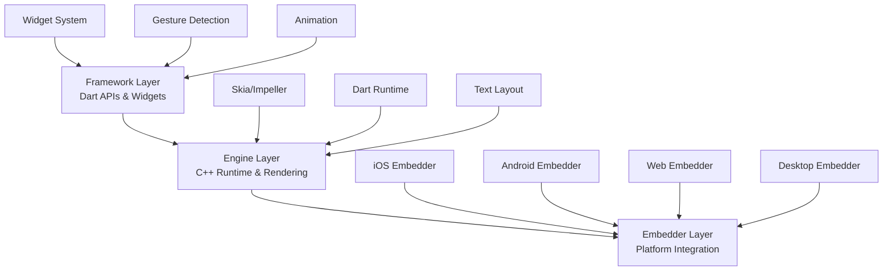
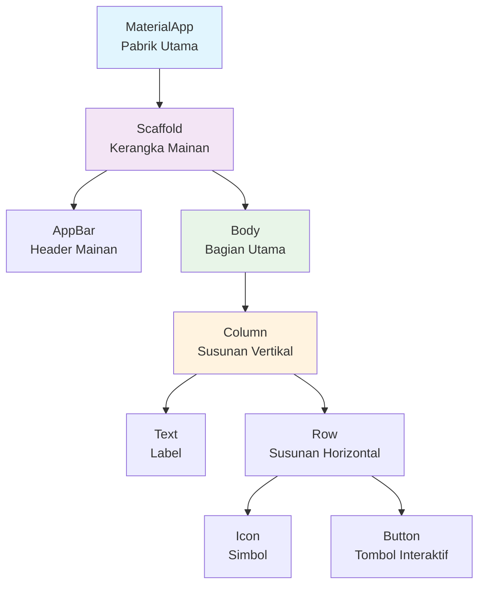
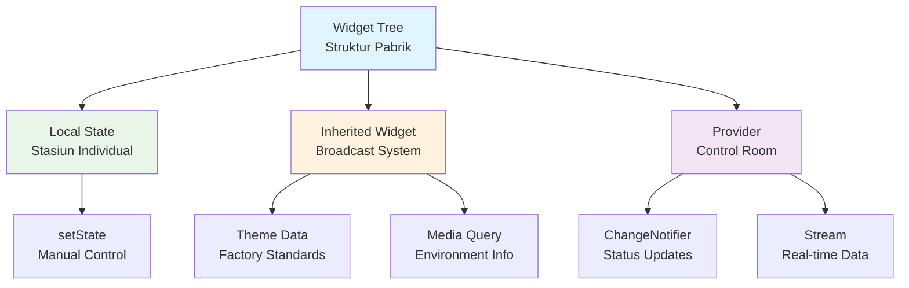
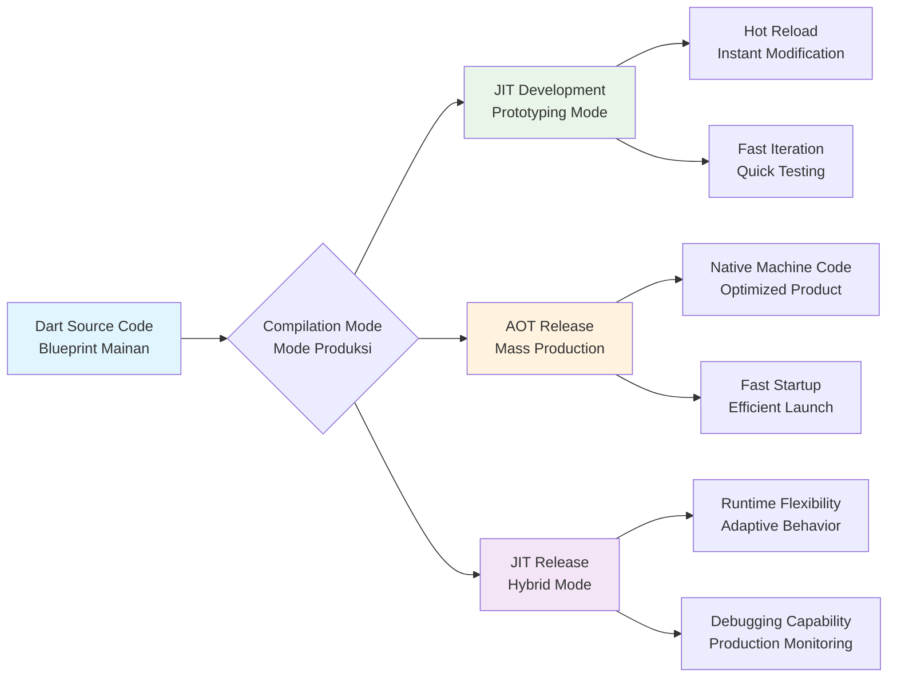

## Pengantar: Pabrik Mainan yang Revolusioner

Bayangkan sebuah pabrik mainan modern yang mampu memproduksi mainan identik untuk berbagai pasar global hanya dengan satu set blueprint. Pabrik ini memiliki jalur produksi otomatis yang sangat canggih, mampu mengubah desain secara real-time tanpa menghentikan produksi, dan menghasilkan mainan berkualitas tinggi dengan performa yang konsisten. Inilah [[Flutter]] - sebuah framework pengembangan aplikasi yang merevolusi cara kita membangun pengalaman digital lintas platform.

Flutter adalah toolkit UI Google yang memungkinkan pengembangan aplikasi natively compiled untuk mobile, web, dan desktop dari single codebase. Seperti pabrik mainan revolusioner kita, Flutter menggunakan satu set "blueprint" (kode [[Dart]]) untuk menghasilkan aplikasi yang identik dan berkualitas tinggi di berbagai platform. Yang membuatnya istimewa adalah kemampuan hot reload yang memungkinkan perubahan desain secara instan, layaknya mengubah blueprint tanpa menghentikan jalur produksi.

Mengapa Flutter penting? Dalam era digital yang menuntut kecepatan dan konsistensi, Flutter menjawab tantangan pengembangan multi-platform dengan pendekatan yang berbeda dari [[React Native]] atau pengembangan native tradisional. Framework ini tidak hanya menghemat waktu dan biaya pengembangan, tetapi juga memberikan kontrol penuh atas setiap pixel UI, memungkinkan kreativitas tanpa batas dalam desain antarmuka.

## Arsitektur Berlapis: Blueprint dan Mesin Produksi

Flutter memiliki arsitektur berlapis yang elegan, seperti pabrik mainan dengan divisi yang terorganisir dengan baik. Setiap lapisan memiliki tanggung jawab spesifik dalam mengubah ide menjadi aplikasi yang berfungsi.

### Framework Layer: Departemen Desain dan Instruksi

Framework layer adalah departemen desain pabrik kita, tempat semua blueprint mainan dibuat dan dikelola. Layer ini ditulis dalam [[Dart]] dan menyediakan API tingkat tinggi untuk:

- **Widget System**: Katalog komponen mainan yang bisa disusun
- **Gesture Detection**: Sistem sensor untuk interaksi pengguna  
- **Animation**: Mekanisme pergerakan dan transisi
- **Accessibility**: Panduan inklusi untuk semua pengguna

Framework layer menggunakan paradigma deklaratif, di mana developer mendeskripsikan "apa" yang ingin ditampilkan, bukan "bagaimana" menampilkannya. Seperti desainer mainan yang menggambar blueprint tanpa perlu tahu detail mesin produksi.

### Engine Layer: Mesin Produksi Berkecepatan Tinggi

Engine adalah jantung pabrik - mesin produksi yang mengubah blueprint menjadi produk nyata. Ditulis dalam C++, engine menyediakan:

- **Skia/Impeller**: Mesin rendering grafis 2D yang hardware-accelerated
- **Dart Runtime**: Lingkungan eksekusi untuk kode aplikasi
- **Text Layout**: Sistem tata letak teks yang canggih
- **Platform Channels**: Jembatan komunikasi dengan sistem operasi

Engine mengekspos fungsionalitasnya ke framework melalui `dart:ui` API, seperti interface control panel yang memungkinkan departemen desain mengoperasikan mesin produksi.

### Embedder Layer: Sistem Distribusi Multi-Platform

Embedder adalah sistem distribusi yang memastikan produk akhir bisa sampai ke berbagai pasar (platform). Layer ini menyediakan:

- **Platform Integration**: Adaptasi untuk iOS, Android, Web, Desktop
- **Rendering Surface**: Canvas tempat aplikasi digambar
- **Event Loop**: Sistem manajemen input dan event
- **Plugin Architecture**: Mekanisme ekstensi platform-specific



Diagram di atas menunjukkan alur kerja arsitektur Flutter yang mirip dengan jalur produksi pabrik. Framework layer (departemen desain) membuat spesifikasi, engine layer (mesin produksi) memproses blueprint, dan embedder layer (sistem distribusi) memastikan produk sampai ke platform yang tepat. Setiap lapisan memiliki spesialisasi yang jelas namun bekerja secara harmonis untuk menghasilkan aplikasi berkualitas tinggi.

## Sistem Widget: Komponen Mainan yang Dapat Disusun

Dalam pabrik mainan Flutter, widget adalah komponen dasar yang bisa disusun menjadi mainan kompleks. Seperti blok LEGO yang bisa dikombinasikan tanpa batas, widget Flutter mengikuti prinsip komposisi untuk membangun UI yang sophisticated.

### StatelessWidget: Template Mainan Sederhana

StatelessWidget adalah template mainan yang tidak berubah setelah diproduksi - seperti balok kayu atau puzzle dengan bentuk tetap. Widget ini immutable dan hanya bergantung pada konfigurasi awal yang diberikan.

```dart
class SimpleCard extends StatelessWidget {
  final String title;
  final String content;
  
  const SimpleCard({Key? key, required this.title, required this.content}) : super(key: key);
  
  @override
  Widget build(BuildContext context) {
    return Card(
      child: Padding(
        padding: EdgeInsets.all(16.0),
        child: Column(
          children: [
            Text(title, style: Theme.of(context).textTheme.headline6),
            SizedBox(height: 8),
            Text(content),
          ],
        ),
      ),
    );
  }
}
```

StatelessWidget ideal untuk komponen UI yang tidak memerlukan perubahan state internal, seperti label, icon, atau layout container. Method `build()` dipanggil ketika widget pertama kali dimasukkan ke widget tree atau ketika parent widget berubah.

### StatefulWidget: Mainan Interaktif dengan Mekanisme

StatefulWidget adalah mainan interaktif yang bisa berubah - seperti robot dengan lampu LED yang bisa menyala-mati atau mobil remote control. Widget ini memiliki State object yang menyimpan data mutable dan bisa memicu rebuild UI.

```dart
class CounterWidget extends StatefulWidget {
  @override
  _CounterWidgetState createState() => _CounterWidgetState();
}

class _CounterWidgetState extends State<CounterWidget> {
  int _counter = 0;
  
  void _incrementCounter() {
    setState(() {
      _counter++;
    });
  }
  
  @override
  Widget build(BuildContext context) {
    return Column(
      children: [
        Text('Counter: $_counter'),
        ElevatedButton(
          onPressed: _incrementCounter,
          child: Text('Increment'),
        ),
      ],
    );
  }
}
```

### Widget Lifecycle: Siklus Hidup di Jalur Produksi

Lifecycle StatefulWidget mirip dengan siklus produksi mainan di pabrik, dari persiapan material hingga quality control:

| Phase | Method | Analogi Pabrik | Fungsi |
|-------|--------|----------------|---------|
| **Initialization** | `createState()` | Menyiapkan stasiun kerja | Membuat State object |
| **Setup** | `initState()` | Setup mesin dan material | Inisialisasi one-time |
| **Dependencies** | `didChangeDependencies()` | Update supplier info | Respond ke perubahan InheritedWidget |
| **Production** | `build()` | Proses produksi aktual | Membangun UI tree |
| **Update** | `didUpdateWidget()` | Modifikasi blueprint | Handle perubahan widget parent |
| **State Change** | `setState()` | Quality control trigger | Memicu rebuild UI |
| **Cleanup** | `dispose()` | Pembersihan stasiun | Release resources |

### Widget Tree: Diagram Perakitan Mainan Kompleks

Widget tree adalah diagram perakitan yang menunjukkan bagaimana komponen-komponen kecil disusun menjadi mainan kompleks. Setiap node dalam tree adalah widget yang bisa memiliki children widgets.



Diagram ini menunjukkan hierarki widget yang mirip dengan struktur perakitan mainan. MaterialApp adalah "pabrik utama" yang menyediakan tema dan navigasi, Scaffold adalah "kerangka mainan" yang memberikan struktur dasar, dan komponen-komponen lain adalah bagian-bagian detail yang membentuk pengalaman pengguna final.

Setiap widget dalam tree memiliki tanggung jawab spesifik: layout widgets (Column, Row) mengatur posisi, content widgets (Text, Icon) menampilkan informasi, dan interactive widgets (Button) menangani input pengguna. Komposisi ini memungkinkan fleksibilitas tinggi dalam desain UI sambil menjaga kode tetap modular dan maintainable.

## Pipeline Rendering: Jalur Produksi dari Desain ke Produk Jadi

Pipeline rendering Flutter adalah jalur produksi canggih yang mengubah widget tree menjadi pixel di layar. Seperti conveyor belt otomatis di pabrik mainan, setiap fase memiliki fungsi spesifik dan berjalan dengan koordinasi yang presisi.

### Sepuluh Fase Produksi Aplikasi

Pipeline rendering Flutter terdiri dari 10 fase yang terkoordinasi antara UI thread dan Raster thread:

```mermaid
graph LR
    A[Animation<br/>Persiapan Material] --> B[Microtasks<br/>Quality Check]
    B --> C[Build<br/>Perakitan Komponen]
    C --> D[Layout<br/>Pengaturan Posisi]
    D --> E[Compositing Bits<br/>Marking Layers]
    E --> F[Paint<br/>Pewarnaan]
    F --> G[Compositing<br/>Pengemasan]
    G --> H[Semantics<br/>Labeling]
    H --> I[Finalization Widgets<br/>Cleanup Stasiun]
    I --> J[Finalization Scheduler<br/>Post-Production]
    
    style A fill:#ffebee
    style C fill:#e3f2fd
    style D fill:#e8f5e8
    style F fill:#fff3e0
    style G fill:#f3e5f5
```



**1. Animation Phase**: Seperti persiapan material di awal jalur produksi, fase ini menjalankan `Ticker` instances yang menggerakkan `AnimationController` objects. Semua animasi yang sedang berjalan diupdate untuk frame saat ini.

**2. Microtasks Phase**: Quality check cepat yang menjalankan microtasks yang dijadwalkan oleh transient frame callbacks. Ini memastikan semua persiapan selesai sebelum produksi dimulai.

**3. Build Phase**: Stasiun perakitan utama di mana dirty `Element`s dalam widget tree direbuild. Framework memanggil `build()` method pada widget yang perlu diupdate, menghasilkan widget tree baru.

**4. Layout Phase**: Stasiun pengaturan posisi di mana dirty `RenderObject`s dihitung ukuran dan posisinya. Setiap render object menentukan constraints dan memberikan size kepada children-nya.

**5. Compositing Bits Phase**: Marking station yang mengupdate compositing bits pada dirty `RenderObject`s. Ini menentukan layer mana yang perlu di-composite ulang.

**6. Paint Phase**: Stasiun pewarnaan di mana dirty `RenderObject`s digambar, menghasilkan `Layer` tree. Setiap render object menggambar dirinya sendiri ke dalam layer yang sesuai.

**7. Compositing Phase**: Stasiun pengemasan final di mana layer tree dikonversi menjadi `Scene` dan dikirim ke GPU untuk rendering. Ini adalah tahap di mana semua layer digabungkan menjadi frame final.

**8. Semantics Phase**: Stasiun labeling untuk accessibility di mana dirty `RenderObject`s mengupdate semantics mereka, menghasilkan `SemanticsNode` tree untuk screen readers dan assistive technologies.

**9. Finalization Phase (Widgets)**: Cleanup stasiun widget di mana `State.dispose()` dipanggil pada objects yang dihapus dari widget tree, memastikan tidak ada memory leaks.

**10. Finalization Phase (Scheduler)**: Post-production cleanup di mana post-frame callbacks dijalankan, menyelesaikan siklus frame dan mempersiapkan frame berikutnya.

### Impeller vs Skia: Upgrade Mesin Produksi

Flutter sedang bertransisi dari Skia ke Impeller sebagai rendering engine, seperti upgrade dari mesin produksi lama ke teknologi terbaru:

| Aspek | Skia (Mesin Lama) | Impeller (Mesin Baru) |
|-------|-------------------|----------------------|
| **Shader Compilation** | Runtime (menyebabkan jank) | Build-time (smooth performance) |
| **Performance Predictability** | Inconsistent first-frame | Predictable performance |
| **Binary Size** | Baseline | +100KB, tapi -17% jika Skia dihapus |
| **Platform Support** | Mature di semua platform | iOS stable, Android in progress |
| **Jank Elimination** | Shader compilation jank | Pre-compiled shaders |

Impeller mengatasi masalah shader compilation jank dengan pre-compiling semua shaders pada build time dan packaging mereka dengan engine. Ini seperti mempersiapkan semua template dan cetakan sebelum produksi dimulai, sehingga tidak ada delay saat proses berlangsung.

### Hot Reload: Modifikasi Blueprint Tanpa Menghentikan Produksi

Hot reload adalah fitur revolusioner yang memungkinkan modifikasi blueprint (kode) tanpa menghentikan jalur produksi (aplikasi). Ketika hot reload terjadi:

1. **Marking Dirty**: Setiap `Element` dalam widget tree ditandai sebagai dirty
2. **State Preservation**: State objects tetap dipertahankan, seperti mainan setengah jadi yang tetap di posisinya
3. **Reassemble**: Method `reassemble()` dipanggil pada semua State objects
4. **Rebuild**: Framework memanggil `build()` method untuk merekonstruksi UI dengan kode baru

Ini memungkinkan developer melihat perubahan secara instan tanpa kehilangan context aplikasi, dramatically meningkatkan produktivitas development seperti kemampuan mengubah desain mainan sambil melihat hasilnya secara real-time.

## Manajemen State: Sistem Kontrol Pabrik

Dalam pabrik mainan Flutter, manajemen state adalah sistem kontrol yang mengatur informasi dan koordinasi antar stasiun kerja. Ada dua jenis state yang perlu dikelola dengan pendekatan berbeda.

### Ephemeral State: Status Stasiun Kerja Lokal

Ephemeral state adalah informasi yang hanya relevan untuk satu stasiun kerja (widget) dan tidak perlu dibagikan ke stasiun lain. Seperti status mesin di satu stasiun - apakah sedang berjalan, berapa kecepatan operasi, atau material apa yang sedang diproses.

```dart
class LocalWorkstation extends StatefulWidget {
  @override
  _LocalWorkstationState createState() => _LocalWorkstationState();
}

class _LocalWorkstationState extends State<LocalWorkstation> {
  bool _isOperating = false;
  int _processedItems = 0;
  String _currentMaterial = 'plastic';
  
  void _toggleOperation() {
    setState(() {
      _isOperating = !_isOperating;
      if (_isOperating) {
        _processedItems++;
      }
    });
  }
  
  @override
  Widget build(BuildContext context) {
    return Card(
      child: Column(
        children: [
          Text('Stasiun Status: ${_isOperating ? "Aktif" : "Standby"}'),
          Text('Items Diproses: $_processedItems'),
          Text('Material: $_currentMaterial'),
          ElevatedButton(
            onPressed: _toggleOperation,
            child: Text(_isOperating ? 'Stop' : 'Start'),
          ),
        ],
      ),
    );
  }
}
```

Ephemeral state dikelola dengan `setState()` dan cocok untuk:
- Form input values dan validation states
- Animation controllers dan progress indicators  
- UI state seperti selected tabs atau expanded panels
- Temporary loading states

### App State: Sistem Kontrol Pabrik Global

App state adalah informasi yang perlu dibagikan antar multiple stasiun kerja atau mempengaruhi operasi keseluruhan pabrik. Seperti target produksi harian, inventory material, atau status quality control yang mempengaruhi semua stasiun.

```dart
// Model untuk Factory State
class FactoryState extends ChangeNotifier {
  int _dailyTarget = 1000;
  int _currentProduction = 0;
  List<String> _availableMaterials = ['plastic', 'metal', 'wood'];
  bool _qualityControlActive = true;
  
  int get dailyTarget => _dailyTarget;
  int get currentProduction => _currentProduction;
  List<String> get availableMaterials => _availableMaterials;
  bool get qualityControlActive => _qualityControlActive;
  
  double get productionProgress => _currentProduction / _dailyTarget;
  
  void addProduction(int items) {
    _currentProduction += items;
    notifyListeners();
  }
  
  void setDailyTarget(int target) {
    _dailyTarget = target;
    notifyListeners();
  }
  
  void toggleQualityControl() {
    _qualityControlActive = !_qualityControlActive;
    notifyListeners();
  }
}

// Widget yang menggunakan Factory State
class ProductionDashboard extends StatelessWidget {
  @override
  Widget build(BuildContext context) {
    return Consumer<FactoryState>(
      builder: (context, factory, child) {
        return Column(
          children: [
            Text('Target Harian: ${factory.dailyTarget}'),
            Text('Produksi Saat Ini: ${factory.currentProduction}'),
            LinearProgressIndicator(value: factory.productionProgress),
            Text('Quality Control: ${factory.qualityControlActive ? "Aktif" : "Nonaktif"}'),
            ElevatedButton(
              onPressed: () => factory.addProduction(10),
              child: Text('Tambah Produksi'),
            ),
          ],
        );
      },
    );
  }
}
```

### Pola State Management: Sistem Komunikasi Pabrik

Flutter mendukung berbagai pola state management, seperti sistem komunikasi berbeda dalam pabrik:

| Pola | Analogi Pabrik | Use Case | Kompleksitas |
|------|----------------|----------|--------------|
| **setState** | Intercom lokal stasiun | Ephemeral state sederhana | Rendah |
| **InheritedWidget** | Sistem broadcast pabrik | Shared data read-only | Medium |
| **Provider/ChangeNotifier** | Control room dengan operator | App state dengan notifikasi | Medium |
| **Bloc/Cubit** | Command center dengan protokol | Complex business logic | Tinggi |
| **Riverpod** | Smart factory system | Modern reactive state | Tinggi |
| **GetX** | All-in-one control system | Rapid development | Medium |



Diagram ini menunjukkan hierarki state management dalam Flutter. Widget tree adalah struktur pabrik keseluruhan, dengan berbagai sistem komunikasi yang melayani kebutuhan berbeda. Local state untuk kontrol individual, Inherited Widget untuk broadcast information, dan Provider untuk centralized state management.

Pemilihan pola state management bergantung pada kompleksitas aplikasi dan kebutuhan komunikasi antar widget. Untuk aplikasi sederhana, `setState` sudah cukup. Untuk aplikasi medium, Provider dengan ChangeNotifier memberikan balance yang baik. Untuk aplikasi kompleks dengan business logic yang sophisticated, Bloc atau Riverpod memberikan struktur yang lebih robust.

## Performance dan Trade-offs: Efisiensi Pabrik vs Fleksibilitas

Flutter menawarkan performance characteristics yang impressive, namun seperti setiap pabrik modern, ada trade-offs antara efisiensi, fleksibilitas, dan kompleksitas yang perlu dipahami untuk membuat keputusan arsitektur yang tepat.

### Dart Compilation: Mesin Produksi Multi-Mode

Dart compiler Flutter seperti mesin produksi yang bisa beroperasi dalam mode berbeda sesuai kebutuhan:



**JIT (Just-in-Time) Development Mode**: Seperti mode prototyping di mana mesin bisa dimodifikasi secara real-time. Dart VM mengcompile kode on-the-fly, memungkinkan hot reload dan debugging yang powerful. Perfect untuk development phase.

**AOT (Ahead-of-Time) Release Mode**: Mode mass production di mana semua blueprint sudah dioptimasi dan dicompile menjadi native machine code sebelum distribusi. Menghasilkan:
- Startup time yang sangat cepat
- Performance runtime yang optimal  
- Binary size yang lebih kecil (dengan tree shaking)
- Tidak ada overhead compilation saat runtime

**JIT Release Mode**: Hybrid mode yang mempertahankan beberapa fleksibilitas runtime sambil tetap optimized untuk production. Berguna untuk aplikasi yang memerlukan dynamic behavior.

### Bundle Size Optimization: Efisiensi Packaging

Flutter menyediakan berbagai teknik optimasi bundle size, seperti sistem packaging yang efficient:

| Teknik Optimasi | Impact | Trade-off | Use Case |
|-----------------|--------|-----------|----------|
| **--split-debug-info** | Reduce 15-30% | Debugging complexity | Production releases |
| **--obfuscation** | Reduce 10-20% + Security | Code readability | Sensitive applications |
| **--tree-shake-icons** | Reduce icon bundle | Limited icon availability | Custom icon sets |
| **Impeller migration** | -17% engine size | Platform compatibility | Modern applications |
| **Deferred loading** | Reduce initial load | Network dependency | Large applications |

```dart
// Contoh deferred loading untuk mengurangi initial bundle size
import 'package:flutter/material.dart';
import 'advanced_features.dart' deferred as advanced;

class MainApp extends StatelessWidget {
  Future<void> _loadAdvancedFeatures() async {
    await advanced.loadLibrary();
    // Advanced features sekarang tersedia
  }
  
  @override
  Widget build(BuildContext context) {
    return MaterialApp(
      home: Scaffold(
        body: Column(
          children: [
            Text('Core Features Always Available'),
            ElevatedButton(
              onPressed: _loadAdvancedFeatures,
              child: Text('Load Advanced Features'),
            ),
          ],
        ),
      ),
    );
  }
}
```

### Performance Benchmarking: Quality Control Metrics

Flutter menggunakan comprehensive benchmarking system untuk memastikan performance quality, seperti quality control yang ketat di pabrik:

**Frame Rendering Metrics**:
- **60fps target**: Setiap frame harus selesai dalam 16.67ms
- **120fps capability**: Untuk high-refresh displays (8.33ms per frame)
- **Jank detection**: Monitoring frame drops dan stutters
- **GPU utilization**: Tracking rendering efficiency

**Memory Management**:
- **Garbage collection optimization**: Dart VM menggunakan generational GC
- **Widget tree efficiency**: Minimizing unnecessary rebuilds
- **Texture memory**: Managing image dan video resources
- **Platform channel overhead**: Optimizing native communication

**Real-world Performance Comparison**:

| Metric | Flutter | React Native | Native |
|--------|---------|--------------|--------|
| **Cold Startup** | ~400ms | ~600ms | ~200ms |
| **Hot Startup** | ~150ms | ~300ms | ~100ms |
| **Memory Usage** | Medium | High | Low |
| **Animation Smoothness** | Excellent | Good | Excellent |
| **Bundle Size** | 4-8MB | 6-12MB | 2-4MB |
| **Development Speed** | Fast | Fast | Slow |

### Trade-offs Analysis: Kapan Memilih Flutter

**Pilih Flutter ketika**:
- **Konsistensi UI critical**: Pixel-perfect design across platforms
- **Development speed prioritas**: Single codebase untuk multiple platforms  
- **Custom animations penting**: Complex UI interactions dan transitions
- **Team expertise**: Dart learning curve acceptable
- **Performance requirements**: 60fps smooth animations needed

**Pertimbangkan alternatif ketika**:
- **Platform-specific features dominan**: Heavy native API usage
- **Existing codebase besar**: Significant native code investment
- **Team expertise**: Strong JavaScript (React Native) atau native skills
- **Bundle size critical**: Extremely size-sensitive applications
- **Legacy system integration**: Complex existing native infrastructure

### Studi Kasus: Alibaba's Xianyu App

Alibaba's Xianyu (second-hand marketplace) adalah contoh excellent Flutter implementation di scale besar:

**Challenges Solved**:
- **Unified codebase**: Menggantikan separate iOS/Android teams
- **Consistent UX**: Identical behavior across platforms
- **Rapid iteration**: Hot reload untuk faster development cycles
- **Performance**: Smooth scrolling untuk product listings

**Results Achieved**:
- **50% reduction** dalam development time
- **Consistent 60fps** performance pada product grids
- **Single team** maintaining cross-platform codebase
- **Faster feature rollout** dengan unified deployment

**Technical Decisions**:
- Custom state management dengan Provider pattern
- Optimized image loading untuk product photos
- Platform channels untuk payment integration
- Deferred loading untuk advanced features

Xianyu case study menunjukkan bahwa Flutter bisa handle production applications dengan millions of users, membuktikan bahwa "pabrik mainan" Flutter mampu beroperasi pada industrial scale dengan efficiency dan quality yang tinggi.

## Refleksi: Masa Depan Pabrik Digital

Flutter telah membuktikan dirinya sebagai "pabrik mainan modern" yang revolusioner dalam dunia pengembangan aplikasi. Seperti pabrik yang mengubah cara kita memproduksi barang fisik, Flutter mengubah cara kita membangun pengalaman digital dengan pendekatan single codebase, rendering engine yang powerful, dan developer experience yang exceptional.

Kekuatan utama Flutter terletak pada filosofi "write once, run everywhere" yang tidak berkompromi dengan kualitas. Framework ini tidak hanya menghemat waktu dan resources, tetapi juga memberikan kontrol penuh atas setiap pixel, memungkinkan kreativitas tanpa batas dalam desain UI. Hot reload yang instant, widget system yang composable, dan performance yang mendekati native membuat Flutter menjadi pilihan yang compelling untuk berbagai jenis aplikasi.

Namun, seperti setiap teknologi, Flutter memiliki trade-offs yang perlu dipahami. Bundle size yang lebih besar, learning curve Dart untuk tim JavaScript, dan ketergantungan pada Google ecosystem adalah faktor-faktor yang perlu dipertimbangkan. Keputusan untuk mengadopsi Flutter harus didasarkan pada analisis mendalam terhadap kebutuhan project, expertise tim, dan long-term maintenance strategy.

Masa depan Flutter terlihat cerah dengan roadmap yang ambisius: Impeller engine yang semakin mature, support untuk platform baru, dan ecosystem yang terus berkembang. Seperti pabrik modern yang terus berinovasi dengan automation dan AI, Flutter terus evolve untuk menjawab tantangan pengembangan aplikasi di era digital yang semakin kompleks.

Bagi developer yang ingin membangun aplikasi cross-platform dengan performance tinggi dan UI yang consistent, Flutter menawarkan solusi yang elegant dan practical. Framework ini bukan hanya tool, tetapi paradigma baru dalam pengembangan aplikasi yang mengutamakan developer productivity tanpa mengorbankan user experience.

---

*Catatan ini disusun berdasarkan dokumentasi resmi Flutter repository dan analisis mendalam menggunakan Sequential Thinking methodology untuk memberikan pemahaman komprehensif tentang framework yang merevolusi pengembangan aplikasi cross-platform.*