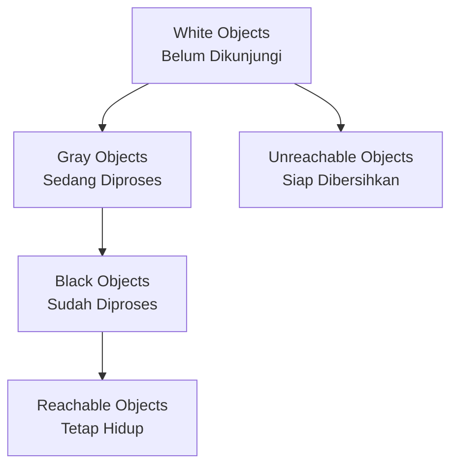

## Pengantar: Robot Pembersih Adaptif

Garbage Collector Go adalah **robot pembersih yang sangat pintar dan adaptif**. Berbeda dengan petugas kebersihan tradisional yang bekerja pada jadwal tetap, GC Go bekerja secara dinamis, tahu kapan harus membersihkan "sampah memori" tanpa mengganggu aktivitas utama program.

## Algoritma Tri-Color Mark-and-Sweep

### Konsep Tri-Color: Sistem Pewarnaan Cerdas

GC menggunakan **sistem pewarnaan tiga warna** seperti traffic light yang mengatur lalu lintas memori:



- **White (Putih)**: Objek yang belum dikunjungi, kandidat untuk dibersihkan
- **Gray (Abu-abu)**: Objek yang sedang diproses, dalam antrian pemeriksaan  
- **Black (Hitam)**: Objek yang sudah diproses dan confirmed reachable

## Fase-Fase GC: Siklus Pembersihan Terorganisir

### 1. Sweep Termination - Penyelesaian Tugas Sebelumnya
- **Menyelesaikan pending sweep work** dari cycle sebelumnya
- Memastikan tidak ada "pekerjaan setengah jadi" yang tertinggal
- Seperti petugas kebersihan yang menyelesaikan area terakhir sebelum mulai shift baru

### 2. Mark Phase - Detektif Pencari Jejak
- **Concurrent marking** berjalan bersamaan dengan program utama
- Dimulai dari **root pointers** (global variables, stack variables)
- Write barriers diaktifkan untuk melacak pointer baru yang dibuat mutator
- Seperti detektif yang mengikuti jejak untuk menemukan semua objek yang masih "hidup"

### 3. Mark Termination - Checkpoint Kritis
- **Stop-the-world (STW) phase** yang singkat
- Finalisasi marking process dan disable write barriers
- Persiapan untuk sweep phase
- Seperti traffic light merah yang menghentikan lalu lintas sejenak untuk transisi

### 4. Sweep Phase - Pembersihan Sesungguhnya  
- **Concurrent sweeping** mengembalikan unreachable objects ke heap
- Memory reclamation berjalan parallel dengan program
- Seperti robot vacuum yang bekerja di background tanpa mengganggu aktivitas

## GC Controller: Manajer Pacing Cerdas

### Pacing Algorithm
- **gcController** menentukan kapan trigger GC cycle
- Mengatur balance antara memory usage dan CPU overhead
- Adaptive pacing berdasarkan allocation rate dan heap growth

### Mutator Assists
- **Goroutines membantu GC** ketika allocation rate tinggi
- Prevents heap growth yang tidak terkendali
- Cooperative approach antara application dan GC

## Integration dengan Runtime Systems

### Koordinasi dengan Memory Management
- **mallocgc** mengalokasikan objek sebagai "black" during GC cycle
- Write barriers memastikan new pointers terdeteksi
- Seamless integration dengan [[Memory Management]] hierarchy

### Scheduler Coordination  
- **STW phases** menghentikan semua goroutines temporarily
- Background marking menggunakan dedicated goroutines
- Integration dengan [[Goroutine Scheduler]] untuk optimal performance

## Performance Characteristics

### Latency Optimization
| Aspect | Traditional GC | Go GC |
|--------|---------------|-------|
| STW Duration | Seconds | Sub-millisecond |
| Concurrency | Stop-the-world | Mostly concurrent |
| Predictability | Variable | Consistent low latency |

### Throughput vs Latency Trade-off
- **Low-latency design** prioritizes responsiveness
- Concurrent algorithms minimize application pauses
- Tunable via GOGC untuk different workload characteristics

## Configuration dan Tuning

### Environment Variables
- **GOGC**: Controls GC frequency (default 100%)
- **GOMEMLIMIT**: Soft memory limit untuk GC triggering  
- **GODEBUG=gctrace=1**: Detailed GC statistics dan timing

### Runtime Controls
```go
// Programmatic GC control
runtime.GC()              // Force GC cycle
runtime.SetGCPercent(50)  // Adjust GC frequency
debug.SetGCPercent(-1)    // Disable automatic GC
```

## Advanced Features

### Write Barriers: Sentinel Guards
- **Hybrid write barriers** track pointer modifications during concurrent marking
- Ensures no reachable objects missed during concurrent phase
- Minimal overhead pada normal operations

### Finalizers dan Weak References
- **Finalizers** untuk cleanup resources sebelum object reclaimed
- Careful ordering untuk avoid resurrection scenarios
- Integration dengan resource management patterns

## Monitoring dan Debugging

### GC Statistics
```go
var stats runtime.MemStats
runtime.ReadMemStats(&stats)
// Access GC timing, frequency, pause times
```

### Profiling Integration
- **GC profiling** melalui go tool pprof
- Heap dumps untuk memory leak detection
- Integration dengan [[Profiling and Metrics]] ecosystem

## Best Practices untuk GC-Friendly Code

### Memory Allocation Patterns
- **Pool objects** untuk reducing allocation pressure
- Avoid excessive small allocations
- Reuse buffers dan data structures when possible

### Pointer Management
- **Minimize pointer chains** untuk faster marking
- Use value types when appropriate
- Careful dengan circular references

---

*Catatan ini mengeksplorasi Garbage Collection system Go berdasarkan implementasi tri-color concurrent collector dalam golang/go runtime.*