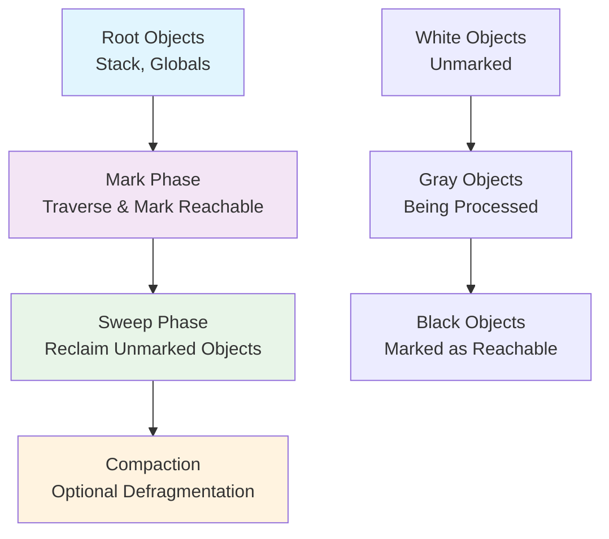
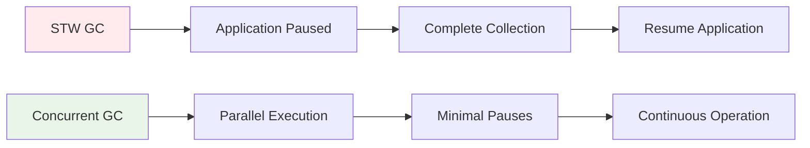

## Pengantar: Robot Pembersih Universal dalam Dunia Pemrograman

Garbage Collection adalah **sistem manajemen memori otomatis** yang bertindak seperti petugas kebersihan pintar di berbagai bahasa pemrograman modern. Seperti robot vacuum yang tahu kapan dan di mana harus membersihkan tanpa mengganggu aktivitas penghuni rumah, GC secara otomatis mengidentifikasi dan membersihkan objek-objek yang tidak lagi digunakan dalam program.

Konsep ini hadir di berbagai bahasa seperti [[Java]], [[JVM]] languages, [[Go]], C#, Python, JavaScript, dan banyak lagi, masing-masing dengan implementasi dan karakteristik yang unik sesuai dengan filosofi dan kebutuhan bahasa tersebut.

## Algoritma Fundamental Garbage Collection

### Mark-and-Sweep: Algoritma Klasik

**Mark-and-Sweep** adalah algoritma foundational yang digunakan dalam berbagai implementasi GC:



**Tri-Color Abstraction** (digunakan dalam Go, beberapa JVM GC):
- **White**: Objek belum dikunjungi, kandidat untuk dibersihkan
- **Gray**: Objek sedang diproses, dalam antrian pemeriksaan  
- **Black**: Objek sudah diproses dan confirmed reachable

## Implementasi GC Across Languages

### Java/JVM Ecosystem
**HotSpot JVM** menyediakan berbagai GC algorithms:

| GC Algorithm | Characteristics | Use Case |
|--------------|----------------|----------|
| **Serial GC** | Single-threaded, STW | Small applications |
| **Parallel GC** | Multi-threaded, throughput-focused | Batch processing |
| **G1GC** | Low-latency, region-based | Large heaps, interactive apps |
| **ZGC/Shenandoah** | Ultra-low latency, concurrent | Real-time applications |

### Go Runtime GC
- **Tri-color concurrent collector** dengan minimal STW pauses
- **Write barriers** untuk concurrent marking
- **Pacing algorithm** untuk adaptive triggering

### .NET/C# GC
- **Generational collection** dengan multiple generations
- **Background GC** untuk server applications
- **Workstation vs Server modes** untuk different scenarios

### Python GC
- **Reference counting** sebagai primary mechanism
- **Cycle detection** untuk handling circular references
- **Generational collection** untuk optimization

### JavaScript V8 GC
- **Orinoco collector** dengan incremental marking
- **Scavenger** untuk young generation
- **Mark-Compact** untuk old generation

## Strategi dan Teknik GC Universal

### Generational Hypothesis
**Konsep fundamental** yang digunakan di Java, .NET, Python:
- **Young objects** cenderung mati lebih cepat
- **Old objects** cenderung hidup lebih lama
- **Separate collection strategies** untuk different generations

### Concurrent vs Stop-the-World


### Write Barriers dan Read Barriers
- **Write barriers**: Track pointer modifications during concurrent collection
- **Read barriers**: Ensure consistent view during concurrent phases
- **Implementation varies** across different runtime systems

## Performance Characteristics dan Trade-offs

### Latency vs Throughput Spectrum

| Priority | GC Strategy | Examples | Trade-offs |
|----------|-------------|----------|------------|
| **Low Latency** | Concurrent, Incremental | ZGC, Shenandoah, Go GC | Higher CPU overhead |
| **High Throughput** | Parallel, Batch | Parallel GC, G1GC | Longer pause times |
| **Balanced** | Generational, Adaptive | HotSpot G1, .NET GC | Moderate both |

### Memory Overhead Considerations
- **GC metadata** requires additional memory
- **Write barriers** add runtime overhead
- **Concurrent algorithms** need extra bookkeeping structures

## Language-Specific Tuning dan Configuration

### Java/JVM Tuning
```bash
# G1GC configuration
-XX:+UseG1GC -XX:MaxGCPauseMillis=200 -XX:G1HeapRegionSize=16m

# ZGC for ultra-low latency
-XX:+UseZGC -XX:+UnlockExperimentalVMOptions
```

### Go GC Configuration
```bash
# Environment variables
GOGC=100          # GC frequency (default 100%)
GOMEMLIMIT=4GiB   # Soft memory limit
GODEBUG=gctrace=1 # GC statistics
```

### .NET GC Settings
```xml
<configuration>
  <runtime>
    <gcServer enabled="true"/>
    <gcConcurrent enabled="true"/>
  </runtime>
</configuration>
```

## Advanced GC Concepts

### Weak References dan Finalization
- **Weak references**: References yang tidak mencegah GC
- **Finalizers**: Cleanup code sebelum object destruction
- **Phantom references**: Post-mortem notifications

### Escape Analysis dan Stack Allocation
- **Compiler optimization** untuk avoiding heap allocation
- **Stack allocation** untuk short-lived objects
- **Reduced GC pressure** melalui smart allocation strategies

## Monitoring dan Profiling GC Performance

### Universal Monitoring Approaches
- **GC logs analysis** untuk understanding collection patterns
- **Heap dumps** untuk memory leak detection
- **Allocation profiling** untuk identifying hotspots

### Language-Specific Tools

| Language | Tools | Capabilities |
|----------|-------|-------------|
| **Java** | JVisualVM, GCEasy, JProfiler | Heap analysis, GC tuning |
| **Go** | go tool pprof, runtime.MemStats | Memory profiling, GC stats |
| **C#** | PerfView, dotMemory | .NET heap analysis |
| **Python** | tracemalloc, memory_profiler | Memory tracking |
| **JavaScript** | Chrome DevTools, Node.js --inspect | V8 heap snapshots |

## Best Practices untuk GC-Friendly Programming

### Universal Principles
- **Minimize object allocation** dalam hot paths
- **Reuse objects** melalui object pooling
- **Avoid deep object graphs** yang memperlambat marking
- **Prefer value types** over reference types when appropriate

### Language-Specific Optimizations

**Java/JVM:**
- Use `StringBuilder` untuk string concatenation
- Implement object pooling untuk expensive objects
- Tune heap sizes berdasarkan application behavior

**Go:**
- Use `sync.Pool` untuk object reuse
- Minimize pointer chains dalam data structures
- Leverage stack allocation melalui escape analysis

**C#:**
- Use `Span<T>` dan `Memory<T>` untuk avoiding allocations
- Implement `IDisposable` untuk deterministic cleanup
- Consider `struct` types untuk value semantics

## Future Directions dalam GC Research

### Emerging Trends
- **Region-based collection** (G1GC, Shenandoah evolution)
- **Machine learning-guided** GC tuning
- **Hardware-assisted** garbage collection
- **Persistent memory** integration

### Real-time dan Low-latency Focus
- **Deterministic pause times** untuk real-time systems
- **Concurrent algorithms** dengan minimal STW phases
- **Predictable performance** untuk latency-sensitive applications

## Refleksi: Evolusi Manajemen Memori Otomatis

Garbage Collection merepresentasikan evolusi fundamental dalam programming language design, membebaskan developers dari kompleksitas manual memory management sambil memberikan performance yang competitive. Seperti evolusi dari manual transmission ke automatic transmission dalam otomotif, GC memungkinkan developers fokus pada business logic daripada low-level memory bookkeeping.

Setiap bahasa pemrograman mengimplementasikan GC dengan trade-offs yang berbeda, mencerminkan filosofi dan target use case masing-masing. Dari throughput-oriented collectors di [[Java]] enterprise applications hingga low-latency collectors di Go microservices, diversity dalam GC implementations menunjukkan bahwa tidak ada "one size fits all" solution dalam memory management.

Pemahaman mendalam tentang GC characteristics memungkinkan developers membuat informed decisions dalam architecture design, performance optimization, dan technology selection, ultimately menghasilkan applications yang lebih robust dan efficient.

---

*Catatan ini mengeksplorasi Garbage Collection sebagai konsep universal dalam modern programming languages, dengan insights dari berbagai implementasi dan runtime systems.*