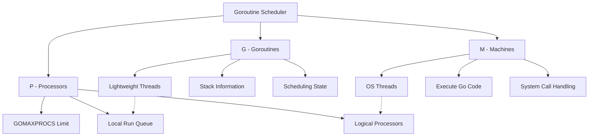

## Pengantar: Orkestra Tiga Serangkai

Go Runtime System adalah **orkestra tiga serangkai** yang bekerja dalam harmoni sempurna: [[Goroutine Scheduler]], [[Memory Management]], dan [[Garbage Collection]]. Ketiga komponen ini saling terintegrasi untuk menyediakan execution model yang efisien dan reliable.

## Goroutine Scheduler: Konduktor Orkestra Digital

### Model G-M-P: Arsitektur Tiga Pilar

| Component | Purpose | Key Features |
|-----------|---------|--------------|
| **G (Goroutine)** | Lightweight execution unit | Stack info, scheduling state, created via `newproc` |
| **M (Machine)** | OS thread executor | Must have P to run Go code, handles system calls |
| **P (Processor)** | Logical processor | Local run queue, resource provider, GOMAXPROCS limited |

### Mekanisme Scheduling

Scheduler bekerja dengan mencocokkan G dengan M dan P. Ketika M berhenti mengeksekusi Go code (misalnya karena system call), ia mengembalikan P ke idle pool. Setiap P memiliki local run queue (`runq`) untuk goroutines.

## Memory Management: Hierarki Alokasi Cerdas

### Struktur Hierarkis Tiga Tingkat

1. **mcache (Per-P Cache)**: Thread-local cache untuk setiap P, meminimalkan locking untuk alokasi objek kecil
2. **mcentral (Central Lists)**: Mengelola lists dari `mspan`s berdasarkan size class ketika mcache membutuhkan lebih banyak memori
3. **mheap (Page Heap)**: Mengelola virtual memory untuk seluruh Go heap, berinteraksi dengan OS melalui `sysAlloc` dan `sysFree`

### Memory Spans dan Alokasi

Memori dialokasikan dalam `mspan`s (contiguous pages). Objek dalam mspan dapat di-zero jika `mspan.needzero` true, atau diasumsikan sudah zero.

## Garbage Collection: Pembersih Concurrent

### Algoritma Tri-Color Mark-and-Sweep

GC Go menggunakan concurrent tri-color mark-and-sweep dengan empat fase:

1. **Sweep Termination**: Menyelesaikan pending sweep work dari cycle sebelumnya
2. **Mark Phase**: Mengidentifikasi semua reachable objects dari root pointers (concurrent dengan mutator)
3. **Mark Termination**: Stop-the-world phase untuk finalisasi marking
4. **Sweep Phase**: Mereclaim unreachable objects (concurrent)

### GC Controller dan Pacing

`gcController` mengelola GC pacing, menentukan kapan trigger GC cycle dan berapa banyak marking work yang harus dilakukan oleh mutator assists dan background marking.

## Integrasi Antar Subsystem

### Scheduler ↔ Memory Management
- P menyediakan akses ke mcache untuk alokasi goroutine
- Jika mcache habis, mengambil dari mcentral dan mheap

### Scheduler ↔ Garbage Collection  
- Scheduler assist dalam marking via `gcAssistAlloc`
- STW phases menghentikan semua goroutines
- P objects melacak `goroutinesCreated` untuk GC statistics

### Memory Management ↔ Garbage Collection
- `mallocgc` mengalokasikan objek sebagai "black" selama GC cycle jika write barriers enabled
- GC sweep mengembalikan unused memory ke allocator

## Konfigurasi Runtime

Runtime behavior dapat dikonfigurasi melalui environment variables:
- `GOGC`: Mengontrol GC frequency
- `GOMEMLIMIT`: Mengatur memory limit
- `GOMAXPROCS`: Menentukan jumlah logical processors

## Initialization Sequence

Runtime initialization mengikuti urutan: `osinit` → `schedinit` → `mallocinit` → `gcinit` → `newproc` (main goroutine) → `gcenable` (background sweeper).

---

*Catatan ini merupakan eksplorasi mendalam terhadap Go Runtime System berdasarkan dokumentasi golang/go repository.*