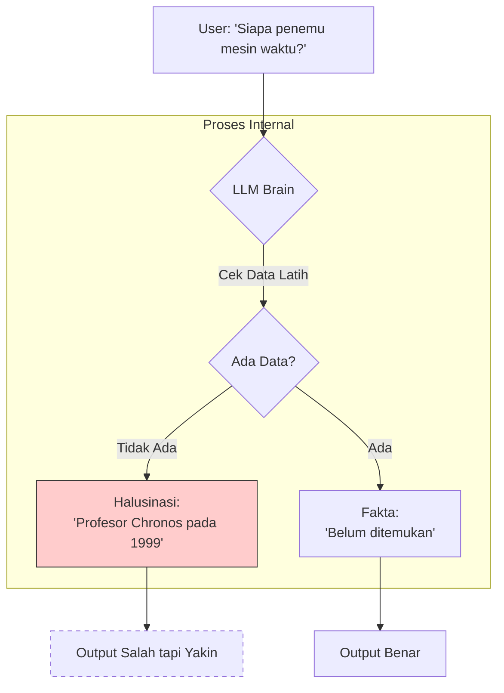

## Pengantar: Sang Aktor Improvisasi
Bayangkan sebuah panggung teater improvisasi. Di atas panggung, berdiri seorang aktor yang sangat berbakat (**[[LLM]]**). Aturan utama teater ini adalah: **"The Show Must Go On"** (Pertunjukan Harus Berlanjut). Aktor ini dilarang diam.

Jika penonton berteriak, "Ceritakan tentang Raja Mars!", aktor tersebut **tidak akan** menjawab "Mars tidak punya raja." Sebaliknya, demi menjaga kelancaran cerita, dia akan dengan percaya diri mengarang: *"Raja Zorgon dari Mars adalah pemimpin yang bijaksana..."*

Inilah metafora dari **Hallucination** pada AI. Model tidak didesain untuk menjadi **Ensiklopedia Kebenaran**, melainkan **Mesin Pelengkap Pola** yang memprioritaskan kelancaran bahasa di atas akurasi fakta.

## Mekanisme: Kenapa Aktor Berbohong?
Aktor ini (LLM) dilatih dengan satu tujuan utama: **Next Token Prediction** (Memprediksi kata selanjutnya).
*   Dia tidak memiliki konsep "Kebenaran" atau "Kebohongan".
*   Dia hanya memiliki konsep **Probabilitas**.
*   Jika secara statistik kata "Bumi" sering diikuti "Datar" di sebagian kecil data internet, dan konteksnya mendukung, dia mungkin akan mengatakannya, bukan karena dia percaya, tapi karena itu "terdengar pas" (plausible).

## Jenis-Jenis Kebohongan (Tipe Halusinasi)

Para peneliti membagi halusinasi menjadi dua kategori utama:

### 1. Intrinsic Hallucination (Salah Baca Naskah)
Ini terjadi ketika output AI bertentangan langsung dengan sumber yang diberikan.
*   **Contoh**: Anda memberi artikel berita "Jokowi meresmikan jembatan di *Papua*."
*   **AI Menjawab**: "Presiden meresmikan jembatan di *Kalimantan*."
*   **Analogi**: Aktor diberi naskah, tapi dia salah baca atau sengaja mengubahnya karena lupa.

### 2. Extrinsic Hallucination (Mengarang Bebas)
Ini terjadi ketika output AI menambahkan informasi yang tidak ada di sumber, yang tidak bisa diverifikasi (dan seringkali salah).
*   **Contoh**: Anda bertanya "Siapa CEO Google tahun 1800?"
*   **AI Menjawab**: "CEO Google tahun 1800 adalah Sir Archibald Tech." (Padahal Google belum ada).
*   **Analogi**: Aktor diminta menceritakan sejarah yang tidak pernah terjadi, dan dia mengarang detailnya dengan sangat meyakinkan.

## Penyebab Utama

1.  **Data Scarcity**: Aktor kehabisan bahan referensi untuk topik jarang, jadi dia mulai mengarang.
2.  **Overfitting**: Aktor menghafal naskah latihan terlalu persis, tapi gagal saat situasi sedikit berubah.
3.  **Prompt Ambiguity**: Instruksi sutradara (User) tidak jelas, jadi aktor menebak-nebak arah cerita.

## Solusi: Memberi Naskah & Koreksi

Bagaimana cara membuat aktor ini lebih jujur?

### 1. RAG (Retrieval-Augmented Generation) - [[RAG]]
*   **Konsep**: Jangan biarkan aktor mengarang dari ingatan kosong. Beri dia **Buku Panduan** (Dokumen Perusahaan/Wiki) yang boleh dia baca di panggung.
*   **Instruksi**: "Jawab pertanyaan penonton HANYA berdasarkan buku ini. Jika tidak ada di buku, katakan tidak tahu."

### 2. Chain of Thought (CoT) - Berpikir Sebelum Bicara
*   Meminta aktor untuk bergumam (berpikir langkah demi langkah) sebelum menjawab keras. Ini seringkali menyadarkan aktor akan kesalahan logikanya sendiri.

### 3. Grounding & Citation
*   Memaksa aktor untuk menyebutkan "Halaman berapa" dia menemukan fakta tersebut. Jika dia tidak bisa menyebut sumber, dia dilarang bicara.

## Visualisasi: Spektrum Kepercayaan Diri

*Diagram di atas menunjukkan percabangan di mana ketiadaan data seringkali memicu halusinasi karena dorongan model untuk tetap menjawab.*

## Refleksi: Kreativitas vs Halusinasi
Menariknya, mekanisme yang menyebabkan halusinasi adalah mekanisme yang sama yang memungkinkan **Kreativitas**. Kemampuan AI untuk "mengarang cerita fiksi" dan "berbohong tentang fakta" berasal dari sumber yang sama: **Imajinasi Probabilistik**. Tugas kita bukan mematikan imajinasi itu, tapi memberinya pagar pembatas yang jelas kapan harus berimajinasi (puisi/fiksi) dan kapan harus melapor (berita/sains).
