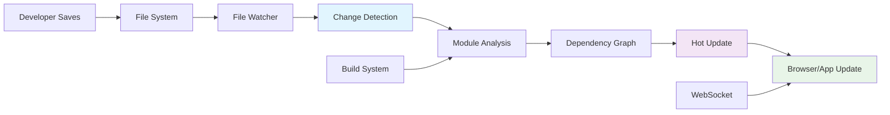

## Pengantar: Renovasi Rumah Tanpa Pindah Keluar

Bayangkan Hot Reloading sebagai **sistem renovasi rumah ajaib** di mana Anda bisa mengubah warna dinding, mengganti furniture, atau bahkan merombak tata ruang sambil tetap tinggal di dalam rumah tanpa gangguan. Tidak perlu pindah keluar, tidak perlu mengemas barang-barang, dan yang terpenting - semua perubahan terlihat secara real-time tanpa kehilangan "suasana" yang sudah terbangun.

Hot Reloading adalah teknologi development yang memungkinkan developer melihat perubahan code secara instant di aplikasi yang sedang berjalan, tanpa kehilangan application state atau perlu refresh manual. Ini bukan sekadar "auto-refresh" - Hot Reloading mempertahankan state aplikasi sambil mengupdate hanya bagian yang berubah. Technology ini sangat penting untuk [[Developer Experience]] dan sering diintegrasikan dengan [[React]], [[JavaScript]] development tools, dan [[Performance Optimization]] workflows.

**Mengapa Hot Reloading Revolusioner?**
- **Instant Feedback**: Perubahan code terlihat dalam hitungan milidetik
- **State Preservation**: Tidak kehilangan form data, scroll position, atau navigation state
- **[[Developer Velocity]]**: Mengurangi development cycle time hingga 90%
- **Enhanced Focus**: Developer tetap dalam "flow state" tanpa context switching

## Mekanisme Kerja: Sistem Deteksi dan Patch Otomatis

### File Watching - Sistem Sensor Perubahan

Hot Reloading dimulai dengan **sistem sensor canggih** yang memantau setiap perubahan file dalam project, seperti alarm kebakaran yang sensitif terhadap asap.



**File Watching Implementation:**
```javascript
// Webpack Hot Module Replacement (HMR)
const webpack = require('webpack');

module.exports = {
  mode: 'development',
  entry: './src/index.js',
  
  devServer: {
    hot: true, // Enable HMR
    liveReload: false, // Disable live reload to use HMR instead
    port: 3000,
    open: true,
  },
  
  plugins: [
    new webpack.HotModuleReplacementPlugin(),
  ],
  
  module: {
    rules: [
      {
        test: /\.(js|jsx)$/,
        exclude: /node_modules/,
        use: {
          loader: 'babel-loader',
          options: {
            plugins: ['react-hot-loader/babel'],
          },
        },
      },
      {
        test: /\.css$/,
        use: ['style-loader', 'css-loader'],
      },
    ],
  },
};

// Client-side HMR acceptance
if (module.hot) {
  module.hot.accept('./App', () => {
    // Re-render the app when App component changes
    const NextApp = require('./App').default;
    render(<NextApp />, document.getElementById('root'));
  });
  
  // Accept CSS changes
  module.hot.accept('./styles.css', () => {
    // CSS will be automatically updated
  });
}
```

### Module Replacement - Sistem Transplantasi Komponen

Module replacement seperti **sistem transplantasi organ** yang mengganti bagian yang rusak tanpa mengganggu fungsi organ lainnya.

```javascript
// React Hot Loader Implementation
import { hot } from 'react-hot-loader/root';
import React, { useState } from 'react';

function Counter() {
  const [count, setCount] = useState(0);
  const [message, setMessage] = useState('Hello World!');
  
  return (
    <div>
      <h1>{message}</h1>
      <p>Count: {count}</p>
      <button onClick={() => setCount(count + 1)}>
        Increment
      </button>
      <input 
        value={message}
        onChange={(e) => setMessage(e.target.value)}
        placeholder="Type a message..."
      />
    </div>
  );
}

// Hot reload wrapper - preserves state during updates
export default hot(Counter);

// When you change the JSX or styling:
// 1. File watcher detects change
// 2. Webpack rebuilds only changed module
// 3. HMR sends update to browser via WebSocket
// 4. React Hot Loader replaces component definition
// 5. State (count, message) is preserved
// 6. Only visual changes are applied
```

### State Preservation - Sistem Backup Otomatis

State preservation seperti **sistem backup otomatis** yang menyimpan dan memulihkan kondisi aplikasi saat renovasi berlangsung.

```javascript
// Advanced State Preservation
class HotReloadManager {
  constructor() {
    this.stateBackup = new Map();
    this.componentInstances = new WeakMap();
  }
  
  // Backup state sebelum hot reload
  backupState(componentId, state) {
    this.stateBackup.set(componentId, {
      ...state,
      timestamp: Date.now()
    });
  }
  
  // Restore state setelah hot reload
  restoreState(componentId) {
    const backup = this.stateBackup.get(componentId);
    if (backup && Date.now() - backup.timestamp < 5000) {
      return backup;
    }
    return null;
  }
  
  // Register component untuk tracking
  registerComponent(component, id) {
    this.componentInstances.set(component, id);
    
    // Backup state saat component akan di-unmount
    const originalComponentWillUnmount = component.componentWillUnmount;
    component.componentWillUnmount = () => {
      this.backupState(id, component.state);
      if (originalComponentWillUnmount) {
        originalComponentWillUnmount.call(component);
      }
    };
  }
}

// Usage dalam React component
function useHotReloadState(initialState, componentId) {
  const [state, setState] = useState(() => {
    // Try to restore state from hot reload
    const restored = hotReloadManager.restoreState(componentId);
    return restored || initialState;
  });
  
  useEffect(() => {
    // Backup state periodically
    const interval = setInterval(() => {
      hotReloadManager.backupState(componentId, state);
    }, 1000);
    
    return () => clearInterval(interval);
  }, [state, componentId]);
  
  return [state, setState];
}
```

## Platform Implementation: Renovasi di Berbagai Jenis Bangunan

### Web Development - Renovasi Apartemen Modern

Web hot reloading seperti **renovasi apartemen modern** dengan sistem modular yang canggih.

```javascript
// Vite Hot Reload (Modern Web)
// vite.config.js
import { defineConfig } from 'vite';
import react from '@vitejs/plugin-react';

export default defineConfig({
  plugins: [
    react({
      // Enable Fast Refresh
      fastRefresh: true,
    }),
  ],
  
  server: {
    hmr: {
      overlay: true, // Show errors in overlay
    },
  },
  
  css: {
    devSourcemap: true, // Enable CSS source maps
  },
});

// Client-side integration
// main.jsx
import React from 'react';
import ReactDOM from 'react-dom/client';
import App from './App';

const root = ReactDOM.createRoot(document.getElementById('root'));

function render() {
  root.render(<App />);
}

render();

// Vite HMR API
if (import.meta.hot) {
  import.meta.hot.accept('./App', (newModule) => {
    render();
  });
  
  // Handle CSS updates
  import.meta.hot.accept('./styles.css', () => {
    // CSS is automatically updated
  });
  
  // Custom HMR handling
  import.meta.hot.accept('./utils', (newModule) => {
    console.log('Utils module updated');
    // Handle utility function updates
  });
}
```

### React Native - Renovasi Rumah Mobile

[[React Native]] hot reloading seperti **renovasi rumah mobile** yang harus bekerja di berbagai lokasi dan kondisi.

```javascript
// React Native Fast Refresh
// metro.config.js
module.exports = {
  transformer: {
    getTransformOptions: async () => ({
      transform: {
        experimentalImportSupport: false,
        inlineRequires: true,
      },
    }),
  },
  
  server: {
    enhanceMiddleware: (middleware) => {
      return (req, res, next) => {
        // Custom middleware untuk HMR
        if (req.url === '/hot-reload') {
          res.writeHead(200, { 'Content-Type': 'application/json' });
          res.end(JSON.stringify({ status: 'ready' }));
          return;
        }
        return middleware(req, res, next);
      };
    },
  },
};

// Component dengan Fast Refresh support
import React, { useState } from 'react';
import { View, Text, TouchableOpacity, TextInput } from 'react-native';

function MobileCounter() {
  const [count, setCount] = useState(0);
  const [note, setNote] = useState('');
  
  // Fast Refresh preserves this state
  return (
    <View style={styles.container}>
      <Text style={styles.title}>Mobile Counter</Text>
      <Text style={styles.count}>Count: {count}</Text>
      
      <TouchableOpacity 
        style={styles.button}
        onPress={() => setCount(count + 1)}
      >
        <Text style={styles.buttonText}>Increment</Text>
      </TouchableOpacity>
      
      <TextInput
        style={styles.input}
        value={note}
        onChangeText={setNote}
        placeholder="Add a note..."
      />
    </View>
  );
}

// Fast Refresh akan preserve state saat code berubah
export default MobileCounter;
```

### Flutter - Renovasi Rumah Dart

[[Flutter]] hot reload seperti **renovasi rumah dengan arsitektur Dart** yang memiliki sistem reload yang sangat cepat.

```dart
// Flutter Hot Reload
import 'package:flutter/material.dart';

class CounterApp extends StatefulWidget {
  @override
  _CounterAppState createState() => _CounterAppState();
}

class _CounterAppState extends State<CounterApp> {
  int _counter = 0;
  String _message = 'Hello Flutter!';
  
  void _incrementCounter() {
    setState(() {
      _counter++;
    });
  }
  
  @override
  Widget build(BuildContext context) {
    // Hot reload akan preserve _counter dan _message state
    return Scaffold(
      appBar: AppBar(
        title: Text('Hot Reload Demo'),
        backgroundColor: Colors.blue, // Ubah warna ini dan lihat hot reload
      ),
      
      body: Center(
        child: Column(
          mainAxisAlignment: MainAxisAlignment.center,
          children: [
            Text(
              _message,
              style: TextStyle(fontSize: 24),
            ),
            
            Text(
              'Counter: $_counter',
              style: Theme.of(context).textTheme.headlineMedium,
            ),
            
            SizedBox(height: 20),
            
            TextField(
              onChanged: (value) {
                setState(() {
                  _message = value;
                });
              },
              decoration: InputDecoration(
                hintText: 'Type a message...',
                border: OutlineInputBorder(),
              ),
            ),
          ],
        ),
      ),
      
      floatingActionButton: FloatingActionButton(
        onPressed: _incrementCounter,
        tooltip: 'Increment',
        child: Icon(Icons.add),
        backgroundColor: Colors.green, // Hot reload preserves functionality
      ),
    );
  }
}

// Hot reload commands:
// r - Hot reload (preserves state)
// R - Hot restart (resets state)
// q - Quit
```

## Advanced Features: Sistem Renovasi Canggih

### Error Recovery - Sistem Pemulihan Otomatis

Error recovery seperti **sistem pemulihan otomatis** yang dapat mengatasi kesalahan renovasi tanpa merusak seluruh bangunan.


```javascript
// Error Boundary untuk Hot Reload
class HotReloadErrorBoundary extends React.Component {
  constructor(props) {
    super(props);
    this.state = { 
      hasError: false, 
      error: null,
      errorInfo: null 
    };
  }
  
  static getDerivedStateFromError(error) {
    return { hasError: true };
  }
  
  componentDidCatch(error, errorInfo) {
    this.setState({
      error,
      errorInfo
    });
    
    // Log error untuk debugging
    console.error('Hot Reload Error:', error, errorInfo);
  }
  
  componentDidUpdate(prevProps) {
    // Reset error state saat hot reload terjadi
    if (this.state.hasError && prevProps.children !== this.props.children) {
      this.setState({ 
        hasError: false, 
        error: null, 
        errorInfo: null 
      });
    }
  }
  
  render() {
    if (this.state.hasError) {
      return (
        <div style={{ padding: '20px', backgroundColor: '#ffebee' }}>
          <h2>🔥 Hot Reload Error</h2>
          <details style={{ whiteSpace: 'pre-wrap' }}>
            <summary>Error Details</summary>
            {this.state.error && this.state.error.toString()}
            <br />
            {this.state.errorInfo.componentStack}
          </details>
          
          <button 
            onClick={() => window.location.reload()}
            style={{ marginTop: '10px' }}
          >
            Reload Page
          </button>
        </div>
      );
    }
    
    return this.props.children;
  }
}

// Usage
function App() {
  return (
    <HotReloadErrorBoundary>
      <MyComponent />
    </HotReloadErrorBoundary>
  );
}
```


### CSS Hot Reload - Renovasi Dekorasi Instan

CSS hot reload seperti **renovasi dekorasi instan** yang mengubah tampilan tanpa mengganggu struktur.

```javascript
// CSS-in-JS Hot Reload
import styled, { ThemeProvider } from 'styled-components';

// Theme yang bisa di-hot reload
const theme = {
  colors: {
    primary: '#007bff',    // Ubah warna ini
    secondary: '#6c757d',  // Dan lihat perubahan instant
    success: '#28a745',
    danger: '#dc3545',
  },
  
  spacing: {
    small: '8px',
    medium: '16px',
    large: '24px',
  },
};

// Styled component dengan hot reload
const Button = styled.button`
  background-color: ${props => props.theme.colors.primary};
  color: white;
  padding: ${props => props.theme.spacing.medium};
  border: none;
  border-radius: 4px;
  cursor: pointer;
  
  &:hover {
    background-color: ${props => props.theme.colors.secondary};
    transform: translateY(-2px); /* Tambah animasi ini */
  }
  
  /* Hot reload akan update styling secara instant */
  transition: all 0.3s ease;
`;

const Container = styled.div`
  max-width: 800px;
  margin: 0 auto;
  padding: ${props => props.theme.spacing.large};
  
  /* Ubah layout ini dan lihat hot reload */
  display: flex;
  flex-direction: column;
  gap: ${props => props.theme.spacing.medium};
`;

function StyledApp() {
  return (
    <ThemeProvider theme={theme}>
      <Container>
        <h1>Styled Components Hot Reload</h1>
        <Button>Click me!</Button>
      </Container>
    </ThemeProvider>
  );
}

// Hot reload untuk CSS modules
import styles from './App.module.css';

function CSSModuleApp() {
  return (
    <div className={styles.container}>
      <h1 className={styles.title}>CSS Modules Hot Reload</h1>
      <button className={styles.button}>
        Styled Button
      </button>
    </div>
  );
}

// App.module.css - akan di-hot reload saat berubah
/*
.container {
  max-width: 800px;
  margin: 0 auto;
  padding: 24px;
}

.title {
  color: #333;
  font-size: 2rem;
  margin-bottom: 16px;
}

.button {
  background: linear-gradient(45deg, #007bff, #0056b3);
  color: white;
  padding: 12px 24px;
  border: none;
  border-radius: 8px;
  cursor: pointer;
  transition: transform 0.2s;
}

.button:hover {
  transform: scale(1.05);
}
*/
```

## Performance Optimization: Efisiensi Sistem Renovasi

### Selective Updates - Renovasi Terfokus

Selective updates seperti **renovasi terfokus** yang hanya mengubah bagian yang benar-benar perlu diubah.

```javascript
// Optimized Hot Reload dengan React.memo
const ExpensiveComponent = React.memo(function ExpensiveComponent({ data }) {
  console.log('ExpensiveComponent rendered');
  
  // Simulasi expensive computation
  const processedData = useMemo(() => {
    return data.map(item => ({
      ...item,
      processed: true,
      timestamp: Date.now()
    }));
  }, [data]);
  
  return (
    <div>
      {processedData.map(item => (
        <div key={item.id}>{item.name}</div>
      ))}
    </div>
  );
});

// Component yang sering berubah
function FrequentlyChangingComponent() {
  const [count, setCount] = useState(0);
  
  return (
    <div>
      <h2>Frequently Updated: {count}</h2>
      <button onClick={() => setCount(count + 1)}>
        Update
      </button>
    </div>
  );
}

// Parent component
function OptimizedApp() {
  const [expensiveData] = useState([
    { id: 1, name: 'Item 1' },
    { id: 2, name: 'Item 2' },
    // ... lots of data
  ]);
  
  return (
    <div>
      {/* ExpensiveComponent tidak akan re-render saat FrequentlyChangingComponent berubah */}
      <ExpensiveComponent data={expensiveData} />
      <FrequentlyChangingComponent />
    </div>
  );
}

// Hot reload configuration untuk performance
if (module.hot) {
  // Accept updates untuk specific modules
  module.hot.accept('./ExpensiveComponent', () => {
    // Only update expensive component when it changes
  });
  
  // Decline updates untuk certain modules
  module.hot.decline('./constants');
  
  // Custom disposal handler
  module.hot.dispose((data) => {
    // Cleanup sebelum hot reload
    data.savedState = getCurrentState();
  });
  
  module.hot.accept((err) => {
    if (err) {
      console.error('Hot reload failed:', err);
    }
  });
}
```

### Bundle Splitting - Sistem Modular Renovasi

Bundle splitting seperti **sistem modular renovasi** yang memungkinkan update bagian tertentu tanpa mengganggu keseluruhan.

```javascript
// Webpack configuration untuk optimal hot reload
module.exports = {
  optimization: {
    splitChunks: {
      chunks: 'all',
      cacheGroups: {
        // Vendor libraries (jarang berubah)
        vendor: {
          test: /[\\/]node_modules[\\/]/,
          name: 'vendors',
          chunks: 'all',
        },
        
        // Common components (sedang berubah)
        common: {
          name: 'common',
          minChunks: 2,
          chunks: 'all',
          enforce: true,
        },
        
        // Feature-specific code (sering berubah)
        features: {
          test: /[\\/]src[\\/]features[\\/]/,
          name: 'features',
          chunks: 'all',
        },
      },
    },
  },
  
  devServer: {
    hot: true,
    // Optimize hot reload performance
    watchOptions: {
      ignored: /node_modules/,
      aggregateTimeout: 300,
      poll: 1000,
    },
  },
};

// Dynamic imports untuk lazy loading dengan hot reload
const LazyFeature = lazy(() => 
  import('./features/LazyFeature').then(module => ({
    default: module.LazyFeature
  }))
);

function App() {
  return (
    <Suspense fallback={<div>Loading...</div>}>
      <LazyFeature />
    </Suspense>
  );
}

// Hot reload untuk lazy-loaded components
if (module.hot) {
  module.hot.accept('./features/LazyFeature', () => {
    // Lazy component akan di-reload otomatis
  });
}
```

## Trade-offs dan Best Practices: Renovasi yang Bijak

### Perbandingan Hot Reload Systems

| System | Speed | State Preservation | Error Recovery | Platform |
|--------|-------|-------------------|----------------|----------|
| **Webpack HMR** | Good | Partial | Good | Web |
| **Vite HMR** | Excellent | Good | Excellent | Web |
| **React Fast Refresh** | Excellent | Excellent | Good | Web/Native |
| **Flutter Hot Reload** | Excellent | Excellent | Good | Mobile |
| **Next.js Fast Refresh** | Excellent | Excellent | Excellent | Web |

### Hot Reload Best Practices

```javascript
// 1. Proper component structure untuk hot reload
// ❌ Bad: Anonymous components
export default () => {
  const [state, setState] = useState(0);
  return <div>{state}</div>;
};

// ✅ Good: Named components
function Counter() {
  const [state, setState] = useState(0);
  return <div>{state}</div>;
}
export default Counter;

// 2. State management yang hot-reload friendly
// ❌ Bad: Global state yang tidak persistent
let globalCounter = 0;

// ✅ Good: Proper state management
function usePersistedState(key, defaultValue) {
  const [state, setState] = useState(() => {
    if (typeof window !== 'undefined') {
      const saved = localStorage.getItem(key);
      return saved ? JSON.parse(saved) : defaultValue;
    }
    return defaultValue;
  });
  
  useEffect(() => {
    localStorage.setItem(key, JSON.stringify(state));
  }, [key, state]);
  
  return [state, setState];
}

// 3. Error handling untuk hot reload
function ErrorBoundaryWrapper({ children }) {
  return (
    <ErrorBoundary
      fallback={<div>Something went wrong during hot reload</div>}
      onError={(error, errorInfo) => {
        console.error('Hot reload error:', error, errorInfo);
      }}
    >
      {children}
    </ErrorBoundary>
  );
}

// 4. Development vs Production configuration
const isDevelopment = process.env.NODE_ENV === 'development';

const config = {
  devServer: {
    hot: isDevelopment,
    liveReload: !isDevelopment, // Use live reload in production builds
  },
  
  plugins: [
    ...(isDevelopment ? [new webpack.HotModuleReplacementPlugin()] : []),
  ],
};
```

## Studi Kasus: Renovasi Sukses di Dunia Nyata

**Facebook**: React Fast Refresh meningkatkan developer productivity 40%
**Vercel**: Next.js Fast Refresh mengurangi development cycle time 60%
**Google**: Flutter hot reload memungkinkan rapid UI iteration
**Shopify**: Webpack HMR optimization mengurangi build time 70%

**Lessons Learned:**
- Hot reload investment pays off dalam developer satisfaction dan productivity
- State preservation crucial untuk complex application development
- Error recovery mechanisms essential untuk smooth development experience
- Performance optimization perlu balance antara speed dan reliability

## Refleksi: Masa Depan Renovasi Instan

Hot Reloading telah berevolusi dari "nice-to-have feature" menjadi "essential development tool" yang mengubah cara developer bekerja. Seperti sistem renovasi yang berkembang dari manual labor menjadi automated systems, hot reload terus berinovasi menuju **instant development experience**.

Masa depan hot reloading terletak pada **intelligent updates** - AI-powered change detection, predictive preloading, dan seamless cross-device synchronization. Dengan [[Machine Learning]] dan advanced static analysis, hot reload systems akan semakin pintar dalam memahami code changes dan mengoptimalkan update strategies.

Investasi dalam memahami dan mengoptimalkan hot reload adalah investasi dalam developer happiness - seperti memiliki sistem renovasi yang sempurna, hot reload yang baik memungkinkan developer untuk bereksperimen, iterate, dan create dengan confidence tanpa friction yang mengganggu creative flow.

---

*Catatan ini menggambarkan Hot Reloading sebagai sistem renovasi instan yang memungkinkan developer melihat perubahan code secara real-time, dengan analogi renovasi rumah yang memudahkan pemahaman tentang mekanisme kerja, implementasi, dan best practices untuk optimal development experience.*