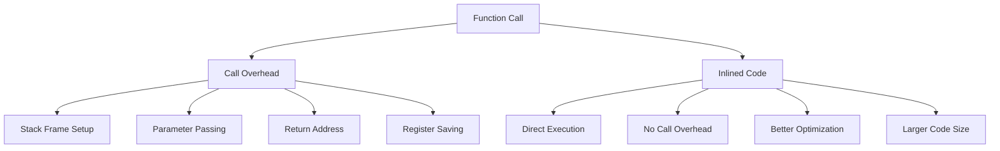
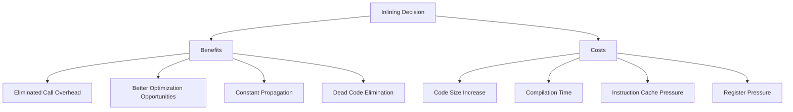
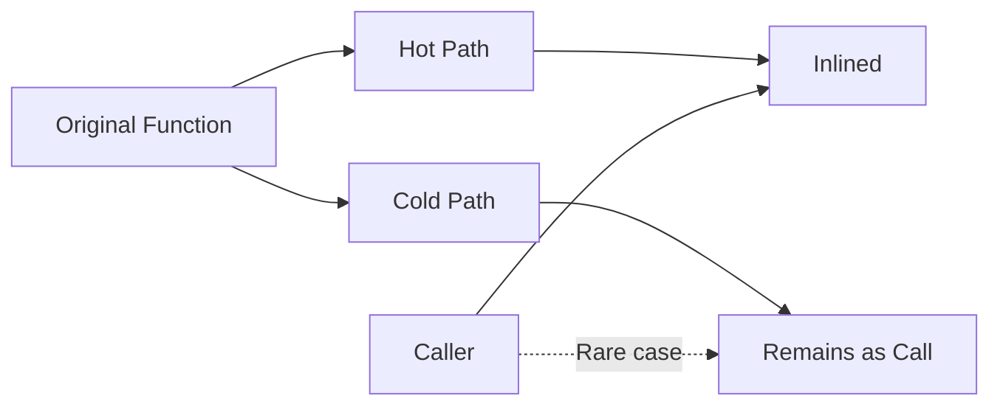
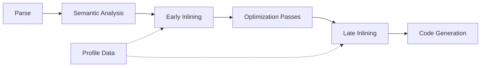
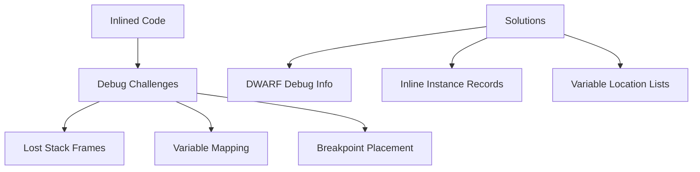

## Pengantar: Eliminasi Birokrasi Kode

Inlining adalah **penghilang perantara dalam bisnis kode**. Alih-alih memanggil fungsi melalui "perantara" (function call overhead), kode fungsi langsung ditempatkan di lokasi pemanggilan, mengurangi overhead dan meningkatkan kecepatan eksekusi seperti menghilangkan birokrasi yang tidak perlu.

## Konsep Fundamental: Direct vs Indirect

### Function Call Overhead - Biaya Komunikasi
Setiap function call seperti **mengirim surat melalui pos** - ada overhead untuk packaging, addressing, dan delivery. Inlining seperti **berbicara langsung** tanpa perantara.



### Trade-offs Analysis
| Aspect | Function Call | Inlined Code |
|--------|---------------|--------------|
| **Execution Speed** | Slower (call overhead) | Faster (direct execution) |
| **Code Size** | Smaller (single copy) | Larger (multiple copies) |
| **Cache Behavior** | Better instruction cache | Potential cache misses |
| **Optimization** | Limited across boundaries | Better local optimization |

## Inlining Strategies: Algoritma Keputusan

### Heuristic-Based Inlining
Compiler menggunakan **heuristics seperti dokter yang mendiagnosis** berdasarkan symptoms untuk memutuskan apakah suatu fungsi layak di-inline:

```cpp
// Inline candidates
inline int add(int a, int b) {    // Small, simple
    return a + b;
}

int square(int x) {               // Hot path, frequently called
    return x * x;
}

// Non-inline candidates  
void complexFunction() {          // Large function body
    // 100+ lines of code
}

void recursiveFunction(int n) {   // Recursive calls
    if (n > 0) recursiveFunction(n-1);
}
```

### Cost-Benefit Analysis


## Types of Inlining: Spektrum Optimasi

### Static Inlining - Compile-Time Decision
- **Compiler decides** at compile time berdasarkan heuristics
- Function size, call frequency, optimization level
- Profile-guided optimization untuk better decisions
- Template instantiation dalam C++

### Dynamic Inlining - Runtime Adaptation
- **JIT compilers** dapat inline berdasarkan runtime behavior
- Speculative inlining dengan deoptimization fallback
- Adaptive optimization berdasarkan actual usage patterns
- Examples: JVM HotSpot, .NET CLR

### Partial Inlining - Selective Optimization


## Advanced Inlining Techniques

### Cross-Module Inlining
- **Link-Time Optimization (LTO)** enables inlining across compilation units
- Whole-program analysis untuk global optimization
- Inter-procedural analysis untuk call graph optimization
- Challenges: compilation time, build complexity

### Template Metaprogramming
```cpp
// C++ template inlining
template<int N>
constexpr int factorial() {
    if constexpr (N <= 1) {
        return 1;
    } else {
        return N * factorial<N-1>();
    }
}

// Completely inlined at compile time
constexpr int result = factorial<5>(); // = 120
```

### Devirtualization - Interface Inlining
| Technique | Approach | Benefit |
|-----------|----------|---------|
| **Class Hierarchy Analysis** | Static type analysis | Eliminate virtual calls |
| **Speculative Devirtualization** | Assume common type | Fast path optimization |
| **Profile-Guided Devirtualization** | Use runtime data | Accurate predictions |

## Performance Impact: Measurement dan Analysis

### Micro-benchmarks
```cpp
// Benchmark: Function call vs Inlined
void benchmark_function_call() {
    for (int i = 0; i < 1000000; ++i) {
        result += add_function(i, i+1);  // Function call
    }
}

void benchmark_inlined() {
    for (int i = 0; i < 1000000; ++i) {
        result += i + (i+1);             // Inlined
    }
}
```

### Real-World Impact
- **Hot paths**: 10-50% performance improvement
- **Cold paths**: Minimal impact, potential regression
- **Cache effects**: Complex interaction dengan instruction cache
- **Branch prediction**: Better prediction dengan inlined code

## Compiler Implementation: Under the Hood

### Inlining Pass dalam Compiler Pipeline


### Heuristics dan Thresholds
- **Function size limits** (e.g., 30-100 instructions)
- **Call site frequency** dari profiling data
- **Nesting depth limits** untuk preventing explosion
- **Total inline budget** per compilation unit

## Language-Specific Considerations

### C++ Inlining
```cpp
// Explicit inline hints
inline int fast_function(int x) { return x * 2; }

// Template functions (implicitly inline)
template<typename T>
T max(T a, T b) { return a > b ? a : b; }

// Member functions defined in class (implicitly inline)
class MyClass {
    int getValue() const { return value; }  // Inline candidate
private:
    int value;
};
```

### Java HotSpot Inlining
- **Tiered compilation** dengan different inlining strategies
- **Speculative inlining** dengan uncommon trap fallback
- **Polymorphic inline caching** untuk virtual calls
- **Profile pollution** considerations

### JavaScript V8 Inlining
- **Hidden class optimization** untuk property access
- **Inline caching** untuk dynamic property lookup
- **Turbofan optimizing compiler** dengan aggressive inlining
- **Deoptimization** ketika assumptions violated

## Debugging Inlined Code: Challenges dan Solutions

### Debug Information Preservation


### Profiling Inlined Functions
- **Sampling profilers** may attribute time incorrectly
- **Instrumentation overhead** dapat affect inlining decisions
- **Call graph reconstruction** dari inlined code
- **Hot spot identification** dalam inlined contexts

## Best Practices dan Guidelines

### When to Inline
- **Small functions** (< 10-20 lines)
- **Frequently called functions** dalam hot paths
- **Simple functions** tanpa complex control flow
- **Accessor methods** dan property getters

### When NOT to Inline
- **Large functions** yang increase code size significantly
- **Recursive functions** (dapat cause infinite expansion)
- **Functions dengan complex exception handling**
- **Rarely called functions** dalam cold paths

### Compiler Hints dan Attributes
```cpp
// C++ attributes
[[gnu::always_inline]] void force_inline() { }
[[gnu::noinline]] void never_inline() { }

// C# attributes
[MethodImpl(MethodImplOptions.AggressiveInlining)]
public static int FastMethod(int x) { return x * 2; }

// Rust attributes
#[inline(always)]
fn force_inline() { }

#[inline(never)]
fn no_inline() { }
```

## Future Directions: Machine Learning dan AI

### ML-Guided Inlining
- **Neural networks** untuk predicting inlining benefit
- **Reinforcement learning** untuk adaptive strategies
- **Transfer learning** across different codebases
- **Automated feature engineering** dari code characteristics

### Profile-Guided Optimization Evolution
- **Continuous profiling** dalam production environments
- **Feedback-directed optimization** dengan real user data
- **A/B testing** untuk inlining strategies
- **Cloud-based optimization** dengan distributed profiling

---

*Catatan ini mengeksplorasi Inlining sebagai fundamental compiler optimization technique yang balance antara performance gains dan code size trade-offs.*