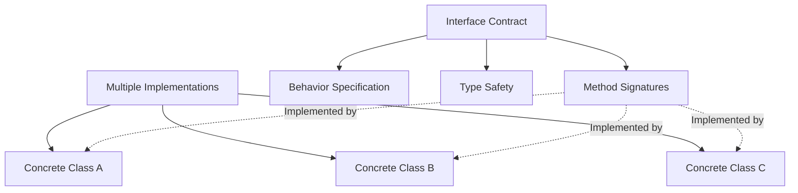
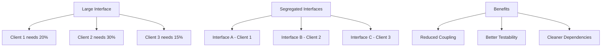
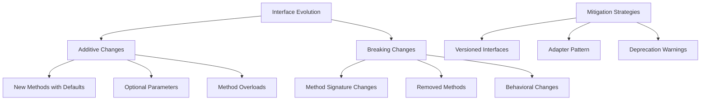
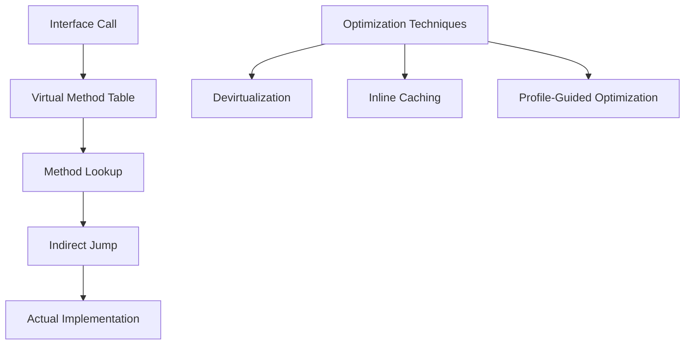

## Pengantar: Perjanjian Tanpa Implementasi

Interface Types adalah **kontrak digital yang mendefinisikan apa yang harus dilakukan tanpa menentukan bagaimana melakukannya**. Seperti kontrak bisnis yang menentukan deliverables tanpa mengatur detail internal perusahaan, interfaces memberikan fleksibilitas implementasi sambil menjamin konsistensi behavior.

## Konsep Fundamental: Abstraksi vs Implementasi

### Contract-Based Programming
Interface seperti **job description yang detail** - menentukan responsibilities dan expectations tanpa mengatur cara kerja internal karyawan.



### Polymorphism Through Interfaces
| Concept | Description | Benefit |
|---------|-------------|---------|
| **Duck Typing** | "If it walks like a duck..." | Runtime flexibility |
| **Structural Typing** | Shape-based compatibility | Compile-time safety |
| **Nominal Typing** | Explicit interface declaration | Clear contracts |

## Interface Design Patterns: Arsitektur Kontrak

### Single Responsibility Interfaces
```java
// Good: Focused interfaces
interface Readable {
    String read();
}

interface Writable {
    void write(String data);
}

interface ReadWritable extends Readable, Writable {
    // Composition of focused interfaces
}

// Bad: God interface
interface FileOperations {
    String read();
    void write(String data);
    void compress();
    void encrypt();
    void backup();
    // Too many responsibilities
}
```

### Interface Segregation Principle
Clients tidak boleh **dipaksa depend pada interfaces yang tidak mereka gunakan**. Seperti menu restoran yang terspesialisasi daripada menu raksasa yang membingungkan.



## Language-Specific Implementations

### Java Interfaces
```java
// Traditional interface
interface Shape {
    double area();
    double perimeter();
}

// Default methods (Java 8+)
interface Drawable {
    void draw();
    
    default void highlight() {
        System.out.println("Highlighting shape");
        draw();
    }
}

// Functional interface
@FunctionalInterface
interface Calculator {
    int calculate(int a, int b);
    
    // Lambda compatible: (a, b) -> a + b
}
```

### C# Interfaces
```csharp
// Basic interface
public interface IRepository<T> {
    T GetById(int id);
    void Save(T entity);
    void Delete(int id);
}

// Interface with properties
public interface IConfigurable {
    string Name { get; set; }
    bool IsEnabled { get; }
    void Configure(Dictionary<string, object> settings);
}

// Multiple interface inheritance
public class DatabaseRepository : IRepository<User>, IDisposable {
    // Implementation
}
```

### Go Interfaces - Implicit Satisfaction
```go
// Interface definition
type Writer interface {
    Write([]byte) (int, error)
}

type Reader interface {
    Read([]byte) (int, error)
}

// Composition
type ReadWriter interface {
    Reader
    Writer
}

// Implicit implementation - no "implements" keyword
type File struct {
    name string
}

func (f *File) Write(data []byte) (int, error) {
    // Implementation
    return len(data), nil
}

// File automatically satisfies Writer interface
```

## Advanced Interface Concepts

### Generic Interfaces
```typescript
// TypeScript generic interfaces
interface Repository<T, K> {
    findById(id: K): Promise<T | null>;
    save(entity: T): Promise<T>;
    delete(id: K): Promise<boolean>;
}

interface Comparable<T> {
    compareTo(other: T): number;
}

// Usage with constraints
function sort<T extends Comparable<T>>(items: T[]): T[] {
    return items.sort((a, b) => a.compareTo(b));
}
```

### Marker Interfaces
```java
// Marker interfaces - no methods, just type marking
public interface Serializable {
    // Empty interface - marks class as serializable
}

public interface Cloneable {
    // Indicates object can be cloned
}

// Usage in framework code
if (obj instanceof Serializable) {
    // Safe to serialize
    serialize(obj);
}
```

## Interface Evolution: Versioning dan Compatibility

### Backward Compatibility Strategies


### Interface Versioning
```java
// Version 1
public interface PaymentProcessor {
    boolean processPayment(double amount);
}

// Version 2 - Backward compatible
public interface PaymentProcessorV2 extends PaymentProcessor {
    boolean processPayment(double amount, String currency);
    
    // Default implementation for backward compatibility
    default boolean processPayment(double amount) {
        return processPayment(amount, "USD");
    }
}
```

## Testing dengan Interfaces: Mock dan Stub

### Dependency Injection
```java
// Interface for testability
public interface EmailService {
    void sendEmail(String to, String subject, String body);
}

// Production implementation
public class SmtpEmailService implements EmailService {
    public void sendEmail(String to, String subject, String body) {
        // Actual SMTP implementation
    }
}

// Test implementation
public class MockEmailService implements EmailService {
    private List<Email> sentEmails = new ArrayList<>();
    
    public void sendEmail(String to, String subject, String body) {
        sentEmails.add(new Email(to, subject, body));
    }
    
    public List<Email> getSentEmails() { return sentEmails; }
}
```

### Test Doubles Pattern
| Type | Purpose | Implementation |
|------|---------|----------------|
| **Mock** | Verify interactions | Records method calls |
| **Stub** | Provide test data | Returns predefined values |
| **Fake** | Working implementation | Simplified version |
| **Spy** | Partial mocking | Wraps real object |

## Performance Considerations

### Virtual Method Dispatch


### Interface vs Abstract Classes
```java
// Interface - multiple inheritance, no state
interface Flyable {
    void fly();  // Pure virtual
}

// Abstract class - single inheritance, can have state
abstract class Bird {
    protected String species;
    
    public abstract void fly();  // Abstract method
    
    public void eat() {          // Concrete method
        System.out.println("Bird is eating");
    }
}
```

## Modern Interface Patterns

### Fluent Interfaces - Method Chaining
```java
public interface QueryBuilder {
    QueryBuilder select(String... columns);
    QueryBuilder from(String table);
    QueryBuilder where(String condition);
    QueryBuilder orderBy(String column);
    String build();
}

// Usage: Readable, chainable API
String query = new SqlQueryBuilder()
    .select("name", "email")
    .from("users")
    .where("age > 18")
    .orderBy("name")
    .build();
```

### Builder Pattern dengan Interfaces
```java
public interface UserBuilder {
    UserBuilder withName(String name);
    UserBuilder withEmail(String email);
    UserBuilder withAge(int age);
    User build();
}

// Type-safe builder progression
public interface NameStep {
    EmailStep withName(String name);
}

public interface EmailStep {
    BuildStep withEmail(String email);
}

public interface BuildStep {
    BuildStep withAge(int age);  // Optional
    User build();
}
```

## Functional Programming Integration

### Higher-Order Functions
```typescript
// Function interfaces
interface Predicate<T> {
    (item: T): boolean;
}

interface Mapper<T, U> {
    (item: T): U;
}

interface Reducer<T, U> {
    (accumulator: U, current: T): U;
}

// Usage in functional style
function filter<T>(items: T[], predicate: Predicate<T>): T[] {
    return items.filter(predicate);
}

function map<T, U>(items: T[], mapper: Mapper<T, U>): U[] {
    return items.map(mapper);
}
```

### Strategy Pattern dengan Function Interfaces
```java
@FunctionalInterface
public interface SortingStrategy<T> {
    void sort(List<T> items);
}

public class Sorter<T> {
    public void sort(List<T> items, SortingStrategy<T> strategy) {
        strategy.sort(items);
    }
}

// Usage with lambdas
sorter.sort(numbers, Collections::sort);
sorter.sort(strings, list -> list.sort(String::compareToIgnoreCase));
```

## Best Practices dan Anti-Patterns

### Interface Design Guidelines
- **Keep interfaces small dan focused** (Single Responsibility)
- **Favor composition over inheritance** dalam interface hierarchies
- **Use meaningful names** yang describe behavior, not implementation
- **Document behavioral contracts** beyond just method signatures

### Common Anti-Patterns
| Anti-Pattern | Problem | Solution |
|--------------|---------|----------|
| **God Interface** | Too many responsibilities | Interface segregation |
| **Marker Abuse** | Empty interfaces everywhere | Use annotations/attributes |
| **Leaky Abstraction** | Implementation details exposed | Better encapsulation |
| **Interface Pollution** | Unnecessary interface extraction | YAGNI principle |

---

*Catatan ini mengeksplorasi Interface Types sebagai fundamental building blocks untuk flexible, maintainable software architecture yang promotes loose coupling dan high cohesion.*