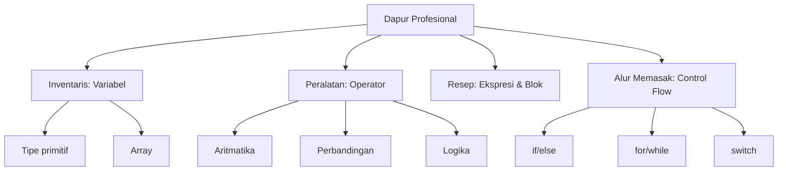

## Pengantar: Dapur Profesional
- Bayangkan dasar-dasar Java seperti operasi sebuah dapur profesional: bahan, alat, resep, dan alur memasak bekerja serempak agar hidangan konsisten dan cepat disajikan.
- Variabel adalah wadah bahan, tipe data adalah jenis bahan, operator adalah alat, ekspresi dan pernyataan adalah langkah resep, sedangkan control flow adalah keputusan koki di tengah proses.
- Untuk konteks eksekusi mesin, lihat [[JVM]] dan kaitannya dengan [[Object-Oriented Programming|OOP]]. Koleksi seperti daftar dan set dapat dibaca di [[Java Collections]].
- Break Point Analysis: tidak seperti dapur nyata, data di Java dapat digandakan tanpa habis; waktu komputasi tidak selalu linear dengan "berat bahan"; dan bahan (nilai) tidak basi kecuali kita menggantinya.



- Diagram di atas memetakan hierarki konsep: mulai dari dapur (Java dasar) ke empat cabang utama. Baca dari atas ke bawah: setiap node adalah sub-topik; anak node merinci kategori di dalamnya.

## Inventaris: Variabel & Tipe
### Menamai dan menyimpan bahan
- Variabel menamai wadah agar koki tahu di mana bahan disimpan. Lihat [[Creating Variables and Naming Them]] untuk aturan penamaan yang konsisten dan mudah dibaca.
- Gunakan nama yang menjawab "apa" bukan "bagaimana" (mis. `totalPrice`, bukan `tp`).

### Tipe primitif sebagai jenis bahan
- Tipe primitif adalah bahan dasar: `int`, `double`, `boolean`, `char`, `byte`, `short`, `long`, `float`.
- Lihat [[Creating Primitive Type Variables in Your Programs]] untuk sintaks inisialisasi dan default value.
- Pertimbangkan rentang dan presisi: pilih `int` vs `long`, `float` vs `double` sesuai "ukuran bahan" yang dibutuhkan.

### Var sebagai inferensi wadah
- `var` memungkinkan compiler menginferensi tipe bahan dari konteks lokal sehingga resep tetap ringkas namun bertipe statis.
- Lihat [[Using the Var Type Identifier]] untuk batasan (hanya variabel lokal), praktik penamaan yang tetap eksplisit, dan contoh yang aman.

### Array sebagai rak bahan
- Array menyusun bahan sejenis di satu rak berindeks untuk akses cepat.
- Lihat [[Creating Arrays in Your Programs]] untuk membuat rak berukuran tetap dan teknik iterasi yang aman.
- Jika perlu fleksibilitas rak, pertimbangkan koleksi dinamis pada [[Java Collections]].

## Peralatan: Operator
### Menggunakan operator sebagai alat
- Operator aritmatika (`+`, `-`, `*`, `/`, `%`) adalah pisau, panci, dan pengaduk untuk "mengolah" bahan.
- Operator perbandingan (`==`, `!=`, `>`, `<`, `>=`, `<=`) menilai kualitas/kuantitas bahan.
- Operator logika (`&&`, `||`, `!`) menggabungkan keputusan seperti "jika bahan ada dan segar".
- Lihat [[Using Operators in Your Programs]] dan [[Summary of Operators]] untuk daftar lengkap dan prioritas evaluasi.

## Resep: Ekspresi, Pernyataan dan Blok
### Ekspresi sebagai adukan
- Ekspresi mengembalikan nilai; pikirkan sebagai adukan yang menghasilkan konsistensi tertentu (nilai akhir).
- Contoh: `a + b * c` dievaluasi mengikuti prioritas alat.

### Pernyataan dan blok sebagai langkah resep
- Pernyataan menjalankan tindakan (mis. penugasan, pemanggilan metode); blok `{ ... }` mengelompokkan langkah-langkah menjadi satu tahapan.
- Lihat [[Expressions, Statements and Blocks]] untuk pola penyusunan agar resep tetap rapi dan teruji.

## Alur Memasak: Control Flow
### Keputusan, perulangan, dan percabangan
- `if/else` adalah keputusan koki saat melihat kondisi bahan.
- Perulangan `for`/`while` mengaduk atau memanggang berulang sampai syarat tercapai.
- `break`/`continue` mengatur kapan berhenti atau loncat dalam proses.
- Lihat [[Control Flow Statements]] untuk kombinasi pola yang aman dan idiomatik.

### Papan menu: switch statement
- Gunakan `switch` untuk memilih cabang resep berdasarkan satu nilai.
- Lihat [[Branching with Switch Statements]] untuk sintaks dan praktik `break` agar tidak "meluber" ke kasus lain.

```java
int day = 3;
switch (day) {
  case 1:
    System.out.println("Mon");
    break;
  case 2:
    System.out.println("Tue");
    break;
  default:
    System.out.println("Other");
}
```

### Papan menu: switch expression
- `switch` modern dapat menghasilkan nilai secara langsung dan lebih ringkas.
- Lihat [[Branching with Switch Expressions]] untuk pola ekspresi dengan panah `->`.

```java
int grade = 85;
String result = switch (grade / 10) {
  case 10, 9 -> "A";
  case 8 -> "B";
  case 7 -> "C";
  case 6 -> "D";
  default -> "E";
};
```

## Perbandingan: Statement vs Expression

| Aspek | Switch Statement | Switch Expression |
|---|---|---|
| Tujuan | Percabangan prosedural | Menghasilkan nilai |
| Verbositas | Lebih panjang (butuh `break`) | Lebih ringkas (panah `->`) |
| Keamanan | Risiko fall-through | Tidak ada fall-through |
| Kesesuaian | Alur langkah resep | Penentuan hasil hidangan |

## Refleksi: Dapur yang Konsisten
- Dengan metafora dapur, kita menempatkan variabel sebagai bahan, operator sebagai alat, dan control flow sebagai keputusan koki sehingga resep (program) selalu konsisten.
- Untuk performa dan memori, rujuk [[JVM]]; untuk desain tipe dan antarmuka, rujuk [[Object-Oriented Programming|OOP]]; untuk struktur data siap pakai, rujuk [[Java Collections]].
- Batas metafora: bahan di Java tidak rusak oleh waktu, alat tidak tumpul, dan hasil dapat direplikasi persis—sesuatu yang sulit di dapur nyata.
