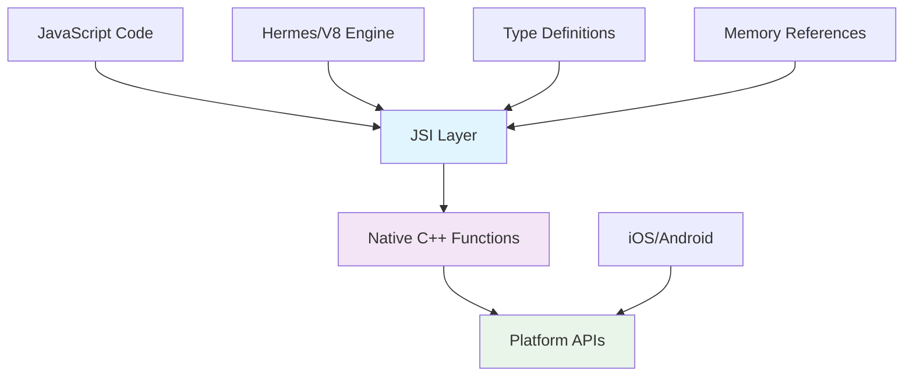

## Pengantar: Telepon Langsung Tanpa Operator

Bayangkan JavaScript Interface (JSI) sebagai **sistem telepon langsung** yang menghubungkan dua kantor penting tanpa perlu melalui operator. Sebelumnya, setiap kali JavaScript ingin berkomunikasi dengan [[Native Code]], harus melalui "operator" ([[Bridge Pattern]]) yang mencatat pesan, mengantri, dan meneruskannya nanti. Dengan JSI, ada line langsung yang memungkinkan percakapan real-time tanpa delay atau kehilangan konteks.

JavaScript Interface (JSI) adalah layer komunikasi baru dalam [[React Native]] yang memungkinkan [[JavaScript]] berinteraksi langsung dengan native modules tanpa melalui [[Serialization]] bridge. JSI memberikan akses synchronous ke native functions dan memungkinkan sharing memory references antara JavaScript dan native code.

**Mengapa JSI Revolusioner?**
- **Direct Communication**: Eliminasi [[Bridge Pattern]] overhead untuk performance maksimal
- **[[Synchronous Programming|Synchronous Calls]]**: Native functions dapat dipanggil secara synchronous
- **Memory Sharing**: [[Zero-Copy]] operations dengan shared memory references
- **Type Safety**: Compile-time type checking untuk JavaScript-native boundary
## Arsitektur JSI: Sistem Komunikasi Langsung

### Direct Binding - Koneksi Tanpa Perantara

JSI menciptakan **koneksi langsung** antara JavaScript engine dan native code, seperti hotline khusus antara dua departemen penting.



**JSI Architecture Components:**
```cpp
// JSI Native Module Implementation
#include <jsi/jsi.h>

class MathModule : public facebook::jsi::HostObject {
public:
    facebook::jsi::Value get(
        facebook::jsi::Runtime& runtime,
        const facebook::jsi::PropNameID& propName
    ) override {
        auto name = propName.utf8(runtime);
        
        if (name == "add") {
            return facebook::jsi::Function::createFromHostFunction(
                runtime,
                facebook::jsi::PropNameID::forAscii(runtime, "add"),
                2, // parameter count
                [](facebook::jsi::Runtime& rt,
                   const facebook::jsi::Value& thisVal,
                   const facebook::jsi::Value* args,
                   size_t count) -> facebook::jsi::Value {
                    
                    if (count != 2) {
                        throw facebook::jsi::JSError(rt, "add expects 2 arguments");
                    }
                    
                    double a = args[0].asNumber();
                    double b = args[1].asNumber();
                    
                    // Direct calculation - no serialization!
                    return facebook::jsi::Value(a + b);
                }
            );
        }
        
        if (name == "multiply") {
            return facebook::jsi::Function::createFromHostFunction(
                runtime,
                facebook::jsi::PropNameID::forAscii(runtime, "multiply"),
                2,
                [](facebook::jsi::Runtime& rt,
                   const facebook::jsi::Value& thisVal,
                   const facebook::jsi::Value* args,
                   size_t count) -> facebook::jsi::Value {
                    
                    double a = args[0].asNumber();
                    double b = args[1].asNumber();
                    
                    return facebook::jsi::Value(a * b);
                }
            );
        }
        
        return facebook::jsi::Value::undefined();
    }
    
    std::vector<facebook::jsi::PropNameID> getPropertyNames(
        facebook::jsi::Runtime& runtime
    ) override {
        return facebook::jsi::PropNameID::names(runtime, "add", "multiply");
    }
};

// Installation function
void installMathModule(facebook::jsi::Runtime& runtime) {
    auto mathModule = std::make_shared<MathModule>();
    runtime.global().setProperty(
        runtime,
        "MathModule",
        facebook::jsi::Object::createFromHostObject(runtime, mathModule)
    );
}
```

### Memory Management - Sistem Referensi Langsung

JSI memungkinkan **sharing memory references** langsung antara JavaScript dan native code, seperti memberikan akses langsung ke filing cabinet tanpa perlu fotokopi.

```javascript
// JavaScript side - Direct access to native objects
const nativeImageProcessor = global.ImageProcessor;

// Synchronous call - no bridge overhead
const processedImage = nativeImageProcessor.applyFilter(
    originalImage, // Direct memory reference
    'blur',
    { radius: 5 }
);

// The native code can directly access the image data
// without serialization/deserialization
```

```cpp
// Native side - Direct memory access
class ImageProcessor : public facebook::jsi::HostObject {
public:
    facebook::jsi::Value get(
        facebook::jsi::Runtime& runtime,
        const facebook::jsi::PropNameID& propName
    ) override {
        auto name = propName.utf8(runtime);
        
        if (name == "applyFilter") {
            return facebook::jsi::Function::createFromHostFunction(
                runtime,
                facebook::jsi::PropNameID::forAscii(runtime, "applyFilter"),
                3,
                [](facebook::jsi::Runtime& rt,
                   const facebook::jsi::Value& thisVal,
                   const facebook::jsi::Value* args,
                   size_t count) -> facebook::jsi::Value {
                    
                    // Direct access to image buffer - no copying!
                    auto imageBuffer = getImageBuffer(args[0]);
                    std::string filterType = args[1].asString(rt).utf8(rt);
                    auto options = args[2].asObject(rt);
                    
                    // Process image in-place
                    applyImageFilter(imageBuffer, filterType, options);
                    
                    // Return reference to processed image
                    return createImageReference(rt, imageBuffer);
                }
            );
        }
        
        return facebook::jsi::Value::undefined();
    }
};
```

## Performance Benefits: Efisiensi Komunikasi Maksimal

### Synchronous Operations - Panggilan Instan

JSI memungkinkan **panggilan synchronous** ke native functions, seperti intercom langsung tanpa delay.

```javascript
// Before JSI (Bridge) - Asynchronous only
const oldWay = async () => {
    try {
        const result = await NativeModules.Calculator.add(5, 3);
        console.log('Result:', result); // Comes later via callback
    } catch (error) {
        console.error('Error:', error);
    }
};

// With JSI - Synchronous possible
const newWay = () => {
    try {
        // Direct synchronous call - no await needed!
        const result = global.Calculator.add(5, 3);
        console.log('Result:', result); // Immediate result
    } catch (error) {
        console.error('Error:', error);
    }
};

// Performance comparison
console.time('Bridge Call');
await NativeModules.Calculator.add(5, 3);
console.timeEnd('Bridge Call'); // ~2-5ms

console.time('JSI Call');
global.Calculator.add(5, 3);
console.timeEnd('JSI Call'); // ~0.1ms
```

### Zero-Copy Operations - Efisiensi Memory

```cpp
// Zero-copy array processing
class ArrayProcessor : public facebook::jsi::HostObject {
public:
    facebook::jsi::Value get(
        facebook::jsi::Runtime& runtime,
        const facebook::jsi::PropNameID& propName
    ) override {
        auto name = propName.utf8(runtime);
        
        if (name == "processLargeArray") {
            return facebook::jsi::Function::createFromHostFunction(
                runtime,
                facebook::jsi::PropNameID::forAscii(runtime, "processLargeArray"),
                1,
                [](facebook::jsi::Runtime& rt,
                   const facebook::jsi::Value& thisVal,
                   const facebook::jsi::Value* args,
                   size_t count) -> facebook::jsi::Value {
                    
                    auto jsArray = args[0].asObject(rt).asArray(rt);
                    size_t length = jsArray.length(rt);
                    
                    // Direct access to array buffer - no copying!
                    auto arrayBuffer = jsArray.getArrayBuffer(rt);
                    auto* data = arrayBuffer.data(rt);
                    
                    // Process data in-place
                    processArrayInPlace(static_cast<double*>(data), length);
                    
                    // Return modified array (same memory)
                    return facebook::jsi::Value(rt, jsArray);
                }
            );
        }
        
        return facebook::jsi::Value::undefined();
    }
    
private:
    void processArrayInPlace(double* data, size_t length) {
        // SIMD optimized processing
        for (size_t i = 0; i < length; i += 4) {
            // Process 4 elements at once
            __m256d values = _mm256_load_pd(&data[i]);
            __m256d processed = _mm256_mul_pd(values, _mm256_set1_pd(2.0));
            _mm256_store_pd(&data[i], processed);
        }
    }
};
```

## Advanced JSI Patterns: Teknik Canggih

### Host Objects - Native Objects dalam JavaScript

```cpp
// Complex native object exposed to JavaScript
class DatabaseConnection : public facebook::jsi::HostObject {
private:
    std::unique_ptr<SQLiteDatabase> db;
    
public:
    DatabaseConnection(const std::string& dbPath) {
        db = std::make_unique<SQLiteDatabase>(dbPath);
    }
    
    facebook::jsi::Value get(
        facebook::jsi::Runtime& runtime,
        const facebook::jsi::PropNameID& propName
    ) override {
        auto name = propName.utf8(runtime);
        
        if (name == "query") {
            return facebook::jsi::Function::createFromHostFunction(
                runtime,
                facebook::jsi::PropNameID::forAscii(runtime, "query"),
                1,
                [this](facebook::jsi::Runtime& rt,
                       const facebook::jsi::Value& thisVal,
                       const facebook::jsi::Value* args,
                       size_t count) -> facebook::jsi::Value {
                    
                    std::string sql = args[0].asString(rt).utf8(rt);
                    
                    // Execute query synchronously
                    auto results = db->execute(sql);
                    
                    // Convert results to JavaScript array
                    auto jsArray = facebook::jsi::Array(rt, results.size());
                    for (size_t i = 0; i < results.size(); i++) {
                        auto row = facebook::jsi::Object(rt);
                        for (const auto& [key, value] : results[i]) {
                            row.setProperty(rt, key.c_str(), 
                                          facebook::jsi::String::createFromUtf8(rt, value));
                        }
                        jsArray.setValueAtIndex(rt, i, row);
                    }
                    
                    return jsArray;
                }
            );
        }
        
        if (name == "close") {
            return facebook::jsi::Function::createFromHostFunction(
                runtime,
                facebook::jsi::PropNameID::forAscii(runtime, "close"),
                0,
                [this](facebook::jsi::Runtime& rt,
                       const facebook::jsi::Value& thisVal,
                       const facebook::jsi::Value* args,
                       size_t count) -> facebook::jsi::Value {
                    
                    db->close();
                    return facebook::jsi::Value::undefined();
                }
            );
        }
        
        return facebook::jsi::Value::undefined();
    }
};

// Usage in JavaScript
const db = new global.DatabaseConnection('/path/to/database.db');
const users = db.query('SELECT * FROM users WHERE active = 1');
console.log('Active users:', users);
db.close();
```

### Error Handling - Penanganan Error Langsung

```cpp
// Proper error handling in JSI
facebook::jsi::Function::createFromHostFunction(
    runtime,
    facebook::jsi::PropNameID::forAscii(runtime, "riskyOperation"),
    1,
    [](facebook::jsi::Runtime& rt,
       const facebook::jsi::Value& thisVal,
       const facebook::jsi::Value* args,
       size_t count) -> facebook::jsi::Value {
        
        try {
            auto input = args[0].asString(rt).utf8(rt);
            
            if (input.empty()) {
                throw facebook::jsi::JSError(rt, "Input cannot be empty");
            }
            
            auto result = performRiskyOperation(input);
            return facebook::jsi::String::createFromUtf8(rt, result);
            
        } catch (const std::exception& e) {
            throw facebook::jsi::JSError(rt, e.what());
        }
    }
);
```

## Trade-offs dan Best Practices: Optimasi Komunikasi

### Performance Comparison

| Aspect | Bridge | JSI |
|--------|--------|-----|
| **Call Overhead** | 2-5ms | 0.1ms |
| **Memory Usage** | High (serialization) | Low (direct refs) |
| **Type Safety** | Runtime | Compile-time |
| **Debugging** | Complex | Direct stack traces |
| **Learning Curve** | Medium | Steep |

### JSI Best Practices

```cpp
// 1. Efficient memory management
class OptimizedJSIModule : public facebook::jsi::HostObject {
private:
    // Use smart pointers for automatic cleanup
    std::shared_ptr<ResourceManager> resourceManager;
    
    // Cache frequently used property names
    mutable std::unordered_map<std::string, facebook::jsi::PropNameID> cachedProps;
    
public:
    facebook::jsi::PropNameID getCachedPropName(
        facebook::jsi::Runtime& runtime,
        const std::string& name
    ) const {
        auto it = cachedProps.find(name);
        if (it != cachedProps.end()) {
            return it->second;
        }
        
        auto propName = facebook::jsi::PropNameID::forAscii(runtime, name);
        cachedProps[name] = propName;
        return propName;
    }
};

// 2. Batch operations untuk efficiency
facebook::jsi::Function::createFromHostFunction(
    runtime,
    facebook::jsi::PropNameID::forAscii(runtime, "batchProcess"),
    1,
    [](facebook::jsi::Runtime& rt,
       const facebook::jsi::Value& thisVal,
       const facebook::jsi::Value* args,
       size_t count) -> facebook::jsi::Value {
        
        auto operations = args[0].asObject(rt).asArray(rt);
        size_t length = operations.length(rt);
        
        std::vector<ProcessResult> results;
        results.reserve(length);
        
        // Process all operations in one native call
        for (size_t i = 0; i < length; i++) {
            auto op = operations.getValueAtIndex(rt, i);
            results.push_back(processOperation(op));
        }
        
        // Return all results at once
        return createResultArray(rt, results);
    }
);

// 3. Proper lifecycle management
class JSIModuleManager {
private:
    std::vector<std::shared_ptr<facebook::jsi::HostObject>> modules;
    
public:
    void installModule(
        facebook::jsi::Runtime& runtime,
        const std::string& name,
        std::shared_ptr<facebook::jsi::HostObject> module
    ) {
        modules.push_back(module);
        runtime.global().setProperty(
            runtime,
            name.c_str(),
            facebook::jsi::Object::createFromHostObject(runtime, module)
        );
    }
    
    void cleanup() {
        modules.clear(); // Automatic cleanup
    }
};
```

## Studi Kasus: JSI dalam Production

**Shopify Mobile**: JSI untuk real-time inventory calculations - 10x faster than bridge
**Discord**: Voice processing dengan JSI - 50% reduction in audio [[Latency]]
**Coinbase**: Cryptocurrency calculations dengan JSI - secure and fast math operations
**Microsoft Office**: Document processing dengan JSI - seamless native integration

**Lessons Learned:**
- JSI investment pays off untuk performance-critical operations
- Type safety crucial untuk preventing runtime errors
- Memory management requires careful attention dalam C++ code
- Debugging tools essential untuk complex JSI implementations

## Refleksi: Masa Depan Komunikasi JavaScript-Native

JavaScript Interface telah merevolusi cara [[React Native]] berkomunikasi dengan native platforms, dari "postal service" menjadi "direct hotline". Seperti evolusi komunikasi dari surat pos ke video call, JSI memungkinkan real-time, low-latency interaction antara JavaScript dan native code.

Masa depan JSI terletak pada **intelligent optimization** - automatic batching, predictive caching, dan AI-powered performance tuning. Dengan [[Machine Learning]] dan advanced static analysis, JSI akan semakin pintar dalam mengoptimalkan communication patterns dan resource usage.

Investasi dalam memahami JSI adalah investasi dalam future of cross-platform development - seperti memiliki sistem komunikasi yang perfect, JSI memungkinkan developers untuk membangun applications yang truly native dalam performance sambil mempertahankan flexibility dan [[Developer Velocity]] dari JavaScript ecosystem.

---

*Catatan ini menggambarkan JavaScript Interface sebagai sistem telepon langsung yang menghubungkan JavaScript dan native code tanpa perantara, dengan analogi komunikasi yang memudahkan pemahaman tentang direct binding, performance benefits, dan advanced patterns dalam React Native New Architecture.*