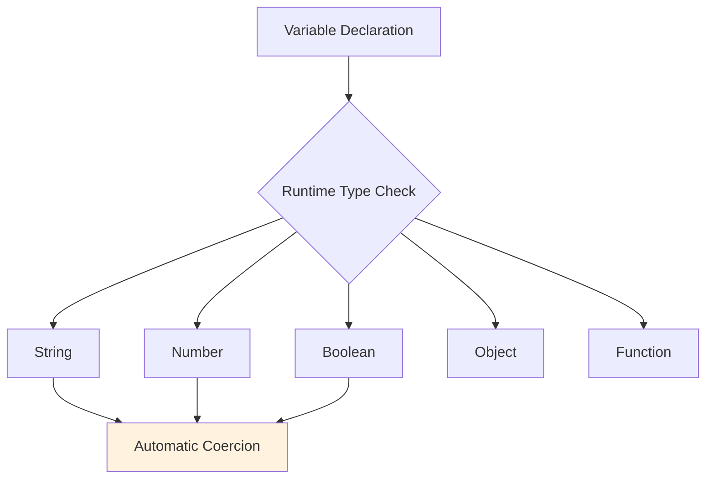
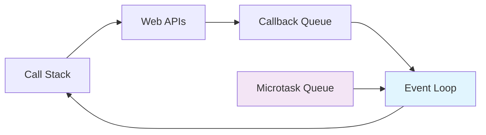

## Pengantar: Lingua Franca Dunia Digital

Bayangkan JavaScript sebagai **bahasa Inggris di dunia programming** - bahasa universal yang dipahami di mana-mana, dari browser web hingga server backend, dari aplikasi mobile hingga desktop, bahkan sampai ke IoT devices. Seperti bahasa Inggris yang menjadi lingua franca perdagangan internasional, JavaScript telah menjadi bahasa pemrograman yang paling versatile dan widely-adopted di dunia.

JavaScript adalah bahasa pemrograman dinamis yang awalnya diciptakan untuk membuat halaman web interaktif, namun kini telah berkembang menjadi bahasa yang dapat berjalan di hampir semua platform. Dengan filosofi "Write Once, Run Everywhere", JavaScript memungkinkan developer menggunakan satu bahasa untuk berbagai keperluan development.

**Mengapa JavaScript Begitu Penting?**
- **Ubiquity**: Berjalan di browser, server ([[Node.js]]), mobile ([[React Native]]), desktop ([[Electron]])
- **Low Barrier to Entry**: Syntax yang mudah dipelajari dan tidak memerlukan compilation
- **Rich Ecosystem**: [[NPM]] dengan jutaan package dan library
- **Modern Features**: [[Asynchronous Programming]], [[Threading]] dengan Web Workers, dan [[Performance Optimization]]
- **Community Support**: Komunitas terbesar di dunia programming dengan dokumentasi lengkap

## Karakteristik Inti: DNA Bahasa Universal

### Dynamic Typing - Fleksibilitas Tanpa Batas

JavaScript menggunakan dynamic typing, seperti percakapan casual yang tidak perlu deklarasi formal di awal.



**Keunggulan Dynamic Typing:**
- **Rapid Prototyping**: Tidak perlu deklarasi type yang rigid
- **Flexibility**: Variable bisa berubah type sesuai kebutuhan
- **Expressiveness**: Code lebih concise dan readable

**Trade-offs:**
- **Runtime Errors**: Type errors baru ketahuan saat runtime
- **Performance**: Type checking overhead di runtime
- **Maintainability**: Sulit track type di large codebase

### Prototype-Based Inheritance - Warisan Fleksibel

Berbeda dengan class-based inheritance, JavaScript menggunakan prototype chain seperti sistem mentorship di dunia nyata.

```javascript
// Prototype Chain Example
function Developer(name) {
  this.name = name;
}

Developer.prototype.code = function() {
  return `${this.name} is coding...`;
};

function JavaScriptDeveloper(name, framework) {
  Developer.call(this, name);
  this.framework = framework;
}

// Inheritance through prototype
JavaScriptDeveloper.prototype = Object.create(Developer.prototype);
JavaScriptDeveloper.prototype.constructor = JavaScriptDeveloper;

JavaScriptDeveloper.prototype.buildApp = function() {
  return `Building app with ${this.framework}`;
};
```

### Event-Driven Programming - Orkestra Asynchronous

JavaScript menggunakan Event Loop untuk menangani operasi asynchronous, seperti konduktor orkestra yang mengatur timing berbagai instrumen.



## Ekosistem Modern: Kota Metropolitan Programming

### Runtime Environments - Distrik Berbeda, Bahasa Sama

| Environment | Use Case | Analogi |
|-------------|----------|---------|
| **Browser** | Frontend web apps | Pusat perbelanjaan (UI/UX) |
| **[[Node.js]]** | Backend servers | Distrik bisnis (logic/data) |
| **[[React Native]]** | Mobile apps | Kawasan residential (native feel) |
| **[[Electron]]** | Desktop apps | Mixed-use development |

### Package Management - Sistem Logistik Global

[[NPM]] (Node Package Manager) adalah seperti **sistem logistik Amazon** untuk JavaScript - jutaan package siap dikirim ke project manapun dalam hitungan detik.

```javascript
// Package.json - Manifest Kebutuhan Project
{
  "name": "my-awesome-app",
  "dependencies": {
    "react": "^18.0.0",
    "lodash": "^4.17.21",
    "axios": "^1.0.0"
  },
  "devDependencies": {
    "webpack": "^5.0.0",
    "babel": "^7.0.0",
    "jest": "^29.0.0"
  }
}
```

### Modern JavaScript Features - Evolusi Berkelanjutan

JavaScript terus berevolusi melalui ECMAScript specifications, seperti bahasa hidup yang terus berkembang mengikuti zaman.

```javascript
// ES6+ Modern Features
const developers = ['Alice', 'Bob', 'Charlie'];

// Destructuring & Spread
const [lead, ...team] = developers;
const newTeam = [...team, 'Diana'];

// Arrow Functions & Template Literals
const greet = (name) => `Hello, ${name}!`;

// Async/Await
async function fetchUserData(id) {
  try {
    const response = await fetch(`/api/users/${id}`);
    const user = await response.json();
    return user;
  } catch (error) {
    console.error('Failed to fetch user:', error);
  }
}

// Modules
export { greet, fetchUserData };
```

## Implementasi Praktis: Dari Konsep ke Kode

### Type Safety dengan TypeScript

Untuk mengatasi keterbatasan dynamic typing, TypeScript hadir sebagai "sistem keamanan berlapis" untuk JavaScript.

```typescript
// TypeScript - JavaScript with Type Safety
interface Developer {
  name: string;
  skills: string[];
  experience: number;
}

function hireDeveloper(dev: Developer): boolean {
  return dev.experience >= 2 && dev.skills.includes('JavaScript');
}

// Compile-time error prevention
const candidate = {
  name: "John Doe",
  skills: ["JavaScript", "React"],
  experience: 3
};

const hired = hireDeveloper(candidate); // ✅ Type safe
```

### Performance Optimization Techniques

**Memory Management:**
```javascript
// Efficient Memory Usage
const cache = new Map();

function memoize(fn) {
  return function(...args) {
    const key = JSON.stringify(args);
    if (cache.has(key)) {
      return cache.get(key);
    }
    const result = fn.apply(this, args);
    cache.set(key, result);
    return result;
  };
}

// Event Listener Cleanup
function setupEventListener() {
  const handler = (event) => console.log(event);
  
  document.addEventListener('click', handler);
  
  // Cleanup to prevent memory leaks
  return () => document.removeEventListener('click', handler);
}
```

### Modern Development Workflow

```javascript
// Modern JavaScript Development Stack
// 1. Build Tools
import { defineConfig } from 'vite';

export default defineConfig({
  build: {
    target: 'es2020',
    minify: 'terser'
  }
});

// 2. Testing
import { describe, it, expect } from 'vitest';

describe('Calculator', () => {
  it('should add numbers correctly', () => {
    expect(add(2, 3)).toBe(5);
  });
});

// 3. Linting & Formatting
// .eslintrc.js
module.exports = {
  extends: ['eslint:recommended'],
  rules: {
    'no-unused-vars': 'error',
    'prefer-const': 'warn'
  }
};
```

## Trade-offs dan Best Practices: Navigasi Kompleksitas

### Perbandingan dengan Bahasa Lain

| Aspek | JavaScript | Python | Java | Go |
|-------|------------|------------|----------|--------|
| **Learning Curve** | Easy | Easy | Medium | Medium |
| **Performance** | Good (V8) | Slow | Fast | Very Fast |
| **Ecosystem** | Huge | Large | Large | Growing |
| **Type Safety** | Optional (TS) | Optional | Strong | Strong |
| **Concurrency** | Event Loop | Threading | Threading | Goroutines |

### Kapan Menggunakan JavaScript?

**Ideal untuk:**
- **Full-Stack Development**: Satu bahasa untuk frontend dan backend
- **Rapid Prototyping**: Quick iteration dan fast feedback loop
- **Cross-Platform Apps**: Web, mobile, desktop dengan satu codebase
- **Real-time Applications**: WebSocket, chat apps, collaborative tools

**Pertimbangkan Alternatif jika:**
- **CPU-Intensive Tasks**: Computational heavy workloads
- **System Programming**: Low-level system access
- **Large Enterprise Systems**: Membutuhkan strong typing dan structure
- **Performance Critical**: Latency-sensitive applications

### Best Practices Modern

```javascript
// 1. Use Modern Syntax
const users = await Promise.all(
  userIds.map(id => fetchUser(id))
);

// 2. Error Handling
try {
  const result = await riskyOperation();
  return { success: true, data: result };
} catch (error) {
  logger.error('Operation failed:', error);
  return { success: false, error: error.message };
}

// 3. Functional Programming
const processUsers = (users) =>
  users
    .filter(user => user.active)
    .map(user => ({ ...user, displayName: `${user.firstName} ${user.lastName}` }))
    .sort((a, b) => a.displayName.localeCompare(b.displayName));

// 4. Module Organization
export const userService = {
  async getUser(id) { /* ... */ },
  async createUser(data) { /* ... */ },
  async updateUser(id, data) { /* ... */ }
};
```

## Studi Kasus: Dominasi Multi-Platform

**Netflix**: Menggunakan JavaScript untuk streaming interface yang responsive
**WhatsApp Web**: Real-time messaging dengan WebSocket dan modern JS
**Discord**: Desktop app dengan [[Electron]], mobile dengan [[React Native]]
**Airbnb**: Full-stack JavaScript dengan [[React]] dan [[Node.js]]

**Lessons Learned:**
- JavaScript ecosystem memungkinkan rapid scaling dari startup ke enterprise
- Type safety dengan TypeScript crucial untuk large codebases
- Performance optimization perlu attention khusus di production scale

## Refleksi: Masa Depan Bahasa Universal

JavaScript telah berevolusi dari "bahasa mainan" di browser menjadi bahasa pemrograman paling influential di dunia. Seperti bahasa Inggris yang terus berkembang dengan vocabulary baru, JavaScript terus berinovasi dengan fitur-fitur modern sambil mempertahankan backward compatibility.

Masa depan JavaScript terletak pada **universality** dan **performance**. Dengan WebAssembly untuk performance-critical tasks, Deno untuk secure runtime, dan TypeScript untuk type safety, JavaScript ecosystem terus berkembang menjadi platform yang semakin mature dan powerful.

Investasi dalam menguasai JavaScript adalah investasi jangka panjang - seperti belajar bahasa Inggris yang membuka pintu ke seluruh dunia, menguasai JavaScript membuka akses ke hampir semua domain programming modern.

---

*Catatan ini menggambarkan JavaScript sebagai bahasa universal yang menghubungkan berbagai platform dan paradigma programming, dengan analogi bahasa internasional yang memudahkan pemahaman konsep teknis.*