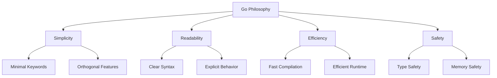
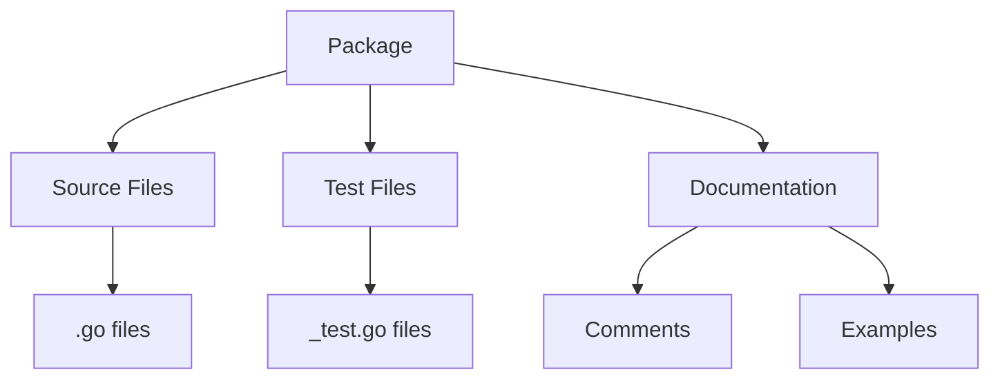

## Pengantar: Dokumen Fundamental

Language Specification Go adalah **konstitusi digital** yang mendefinisikan aturan dan prinsip fundamental bahasa. Seperti konstitusi negara yang menjadi rujukan untuk semua hukum, language spec menjadi rujukan authoritative untuk semua implementasi dan tools Go.

## Filosofi Design: Prinsip Kesederhanaan

### Simplicity Over Complexity
- **"Less is more"** - minimal feature set yang powerful
- Orthogonal design - features tidak saling bertumpang tindih
- Explicit over implicit - clarity dalam code behavior
- Composition over inheritance - building blocks yang fleksibel



## Type System: Fondasi Keamanan

### Static Typing dengan Inference
- **Compile-time type checking** untuk early error detection
- Type inference mengurangi verbosity tanpa mengorbankan safety
- Interface-based polymorphism yang elegant
- No implicit type conversions - explicit casting required

### Built-in Types: Toolkit Fundamental

| Category | Types | Purpose |
|----------|-------|---------|
| Numeric | int, float64, complex128 | Mathematical operations |
| Text | string, rune | Text processing |
| Boolean | bool | Logic operations |
| Composite | array, slice, map, struct | Data organization |
| Reference | pointer, channel, interface | Indirection & communication |

## Memory Model: Panduan Keamanan Concurrent

### Happens-Before Relationship
- **Formal definition** untuk memory operation ordering
- Guarantees untuk concurrent program behavior
- Foundation untuk safe concurrent programming
- Integration dengan [[Goroutine Scheduler]] dan [[Memory Management]]

### Synchronization Primitives
```go
// Channel communication
ch := make(chan int)
go func() { ch <- 42 }()
value := <-ch  // Happens-before guarantee

// Mutex synchronization  
var mu sync.Mutex
mu.Lock()
// Critical section
mu.Unlock()
```

## Concurrency Model: CSP Implementation

### Goroutines - Lightweight Threads
- **Communicating Sequential Processes (CSP)** model
- M:N threading dengan efficient scheduling
- Stack growth yang dynamic
- Integration dengan [[Go Runtime]] system

### Channels - Communication Mechanism
- **"Don't communicate by sharing memory; share memory by communicating"**
- Type-safe message passing
- Synchronous dan asynchronous communication
- Select statement untuk multiplexing

## Interface System: Contract Definition

### Implicit Interface Satisfaction
- **Duck typing** dengan compile-time verification
- No explicit "implements" declaration needed
- Composition-friendly design
- Empty interface{} untuk generic programming

### Interface Embedding
```go
type Reader interface {
    Read([]byte) (int, error)
}

type Writer interface {
    Write([]byte) (int, error)
}

type ReadWriter interface {
    Reader  // Embedded interface
    Writer  // Embedded interface
}
```

## Error Handling: Explicit Philosophy

### Error as Values
- **No exceptions** - errors are return values
- Explicit error checking encourages proper handling
- Error interface untuk consistent behavior
- Error wrapping untuk context preservation

### Panic/Recover Mechanism
- **Panic** untuk unrecoverable errors
- Recover untuk graceful error handling
- Limited scope - not for normal control flow
- Integration dengan [[Go Runtime]] untuk stack unwinding

## Package System: Modular Organization

### Import dan Export Rules
- **Capitalization-based visibility** (public/private)
- Import path resolution melalui [[Module System]]
- Circular import prevention
- Package initialization order guarantees

### Package Structure


## Compilation Model: Build Process

### Compilation Units
- **Package-level compilation** untuk modularity
- Separate compilation dengan export data
- Link-time optimization opportunities
- Integration dengan [[Go Compiler]] pipeline

### Build Constraints
- **Conditional compilation** dengan build tags
- Platform-specific code organization
- Feature flags untuk optional functionality
- Integration dengan [[Build System]]

## Generics: Type Parameters (Go 1.18+)

### Type Constraints
- **Interface-based constraints** untuk type parameters
- Type inference untuk reduced verbosity
- Instantiation rules untuk generic functions/types
- Backward compatibility preservation

```go
func Map[T, U any](slice []T, fn func(T) U) []U {
    result := make([]U, len(slice))
    for i, v := range slice {
        result[i] = fn(v)
    }
    return result
}
```

## Specification Evolution

### Compatibility Promise
- **Go 1 compatibility guarantee** untuk stability
- Careful evolution dengan minimal breaking changes
- Community feedback integration
- Tooling support untuk migration

### Language Versioning
- **Module-level Go version** specification
- Feature gating berdasarkan version
- Gradual adoption untuk new features
- Toolchain compatibility matrix

---

*Catatan ini mengeksplorasi Language Specification Go sebagai foundation untuk understanding bahasa dan ecosystem development.*