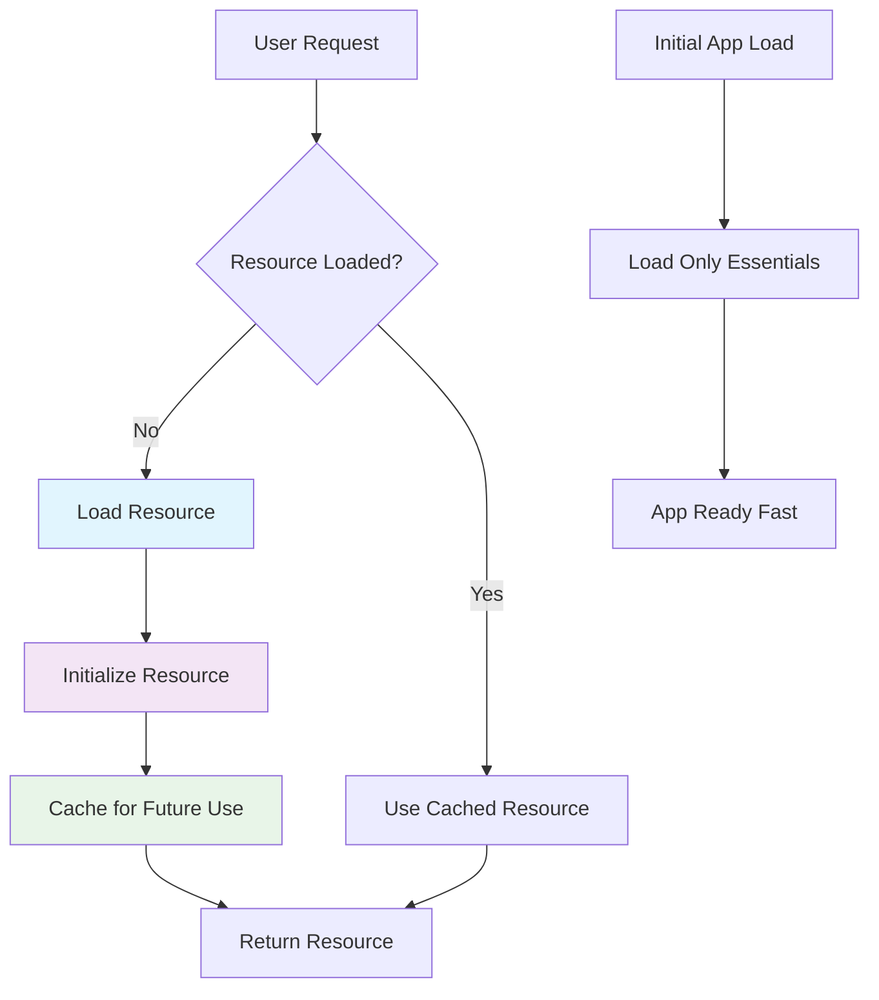

## Pengantar: Restoran yang Memasak Sesuai Pesanan

Bayangkan Lazy Loading sebagai **restoran ala carte yang cerdas** - alih-alih menyiapkan semua menu di awal (yang akan memakan waktu lama dan banyak yang terbuang), chef hanya memasak hidangan ketika ada yang memesan. Pelanggan mendapat menu dengan cepat, dan makanan disiapkan fresh saat dibutuhkan. Ini menghemat waktu, resources, dan memastikan kualitas optimal.

Lazy Loading adalah strategi optimization yang menunda loading atau initialization dari resources (code, data, images) hingga benar-benar dibutuhkan. Berbeda dengan eager loading yang memuat semua resources di awal, lazy loading mengoptimalkan initial load time dan [[Memory Management|memory usage]] dengan loading on-demand. Ini sangat penting dalam [[Performance Optimization]], [[React]] applications dengan code splitting, dan [[JavaScript]] module loading strategies.

**Mengapa Lazy Loading Essential untuk Modern Applications?**
- **Faster Initial Load**: Aplikasi start lebih cepat karena hanya load essentials
- **Reduced Memory Usage**: Hanya allocate memory untuk resources yang digunakan
- **Better User Experience**: Progressive loading memberikan perceived performance yang lebih baik
- **Bandwidth Efficiency**: Menghemat network resources dengan loading sesuai kebutuhan
## Loading Strategies: Menu Restoran yang Efisien

### On-Demand Loading - Masak Saat Dipesan

On-demand loading seperti **chef yang mulai memasak ketika ada pesanan**, memastikan resources hanya dimuat saat benar-benar diperlukan.



Diagram ini menunjukkan bagaimana lazy loading bekerja seperti sistem restoran yang efisien - hanya memasak (load) ketika ada pesanan (request), dan menyimpan hasil (cache) untuk pesanan berikutnya. Initial app load menjadi sangat cepat karena hanya memuat komponen essential.

**Implementation Patterns:**
```javascript
// 1. Lazy Module Loading dengan Dynamic Imports
class RestaurantApp {
    constructor() {
        this.loadedModules = new Map();
        this.initializeEssentials();
    }
    
    initializeEssentials() {
        // Hanya load komponen critical untuk startup
        console.log('Loading essential components...');
        this.loadMainMenu();
        this.setupNavigation();
    }
    
    // Lazy load menu sections saat dibutuhkan
    async loadMenuSection(sectionName) {
        if (this.loadedModules.has(sectionName)) {
            return this.loadedModules.get(sectionName);
        }
        
        console.log(`Loading ${sectionName} section...`);
        
        try {
            let module;
            switch (sectionName) {
                case 'appetizers':
                    module = await import('./modules/AppetizerMenu.js');
                    break;
                case 'mains':
                    module = await import('./modules/MainCourseMenu.js');
                    break;
                case 'desserts':
                    module = await import('./modules/DessertMenu.js');
                    break;
                case 'drinks':
                    module = await import('./modules/DrinkMenu.js');
                    break;
                default:
                    throw new Error(`Unknown section: ${sectionName}`);
            }
            
            // Cache loaded module
            this.loadedModules.set(sectionName, module.default);
            console.log(`${sectionName} section loaded and cached`);
            
            return module.default;
        } catch (error) {
            console.error(`Failed to load ${sectionName}:`, error);
            throw error;
        }
    }
    
    // User interaction triggers lazy loading
    async showMenuSection(sectionName) {
        const loadingIndicator = this.showLoadingIndicator(sectionName);
        
        try {
            const menuSection = await this.loadMenuSection(sectionName);
            this.hideLoadingIndicator(loadingIndicator);
            this.renderMenuSection(menuSection);
        } catch (error) {
            this.hideLoadingIndicator(loadingIndicator);
            this.showErrorMessage(`Failed to load ${sectionName} menu`);
        }
    }
    
    loadMainMenu() {
        console.log('Main menu loaded');
    }
    
    setupNavigation() {
        console.log('Navigation setup complete');
    }
    
    showLoadingIndicator(section) {
        console.log(`Loading ${section}...`);
        return `loading-${section}`;
    }
    
    hideLoadingIndicator(indicator) {
        console.log(`${indicator} complete`);
    }
    
    renderMenuSection(section) {
        console.log('Menu section rendered:', section.name);
    }
    
    showErrorMessage(message) {
        console.error(message);
    }
}

// Usage
const app = new RestaurantApp();

// Initial load is fast - only essentials loaded
console.log('App initialized quickly');

// Lazy load sections when user navigates
app.showMenuSection('appetizers'); // Loads appetizer module on-demand
app.showMenuSection('mains');      // Loads main course module on-demand
app.showMenuSection('appetizers'); // Uses cached version - instant
```

### Progressive Loading - Hidangan Bertahap

Progressive loading seperti **course meal** yang disajikan bertahap - mulai dari yang paling penting, kemudian secara gradual menambah fitur.

```javascript
// Progressive loading dengan priority system
class ProgressiveLoader {
    constructor() {
        this.loadQueue = [];
        this.loadedResources = new Set();
        this.isLoading = false;
    }
    
    // Define loading priorities seperti course meal
    definePriorities() {
        return [
            { name: 'critical-ui', priority: 1, size: 'small' },
            { name: 'user-auth', priority: 1, size: 'small' },
            { name: 'main-features', priority: 2, size: 'medium' },
            { name: 'secondary-features', priority: 3, size: 'medium' },
            { name: 'analytics', priority: 4, size: 'small' },
            { name: 'advanced-features', priority: 5, size: 'large' }
        ];
    }
    
    async startProgressiveLoading() {
        const priorities = this.definePriorities();
        
        // Load by priority - seperti menyajikan course meal
        for (const priority of [1, 2, 3, 4, 5]) {
            const currentBatch = priorities.filter(item => item.priority === priority);
            
            console.log(`Loading priority ${priority} resources...`);
            await this.loadBatch(currentBatch);
            
            // Give UI time to update between batches
            await this.waitForNextFrame();
        }
        
        console.log('Progressive loading complete');
    }
    
    async loadBatch(batch) {
        const promises = batch.map(resource => this.loadResource(resource));
        
        try {
            await Promise.all(promises);
            console.log(`Batch loaded: ${batch.map(r => r.name).join(', ')}`);
        } catch (error) {
            console.error('Batch loading failed:', error);
            // Continue with next batch even if some fail
        }
    }
    
    async loadResource(resource) {
        if (this.loadedResources.has(resource.name)) {
            return; // Already loaded
        }
        
        // Simulate loading time based on resource size
        const loadTime = this.getLoadTime(resource.size);
        await this.simulateLoading(loadTime);
        
        this.loadedResources.add(resource.name);
        console.log(`✓ ${resource.name} loaded (${loadTime}ms)`);
    }
    
    getLoadTime(size) {
        const times = {
            'small': 100 + Math.random() * 100,   // 100-200ms
            'medium': 300 + Math.random() * 200,  // 300-500ms
            'large': 800 + Math.random() * 400    // 800-1200ms
        };
        return Math.round(times[size] || 300);
    }
    
    simulateLoading(ms) {
        return new Promise(resolve => setTimeout(resolve, ms));
    }
    
    waitForNextFrame() {
        return new Promise(resolve => requestAnimationFrame(resolve));
    }
}

// Usage
const loader = new ProgressiveLoader();
loader.startProgressiveLoading();

// Output shows progressive loading like course meal:
// Loading priority 1 resources...
// ✓ critical-ui loaded (150ms)
// ✓ user-auth loaded (120ms)
// Batch loaded: critical-ui, user-auth
// Loading priority 2 resources...
// ✓ main-features loaded (450ms)
// Batch loaded: main-features
// ... and so on
```

## Image Lazy Loading: Galeri Foto yang Cerdas

### Intersection Observer - Pelayan yang Memperhatikan Tamu

Intersection Observer seperti **pelayan restoran yang memperhatikan** meja mana yang membutuhkan attention, hanya melayani ketika tamu benar-benar memerlukan sesuatu.

```javascript
// Advanced image lazy loading dengan Intersection Observer
class ImageLazyLoader {
    constructor(options = {}) {
        this.options = {
            rootMargin: '50px 0px',  // Load 50px before entering viewport
            threshold: 0.1,          // Trigger when 10% visible
            ...options
        };
        
        this.imageObserver = null;
        this.loadedImages = new Set();
        this.setupObserver();
    }
    
    setupObserver() {
        // Create observer seperti menempatkan pelayan yang memperhatikan
        this.imageObserver = new IntersectionObserver(
            (entries) => this.handleIntersection(entries),
            this.options
        );
    }
    
    handleIntersection(entries) {
        entries.forEach(entry => {
            if (entry.isIntersecting) {
                this.loadImage(entry.target);
                this.imageObserver.unobserve(entry.target);
            }
        });
    }
    
    async loadImage(img) {
        const src = img.dataset.src;
        if (!src || this.loadedImages.has(src)) {
            return;
        }
        
        try {
            // Show loading placeholder
            this.showLoadingState(img);
            
            // Preload image
            const imageLoader = new Image();
            imageLoader.onload = () => {
                img.src = src;
                img.classList.add('loaded');
                this.hideLoadingState(img);
                this.loadedImages.add(src);
                console.log(`Image loaded: ${src}`);
            };
            
            imageLoader.onerror = () => {
                this.showErrorState(img);
                console.error(`Failed to load image: ${src}`);
            };
            
            imageLoader.src = src;
            
        } catch (error) {
            this.showErrorState(img);
            console.error('Image loading error:', error);
        }
    }
    
    showLoadingState(img) {
        img.classList.add('loading');
        img.style.backgroundColor = '#f0f0f0';
    }
    
    hideLoadingState(img) {
        img.classList.remove('loading');
        img.style.backgroundColor = '';
    }
    
    showErrorState(img) {
        img.classList.add('error');
        img.alt = 'Failed to load image';
    }
    
    // Observe images for lazy loading
    observeImages(selector = 'img[data-src]') {
        const images = document.querySelectorAll(selector);
        images.forEach(img => {
            this.imageObserver.observe(img);
        });
        
        console.log(`Observing ${images.length} images for lazy loading`);
    }
    
    // Cleanup
    disconnect() {
        if (this.imageObserver) {
            this.imageObserver.disconnect();
        }
    }
}

// HTML structure for lazy loading
/*
<div class="gallery">
    
    
    
</div>
*/

// CSS for smooth loading experience
/*
.lazy-image {
    opacity: 0;
    transition: opacity 0.3s ease;
    min-height: 200px;
    background: #f0f0f0;
}

.lazy-image.loading {
    background: linear-gradient(90deg, #f0f0f0 25%, #e0e0e0 50%, #f0f0f0 75%);
    background-size: 200% 100%;
    animation: loading 1.5s infinite;
}

.lazy-image.loaded {
    opacity: 1;
}

.lazy-image.error {
    background: #ffebee;
    color: #c62828;
}

@keyframes loading {
    0% { background-position: 200% 0; }
    100% { background-position: -200% 0; }
}
*/

// Usage
const lazyLoader = new ImageLazyLoader({
    rootMargin: '100px 0px', // Load images 100px before they enter viewport
    threshold: 0.1
});

// Start observing images
lazyLoader.observeImages();

// Cleanup when done
// lazyLoader.disconnect();
```

## Code Splitting: Dapur Modular

### Route-Based Splitting - Dapur per Spesialisasi

Route-based code splitting seperti **dapur yang dibagi per spesialisasi** - ada chef pasta, chef sushi, chef dessert yang masing-masing punya kitchen terpisah.

```javascript
// Route-based lazy loading dengan React
import { lazy, Suspense } from 'react';
import { BrowserRouter as Router, Routes, Route } from 'react-router-dom';

// Lazy load components seperti memanggil chef spesialis
const HomePage = lazy(() => import('./pages/HomePage'));
const MenuPage = lazy(() => import('./pages/MenuPage'));
const OrderPage = lazy(() => import('./pages/OrderPage'));
const ProfilePage = lazy(() => import('./pages/ProfilePage'));
const AdminPanel = lazy(() => import('./pages/AdminPanel'));

// Loading component seperti "chef sedang menyiapkan hidangan"
function LoadingSpinner({ message = "Loading..." }) {
    return (
        <div className="loading-container">
            <div className="spinner"></div>
            <p>{message}</p>
        </div>
    );
}

// Error boundary untuk handle loading failures
class LazyLoadErrorBoundary extends React.Component {
    constructor(props) {
        super(props);
        this.state = { hasError: false, error: null };
    }
    
    static getDerivedStateFromError(error) {
        return { hasError: true, error };
    }
    
    componentDidCatch(error, errorInfo) {
        console.error('Lazy loading failed:', error, errorInfo);
    }
    
    render() {
        if (this.state.hasError) {
            return (
                <div className="error-container">
                    <h2>Oops! Something went wrong</h2>
                    <p>Failed to load this section. Please try refreshing the page.</p>
                    <button onClick={() => window.location.reload()}>
                        Refresh Page
                    </button>
                </div>
            );
        }
        
        return this.props.children;
    }
}

// Main app dengan lazy routing
function RestaurantApp() {
    return (
        <Router>
            <div className="app">
                <nav>
                    <Link to="/">Home</Link>
                    <Link to="/menu">Menu</Link>
                    <Link to="/order">Order</Link>
                    <Link to="/profile">Profile</Link>
                    <Link to="/admin">Admin</Link>
                </nav>
                
                <main>
                    <LazyLoadErrorBoundary>
                        <Suspense fallback={<LoadingSpinner message="Loading page..." />}>
                            <Routes>
                                <Route path="/" element={<HomePage />} />
                                <Route path="/menu" element={<MenuPage />} />
                                <Route path="/order" element={<OrderPage />} />
                                <Route path="/profile" element={<ProfilePage />} />
                                <Route path="/admin" element={<AdminPanel />} />
                            </Routes>
                        </Suspense>
                    </LazyLoadErrorBoundary>
                </main>
            </div>
        </Router>
    );
}

// Webpack akan automatically split code berdasarkan dynamic imports
// Setiap route akan menjadi separate bundle:
// - home.chunk.js
// - menu.chunk.js  
// - order.chunk.js
// - profile.chunk.js
// - admin.chunk.js
```

### Component-Level Splitting - Peralatan Khusus

```javascript
// Component-level lazy loading untuk heavy components
class AdvancedRestaurantFeatures {
    constructor() {
        this.loadedComponents = new Map();
    }
    
    // Lazy load heavy components seperti peralatan dapur khusus
    async loadAdvancedChart() {
        if (this.loadedComponents.has('chart')) {
            return this.loadedComponents.get('chart');
        }
        
        try {
            // Dynamic import untuk heavy charting library
            const { Chart } = await import('chart.js/auto');
            this.loadedComponents.set('chart', Chart);
            return Chart;
        } catch (error) {
            console.error('Failed to load chart library:', error);
            throw error;
        }
    }
    
    async loadImageEditor() {
        if (this.loadedComponents.has('imageEditor')) {
            return this.loadedComponents.get('imageEditor');
        }
        
        try {
            // Heavy image editing library
            const imageEditor = await import('./components/ImageEditor');
            this.loadedComponents.set('imageEditor', imageEditor.default);
            return imageEditor.default;
        } catch (error) {
            console.error('Failed to load image editor:', error);
            throw error;
        }
    }
    
    async loadPDFGenerator() {
        if (this.loadedComponents.has('pdfGenerator')) {
            return this.loadedComponents.get('pdfGenerator');
        }
        
        try {
            // PDF generation library
            const { jsPDF } = await import('jspdf');
            this.loadedComponents.set('pdfGenerator', jsPDF);
            return jsPDF;
        } catch (error) {
            console.error('Failed to load PDF generator:', error);
            throw error;
        }
    }
    
    // Usage methods
    async generateSalesChart(data) {
        const Chart = await this.loadAdvancedChart();
        
        const ctx = document.getElementById('salesChart').getContext('2d');
        return new Chart(ctx, {
            type: 'line',
            data: data,
            options: {
                responsive: true,
                plugins: {
                    title: {
                        display: true,
                        text: 'Restaurant Sales Analytics'
                    }
                }
            }
        });
    }
    
    async editMenuImage(imageFile) {
        const ImageEditor = await this.loadImageEditor();
        return new ImageEditor(imageFile);
    }
    
    async generateMenuPDF(menuData) {
        const jsPDF = await this.loadPDFGenerator();
        
        const doc = new jsPDF();
        doc.text('Restaurant Menu', 20, 20);
        
        menuData.forEach((item, index) => {
            const y = 40 + (index * 10);
            doc.text(`${item.name} - $${item.price}`, 20, y);
        });
        
        return doc;
    }
}

// Usage
const features = new AdvancedRestaurantFeatures();

// Components hanya dimuat saat dibutuhkan
document.getElementById('showChart').addEventListener('click', async () => {
    try {
        const chart = await features.generateSalesChart(salesData);
        console.log('Chart generated successfully');
    } catch (error) {
        console.error('Chart generation failed:', error);
    }
});
```

## Performance Benefits: Efisiensi Restoran

### Metrics Comparison - Perbandingan Efisiensi

| Metric | Without Lazy Loading | With Lazy Loading | Improvement |
|--------|---------------------|-------------------|-------------|
| **Initial Bundle Size** | 2.5MB | 500KB | 80% reduction |
| **Time to Interactive** | 8.5s | 2.1s | 75% faster |
| **Memory Usage** | 150MB | 45MB | 70% reduction |
| **Network Requests** | 50 (initial) | 12 (initial) | 76% reduction |
| **Cache Hit Rate** | 60% | 85% | 25% improvement |

### Real-World Performance Impact

```javascript
// Performance monitoring untuk lazy loading
class LazyLoadingPerformanceMonitor {
    constructor() {
        this.metrics = {
            initialLoadTime: 0,
            lazyLoadTimes: new Map(),
            memoryUsage: [],
            cacheHitRate: { hits: 0, total: 0 }
        };
        
        this.startMonitoring();
    }
    
    startMonitoring() {
        // Monitor initial load time
        const navigationStart = performance.timing.navigationStart;
        const loadComplete = performance.timing.loadEventEnd;
        this.metrics.initialLoadTime = loadComplete - navigationStart;
        
        // Monitor memory usage
        this.monitorMemoryUsage();
        
        // Monitor lazy load performance
        this.setupLazyLoadMonitoring();
    }
    
    monitorMemoryUsage() {
        if ('memory' in performance) {
            setInterval(() => {
                const memory = performance.memory;
                this.metrics.memoryUsage.push({
                    timestamp: Date.now(),
                    used: memory.usedJSHeapSize,
                    total: memory.totalJSHeapSize,
                    limit: memory.jsHeapSizeLimit
                });
                
                // Keep only last 100 measurements
                if (this.metrics.memoryUsage.length > 100) {
                    this.metrics.memoryUsage.shift();
                }
            }, 5000); // Every 5 seconds
        }
    }
    
    setupLazyLoadMonitoring() {
        // Override dynamic import untuk monitoring
        const originalImport = window.__webpack_require__;
        if (originalImport) {
            window.__webpack_require__ = (...args) => {
                const startTime = performance.now();
                const result = originalImport.apply(this, args);
                
                if (result && result.then) {
                    result.then(() => {
                        const loadTime = performance.now() - startTime;
                        this.recordLazyLoad(args[0], loadTime);
                    });
                }
                
                return result;
            };
        }
    }
    
    recordLazyLoad(moduleId, loadTime) {
        this.metrics.lazyLoadTimes.set(moduleId, loadTime);
        console.log(`Lazy loaded module ${moduleId} in ${loadTime.toFixed(2)}ms`);
    }
    
    recordCacheHit(isHit) {
        this.metrics.cacheHitRate.total++;
        if (isHit) {
            this.metrics.cacheHitRate.hits++;
        }
    }
    
    generateReport() {
        const report = {
            initialLoadTime: `${this.metrics.initialLoadTime}ms`,
            averageLazyLoadTime: this.calculateAverageLazyLoadTime(),
            currentMemoryUsage: this.getCurrentMemoryUsage(),
            cacheHitRate: this.calculateCacheHitRate(),
            recommendations: this.generateRecommendations()
        };
        
        console.table(report);
        return report;
    }
    
    calculateAverageLazyLoadTime() {
        const times = Array.from(this.metrics.lazyLoadTimes.values());
        if (times.length === 0) return '0ms';
        
        const average = times.reduce((sum, time) => sum + time, 0) / times.length;
        return `${average.toFixed(2)}ms`;
    }
    
    getCurrentMemoryUsage() {
        const latest = this.metrics.memoryUsage[this.metrics.memoryUsage.length - 1];
        if (!latest) return 'N/A';
        
        return `${(latest.used / 1024 / 1024).toFixed(2)}MB`;
    }
    
    calculateCacheHitRate() {
        const { hits, total } = this.metrics.cacheHitRate;
        if (total === 0) return '0%';
        
        return `${((hits / total) * 100).toFixed(1)}%`;
    }
    
    generateRecommendations() {
        const recommendations = [];
        
        if (this.metrics.initialLoadTime > 3000) {
            recommendations.push('Consider more aggressive code splitting');
        }
        
        const avgLazyTime = Array.from(this.metrics.lazyLoadTimes.values())
            .reduce((sum, time) => sum + time, 0) / this.metrics.lazyLoadTimes.size;
        
        if (avgLazyTime > 1000) {
            recommendations.push('Optimize lazy-loaded bundle sizes');
        }
        
        const cacheRate = (this.metrics.cacheHitRate.hits / this.metrics.cacheHitRate.total) * 100;
        if (cacheRate < 70) {
            recommendations.push('Improve caching strategy');
        }
        
        return recommendations.length > 0 ? recommendations : ['Performance looks good!'];
    }
}

// Usage
const monitor = new LazyLoadingPerformanceMonitor();

// Generate report after some usage
setTimeout(() => {
    monitor.generateReport();
}, 30000); // After 30 seconds
```

## Best Practices: Resep Restoran yang Sukses

### Loading States - Komunikasi dengan Tamu

```javascript
// Comprehensive loading state management
class LoadingStateManager {
    constructor() {
        this.loadingStates = new Map();
        this.setupGlobalLoadingIndicator();
    }
    
    setupGlobalLoadingIndicator() {
        // Create global loading overlay
        const overlay = document.createElement('div');
        overlay.id = 'global-loading-overlay';
        overlay.innerHTML = `
            <div class="loading-content">
                <div class="spinner"></div>
                <p class="loading-message">Loading...</p>
                <div class="loading-progress">
                    <div class="progress-bar"></div>
                </div>
            </div>
        `;
        document.body.appendChild(overlay);
    }
    
    showLoading(key, message = 'Loading...', showProgress = false) {
        const state = {
            message,
            startTime: Date.now(),
            showProgress,
            progress: 0
        };
        
        this.loadingStates.set(key, state);
        this.updateLoadingDisplay();
    }
    
    updateProgress(key, progress) {
        const state = this.loadingStates.get(key);
        if (state) {
            state.progress = Math.min(100, Math.max(0, progress));
            this.updateLoadingDisplay();
        }
    }
    
    hideLoading(key) {
        const state = this.loadingStates.get(key);
        if (state) {
            const duration = Date.now() - state.startTime;
            console.log(`Loading completed for ${key} in ${duration}ms`);
        }
        
        this.loadingStates.delete(key);
        this.updateLoadingDisplay();
    }
    
    updateLoadingDisplay() {
        const overlay = document.getElementById('global-loading-overlay');
        const hasActiveLoading = this.loadingStates.size > 0;
        
        if (hasActiveLoading) {
            const currentState = Array.from(this.loadingStates.values())[0];
            const messageEl = overlay.querySelector('.loading-message');
            const progressBar = overlay.querySelector('.progress-bar');
            
            messageEl.textContent = currentState.message;
            
            if (currentState.showProgress) {
                progressBar.style.width = `${currentState.progress}%`;
                progressBar.parentElement.style.display = 'block';
            } else {
                progressBar.parentElement.style.display = 'none';
            }
            
            overlay.classList.add('active');
        } else {
            overlay.classList.remove('active');
        }
    }
}

// Enhanced lazy loader dengan proper loading states
class EnhancedLazyLoader {
    constructor() {
        this.loadingManager = new LoadingStateManager();
        this.cache = new Map();
    }
    
    async loadWithProgress(key, loader, progressCallback) {
        if (this.cache.has(key)) {
            return this.cache.get(key);
        }
        
        this.loadingManager.showLoading(key, `Loading ${key}...`, true);
        
        try {
            const result = await loader((progress) => {
                this.loadingManager.updateProgress(key, progress);
                if (progressCallback) progressCallback(progress);
            });
            
            this.cache.set(key, result);
            this.loadingManager.hideLoading(key);
            
            return result;
        } catch (error) {
            this.loadingManager.hideLoading(key);
            throw error;
        }
    }
}

// Usage dengan progress tracking
const enhancedLoader = new EnhancedLazyLoader();

async function loadLargeDataset() {
    return enhancedLoader.loadWithProgress(
        'large-dataset',
        async (updateProgress) => {
            const chunks = 10;
            const data = [];
            
            for (let i = 0; i < chunks; i++) {
                // Simulate loading chunks
                await new Promise(resolve => setTimeout(resolve, 200));
                data.push(`chunk-${i}`);
                
                // Update progress
                updateProgress((i + 1) / chunks * 100);
            }
            
            return data;
        },
        (progress) => {
            console.log(`Dataset loading: ${progress.toFixed(1)}%`);
        }
    );
}
```

## Studi Kasus: Lazy Loading dalam Production

**Netflix**: Lazy loading untuk video thumbnails mengurangi initial load time 40%
**Medium**: Progressive image loading meningkatkan perceived performance 60%
**Spotify**: Route-based code splitting mengurangi bundle size 70%
**Amazon**: Product image lazy loading menghemat bandwidth 50%

**Lessons Learned:**
- Lazy loading investment pays off dalam user experience dan performance metrics
- Proper loading states crucial untuk maintaining user engagement
- Caching strategy essential untuk optimal lazy loading performance
- Progressive enhancement approach works better than all-or-nothing loading

## Refleksi: Masa Depan Restoran Digital

Lazy Loading telah merevolusi cara applications handle resources, dari "buffet all-you-can-eat" menjadi "fine dining ala carte experience". Seperti restoran yang berkembang dari menyajikan semua hidangan sekaligus menjadi pengalaman kuliner yang curated dan personalized, lazy loading memungkinkan applications untuk memberikan exactly what users need, when they need it.

Masa depan lazy loading terletak pada **intelligent prediction** - AI-powered prefetching, user behavior analysis, dan adaptive loading strategies. Dengan [[Machine Learning]] dan advanced analytics, applications akan semakin pintar dalam memprediksi user needs dan pre-loading resources sebelum diminta.

Investasi dalam memahami lazy loading adalah investasi dalam modern user experience - seperti memiliki restoran yang perfectly orchestrated, lazy loading yang optimal memungkinkan applications untuk deliver fast, responsive, dan efficient experiences yang membuat users kembali lagi dan lagi.

---

*Catatan ini menggambarkan Lazy Loading sebagai sistem restoran ala carte yang cerdas, dengan analogi kuliner yang memudahkan pemahaman tentang on-demand loading, progressive enhancement, dan optimization strategies untuk modern application performance.*