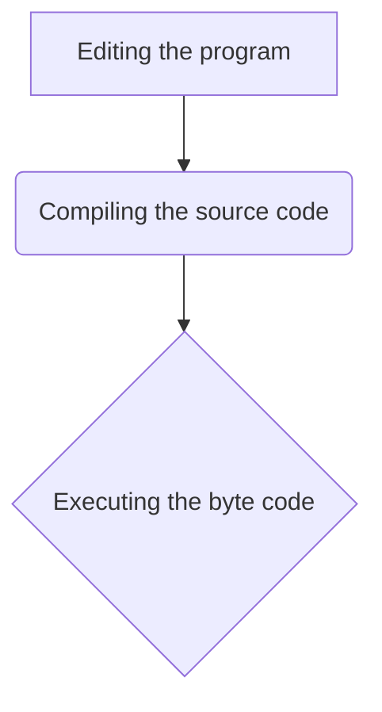

Siklus hidup [[Java|program Java]] adalah serangkaian tahapan yang dilalui oleh [[Source Code|kode sumber]] Java, mulai dari penulisan hingga eksekusi sebagai [[Machine Code|kode mesin]]. Memahami siklus ini sangat penting untuk setiap pengembang Java, karena memberikan gambaran menyeluruh tentang bagaimana aplikasi Java dibangun dan dijalankan. Secara umum, terdapat tiga tahapan utama dalam siklus hidup program Java: pengeditan program, [[Compilation|kompilasi]] kode sumber, dan eksekusi [[Bytecode|bytecode]].

## 1. Pengeditan Program

Tahap pertama dalam siklus hidup program Java adalah **pengeditan program**. Pada tahap ini, pengembang menulis [[Source Code|kode sumber]] Java menggunakan [[Text Editor|editor teks]] atau [[IDE|Integrated Development Environment (IDE)]]. Kode sumber ini berisi instruksi-instruksi yang akan dijalankan oleh program.

Setelah selesai menulis kode, file harus disimpan dengan ekstensi `.java`. Sebagai konvensi yang baik, nama file `.java` sebaiknya sama dengan nama kelas utama yang terkandung di dalamnya. Misalnya, jika program memiliki kelas utama bernama `Sample`, maka file harus disimpan sebagai `Sample.java`.

## 2. Kompilasi Kode Sumber

Tahap kedua adalah **[[Compilation|kompilasi kode sumber]]**. Pada tahap ini, kode sumber Java (`.java`) yang telah ditulis akan diubah menjadi format yang dapat dipahami oleh [[Java Virtual Machine]] ([[JVM]]). Proses ini dilakukan oleh kompiler Java, yang dikenal sebagai `[[Javac|javac]]`.

Input untuk `javac` adalah file `.java`. Output dari proses kompilasi ini adalah kode yang bersifat *machine independent* atau *[[Platform Independence|platform independent]]*, yang dikenal sebagai **[[Bytecode|bytecode]]**. Bytecode ini disimpan dalam file dengan ekstensi `.class`. Mengikuti contoh sebelumnya, `Sample.java` akan dikompilasi menjadi `Sample.class`. Keunggulan bytecode adalah kemampuannya untuk dijalankan di berbagai sistem operasi tanpa perlu kompilasi ulang, selama [[JVM]] tersedia di sistem tersebut.

## 3. Eksekusi Bytecode

Tahap terakhir adalah **eksekusi bytecode**. Pada tahap ini, file `.class` yang berisi [[Bytecode|bytecode]] akan dijalankan oleh **[[Java Virtual Machine]] (JVM)**. [[JVM]] bertindak sebagai penerjemah, mengambil bytecode sebagai input dan mengubahnya menjadi [[Machine Code|kode mesin]] (serangkaian 0 dan 1) yang spesifik untuk arsitektur [[CPU]] mesin lokal. Kode mesin inilah yang kemudian dieksekusi oleh CPU.

Proses ini memungkinkan Java mencapai prinsip "[[WORA|Write Once, Run Anywhere]]", karena bytecode yang sama dapat dieksekusi di berbagai platform yang memiliki [[JVM]] yang kompatibel.

### Referensi

*   Pericherla, S. (n.d.). *Life cycle of a Java program*. Startertutorials.com. Diambil dari [https://www.startertutorials.com/corejava/life-cycle-java-program.html](https://www.startertutorials.com/corejava/life-cycle-java-program.html)
