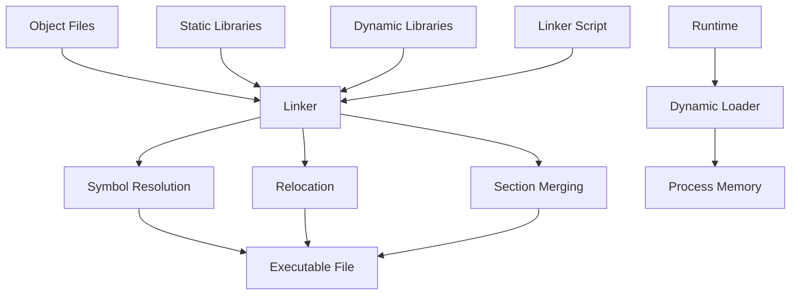
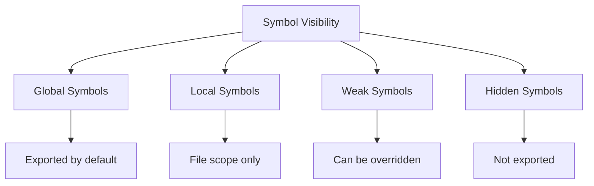
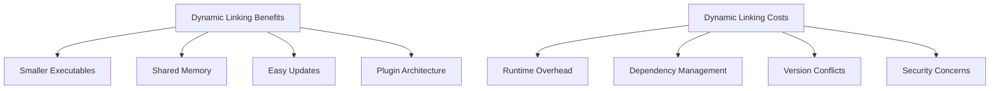
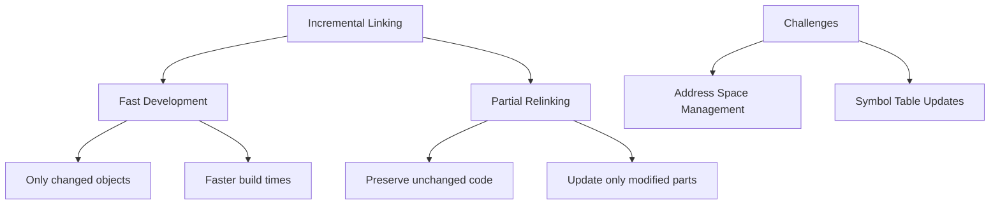
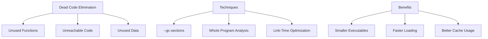
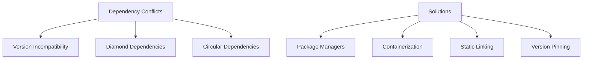

## Pengantar: Pemersatu Komponen

Linker adalah **arsitek integrasi** yang menyatukan semua komponen menjadi executable final. Seperti arsitek yang memastikan semua bagian bangunan terhubung dengan benar, linker menyelesaikan referensi antar modul dan mengoptimalkan layout memori untuk performa terbaik.

## Konsep Fundamental: From Objects to Executables

### Linking Process Overview
Linking seperti **proses konstruksi bangunan** di mana berbagai komponen prefabrikasi disatukan menjadi struktur yang utuh dan fungsional.



### Types of Linking
| Linking Type | When | Characteristics |
|--------------|------|-----------------|
| **Static Linking** | Compile-time | Self-contained executable |
| **Dynamic Linking** | Runtime | Shared libraries, smaller executables |
| **Load-Time Linking** | Program load | DLL resolution |
| **Runtime Linking** | On-demand | Plugin systems, dlopen() |

## Symbol Resolution: Menghubungkan Referensi

### Symbol Table Management
Symbol table seperti **direktori telepon raksasa** yang menghubungkan nama dengan alamat aktual dalam memori.

```c
// main.c
extern int global_var;      // External symbol
extern void function_b();   // External function

int main() {
    global_var = 42;        // Reference to external symbol
    function_b();           // Call to external function
    return 0;
}

// module.c  
int global_var;             // Symbol definition

void function_b() {         // Symbol definition
    // Implementation
}
```

### Symbol Visibility dan Scope


## Relocation: Address Fixup Process

### Types of Relocations
Relocation seperti **GPS yang memberikan directions yang tepat** setelah mengetahui lokasi final semua komponen.

```assembly
; Before relocation (object file)
call function_name    ; Placeholder address: 0x00000000

; After relocation (executable)  
call 0x401234        ; Actual address after linking
```

### Relocation Entries
| Relocation Type | Purpose | Example |
|----------------|---------|---------|
| **R_X86_64_PC32** | PC-relative 32-bit | Function calls, jumps |
| **R_X86_64_PLT32** | PLT entry reference | Dynamic function calls |
| **R_X86_64_GOT32** | GOT entry reference | Global variable access |
| **R_X86_64_64** | Absolute 64-bit address | Direct addressing |

## Static vs Dynamic Linking: Trade-offs

### Static Linking - Self-Contained Approach
```bash
# Static linking example
gcc -static main.c module.c -o program

# Results in:
# - Large executable size
# - No external dependencies  
# - Faster startup time
# - Memory duplication across processes
```

### Dynamic Linking - Shared Resources


## Executable File Formats: Container Standards

### ELF (Executable and Linkable Format)
```c
// ELF header structure
typedef struct {
    unsigned char e_ident[16];    // Magic number and other info
    Elf64_Half    e_type;         // Object file type
    Elf64_Half    e_machine;      // Architecture
    Elf64_Word    e_version;      // Object file version
    Elf64_Addr    e_entry;        // Entry point virtual address
    Elf64_Off     e_phoff;        // Program header table offset
    Elf64_Off     e_shoff;        // Section header table offset
    // ... more fields
} Elf64_Ehdr;
```

### PE (Portable Executable) - Windows
- **DOS Header**: Backward compatibility
- **PE Header**: Main executable information
- **Section Table**: Code and data sections
- **Import/Export Tables**: Dynamic linking information

### Mach-O - macOS/iOS
- **Header**: Architecture and load commands
- **Load Commands**: Segment and library information
- **Segments**: Code, data, and other sections
- **Dynamic Loader Info**: Runtime linking data

## Advanced Linking Techniques

### Link-Time Optimization (LTO)
LTO seperti **renovasi menyeluruh** yang melihat seluruh program untuk optimasi global.

```bash
# GCC LTO example
gcc -flto -O3 main.c module1.c module2.c -o optimized_program

# Benefits:
# - Cross-module inlining
# - Dead code elimination across modules
# - Better register allocation
# - Whole-program analysis
```

### Incremental Linking


## Dynamic Loading: Runtime Flexibility

### Shared Libraries (.so, .dll, .dylib)
```c
// Dynamic loading example (POSIX)
#include <dlfcn.h>

void* handle = dlopen("libmodule.so", RTLD_LAZY);
if (!handle) {
    fprintf(stderr, "Error: %s\n", dlerror());
    exit(1);
}

// Get function pointer
int (*func)(int) = dlsym(handle, "function_name");
if (!func) {
    fprintf(stderr, "Error: %s\n", dlerror());
    dlclose(handle);
    exit(1);
}

// Use the function
int result = func(42);

// Cleanup
dlclose(handle);
```

### Position Independent Code (PIC)
| Concept | Purpose | Implementation |
|---------|---------|----------------|
| **PIC** | Code can run at any address | Relative addressing |
| **PIE** | Executable with PIC | ASLR security |
| **GOT** | Global Offset Table | Indirect data access |
| **PLT** | Procedure Linkage Table | Lazy function binding |

## Linker Scripts: Memory Layout Control

### Custom Memory Layout
```ld
/* Linker script example */
MEMORY {
    ROM (rx)  : ORIGIN = 0x00000000, LENGTH = 256K
    RAM (rwx) : ORIGIN = 0x20000000, LENGTH = 64K
}

SECTIONS {
    .text : {
        *(.text)
        *(.rodata)
    } > ROM
    
    .data : {
        *(.data)
    } > RAM AT > ROM
    
    .bss : {
        *(.bss)
    } > RAM
}
```

### Section Placement Control
- **Code sections**: Executable, read-only
- **Data sections**: Initialized data, read-write
- **BSS sections**: Uninitialized data, zero-filled
- **Custom sections**: Special-purpose data

## Performance Optimization

### Symbol Interposition
```c
// Library function
int library_function(int x) {
    return x * 2;
}

// Application override (symbol interposition)
int library_function(int x) {
    printf("Intercepted call with %d\n", x);
    return x * 3;  // Modified behavior
}
```

### Dead Code Elimination


## Security Considerations

### Address Space Layout Randomization (ASLR)
- **PIE executables** untuk randomized base addresses
- **Stack randomization** untuk buffer overflow protection
- **Heap randomization** untuk heap-based attacks
- **Library randomization** untuk shared library addresses

### Control Flow Integrity (CFI)
```c
// CFI protection example
__attribute__((cfi_canonical_jump_table))
void (*function_ptr)(void) = &target_function;

// Compiler generates CFI checks
function_ptr();  // Verified against valid targets
```

## Modern Linking Challenges

### Dependency Hell


### Large-Scale Linking
| Challenge | Impact | Solution |
|-----------|--------|----------|
| **Memory Usage** | Linker OOM on large projects | Incremental linking |
| **Link Time** | Slow development cycles | Parallel linking |
| **Debug Info** | Huge debug sections | Split debug info |
| **Symbol Count** | Millions of symbols | Symbol compression |

## Cross-Platform Linking

### Universal Binaries
```bash
# macOS universal binary (x86_64 + ARM64)
lipo -create program_x86_64 program_arm64 -output program_universal

# Check architectures
lipo -info program_universal
```

### Cross-Compilation Linking
- **Target-specific libraries** untuk different architectures
- **Sysroot management** untuk cross-compilation
- **Toolchain coordination** antara compiler dan linker
- **Runtime library selection** untuk target platform

## Debugging Linker Issues

### Common Linker Errors
```bash
# Undefined symbol
undefined reference to 'missing_function'

# Multiple definitions  
multiple definition of 'global_var'

# Library not found
cannot find -lmissing_library

# Wrong architecture
file format not recognized
```

### Debugging Tools
- **nm**: Symbol table examination
- **objdump**: Object file disassembly
- **readelf**: ELF file analysis
- **ldd**: Dynamic library dependencies
- **ld --verbose**: Detailed linking information

## Future of Linking Technology

### Modern Innovations
- **LLVM LLD**: Fast, modern linker implementation
- **Gold linker**: Parallel linking untuk faster builds
- **Mold linker**: Ultra-fast linking dengan modern algorithms
- **WebAssembly linking**: Browser-based executable format

### Emerging Trends
- **Cloud-based linking** untuk distributed builds
- **AI-assisted optimization** dalam link-time decisions
- **Security-first linking** dengan built-in protections
- **Containerized linking** untuk reproducible builds

---

*Catatan ini mengeksplorasi Linker sebagai critical component dalam software build process, dari basic symbol resolution hingga advanced optimization techniques dan security considerations.*