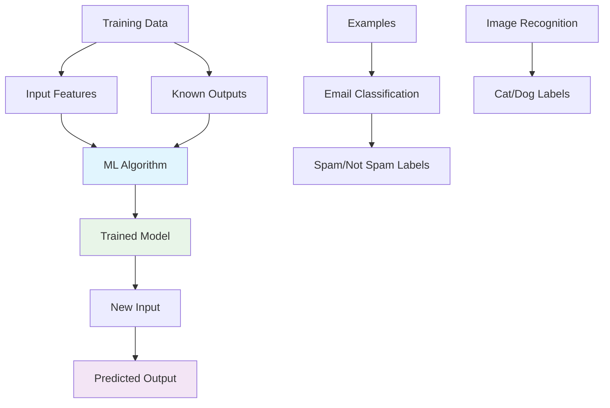
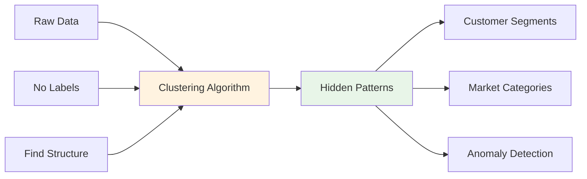

## Pengantar: Guru Digital yang Belajar dari Pengalaman

Bayangkan Machine Learning sebagai **guru digital yang cerdas** yang tidak hanya mengajar, tapi juga terus belajar dari setiap interaksi dengan murid-muridnya. Seperti guru berpengalaman yang semakin memahami cara terbaik mengajar setelah bertahun-tahun berinteraksi dengan berbagai tipe siswa, machine learning systems menggunakan data dan experience untuk membuat predictions dan decisions yang semakin akurat seiring waktu.

Machine Learning adalah subset dari artificial intelligence yang memungkinkan computers untuk belajar dan membuat decisions tanpa explicit programming untuk setiap scenario. Sistem ini menggunakan algorithms untuk menganalisis data, mengidentifikasi patterns, dan membuat predictions atau recommendations berdasarkan learning dari historical data.

**Mengapa Machine Learning Revolutionary?**
- **Adaptive Intelligence**: Systems yang dapat improve performance seiring waktu
- **Pattern Recognition**: Kemampuan menemukan insights tersembunyi dalam large datasets
- **Automation**: Mengotomatisasi complex decision-making processes
- **Predictive Power**: Forecasting future trends berdasarkan historical patterns

## Core Concepts: Metodologi Pembelajaran Digital

### Supervised Learning - Guru dengan Kunci Jawaban

Supervised learning seperti **guru yang memiliki kunci jawaban** dan mengajarkan siswa dengan memberikan contoh soal beserta jawabannya.



**Common Applications:**
- Email spam detection
- Image classification
- Medical diagnosis
- Financial fraud detection
- Recommendation systems

### Unsupervised Learning - Eksplorasi Tanpa Panduan

Unsupervised learning seperti **peneliti yang mengeksplorasi territory baru** tanpa peta, mencari patterns dan structures yang tersembunyi dalam data.



### Reinforcement Learning - Belajar Melalui Trial and Error

Reinforcement learning seperti **anak kecil yang belajar berjalan** - mencoba berbagai actions, mendapat feedback (rewards/penalties), dan gradually improve strategy.

## Applications dalam Technology Stack

### Web Development Integration

Machine Learning semakin terintegrasi dengan modern web development, terutama dalam [[React]] applications dan [[JavaScript]] ecosystems:

```javascript
// ML-powered features dalam React applications
import { useEffect, useState } from 'react';

function SmartRecommendations({ userId }) {
    const [recommendations, setRecommendations] = useState([]);
    const [isLoading, setIsLoading] = useState(true);
    
    useEffect(() => {
        // ML API call untuk personalized recommendations
        fetch(`/api/ml/recommendations/${userId}`)
            .then(response => response.json())
            .then(data => {
                setRecommendations(data.predictions);
                setIsLoading(false);
            });
    }, [userId]);
    
    return (
        <div>
            {isLoading ? (
                <div>Analyzing your preferences...</div>
            ) : (
                <div>
                    {recommendations.map(item => (
                        <RecommendationCard 
                            key={item.id} 
                            item={item}
                            confidence={item.mlScore}
                        />
                    ))}
                </div>
            )}
        </div>
    );
}

// ML-enhanced performance optimization
class MLPerformanceOptimizer {
    constructor() {
        this.userBehaviorData = [];
        this.predictionModel = null;
    }
    
    // Collect user interaction data
    trackUserBehavior(action, context) {
        this.userBehaviorData.push({
            action,
            context,
            timestamp: Date.now(),
            performance: this.getCurrentPerformanceMetrics()
        });
        
        // Trigger ML analysis when enough data collected
        if (this.userBehaviorData.length > 100) {
            this.optimizeBasedOnPredictions();
        }
    }
    
    // Use ML to predict optimal loading strategies
    async optimizeBasedOnPredictions() {
        const predictions = await this.predictUserNeeds();
        
        // Implement [[Lazy Loading]] based on predictions
        if (predictions.likelyToScroll) {
            this.preloadBelowFoldContent();
        }
        
        // Optimize [[Performance Optimization]] strategies
        if (predictions.deviceCapabilities.isLowEnd) {
            this.enableLightweightMode();
        }
    }
}
```

### Integration dengan Modern Development Tools

| Tool/Framework | ML Integration | Use Case |
|----------------|----------------|----------|
| **[[React]]** | Smart components | Adaptive UI based on user behavior |
| **[[Node.js]]** | ML APIs | Server-side inference dan training |
| **[[Performance Optimization]]** | Predictive optimization | Intelligent resource management |
| **[[Developer Experience]]** | Code assistance | AI-powered development tools |

## Advanced Patterns dan Techniques

### Edge ML - Bringing Intelligence Closer

Edge Machine Learning memungkinkan ML inference berjalan directly di user devices, mengurangi [[Latency]] dan improving privacy:

```javascript
// TensorFlow.js untuk browser-based ML
import * as tf from '@tensorflow/tfjs';

class EdgeMLProcessor {
    constructor() {
        this.model = null;
        this.isModelLoaded = false;
    }
    
    async loadModel() {
        try {
            // Load pre-trained model
            this.model = await tf.loadLayersModel('/models/user-intent-classifier.json');
            this.isModelLoaded = true;
            console.log('ML model loaded successfully');
        } catch (error) {
            console.error('Failed to load ML model:', error);
        }
    }
    
    // Real-time prediction tanpa server roundtrip
    async predictUserIntent(inputData) {
        if (!this.isModelLoaded) {
            await this.loadModel();
        }
        
        const prediction = this.model.predict(
            tf.tensor2d([inputData])
        );
        
        const result = await prediction.data();
        return {
            intent: this.mapPredictionToIntent(result),
            confidence: Math.max(...result)
        };
    }
    
    // Optimize UI berdasarkan predicted intent
    async optimizeInterface(userInput) {
        const prediction = await this.predictUserIntent(userInput);
        
        if (prediction.intent === 'search' && prediction.confidence > 0.8) {
            // Pre-load search components
            import('./SearchInterface').then(module => {
                // Dynamic import based on ML prediction
            });
        }
    }
}
```

### ML-Powered Development Workflows

Machine Learning semakin terintegrasi dalam development workflows untuk meningkatkan [[Developer Velocity]]:

```javascript
// AI-assisted code optimization
class MLCodeOptimizer {
    constructor() {
        this.performanceHistory = [];
        this.optimizationModel = null;
    }
    
    // Analyze code patterns dan suggest optimizations
    async analyzeCodePerformance(codeSnippet) {
        const features = this.extractCodeFeatures(codeSnippet);
        const prediction = await this.optimizationModel.predict(features);
        
        return {
            performanceScore: prediction.score,
            suggestions: prediction.optimizations,
            estimatedImprovement: prediction.improvement
        };
    }
    
    // Learn from deployment performance
    learnFromProduction(deploymentMetrics) {
        this.performanceHistory.push({
            codeChanges: deploymentMetrics.changes,
            performanceImpact: deploymentMetrics.performance,
            userSatisfaction: deploymentMetrics.userMetrics
        });
        
        // Retrain model dengan new data
        this.retrainOptimizationModel();
    }
}
```

## Trade-offs dan Considerations

### Performance vs Accuracy

| Aspect | High Accuracy Models | Fast Inference Models |
|--------|---------------------|----------------------|
| **Model Size** | Large (100MB+) | Small (<10MB) |
| **Inference Time** | Slow (100ms+) | Fast (<10ms) |
| **Resource Usage** | High CPU/Memory | Low resource |
| **Use Case** | Server-side analysis | Real-time UI |
| **Integration** | [[Node.js]] backends | [[JavaScript]] frontends |

### Privacy dan Data Considerations

**Data Privacy Strategies:**
- **Federated Learning**: Training models tanpa centralizing data
- **Differential Privacy**: Adding noise untuk protect individual privacy
- **On-Device Processing**: ML inference di client-side untuk data protection
- **Anonymization**: Removing personally identifiable information

## Real-World Applications

### E-commerce Personalization

```javascript
// ML-powered product recommendations
class PersonalizationEngine {
    constructor() {
        this.userProfile = {};
        this.recommendationModel = null;
    }
    
    async generateRecommendations(userId, context) {
        const userFeatures = await this.getUserFeatures(userId);
        const contextFeatures = this.getContextFeatures(context);
        
        const recommendations = await this.recommendationModel.predict({
            user: userFeatures,
            context: contextFeatures,
            inventory: await this.getAvailableProducts()
        });
        
        return recommendations.map(item => ({
            product: item,
            reason: this.explainRecommendation(item, userFeatures),
            confidence: item.mlScore
        }));
    }
    
    // A/B testing dengan ML optimization
    async optimizeRecommendationStrategy() {
        const strategies = ['collaborative', 'content-based', 'hybrid'];
        const results = await Promise.all(
            strategies.map(strategy => this.testStrategy(strategy))
        );
        
        // Use ML untuk determine optimal strategy mix
        const optimalMix = await this.optimizationModel.findBestCombination(results);
        return optimalMix;
    }
}
```

### Performance Monitoring dan Optimization

Machine Learning dapat digunakan untuk intelligent [[Performance Optimization]]:

```javascript
// ML-powered performance monitoring
class IntelligentPerformanceMonitor {
    constructor() {
        this.performanceData = [];
        this.anomalyDetectionModel = null;
        this.optimizationModel = null;
    }
    
    // Detect performance anomalies
    async detectPerformanceIssues(metrics) {
        const anomalyScore = await this.anomalyDetectionModel.predict(metrics);
        
        if (anomalyScore > 0.8) {
            return {
                isAnomaly: true,
                severity: this.calculateSeverity(anomalyScore),
                suggestedActions: await this.getSuggestedOptimizations(metrics)
            };
        }
        
        return { isAnomaly: false };
    }
    
    // Predictive scaling
    async predictResourceNeeds(timeHorizon = '1h') {
        const historicalData = this.getHistoricalMetrics();
        const prediction = await this.forecastingModel.predict({
            historical: historicalData,
            timeHorizon: timeHorizon,
            externalFactors: await this.getExternalFactors()
        });
        
        return {
            predictedLoad: prediction.load,
            recommendedScaling: prediction.scaling,
            confidence: prediction.confidence
        };
    }
}
```

## Integration dengan Development Ecosystem

### ML dalam [[React]] Applications

Modern [[React]] applications semakin mengintegrasikan ML untuk enhanced user experiences:

- **Smart Component Loading**: ML predictions untuk optimal [[Lazy Loading]]
- **Adaptive UI**: Interface yang berubah berdasarkan user behavior patterns
- **Performance Optimization**: ML-driven [[Performance Optimization]] strategies
- **Accessibility**: AI-powered accessibility improvements

### [[JavaScript]] ML Libraries

Popular ML libraries dalam [[JavaScript]] ecosystem:
- **TensorFlow.js**: Comprehensive ML framework untuk browser dan [[Node.js]]
- **Brain.js**: Neural networks dalam pure [[JavaScript]]
- **ML5.js**: Friendly ML library untuk creative coding
- **Synaptic**: Architecture-free neural network library

## Refleksi: Masa Depan Pembelajaran Digital

Machine Learning telah berevolusi dari academic curiosity menjadi essential technology yang mengubah cara applications berinteraksi dengan users. Seperti guru yang semakin bijak dengan pengalaman, ML systems terus belajar dan beradaptasi untuk memberikan experiences yang semakin personal dan intelligent.

Integration dengan modern web technologies seperti [[React]], [[JavaScript]], dan [[Performance Optimization]] tools menciptakan ecosystem yang memungkinkan developers untuk membangun applications yang truly adaptive dan user-centric. Masa depan development adalah tentang **intelligent applications** yang tidak hanya responsive secara teknis, tapi juga responsive terhadap user needs dan behaviors.

Investasi dalam memahami Machine Learning adalah investasi dalam future of software development - seperti memiliki guru digital yang perfect, ML memungkinkan applications untuk deliver experiences yang continuously improve dan adapt untuk setiap individual user.