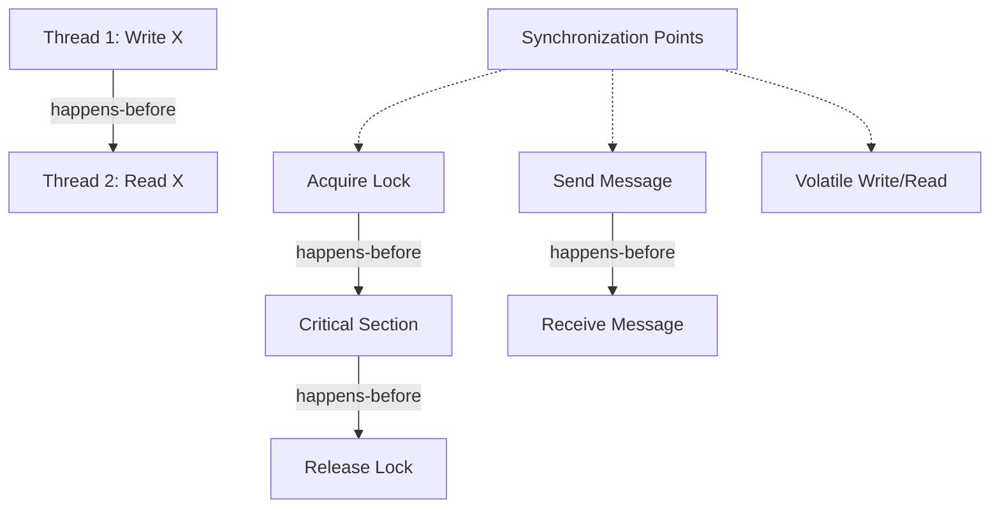
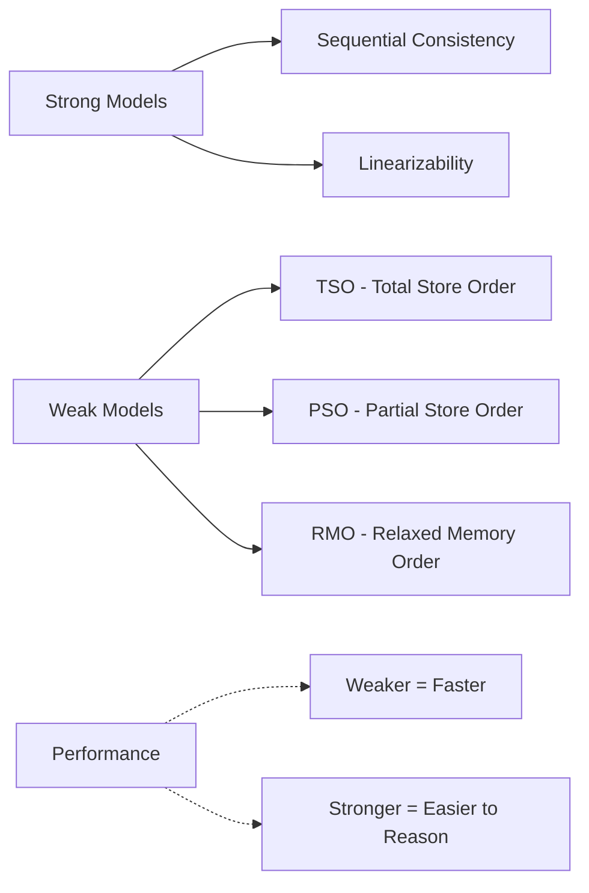
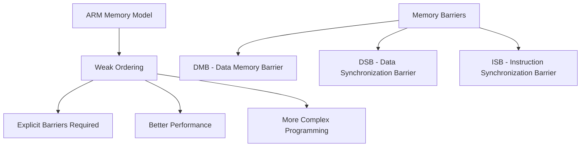
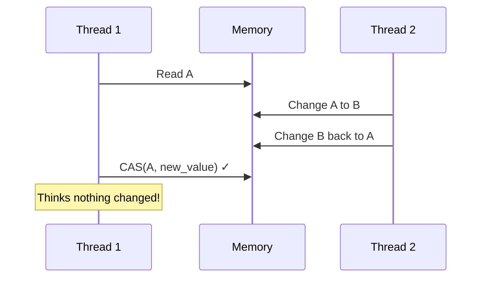
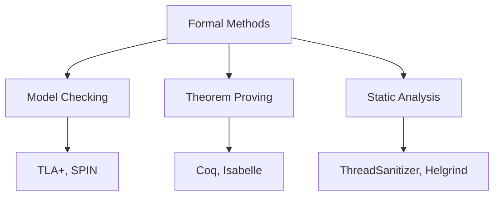

## Pengantar: Konstitusi Memori

Memory Model adalah **konstitusi digital** yang mendefinisikan aturan fundamental tentang bagaimana memory operations berinteraksi dalam lingkungan concurrent. Seperti traffic rules yang mengatur lalu lintas untuk mencegah kecelakaan, memory model mengatur akses memori untuk mencegah race conditions dan data corruption.

## Konsep Fundamental: Ordering dan Visibility

### Happens-Before Relationship
Happens-before adalah **aturan urutan waktu** yang menentukan kapan satu operasi memori "terjadi sebelum" operasi lain, memastikan visibility dan ordering yang predictable.



### Memory Ordering Guarantees
| Ordering Type | Guarantee | Use Case |
|---------------|-----------|----------|
| **Sequential Consistency** | Global total order | Easiest to reason about |
| **Release-Acquire** | Synchronization pairs | Lock-free programming |
| **Relaxed** | No ordering constraints | Performance-critical code |
| **Consume** | Data dependency ordering | Optimized reads |

## Memory Consistency Models

### Sequential Consistency - Strict Order
Sequential consistency seperti **antrian bank yang teratur** di mana semua operasi memori terlihat terjadi dalam urutan yang sama untuk semua threads.

```
Thread 1: W(x,1) → R(y) → 0
Thread 2: W(y,1) → R(x) → 0
```
Dalam sequential consistency, hasil di atas **tidak mungkin** terjadi.

### Weak Consistency Models
- **Processor Consistency**: Writes dari processor yang sama terlihat dalam order
- **Causal Consistency**: Causally related operations maintain order
- **PRAM Consistency**: Pipelined RAM model untuk performance
- **Eventual Consistency**: Distributed systems guarantee

### Relaxed Memory Models


## Synchronization Primitives

### Atomic Operations - Indivisible Actions
Atomic operations seperti **transaksi bank yang tidak bisa diinterupsi** - either completely succeed or completely fail, never partially executed.

| Operation | Purpose | Memory Ordering |
|-----------|---------|-----------------|
| **Load** | Read atomic value | Acquire semantics |
| **Store** | Write atomic value | Release semantics |
| **Compare-and-Swap** | Conditional update | Full barrier |
| **Fetch-and-Add** | Atomic increment | Specified ordering |

### Memory Barriers - Traffic Controllers
Memory barriers adalah **traffic controllers** yang mengatur urutan memory operations:

- **Load Barrier**: Prevents load reordering
- **Store Barrier**: Prevents store reordering  
- **Full Barrier**: Prevents all reordering
- **Acquire Barrier**: One-way barrier for loads
- **Release Barrier**: One-way barrier for stores

## Language-Specific Memory Models

### C++ Memory Model
```cpp
// C++ atomic operations with memory ordering
std::atomic<int> counter{0};

// Relaxed ordering - no synchronization
counter.store(42, std::memory_order_relaxed);

// Release-acquire ordering
counter.store(42, std::memory_order_release);
int value = counter.load(std::memory_order_acquire);

// Sequential consistency (default)
counter.store(42);  // memory_order_seq_cst
```

### Java Memory Model
- **Volatile variables** provide visibility guarantees
- **Synchronized blocks** create happens-before edges
- **Final fields** have special initialization semantics
- **Lock operations** provide full synchronization

### Go Memory Model
```go
// Channel communication creates happens-before
ch := make(chan int)
go func() { 
    x = 1           // happens-before channel send
    ch <- 1 
}()
<-ch                // happens-before subsequent reads
print(x)            // guaranteed to see x = 1
```

## Hardware Memory Models

### x86/x64 - Strong Model
- **Total Store Order (TSO)** dengan strong guarantees
- Stores tidak dapat pass earlier stores
- Loads dapat pass earlier stores (store buffer)
- Relatively programmer-friendly

### ARM/RISC-V - Weak Model


## Common Pitfalls dan Anti-Patterns

### Data Races - Uncontrolled Access
Data race terjadi ketika **multiple threads access shared data** tanpa proper synchronization:

```c
// Data race example
int shared_counter = 0;

// Thread 1
shared_counter++;  // Read-Modify-Write

// Thread 2  
shared_counter++;  // Race condition!
```

### ABA Problem - False Success


## Lock-Free Programming

### Compare-and-Swap Patterns
```cpp
// Lock-free stack implementation
template<typename T>
class LockFreeStack {
    std::atomic<Node*> head{nullptr};
    
public:
    void push(T item) {
        Node* new_node = new Node{item};
        new_node->next = head.load();
        
        // Retry until successful
        while (!head.compare_exchange_weak(
            new_node->next, new_node)) {
            // Loop until CAS succeeds
        }
    }
};
```

### Memory Reclamation Strategies
| Strategy | Approach | Trade-offs |
|----------|----------|------------|
| **Hazard Pointers** | Mark pointers in use | Low overhead, complex |
| **Epoch-Based** | Generational collection | Simple, some delay |
| **RCU** | Read-Copy-Update | Excellent reads, complex writes |

## Testing Concurrent Code

### Stress Testing
- **High contention scenarios** untuk exposing races
- Random scheduling dengan thread yields
- Memory pressure testing
- Platform-specific testing (different architectures)

### Formal Verification


## Performance Implications

### Cache Coherence Protocols
- **MESI Protocol**: Modified, Exclusive, Shared, Invalid
- **MOESI Protocol**: Adds Owned state
- **Cache line bouncing** dalam high contention
- **False sharing** performance degradation

### NUMA Considerations
- **Non-Uniform Memory Access** dalam modern systems
- Memory locality importance untuk performance
- Thread affinity dan memory placement
- NUMA-aware algorithms dan data structures

## Best Practices

### Design Guidelines
- **Minimize shared mutable state** whenever possible
- Use **immutable data structures** untuk safety
- **Message passing** over shared memory
- **Actor model** untuk isolation

### Debugging Techniques
- **ThreadSanitizer** untuk detecting data races
- **Valgrind/Helgrind** untuk memory error detection
- **Intel Inspector** untuk threading analysis
- **Custom logging** dengan happens-before tracking

---

*Catatan ini mengeksplorasi Memory Model sebagai fundamental concept dalam concurrent programming, covering theoretical foundations dan practical implementation considerations across different platforms.*