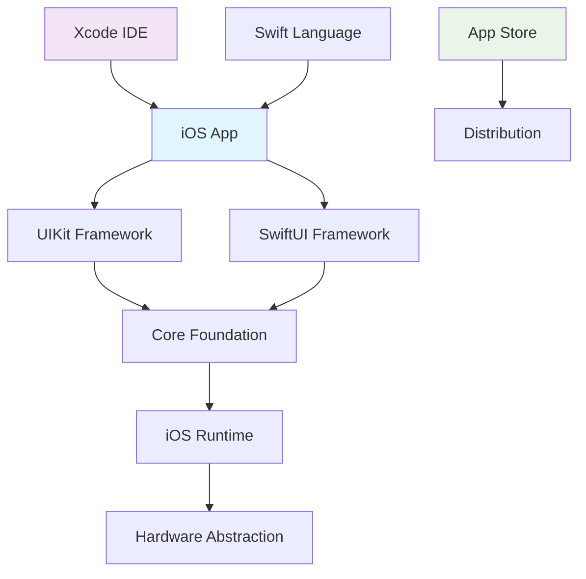
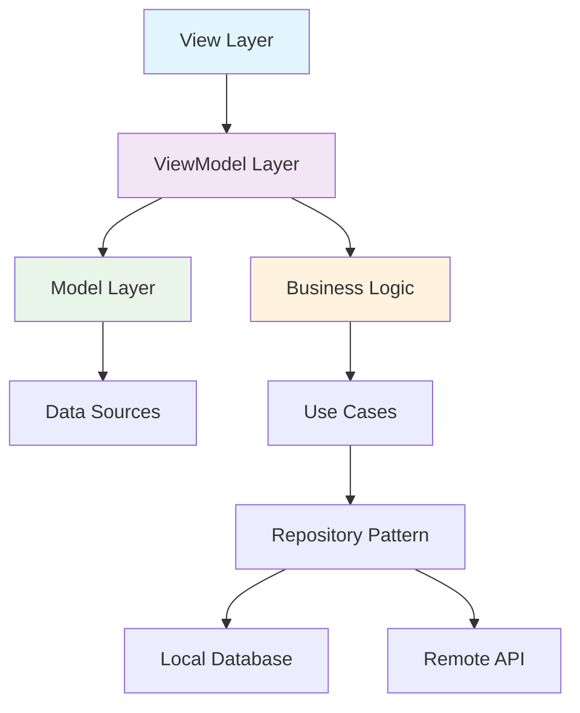

## Pengantar: Membangun Kota Digital di Saku

Bayangkan mobile development sebagai **arsitektur kota digital** yang harus dibangun di lahan terbatas namun dengan kebutuhan yang kompleks. Seperti arsitek kota yang harus mempertimbangkan infrastruktur, transportasi, utilitas, dan pengalaman warga, mobile developer harus merancang aplikasi yang efisien, responsif, dan user-friendly dalam keterbatasan resources perangkat mobile.

Mobile development adalah seni dan sains membangun aplikasi untuk perangkat mobile seperti smartphone dan tablet. Berbeda dengan desktop development yang memiliki resources melimpah, mobile development menghadapi constraint unik: layar kecil, battery life terbatas, processing power yang terbatas, dan variasi device yang sangat beragam.

**Mengapa Mobile Development Krusial?**
- **Mobile-First World**: 60%+ traffic internet berasal dari mobile devices
- **User Engagement**: Mobile apps memiliki retention rate 3x lebih tinggi dari web
- **Business Impact**: Mobile commerce tumbuh 15% per tahun
- **Accessibility**: Membawa teknologi ke miliaran pengguna di seluruh dunia

## Platform Native: Distrik Eksklusif dengan Aturan Khusus

### iOS Development - Kawasan Premium dengan Standar Tinggi

iOS development seperti membangun di **kawasan premium** dengan regulasi ketat namun infrastruktur berkualitas tinggi.



**Karakteristik iOS Development:**
- **[[Swift]] Language**: Modern, type-safe, performance-oriented
- **Xcode IDE**: Integrated development environment dengan powerful tools
- **Strict Guidelines**: [[App Store]] review process yang ketat
- **Premium Hardware**: Consistent performance across limited device variants

**iOS Development Stack:**
```swift
// SwiftUI - Modern Declarative UI
import SwiftUI

struct ContentView: View {
    @State private var counter = 0
    
    var body: some View {
        VStack {
            Text("Counter: \(counter)")
                .font(.largeTitle)
            
            Button("Increment") {
                counter += 1
            }
            .buttonStyle(.borderedProminent)
        }
        .padding()
    }
}

// Combine - Reactive Programming
import Combine

class UserViewModel: ObservableObject {
    @Published var users: [User] = []
    private var cancellables = Set<AnyCancellable>()
    
    func loadUsers() {
        APIService.fetchUsers()
            .receive(on: DispatchQueue.main)
            .sink(
                receiveCompletion: { _ in },
                receiveValue: { [weak self] users in
                    self?.users = users
                }
            )
            .store(in: &cancellables)
    }
}
```

### Android Development - Kota Terbuka dengan Diversitas Tinggi

Android development seperti membangun di **kota metropolitan** yang terbuka, beragam, namun memerlukan adaptasi terhadap berbagai kondisi infrastruktur.

**Karakteristik Android Development:**
- **[[Kotlin]]/[[Java]] Language**: Mature ecosystem dengan interoperability
- **Android Studio**: IDE berbasis IntelliJ dengan Android-specific tools
- **Open Ecosystem**: Multiple app stores dan distribution channels
- **Device Fragmentation**: Ribuan device variants dengan spec berbeda

```kotlin
// Jetpack Compose - Modern Android UI
@Composable
fun UserProfile(user: User) {
    Card(
        modifier = Modifier
            .fillMaxWidth()
            .padding(16.dp),
        elevation = CardDefaults.cardElevation(defaultElevation = 4.dp)
    ) {
        Column(
            modifier = Modifier.padding(16.dp)
        ) {
            AsyncImage(
                model = user.avatarUrl,
                contentDescription = "User Avatar",
                modifier = Modifier
                    .size(64.dp)
                    .clip(CircleShape)
            )
            
            Spacer(modifier = Modifier.height(8.dp))
            
            Text(
                text = user.name,
                style = MaterialTheme.typography.headlineSmall
            )
            
            Text(
                text = user.email,
                style = MaterialTheme.typography.bodyMedium,
                color = MaterialTheme.colorScheme.onSurfaceVariant
            )
        }
    }
}

// ViewModel with StateFlow
class UserViewModel : ViewModel() {
    private val _uiState = MutableStateFlow(UserUiState())
    val uiState: StateFlow<UserUiState> = _uiState.asStateFlow()
    
    fun loadUser(userId: String) {
        viewModelScope.launch {
            try {
                val user = userRepository.getUser(userId)
                _uiState.value = _uiState.value.copy(
                    user = user,
                    isLoading = false
                )
            } catch (e: Exception) {
                _uiState.value = _uiState.value.copy(
                    error = e.message,
                    isLoading = false
                )
            }
        }
    }
}
```

## Cross-Platform Development: Jembatan Antar Kota

### React Native - Sistem Transportasi Universal

[[React Native]] seperti **sistem transportasi cepat** yang menghubungkan berbagai distrik dengan satu infrastruktur.

**Keunggulan Cross-Platform:**
- **Code Reusability**: 70-90% code sharing antar platform
- **[[Developer Velocity]]**: Faster time-to-market
- **Consistent UX**: Unified design system
- **Cost Efficiency**: Satu tim untuk multiple platform

### Flutter - Arsitektur Modular Terpadu

[[Flutter]] seperti **sistem konstruksi modular** yang menggunakan komponen prefab berkualitas tinggi.

```dart
// Flutter Widget Tree
class UserListScreen extends StatefulWidget {
  @override
  _UserListScreenState createState() => _UserListScreenState();
}

class _UserListScreenState extends State<UserListScreen> {
  List<User> users = [];
  bool isLoading = true;
  
  @override
  void initState() {
    super.initState();
    loadUsers();
  }
  
  Future<void> loadUsers() async {
    try {
      final fetchedUsers = await ApiService.getUsers();
      setState(() {
        users = fetchedUsers;
        isLoading = false;
      });
    } catch (e) {
      setState(() {
        isLoading = false;
      });
      ScaffoldMessenger.of(context).showSnackBar(
        SnackBar(content: Text('Failed to load users: $e'))
      );
    }
  }
  
  @override
  Widget build(BuildContext context) {
    return Scaffold(
      appBar: AppBar(title: Text('Users')),
      body: isLoading
          ? Center(child: CircularProgressIndicator())
          : ListView.builder(
              itemCount: users.length,
              itemBuilder: (context, index) {
                return UserTile(user: users[index]);
              },
            ),
    );
  }
}
```

## Arsitektur Mobile: Blueprint Kota Digital

### MVVM Pattern - Sistem Pemerintahan Berlapis



**Separation of Concerns:**
- **View**: UI components dan user interactions
- **ViewModel**: Business logic dan state management
- **Model**: Data structures dan business entities
- **Repository**: Data access abstraction

### State Management - Sistem Lalu Lintas Kota

| Pattern | Use Case | Analogi |
|---------|----------|---------|
| **Local State** | Component-specific data | Rumah pribadi |
| **Shared State** | Cross-component data | Fasilitas umum |
| **Global State** | App-wide data | Infrastruktur kota |
| **Persistent State** | Stored data | Arsip kota |

```javascript
// Redux Toolkit - Global State Management
import { createSlice, createAsyncThunk } from '@reduxjs/toolkit';

export const fetchUsers = createAsyncThunk(
  'users/fetchUsers',
  async (_, { rejectWithValue }) => {
    try {
      const response = await api.getUsers();
      return response.data;
    } catch (error) {
      return rejectWithValue(error.message);
    }
  }
);

const usersSlice = createSlice({
  name: 'users',
  initialState: {
    items: [],
    status: 'idle',
    error: null
  },
  reducers: {
    addUser: (state, action) => {
      state.items.push(action.payload);
    },
    removeUser: (state, action) => {
      state.items = state.items.filter(user => user.id !== action.payload);
    }
  },
  extraReducers: (builder) => {
    builder
      .addCase(fetchUsers.pending, (state) => {
        state.status = 'loading';
      })
      .addCase(fetchUsers.fulfilled, (state, action) => {
        state.status = 'succeeded';
        state.items = action.payload;
      })
      .addCase(fetchUsers.rejected, (state, action) => {
        state.status = 'failed';
        state.error = action.payload;
      });
  }
});
```

## Performance Optimization: Efisiensi Kota Digital

### Memory Management - Sistem Utilitas Kota

**iOS Memory Management:**
```swift
// ARC (Automatic Reference Counting)
class UserViewController: UIViewController {
    private var users: [User] = []
    private weak var delegate: UserDelegate? // Weak reference to prevent retain cycles
    
    deinit {
        // Cleanup resources
        NotificationCenter.default.removeObserver(self)
    }
    
    private func loadUsers() {
        // Use weak self to prevent retain cycles
        APIService.fetchUsers { [weak self] result in
            DispatchQueue.main.async {
                self?.handleUsersResult(result)
            }
        }
    }
}
```

**Android Memory Management:**
```kotlin
// Lifecycle-aware components
class UserFragment : Fragment() {
    private var _binding: FragmentUserBinding? = null
    private val binding get() = _binding!!
    
    override fun onCreateView(inflater: LayoutInflater, container: ViewGroup?, savedInstanceState: Bundle?): View {
        _binding = FragmentUserBinding.inflate(inflater, container, false)
        return binding.root
    }
    
    override fun onDestroyView() {
        super.onDestroyView()
        _binding = null // Prevent memory leaks
    }
}
```

### Battery Optimization - Manajemen Energi Kota

```javascript
// React Native Battery Optimization
import { AppState, NetInfo } from 'react-native';

class DataSyncManager {
  constructor() {
    this.syncInterval = null;
    this.setupAppStateListener();
    this.setupNetworkListener();
  }
  
  setupAppStateListener() {
    AppState.addEventListener('change', (nextAppState) => {
      if (nextAppState === 'background') {
        this.pauseSync();
      } else if (nextAppState === 'active') {
        this.resumeSync();
      }
    });
  }
  
  setupNetworkListener() {
    NetInfo.addEventListener(state => {
      if (state.isConnected && state.type === 'wifi') {
        this.enableHighFrequencySync();
      } else {
        this.enableLowFrequencySync();
      }
    });
  }
  
  pauseSync() {
    if (this.syncInterval) {
      clearInterval(this.syncInterval);
      this.syncInterval = null;
    }
  }
  
  resumeSync() {
    this.startSync();
  }
}
```

## Trade-offs dan Best Practices: Navigasi Kompleksitas Urban

### Perbandingan Pendekatan Development

| Aspek | Native iOS | Native Android | React Native | Flutter |
|-------|------------|----------------|--------------|---------|
| **Performance** | Excellent | Excellent | Good | Very Good |
| **Development Speed** | Slow | Slow | Fast | Fast |
| **Code Reuse** | 0% | 0% | 70-90% | 95%+ |
| **Platform Features** | Full Access | Full Access | Limited | Limited |
| **Learning Curve** | Steep | Medium | Medium | Medium |
| **Team Size** | 2 teams | 2 teams | 1 team | 1 team |

### Kapan Memilih Pendekatan Tertentu?

**Native Development jika:**
- **Performance Critical**: Gaming, AR/VR, real-time applications
- **Platform-Specific Features**: Deep integration dengan OS features
- **Long-term Investment**: Large team dengan specialized expertise
- **Premium User Experience**: Pixel-perfect platform conventions

**Cross-Platform jika:**
- **Time-to-Market**: Rapid deployment ke multiple platform
- **Limited Resources**: Small team atau budget constraints
- **Business Logic Heavy**: Complex logic dengan simple UI
- **Consistent Branding**: Unified experience across platforms

### Modern Development Best Practices

```typescript
// TypeScript for Type Safety
interface User {
  id: string;
  name: string;
  email: string;
  avatar?: string;
}

interface ApiResponse<T> {
  data: T;
  status: 'success' | 'error';
  message?: string;
}

// Generic API service
class ApiService {
  static async get<T>(endpoint: string): Promise<ApiResponse<T>> {
    try {
      const response = await fetch(`${API_BASE_URL}${endpoint}`);
      const data = await response.json();
      return { data, status: 'success' };
    } catch (error) {
      return { 
        data: null as T, 
        status: 'error', 
        message: error.message 
      };
    }
  }
}

// Usage with type safety
const loadUsers = async (): Promise<User[]> => {
  const response = await ApiService.get<User[]>('/users');
  if (response.status === 'success') {
    return response.data;
  }
  throw new Error(response.message || 'Failed to load users');
};
```

## Studi Kasus: Kota Digital Sukses

**Instagram**: Native iOS/Android dengan [[React Native]] untuk fitur tertentu
**Airbnb**: Migrasi dari [[React Native]] kembali ke Native untuk performance
**Alibaba**: [[Flutter]] untuk konsistensi UX di berbagai negara
**Microsoft Teams**: [[React Native]] untuk rapid cross-platform development

**Lessons Learned:**
- Hybrid approach sering optimal: Native untuk core features, cross-platform untuk business logic
- Performance profiling crucial di semua platform
- User experience consistency lebih penting dari code reuse percentage

## Refleksi: Masa Depan Kota Digital Mobile

Mobile development terus berevolusi dari "aplikasi sederhana" menjadi "ekosistem digital kompleks" yang menghubungkan miliaran pengguna. Seperti kota yang berkembang dari settlement kecil menjadi metropolis modern, mobile apps kini menjadi platform untuk commerce, communication, entertainment, dan productivity.

Masa depan mobile development terletak pada **convergence** - batas antara mobile, web, dan desktop semakin blur. Dengan Progressive Web Apps, WebAssembly, dan cloud computing, developer dapat membangun "kota digital universal" yang accessible di mana saja, kapan saja.

Investasi dalam mobile development skills adalah investasi dalam masa depan digital - seperti belajar urban planning di era urbanisasi global, menguasai mobile development membuka peluang untuk membangun pengalaman digital yang meaningful bagi miliaran pengguna.

---

*Catatan ini menggambarkan mobile development sebagai arsitektur kota digital yang kompleks, dengan analogi urban planning yang memudahkan pemahaman tentang constraint, trade-offs, dan best practices dalam membangun aplikasi mobile.*