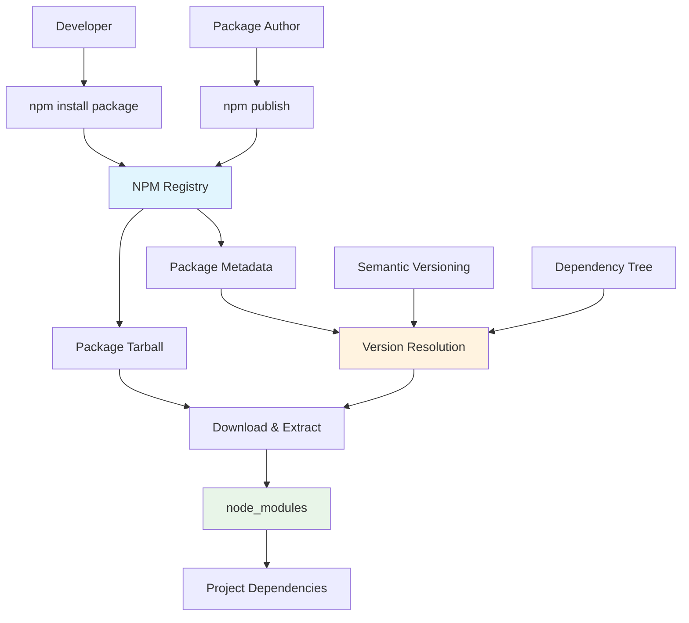

## Pengantar: Amazon untuk Dunia JavaScript

Bayangkan NPM sebagai **sistem logistik Amazon untuk developers** - sebuah warehouse global yang menyimpan jutaan packages siap kirim, dengan sistem delivery yang dapat mengantarkan dependencies ke project manapun dalam hitungan detik. Seperti Amazon yang merevolusi e-commerce dengan one-click purchasing dan same-day delivery, NPM merevolusi [[JavaScript]] development dengan instant access ke massive ecosystem of reusable code.

NPM (Node Package Manager) adalah package manager default untuk [[Node.js]] dan largest software registry di dunia, hosting lebih dari 2 million packages. NPM memungkinkan developers untuk easily share, discover, dan reuse code, menciptakan ecosystem yang mendorong collaboration dan rapid development dalam [[JavaScript]] community.

**Mengapa NPM Revolutionary?**
- **Massive Ecosystem**: 2+ million packages covering hampir setiap use case
- **Instant Access**: Install packages dalam seconds dengan simple commands
- **Dependency Management**: Automatic resolution dan version management
- **Community Driven**: Open-source ecosystem dengan global contributions
- **Seamless Integration**: Perfect integration dengan [[Node.js]] dan modern build tools

## Core Concepts: Sistem Distribusi yang Efisien

### Package Registry - Warehouse Global

NPM registry adalah **warehouse global** yang menyimpan semua packages, dengan sophisticated indexing dan search capabilities.



### Package.json - Manifest Aplikasi

Package.json adalah **blueprint aplikasi** yang mendefinisikan dependencies, scripts, dan metadata:

```json
{
    "name": "modern-web-app",
    "version": "1.0.0",
    "description": "Modern web application with NPM dependencies",
    "main": "index.js",
    "scripts": {
        "start": "node server.js",
        "dev": "nodemon server.js",
        "build": "webpack --mode production",
        "test": "jest",
        "lint": "eslint src/",
        "format": "prettier --write src/"
    },
    "dependencies": {
        "express": "^4.18.0",
        "react": "^18.2.0",
        "lodash": "^4.17.21",
        "axios": "^1.3.0"
    },
    "devDependencies": {
        "webpack": "^5.75.0",
        "babel-loader": "^9.1.0",
        "jest": "^29.3.0",
        "eslint": "^8.30.0",
        "prettier": "^2.8.0",
        "nodemon": "^2.0.20"
    },
    "engines": {
        "node": ">=16.0.0",
        "npm": ">=8.0.0"
    },
    "keywords": ["web", "javascript", "node"],
    "author": "Developer Name",
    "license": "MIT"
}
```

## Dependency Management: Sistem Logistik yang Cerdas

### Semantic Versioning - Sistem Versi yang Predictable

NPM menggunakan semantic versioning (semver) untuk **predictable version management**:

```javascript
// Semantic versioning examples
{
    "dependencies": {
        // Exact version - tidak akan update otomatis
        "lodash": "4.17.21",
        
        // Patch updates allowed (4.17.x)
        "express": "~4.18.0",
        
        // Minor updates allowed (4.x.x)
        "react": "^18.2.0",
        
        // Latest version (dangerous untuk production)
        "axios": "*",
        
        // Version range
        "moment": ">=2.29.0 <3.0.0",
        
        // Pre-release versions
        "next": "13.1.0-canary.0"
    }
}

// NPM commands untuk version management
// Install specific version
// npm install lodash@4.17.21

// Update to latest compatible version
// npm update

// Check outdated packages
// npm outdated

// Install latest version (ignoring semver)
// npm install lodash@latest
```

### Lock Files - Deterministic Builds

Package-lock.json memastikan **deterministic builds** across different environments:

```javascript
// Package-lock.json structure (simplified)
{
    "name": "modern-web-app",
    "version": "1.0.0",
    "lockfileVersion": 2,
    "requires": true,
    "packages": {
        "": {
            "name": "modern-web-app",
            "version": "1.0.0",
            "dependencies": {
                "express": "^4.18.0",
                "lodash": "^4.17.21"
            }
        },
        "node_modules/express": {
            "version": "4.18.2",
            "resolved": "https://registry.npmjs.org/express/-/express-4.18.2.tgz",
            "integrity": "sha512-...",
            "dependencies": {
                "accepts": "~1.3.8",
                "array-flatten": "1.1.1"
            }
        }
    }
}

// Benefits of lock files:
// 1. Exact same dependency tree across environments
// 2. Faster installs (no version resolution needed)
// 3. Security - prevents dependency confusion attacks
// 4. Reproducible builds untuk CI/CD
```

## Advanced NPM Features

### NPM Scripts - Task Automation

NPM scripts menyediakan **task automation** yang powerful tanpa additional build tools:

```json
{
    "scripts": {
        // Basic commands
        "start": "node server.js",
        "dev": "nodemon server.js",
        
        // Build processes
        "build": "npm run clean && npm run compile && npm run bundle",
        "clean": "rimraf dist/",
        "compile": "babel src -d dist",
        "bundle": "webpack --mode production",
        
        // Testing
        "test": "jest",
        "test:watch": "jest --watch",
        "test:coverage": "jest --coverage",
        
        // Code quality
        "lint": "eslint src/ --fix",
        "format": "prettier --write src/",
        "typecheck": "tsc --noEmit",
        
        // Pre/post hooks
        "pretest": "npm run lint",
        "posttest": "npm run coverage-report",
        
        // Environment-specific
        "start:prod": "NODE_ENV=production node server.js",
        "start:dev": "NODE_ENV=development nodemon server.js",
        
        // Complex workflows
        "deploy": "npm run build && npm run test && npm run deploy:aws",
        "deploy:aws": "aws s3 sync dist/ s3://my-bucket"
    }
}
```

### Workspaces - Monorepo Management

NPM workspaces memungkinkan **monorepo management** yang efficient:

```json
// Root package.json untuk monorepo
{
    "name": "my-monorepo",
    "private": true,
    "workspaces": [
        "packages/*",
        "apps/*"
    ],
    "scripts": {
        "build": "npm run build --workspaces",
        "test": "npm run test --workspaces",
        "lint": "npm run lint --workspaces"
    },
    "devDependencies": {
        "jest": "^29.0.0",
        "eslint": "^8.0.0"
    }
}

// packages/ui/package.json
{
    "name": "@mycompany/ui",
    "version": "1.0.0",
    "dependencies": {
        "react": "^18.0.0"
    }
}

// packages/utils/package.json
{
    "name": "@mycompany/utils",
    "version": "1.0.0",
    "dependencies": {
        "lodash": "^4.17.21"
    }
}

// apps/web/package.json
{
    "name": "@mycompany/web",
    "version": "1.0.0",
    "dependencies": {
        "@mycompany/ui": "^1.0.0",
        "@mycompany/utils": "^1.0.0"
    }
}
```

## Security dan Best Practices

### Security Auditing

NPM menyediakan built-in **security auditing** untuk identify vulnerabilities:

```bash
# Check untuk security vulnerabilities
npm audit

# Automatically fix vulnerabilities
npm audit fix

# Force fix (potentially breaking changes)
npm audit fix --force

# Audit dengan detailed output
npm audit --audit-level moderate

# Generate audit report
npm audit --json > audit-report.json
```

### Package Verification

```javascript
// .npmrc configuration untuk security
registry=https://registry.npmjs.org/
audit-level=moderate
fund=false
save-exact=true

// Package integrity verification
{
    "dependencies": {
        "lodash": "4.17.21"
    },
    "overrides": {
        // Force specific versions untuk security
        "minimist": "1.2.6"
    }
}

// Using npm ci untuk production builds
// npm ci - installs from lock file exactly
// Faster, reliable, reproducible builds
```

## Performance Optimization

### Caching Strategies

NPM menggunakan sophisticated **caching mechanisms** untuk faster installs:

```bash
# NPM cache management
npm cache verify
npm cache clean --force

# Configure cache location
npm config set cache /path/to/cache

# Offline installation (menggunakan cache)
npm install --offline

# Cache statistics
npm cache ls
```

### Alternative Package Managers

Comparison dengan alternative package managers:

| Feature | NPM | Yarn | PNPM |
|---------|-----|------|------|
| **Speed** | Good | Fast | Fastest |
| **Disk Usage** | High | High | Low (symlinks) |
| **Lock File** | package-lock.json | yarn.lock | pnpm-lock.yaml |
| **Workspaces** | ✅ | ✅ | ✅ |
| **Offline Mode** | Limited | ✅ | ✅ |
| **[[Node.js]] Integration** | Native | Good | Good |

## Integration dengan Development Workflow

### CI/CD Integration

NPM seamlessly integrates dengan CI/CD pipelines:

```yaml
# GitHub Actions workflow
name: CI/CD Pipeline
on: [push, pull_request]

jobs:
  test:
    runs-on: ubuntu-latest
    steps:
      - uses: actions/checkout@v3
      
      - name: Setup Node.js
        uses: actions/setup-node@v3
        with:
          node-version: '18'
          cache: 'npm'
      
      - name: Install dependencies
        run: npm ci
      
      - name: Run tests
        run: npm test
      
      - name: Build application
        run: npm run build
      
      - name: Security audit
        run: npm audit --audit-level high
```

### Development Tools Integration

```javascript
// Integration dengan modern development tools
{
    "scripts": {
        // [[Hot Reloading]] untuk development
        "dev": "webpack serve --mode development --hot",
        
        // [[Performance Optimization]] analysis
        "analyze": "webpack-bundle-analyzer dist/stats.json",
        
        // Type checking dengan TypeScript
        "typecheck": "tsc --noEmit",
        
        // [[Developer Experience]] improvements
        "prepare": "husky install",
        "pre-commit": "lint-staged"
    },
    "lint-staged": {
        "*.{js,jsx,ts,tsx}": ["eslint --fix", "prettier --write"],
        "*.{css,scss}": ["stylelint --fix", "prettier --write"]
    }
}
```

## Publishing dan Distribution

### Package Publishing

Creating dan publishing NPM packages:

```javascript
// Preparing package untuk publishing
{
    "name": "@mycompany/awesome-utils",
    "version": "1.0.0",
    "description": "Awesome utility functions",
    "main": "dist/index.js",
    "module": "dist/index.esm.js",
    "types": "dist/index.d.ts",
    "files": [
        "dist/",
        "README.md",
        "LICENSE"
    ],
    "publishConfig": {
        "access": "public",
        "registry": "https://registry.npmjs.org/"
    },
    "repository": {
        "type": "git",
        "url": "https://github.com/mycompany/awesome-utils.git"
    },
    "keywords": ["utilities", "javascript", "typescript"],
    "author": "Your Name <email@example.com>",
    "license": "MIT"
}

// Publishing workflow
// 1. npm login
// 2. npm version patch|minor|major
// 3. npm publish
// 4. git push --tags
```

### Scoped Packages

```javascript
// Scoped packages untuk organization
{
    "name": "@mycompany/ui-components",
    "version": "1.0.0",
    "dependencies": {
        "@mycompany/design-tokens": "^2.0.0",
        "@mycompany/utils": "^1.5.0"
    }
}

// Installation
// npm install @mycompany/ui-components

// Usage
import { Button } from '@mycompany/ui-components';
```

## Ecosystem Integration

### Modern JavaScript Frameworks

NPM seamlessly integrates dengan modern frameworks:

```javascript
// [[React]] project dengan NPM
{
    "dependencies": {
        "react": "^18.2.0",
        "react-dom": "^18.2.0",
        "@types/react": "^18.0.0"
    },
    "scripts": {
        "start": "react-scripts start",
        "build": "react-scripts build"
    }
}

// [[Node.js]] server dengan Express
{
    "dependencies": {
        "express": "^4.18.0",
        "cors": "^2.8.5",
        "helmet": "^6.0.0"
    }
}

// Full-stack [[JavaScript]] application
{
    "workspaces": [
        "client",
        "server",
        "shared"
    ]
}
```

## Troubleshooting dan Debugging

### Common Issues dan Solutions

```bash
# Clear NPM cache
npm cache clean --force

# Delete node_modules dan reinstall
rm -rf node_modules package-lock.json
npm install

# Fix permission issues (macOS/Linux)
sudo chown -R $(whoami) ~/.npm

# Update NPM itself
npm install -g npm@latest

# Check NPM configuration
npm config list

# Reset NPM configuration
npm config delete registry
npm config delete proxy
```

## Refleksi: Fondasi Ekosistem JavaScript Modern

NPM telah menjadi **backbone dari JavaScript ecosystem**, memungkinkan millions of developers untuk share, discover, dan reuse code dengan unprecedented ease. Seperti sistem logistik Amazon yang merevolusi commerce, NPM merevolusi software development dengan instant access ke massive library of reusable components.

Integration dengan modern development tools, [[Node.js]] runtime, dan frameworks seperti [[React]] menciptakan ecosystem yang memungkinkan rapid development dan [[Performance Optimization]]. Dengan features seperti workspaces, security auditing, dan sophisticated dependency management, NPM menyediakan foundation yang solid untuk building scalable applications.

Masa depan NPM terletak pada continued improvements dalam security, performance, dan [[Developer Experience]]. Investasi dalam memahami NPM ecosystem adalah investasi dalam modern [[JavaScript]] development - seperti memahami sistem logistik global, mastery NPM memungkinkan developers untuk leverage collective intelligence dari global developer community dan build applications yang truly powerful dan maintainable.