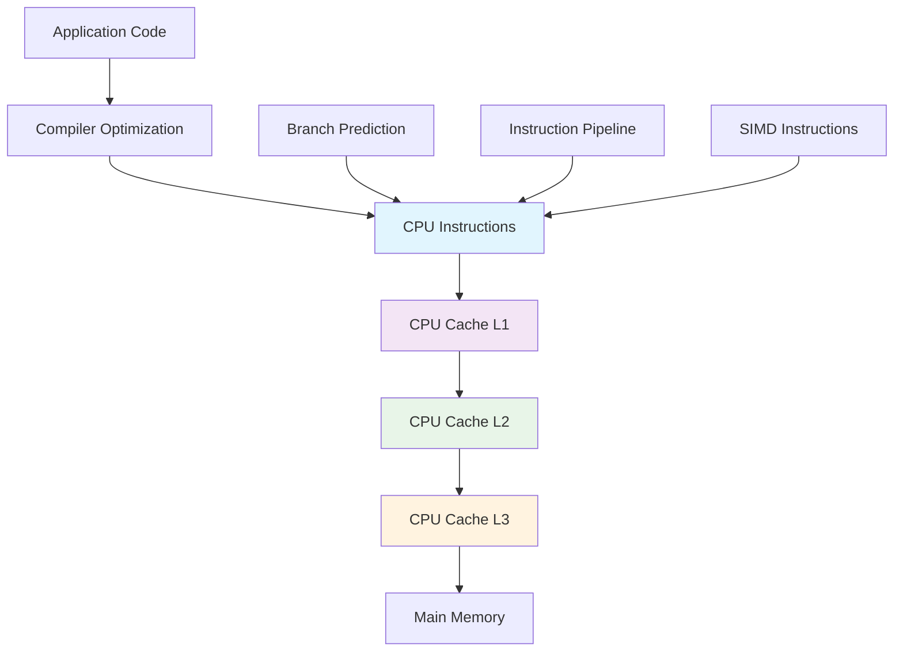

## Pengantar: Mesin Balap yang Dioptimalkan untuk Kecepatan Maksimal

Bayangkan Native Performance sebagai **mesin balap Formula 1** yang dirancang khusus untuk mencapai performa maksimal di sirkuit tertentu. Setiap komponen dioptimalkan hingga detail terkecil - dari aerodinamika yang mengurangi drag, mesin yang disetel untuk power-to-weight ratio optimal, hingga ban yang dipilih khusus untuk kondisi track. Tidak ada komponen yang berlebihan, semuanya berfokus pada satu tujuan: kecepatan dan efisiensi maksimal.

Native Performance adalah kemampuan aplikasi untuk berjalan dengan performa optimal pada platform target dengan memanfaatkan secara langsung capabilities hardware dan operating system. Berbeda dengan abstraction layers yang menambah overhead, native performance memberikan akses direct ke system resources untuk mencapai throughput maksimal dengan [[Latency]] minimal. Ini berkaitan erat dengan [[Performance Optimization]], [[Threading]], [[Memory Management]], dan [[Zero-Copy]] operations.

**Mengapa Native Performance Krusial?**
- **User Experience**: 60 FPS smooth animations dan instant response
- **Battery Efficiency**: Optimal resource usage untuk longer device life
- **Competitive Advantage**: Faster apps win user preference dan retention
- **System Integration**: Deep integration dengan platform-specific features

## Arsitektur Hardware: Mesin Balap yang Dioptimalkan

### CPU Optimization - Tuning Mesin untuk Power Maksimal

CPU optimization seperti **tuning mesin balap** di mana setiap komponen disesuaikan untuk menghasilkan tenaga maksimal dengan efisiensi bahan bakar optimal.



**CPU Performance Techniques:**
```c
// SIMD Optimization - Parallel Processing
#include <immintrin.h>

// Scalar version - satu operasi per waktu
void add_arrays_scalar(float* a, float* b, float* result, int size) {
    for (int i = 0; i < size; i++) {
        result[i] = a[i] + b[i];
    }
}

// SIMD version - 8 operasi paralel (AVX)
void add_arrays_simd(float* a, float* b, float* result, int size) {
    int simd_size = size - (size % 8);
    
    for (int i = 0; i < simd_size; i += 8) {
        __m256 va = _mm256_load_ps(&a[i]);
        __m256 vb = _mm256_load_ps(&b[i]);
        __m256 vresult = _mm256_add_ps(va, vb);
        _mm256_store_ps(&result[i], vresult);
    }
    
    // Handle remaining elements
    for (int i = simd_size; i < size; i++) {
        result[i] = a[i] + b[i];
    }
}

// Cache-friendly data access
struct Point3D {
    float x, y, z;
};

// ❌ Bad: Array of Structures (AoS) - cache misses
Point3D points[1000];
for (int i = 0; i < 1000; i++) {
    points[i].x *= 2.0f; // Loads entire struct, uses only x
}

// ✅ Good: Structure of Arrays (SoA) - cache friendly
struct Points3D {
    float x[1000];
    float y[1000]; 
    float z[1000];
};

Points3D points;
for (int i = 0; i < 1000; i++) {
    points.x[i] *= 2.0f; // Sequential memory access
}
```

### Memory Management - Sistem Bahan Bakar Efisien

Memory management seperti **sistem bahan bakar Formula 1** yang harus memberikan power maksimal sambil meminimalkan weight dan consumption.

```cpp
// Custom Memory Allocator untuk Performance
class PoolAllocator {
private:
    void* memory_pool;
    size_t pool_size;
    size_t block_size;
    std::vector<void*> free_blocks;
    
public:
    PoolAllocator(size_t pool_size, size_t block_size) 
        : pool_size(pool_size), block_size(block_size) {
        
        memory_pool = aligned_alloc(64, pool_size); // 64-byte aligned
        
        // Initialize free block list
        char* ptr = static_cast<char*>(memory_pool);
        for (size_t i = 0; i < pool_size; i += block_size) {
            free_blocks.push_back(ptr + i);
        }
    }
    
    void* allocate() {
        if (free_blocks.empty()) {
            return nullptr; // Pool exhausted
        }
        
        void* block = free_blocks.back();
        free_blocks.pop_back();
        return block;
    }
    
    void deallocate(void* ptr) {
        free_blocks.push_back(ptr);
    }
    
    ~PoolAllocator() {
        free(memory_pool);
    }
};

// Object pooling untuk menghindari allocation overhead
template<typename T>
class ObjectPool {
private:
    std::queue<std::unique_ptr<T>> pool;
    
public:
    std::unique_ptr<T> acquire() {
        if (pool.empty()) {
            return std::make_unique<T>();
        }
        
        auto obj = std::move(pool.front());
        pool.pop();
        return obj;
    }
    
    void release(std::unique_ptr<T> obj) {
        obj->reset(); // Reset object state
        pool.push(std::move(obj));
    }
};
```

## Platform-Specific Optimization: Tuning untuk Sirkuit Khusus

### iOS Performance - Tuning untuk Sirkuit Apple

iOS performance optimization seperti **tuning khusus untuk sirkuit Monaco** - presisi tinggi dalam ruang terbatas dengan aturan ketat.

```swift
// Metal Performance Shaders untuk GPU acceleration
import Metal
import MetalPerformanceShaders

class ImageProcessor {
    private let device: MTLDevice
    private let commandQueue: MTLCommandQueue
    private let gaussianBlur: MPSImageGaussianBlur
    
    init() {
        device = MTLCreateSystemDefaultDevice()!
        commandQueue = device.makeCommandQueue()!
        gaussianBlur = MPSImageGaussianBlur(device: device, sigma: 2.0)
    }
    
    func processImage(_ inputTexture: MTLTexture) -> MTLTexture {
        let descriptor = MTLTextureDescriptor.texture2DDescriptor(
            pixelFormat: inputTexture.pixelFormat,
            width: inputTexture.width,
            height: inputTexture.height,
            mipmapped: false
        )
        
        let outputTexture = device.makeTexture(descriptor: descriptor)!
        
        let commandBuffer = commandQueue.makeCommandBuffer()!
        gaussianBlur.encode(
            commandBuffer: commandBuffer,
            sourceTexture: inputTexture,
            destinationTexture: outputTexture
        )
        commandBuffer.commit()
        commandBuffer.waitUntilCompleted()
        
        return outputTexture
    }
}

// Core Animation optimization
class OptimizedAnimationView: UIView {
    override class var layerClass: AnyClass {
        return CAMetalLayer.self // Hardware accelerated
    }
    
    func setupOptimizedAnimation() {
        // Use CADisplayLink untuk smooth 60fps
        let displayLink = CADisplayLink(target: self, selector: #selector(updateFrame))
        displayLink.add(to: .main, forMode: .common)
        
        // Optimize layer properties
        layer.shouldRasterize = true
        layer.rasterizationScale = UIScreen.main.scale
        layer.drawsAsynchronously = true
    }
    
    @objc private func updateFrame() {
        // Update animation frame
    }
}
```

### Android Performance - Tuning untuk Sirkuit Beragam

Android performance optimization seperti **tuning untuk berbagai jenis sirkuit** - harus adaptif terhadap berbagai kondisi hardware.

```kotlin
// Vulkan API untuk low-level graphics performance
class VulkanRenderer {
    private external fun nativeInitVulkan(): Long
    private external fun nativeRender(nativeHandle: Long)
    private external fun nativeCleanup(nativeHandle: Long)
    
    private var nativeHandle: Long = 0
    
    fun initialize() {
        nativeHandle = nativeInitVulkan()
    }
    
    fun render() {
        if (nativeHandle != 0L) {
            nativeRender(nativeHandle)
        }
    }
    
    fun cleanup() {
        if (nativeHandle != 0L) {
            nativeCleanup(nativeHandle)
            nativeHandle = 0
        }
    }
}

// RenderScript untuk compute-intensive tasks
class ImageBlurProcessor {
    private lateinit var renderScript: RenderScript
    private lateinit var blurScript: ScriptIntrinsicBlur
    
    fun initialize(context: Context) {
        renderScript = RenderScript.create(context)
        blurScript = ScriptIntrinsicBlur.create(renderScript, Element.U8_4(renderScript))
    }
    
    fun blurBitmap(inputBitmap: Bitmap, radius: Float): Bitmap {
        val inputAllocation = Allocation.createFromBitmap(renderScript, inputBitmap)
        val outputAllocation = Allocation.createTyped(renderScript, inputAllocation.type)
        
        blurScript.setRadius(radius)
        blurScript.setInput(inputAllocation)
        blurScript.forEach(outputAllocation)
        
        val outputBitmap = Bitmap.createBitmap(
            inputBitmap.width, 
            inputBitmap.height, 
            Bitmap.Config.ARGB_8888
        )
        outputAllocation.copyTo(outputBitmap)
        
        return outputBitmap
    }
}

// Background processing optimization
class BackgroundTaskManager {
    fun scheduleOptimizedWork(context: Context) {
        val constraints = Constraints.Builder()
            .setRequiredNetworkType(NetworkType.CONNECTED)
            .setRequiresBatteryNotLow(true)
            .setRequiresCharging(false)
            .build()
        
        val workRequest = OneTimeWorkRequestBuilder<DataSyncWorker>()
            .setConstraints(constraints)
            .setBackoffCriteria(BackoffPolicy.EXPONENTIAL, 30, TimeUnit.SECONDS)
            .build()
        
        WorkManager.getInstance(context).enqueue(workRequest)
    }
}
```

## Profiling dan Measurement: Telemetri Balap Real-time

### Performance Monitoring - Dashboard Telemetri

Performance monitoring seperti **dashboard telemetri Formula 1** yang memberikan data real-time tentang performa setiap komponen.

```javascript
// Web Performance API
class PerformanceMonitor {
    constructor() {
        this.metrics = new Map();
        this.observers = new Map();
        this.setupObservers();
    }
    
    setupObservers() {
        // Performance Observer untuk Core Web Vitals
        const observer = new PerformanceObserver((list) => {
            for (const entry of list.getEntries()) {
                this.recordMetric(entry.name, entry.value, entry.entryType);
            }
        });
        
        observer.observe({ 
            entryTypes: ['measure', 'navigation', 'resource', 'paint'] 
        });
        
        // Intersection Observer untuk visibility tracking
        const visibilityObserver = new IntersectionObserver((entries) => {
            entries.forEach(entry => {
                if (entry.isIntersecting) {
                    this.recordMetric('element_visible', Date.now(), 'visibility');
                }
            });
        });
        
        this.observers.set('visibility', visibilityObserver);
    }
    
    measureFunction(name, fn) {
        const startTime = performance.now();
        const result = fn();
        const endTime = performance.now();
        
        this.recordMetric(name, endTime - startTime, 'function');
        return result;
    }
    
    async measureAsync(name, asyncFn) {
        const startTime = performance.now();
        try {
            const result = await asyncFn();
            const endTime = performance.now();
            this.recordMetric(name, endTime - startTime, 'async');
            return result;
        } catch (error) {
            const endTime = performance.now();
            this.recordMetric(`${name}_error`, endTime - startTime, 'async_error');
            throw error;
        }
    }
    
    recordMetric(name, value, type) {
        if (!this.metrics.has(name)) {
            this.metrics.set(name, []);
        }
        
        this.metrics.get(name).push({
            value,
            type,
            timestamp: Date.now()
        });
        
        // Send to analytics if needed
        this.sendToAnalytics(name, value, type);
    }
    
    sendToAnalytics(name, value, type) {
        // Send performance data to monitoring service
        if ('sendBeacon' in navigator) {
            navigator.sendBeacon('/analytics', JSON.stringify({
                metric: name,
                value,
                type,
                timestamp: Date.now(),
                userAgent: navigator.userAgent
            }));
        }
    }
    
    getMetricSummary(name) {
        const values = this.metrics.get(name) || [];
        if (values.length === 0) return null;
        
        const numericValues = values.map(v => v.value).sort((a, b) => a - b);
        
        return {
            count: values.length,
            min: numericValues[0],
            max: numericValues[numericValues.length - 1],
            median: numericValues[Math.floor(numericValues.length / 2)],
            p95: numericValues[Math.floor(numericValues.length * 0.95)],
            average: numericValues.reduce((a, b) => a + b, 0) / numericValues.length
        };
    }
}

// Usage
const monitor = new PerformanceMonitor();

// Measure function performance
const result = monitor.measureFunction('data_processing', () => {
    return processLargeDataset(data);
});

// Measure async operations
const apiData = await monitor.measureAsync('api_call', async () => {
    return fetch('/api/data').then(r => r.json());
});
```

### Memory Profiling - Analisis Konsumsi Bahan Bakar

```cpp
// Custom memory profiler
class MemoryProfiler {
private:
    struct AllocationInfo {
        size_t size;
        std::chrono::high_resolution_clock::time_point timestamp;
        std::string file;
        int line;
    };
    
    std::unordered_map<void*, AllocationInfo> allocations;
    std::mutex allocation_mutex;
    size_t total_allocated = 0;
    size_t peak_usage = 0;
    
public:
    void* tracked_malloc(size_t size, const char* file, int line) {
        void* ptr = malloc(size);
        if (ptr) {
            std::lock_guard<std::mutex> lock(allocation_mutex);
            allocations[ptr] = {
                size, 
                std::chrono::high_resolution_clock::now(),
                file,
                line
            };
            total_allocated += size;
            peak_usage = std::max(peak_usage, total_allocated);
        }
        return ptr;
    }
    
    void tracked_free(void* ptr) {
        if (ptr) {
            std::lock_guard<std::mutex> lock(allocation_mutex);
            auto it = allocations.find(ptr);
            if (it != allocations.end()) {
                total_allocated -= it->second.size;
                allocations.erase(it);
            }
            free(ptr);
        }
    }
    
    void print_memory_report() {
        std::lock_guard<std::mutex> lock(allocation_mutex);
        
        std::cout << "=== Memory Profile Report ===" << std::endl;
        std::cout << "Current allocations: " << allocations.size() << std::endl;
        std::cout << "Current memory usage: " << total_allocated << " bytes" << std::endl;
        std::cout << "Peak memory usage: " << peak_usage << " bytes" << std::endl;
        
        // Group by file
        std::map<std::string, size_t> by_file;
        for (const auto& [ptr, info] : allocations) {
            by_file[info.file] += info.size;
        }
        
        std::cout << "\nMemory usage by file:" << std::endl;
        for (const auto& [file, size] : by_file) {
            std::cout << file << ": " << size << " bytes" << std::endl;
        }
    }
};

// Macro untuk easy tracking
#define TRACKED_MALLOC(size) profiler.tracked_malloc(size, __FILE__, __LINE__)
#define TRACKED_FREE(ptr) profiler.tracked_free(ptr)
```

## Trade-offs dan Optimization Strategies: Balancing Act

### Performance vs Battery Life

| Optimization | Performance Gain | Battery Impact | Use Case |
|--------------|------------------|----------------|----------|
| **CPU Frequency Scaling** | High | High | Gaming, Video |
| **GPU Acceleration** | Very High | Medium | Graphics, ML |
| **Background Processing** | Medium | Low | Data Sync |
| **Cache Optimization** | High | Very Low | General Apps |
| **Memory Pooling** | Medium | Low | Real-time Apps |

### Native vs Cross-Platform Performance

```typescript
// Performance comparison framework
interface PerformanceBenchmark {
  name: string;
  nativeTime: number;
  crossPlatformTime: number;
  memoryUsage: number;
  batteryImpact: number;
}

const benchmarks: PerformanceBenchmark[] = [
  {
    name: "Image Processing",
    nativeTime: 45, // ms
    crossPlatformTime: 120, // ms  
    memoryUsage: 15, // MB
    batteryImpact: 2.3 // %/hour
  },
  {
    name: "List Scrolling (1000 items)",
    nativeTime: 16, // ms per frame
    crossPlatformTime: 22, // ms per frame
    memoryUsage: 8, // MB
    batteryImpact: 1.1 // %/hour
  },
  {
    name: "Network Request",
    nativeTime: 150, // ms
    crossPlatformTime: 165, // ms
    memoryUsage: 2, // MB
    batteryImpact: 0.5 // %/hour
  }
];

function calculatePerformanceScore(benchmark: PerformanceBenchmark): number {
  const timeRatio = benchmark.nativeTime / benchmark.crossPlatformTime;
  const memoryScore = Math.max(0, 100 - benchmark.memoryUsage * 2);
  const batteryScore = Math.max(0, 100 - benchmark.batteryImpact * 10);
  
  return (timeRatio * 40) + (memoryScore * 0.3) + (batteryScore * 0.3);
}
```

## Studi Kasus: Mesin Balap Sukses

**Instagram**: Native iOS/Android dengan custom image processing pipeline - 40% faster rendering
**Spotify**: Native audio engine dengan cross-platform UI - 60% better battery life  
**Uber**: Native location services dengan optimized mapping - 50% reduced latency
**TikTok**: Native video processing dengan ML acceleration - 70% smoother playback

**Lessons Learned:**
- Critical path optimization memberikan impact terbesar pada user experience
- Platform-specific features crucial untuk competitive advantage
- Battery optimization sama pentingnya dengan raw performance
- Profiling data essential untuk informed optimization decisions

## Refleksi: Masa Depan Mesin Balap Digital

Native Performance telah berevolusi dari "faster is better" menjadi "smart optimization for sustainable performance". Seperti Formula 1 yang berkembang dari pure speed menjadi efficiency-focused racing, native performance kini harus mempertimbangkan battery life, thermal management, dan user experience holistically.

Masa depan native performance terletak pada **intelligent adaptation** - AI-powered performance tuning, predictive resource management, dan hardware-software co-optimization. Dengan [[Machine Learning]] dan advanced profiling, applications akan semakin pintar dalam mengoptimalkan performance berdasarkan usage patterns dan device capabilities.

Investasi dalam native performance optimization adalah investasi dalam user satisfaction - seperti memiliki mesin balap yang perfectly tuned, native performance yang optimal memungkinkan applications untuk deliver experiences yang smooth, responsive, dan efficient yang membuat users kembali lagi dan lagi.

---

*Catatan ini menggambarkan Native Performance sebagai mesin balap Formula 1 yang dioptimalkan untuk kecepatan maksimal, dengan analogi racing yang memudahkan pemahaman tentang hardware optimization, platform-specific tuning, dan trade-offs dalam mencapai performa optimal.*