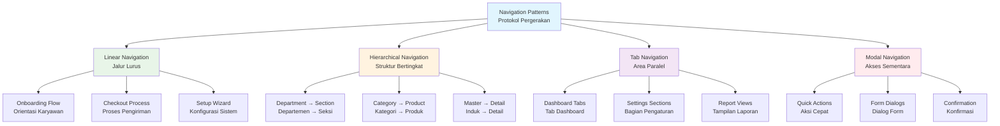

## Pengantar: Jaringan Transportasi dalam Pabrik Digital

Bayangkan sebuah pabrik modern dengan kompleks yang luas, terdiri dari ratusan departemen, gudang, dan stasiun kerja yang saling terhubung melalui sistem transportasi yang sophisticated. Pabrik ini memiliki jalur utama untuk distribusi material besar, koridor khusus untuk personel, elevator untuk akses vertikal, dan sistem tracking yang memantau setiap pergerakan secara real-time. Setiap karyawan memiliki badge akses yang menentukan area mana yang boleh dikunjungi, dan sistem navigasi otomatis memandu mereka ke tujuan dengan rute yang optimal. Ketika ada emergency atau maintenance, sistem dapat mengalihkan traffic ke jalur alternatif tanpa mengganggu operasi keseluruhan. Inilah Navigation & Routing dalam [[Flutter]] - sistem transportasi dan logistik yang mengelola pergerakan user antar screens, menangani deep links, dan memastikan user experience yang smooth dalam aplikasi multi-screen.

Navigation & Routing adalah backbone dari user experience dalam aplikasi [[Flutter]] yang complex. Seperti sistem transportasi pabrik yang menentukan efficiency operasional, navigation system menentukan seberapa intuitif dan responsive aplikasi dalam memandu user mencapai tujuan mereka. Dari simple page transitions hingga complex nested routing dengan authentication guards, setiap aspek navigation mempengaruhi user satisfaction dan app usability. Modern applications memerlukan sophisticated routing capabilities untuk handle deep links, state restoration, dan multi-platform navigation patterns yang consistent.

Mengapa Navigation & Routing critical? Dalam era mobile-first dan web integration, user expectations semakin tinggi terhadap seamless navigation experience. User harus bisa bookmark specific screens, share deep links, dan navigate dengan gesture yang natural. Poor navigation implementation bisa menyebabkan user confusion, broken deep links, dan inconsistent behavior across platforms. Mastery navigation patterns memungkinkan developer membangun aplikasi yang tidak hanya functional, tetapi juga intuitive dan user-friendly, memberikan competitive advantage dalam user retention dan engagement metrics.

## Navigator 1.0: Sistem Transportasi Klasik

Navigator 1.0 adalah sistem transportasi klasik dalam pabrik [[Flutter]], seperti jalur konveyor sederhana yang menggunakan stack-based approach untuk mengelola pergerakan antar departemen. System ini reliable dan straightforward, perfect untuk aplikasi dengan navigation requirements yang simple dan predictable.

### Stack-Based Navigation: Jalur Konveyor Berlapis

Navigator 1.0 menggunakan stack-based approach di mana setiap screen adalah "departemen" yang ditumpuk di atas departemen sebelumnya. Seperti sistem elevator yang mengingat lantai mana yang dikunjungi, navigation stack menyimpan history pergerakan user:

```dart
// Basic Navigator 1.0 implementation
class ClassicNavigationExample extends StatelessWidget {
  @override
  Widget build(BuildContext context) {
    return MaterialApp(
      title: 'Factory Navigation System',
      initialRoute: '/',
      routes: {
        '/': (context) => MainDashboard(),
        '/production': (context) => ProductionDepartment(),
        '/quality': (context) => QualityControlDepartment(),
        '/inventory': (context) => InventoryDepartment(),
        '/settings': (context) => SettingsPage(),
      },
      onGenerateRoute: (settings) {
        // Handle dynamic routes like /product/123
        if (settings.name?.startsWith('/product/') == true) {
          final productId = settings.name!.split('/')[2];
          return MaterialPageRoute(
            builder: (context) => ProductDetailPage(productId: productId),
            settings: settings,
          );
        }
        
        // Handle unknown routes
        return MaterialPageRoute(
          builder: (context) => NotFoundPage(),
        );
      },
    );
  }
}

class MainDashboard extends StatelessWidget {
  @override
  Widget build(BuildContext context) {
    return Scaffold(
      appBar: AppBar(
        title: Text('Factory Control Center'),
        backgroundColor: Colors.blue[800],
      ),
      body: GridView.count(
        crossAxisCount: 2,
        padding: EdgeInsets.all(16),
        children: [
          _buildDepartmentCard(
            context,
            'Production Line',
            Icons.precision_manufacturing,
            Colors.green,
            () => Navigator.pushNamed(context, '/production'),
          ),
          _buildDepartmentCard(
            context,
            'Quality Control',
            Icons.verified,
            Colors.orange,
            () => Navigator.pushNamed(context, '/quality'),
          ),
          _buildDepartmentCard(
            context,
            'Inventory',
            Icons.inventory,
            Colors.purple,
            () => Navigator.pushNamed(context, '/inventory'),
          ),
          _buildDepartmentCard(
            context,
            'Settings',
            Icons.settings,
            Colors.grey,
            () => Navigator.pushNamed(context, '/settings'),
          ),
        ],
      ),
    );
  }
  
  Widget _buildDepartmentCard(
    BuildContext context,
    String title,
    IconData icon,
    Color color,
    VoidCallback onTap,
  ) {
    return Card(
      elevation: 4,
      child: InkWell(
        onTap: onTap,
        child: Column(
          mainAxisAlignment: MainAxisAlignment.center,
          children: [
            Icon(icon, size: 48, color: color),
            SizedBox(height: 8),
            Text(title, style: Theme.of(context).textTheme.subtitle1),
          ],
        ),
      ),
    );
  }
}

class ProductionDepartment extends StatelessWidget {
  @override
  Widget build(BuildContext context) {
    return Scaffold(
      appBar: AppBar(
        title: Text('Production Department'),
        actions: [
          IconButton(
            icon: Icon(Icons.info),
            onPressed: () {
              // Navigate to production details with data
              Navigator.push(
                context,
                MaterialPageRoute(
                  builder: (context) => ProductionDetailsPage(
                    productionData: ProductionData(
                      dailyTarget: 1000,
                      currentOutput: 750,
                      efficiency: 0.85,
                    ),
                  ),
                ),
              );
            },
          ),
        ],
      ),
      body: Column(
        children: [
          _buildProductionMetrics(),
          Expanded(child: _buildProductionLines()),
          _buildActionButtons(context),
        ],
      ),
    );
  }
  
  Widget _buildProductionMetrics() {
    return Card(
      margin: EdgeInsets.all(16),
      child: Padding(
        padding: EdgeInsets.all(16),
        child: Row(
          mainAxisAlignment: MainAxisAlignment.spaceAround,
          children: [
            _buildMetric('Target', '1000', Colors.blue),
            _buildMetric('Current', '750', Colors.green),
            _buildMetric('Efficiency', '85%', Colors.orange),
          ],
        ),
      ),
    );
  }
  
  Widget _buildMetric(String label, String value, Color color) {
    return Column(
      children: [
        Text(value, style: TextStyle(fontSize: 24, fontWeight: FontWeight.bold, color: color)),
        Text(label, style: TextStyle(color: Colors.grey[600])),
      ],
    );
  }
  
  Widget _buildProductionLines() {
    return ListView.builder(
      itemCount: 5,
      itemBuilder: (context, index) {
        return ListTile(
          leading: CircleAvatar(
            backgroundColor: Colors.green,
            child: Text('${index + 1}'),
          ),
          title: Text('Production Line ${index + 1}'),
          subtitle: Text('Status: Active • Output: ${150 + index * 10}/hour'),
          trailing: Icon(Icons.arrow_forward_ios),
          onTap: () {
            Navigator.pushNamed(context, '/product/${index + 1}');
          },
        );
      },
    );
  }
  
  Widget _buildActionButtons(BuildContext context) {
    return Padding(
      padding: EdgeInsets.all(16),
      child: Row(
        children: [
          Expanded(
            child: ElevatedButton.icon(
              onPressed: () => Navigator.pushNamed(context, '/quality'),
              icon: Icon(Icons.verified),
              label: Text('Quality Check'),
            ),
          ),
          SizedBox(width: 16),
          Expanded(
            child: ElevatedButton.icon(
              onPressed: () => Navigator.pushNamed(context, '/inventory'),
              icon: Icon(Icons.inventory),
              label: Text('Check Inventory'),
            ),
          ),
        ],
      ),
    );
  }
}
```

### Route Management: Sistem Peta Departemen

Route management dalam Navigator 1.0 seperti sistem peta departemen yang mendefinisikan jalur-jalur yang tersedia dan bagaimana mengaksesnya:

```dart
// Advanced route management with data passing
class AdvancedRouteManager {
  static Route<T> createRoute<T extends Object?>(
    Widget page, {
    RouteSettings? settings,
    bool fullscreenDialog = false,
  }) {
    return PageRouteBuilder<T>(
      settings: settings,
      fullscreenDialog: fullscreenDialog,
      pageBuilder: (context, animation, secondaryAnimation) => page,
      transitionsBuilder: (context, animation, secondaryAnimation, child) {
        // Custom transition animation
        const begin = Offset(1.0, 0.0);
        const end = Offset.zero;
        const curve = Curves.ease;
        
        var tween = Tween(begin: begin, end: end).chain(
          CurveTween(curve: curve),
        );
        
        return SlideTransition(
          position: animation.drive(tween),
          child: child,
        );
      },
    );
  }
  
  static void navigateToProductDetail(
    BuildContext context,
    String productId, {
    Map<String, dynamic>? additionalData,
  }) {
    Navigator.push(
      context,
      createRoute(
        ProductDetailPage(
          productId: productId,
          additionalData: additionalData,
        ),
        settings: RouteSettings(
          name: '/product/$productId',
          arguments: additionalData,
        ),
      ),
    );
  }
  
  static void navigateWithResult<T>(
    BuildContext context,
    Widget page,
    Function(T?) onResult,
  ) async {
    final result = await Navigator.push<T>(
      context,
      createRoute<T>(page),
    );
    onResult(result);
  }
  
  static void replaceWithDashboard(BuildContext context) {
    Navigator.pushNamedAndRemoveUntil(
      context,
      '/',
      (route) => false, // Remove all previous routes
    );
  }
}

// Example usage with result handling
class QualityControlDepartment extends StatefulWidget {
  @override
  _QualityControlDepartmentState createState() => _QualityControlDepartmentState();
}

class _QualityControlDepartmentState extends State<QualityControlDepartment> {
  List<QualityCheckResult> _results = [];
  
  @override
  Widget build(BuildContext context) {
    return Scaffold(
      appBar: AppBar(
        title: Text('Quality Control'),
        actions: [
          IconButton(
            icon: Icon(Icons.add),
            onPressed: _startQualityCheck,
          ),
        ],
      ),
      body: _results.isEmpty
        ? _buildEmptyState()
        : _buildResultsList(),
    );
  }
  
  void _startQualityCheck() {
    AdvancedRouteManager.navigateWithResult<QualityCheckResult>(
      context,
      QualityCheckPage(),
      (result) {
        if (result != null) {
          setState(() {
            _results.add(result);
          });
        }
      },
    );
  }
  
  Widget _buildEmptyState() {
    return Center(
      child: Column(
        mainAxisAlignment: MainAxisAlignment.center,
        children: [
          Icon(Icons.verified, size: 64, color: Colors.grey),
          SizedBox(height: 16),
          Text('No quality checks performed yet'),
          SizedBox(height: 16),
          ElevatedButton(
            onPressed: _startQualityCheck,
            child: Text('Start Quality Check'),
          ),
        ],
      ),
    );
  }
  
  Widget _buildResultsList() {
    return ListView.builder(
      itemCount: _results.length,
      itemBuilder: (context, index) {
        final result = _results[index];
        return Card(
          margin: EdgeInsets.symmetric(horizontal: 16, vertical: 8),
          child: ListTile(
            leading: CircleAvatar(
              backgroundColor: result.passed ? Colors.green : Colors.red,
              child: Icon(
                result.passed ? Icons.check : Icons.close,
                color: Colors.white,
              ),
            ),
            title: Text('Batch ${result.batchId}'),
            subtitle: Text('Score: ${result.score}% • ${result.timestamp}'),
            trailing: Icon(Icons.arrow_forward_ios),
            onTap: () {
              AdvancedRouteManager.navigateToProductDetail(
                context,
                result.batchId,
                additionalData: {'qualityResult': result},
              );
            },
          ),
        );
      },
    );
  }
}
```
## Navigator 2.0: Sistem Transportasi Modern

Navigator 2.0 adalah evolusi sistem transportasi pabrik menjadi smart logistics system yang declarative dan state-driven. Seperti upgrade dari jalur konveyor manual ke sistem otomatis yang dikendalikan AI, Navigator 2.0 memberikan kontrol penuh atas navigation state dan memungkinkan complex routing scenarios yang tidak mungkin dengan Navigator 1.0.

### Declarative Navigation: Control Center Terpusat

Navigator 2.0 menggunakan declarative approach di mana navigation state dikelola secara terpusat, seperti control center yang memantau dan mengatur seluruh traffic pabrik berdasarkan state real-time:

```dart
// Navigator 2.0 implementation with RouterDelegate
class FactoryRouterDelegate extends RouterDelegate<FactoryRoutePath>
    with ChangeNotifier, PopNavigatorRouterDelegateMixin<FactoryRoutePath> {
  
  @override
  final GlobalKey<NavigatorState> navigatorKey;
  
  // Navigation state
  FactoryAppState _appState = FactoryAppState();
  
  FactoryRouterDelegate() : navigatorKey = GlobalKey<NavigatorState>();
  
  FactoryRoutePath get currentConfiguration {
    if (_appState.isUnknown) {
      return FactoryRoutePath.unknown();
    }
    
    if (_appState.selectedDepartment == null) {
      return FactoryRoutePath.home();
    }
    
    if (_appState.selectedProductId != null) {
      return FactoryRoutePath.productDetail(
        _appState.selectedDepartment!,
        _appState.selectedProductId!,
      );
    }
    
    return FactoryRoutePath.department(_appState.selectedDepartment!);
  }
  
  @override
  Widget build(BuildContext context) {
    return Navigator(
      key: navigatorKey,
      pages: [
        // Home page - always present
        MaterialPage(
          key: ValueKey('HomePage'),
          child: MainDashboard(
            onDepartmentSelected: _handleDepartmentSelection,
          ),
        ),
        
        // Department page
        if (_appState.selectedDepartment != null)
          MaterialPage(
            key: ValueKey('DepartmentPage-${_appState.selectedDepartment}'),
            child: _buildDepartmentPage(_appState.selectedDepartment!),
          ),
        
        // Product detail page
        if (_appState.selectedProductId != null)
          MaterialPage(
            key: ValueKey('ProductPage-${_appState.selectedProductId}'),
            child: ProductDetailPage(
              productId: _appState.selectedProductId!,
              department: _appState.selectedDepartment!,
              onBack: () => _handleProductBack(),
            ),
          ),
      ],
      onPopPage: (route, result) {
        if (!route.didPop(result)) {
          return false;
        }
        
        // Handle back navigation
        if (_appState.selectedProductId != null) {
          _appState.selectedProductId = null;
          notifyListeners();
        } else if (_appState.selectedDepartment != null) {
          _appState.selectedDepartment = null;
          notifyListeners();
        }
        
        return true;
      },
    );
  }
  
  @override
  Future<void> setNewRoutePath(FactoryRoutePath path) async {
    if (path.isUnknown) {
      _appState.isUnknown = true;
      return;
    }
    
    _appState.isUnknown = false;
    
    if (path.isHomePage) {
      _appState.selectedDepartment = null;
      _appState.selectedProductId = null;
    } else if (path.isDepartmentPage) {
      _appState.selectedDepartment = path.department;
      _appState.selectedProductId = null;
    } else if (path.isProductDetailPage) {
      _appState.selectedDepartment = path.department;
      _appState.selectedProductId = path.productId;
    }
    
    notifyListeners();
  }
  
  void _handleDepartmentSelection(String department) {
    _appState.selectedDepartment = department;
    _appState.selectedProductId = null;
    notifyListeners();
  }
  
  void _handleProductBack() {
    _appState.selectedProductId = null;
    notifyListeners();
  }
  
  Widget _buildDepartmentPage(String department) {
    switch (department) {
      case 'production':
        return ProductionDepartment(
          onProductSelected: (productId) {
            _appState.selectedProductId = productId;
            notifyListeners();
          },
        );
      case 'quality':
        return QualityControlDepartment();
      case 'inventory':
        return InventoryDepartment();
      default:
        return NotFoundPage();
    }
  }
}

// Route information parser
class FactoryRouteInformationParser extends RouteInformationParser<FactoryRoutePath> {
  @override
  Future<FactoryRoutePath> parseRouteInformation(RouteInformation routeInformation) async {
    final uri = Uri.parse(routeInformation.location ?? '/');
    
    // Handle different route patterns
    if (uri.pathSegments.isEmpty) {
      return FactoryRoutePath.home();
    }
    
    if (uri.pathSegments.length == 1) {
      final department = uri.pathSegments[0];
      if (['production', 'quality', 'inventory'].contains(department)) {
        return FactoryRoutePath.department(department);
      }
    }
    
    if (uri.pathSegments.length == 3 && uri.pathSegments[1] == 'product') {
      final department = uri.pathSegments[0];
      final productId = uri.pathSegments[2];
      return FactoryRoutePath.productDetail(department, productId);
    }
    
    return FactoryRoutePath.unknown();
  }
  
  @override
  RouteInformation restoreRouteInformation(FactoryRoutePath path) {
    if (path.isUnknown) {
      return RouteInformation(location: '/404');
    }
    
    if (path.isHomePage) {
      return RouteInformation(location: '/');
    }
    
    if (path.isDepartmentPage) {
      return RouteInformation(location: '/${path.department}');
    }
    
    if (path.isProductDetailPage) {
      return RouteInformation(location: '/${path.department}/product/${path.productId}');
    }
    
    return RouteInformation(location: '/');
  }
}

// Route path configuration
class FactoryRoutePath {
  final String? department;
  final String? productId;
  final bool isUnknown;
  
  FactoryRoutePath.home()
      : department = null,
        productId = null,
        isUnknown = false;
  
  FactoryRoutePath.department(this.department)
      : productId = null,
        isUnknown = false;
  
  FactoryRoutePath.productDetail(this.department, this.productId)
      : isUnknown = false;
  
  FactoryRoutePath.unknown()
      : department = null,
        productId = null,
        isUnknown = true;
  
  bool get isHomePage => department == null && !isUnknown;
  bool get isDepartmentPage => department != null && productId == null && !isUnknown;
  bool get isProductDetailPage => department != null && productId != null && !isUnknown;
}

// Application state
class FactoryAppState {
  String? selectedDepartment;
  String? selectedProductId;
  bool isUnknown = false;
}
```

### State Management Integration: Synchronized Control Systems

Navigator 2.0 berintegrasi seamlessly dengan state management patterns, seperti synchronized control systems yang memastikan konsistensi data across different departments:

```dart
// Integration with Provider for state management
class NavigationStateProvider extends ChangeNotifier {
  final FactoryAppState _appState = FactoryAppState();
  
  FactoryAppState get appState => _appState;
  
  void navigateToHome() {
    _appState.selectedDepartment = null;
    _appState.selectedProductId = null;
    _appState.isUnknown = false;
    notifyListeners();
  }
  
  void navigateToDepartment(String department) {
    _appState.selectedDepartment = department;
    _appState.selectedProductId = null;
    _appState.isUnknown = false;
    notifyListeners();
  }
  
  void navigateToProduct(String department, String productId) {
    _appState.selectedDepartment = department;
    _appState.selectedProductId = productId;
    _appState.isUnknown = false;
    notifyListeners();
  }
  
  void handleUnknownRoute() {
    _appState.isUnknown = true;
    notifyListeners();
  }
  
  void goBack() {
    if (_appState.selectedProductId != null) {
      _appState.selectedProductId = null;
    } else if (_appState.selectedDepartment != null) {
      _appState.selectedDepartment = null;
    }
    notifyListeners();
  }
}

// Main app with Navigator 2.0
class FactoryApp extends StatelessWidget {
  @override
  Widget build(BuildContext context) {
    return ChangeNotifierProvider(
      create: (_) => NavigationStateProvider(),
      child: Consumer<NavigationStateProvider>(
        builder: (context, navigationState, child) {
          return MaterialApp.router(
            title: 'Factory Management System',
            routerDelegate: FactoryRouterDelegate(navigationState),
            routeInformationParser: FactoryRouteInformationParser(),
            backButtonDispatcher: RootBackButtonDispatcher(),
          );
        },
      ),
    );
  }
}
```
## GoRouter: Sistem Logistik Pintar

GoRouter adalah sistem logistik pintar yang menggabungkan kemudahan Navigator 1.0 dengan power Navigator 2.0, seperti AI-powered transportation system yang otomatis mengoptimalkan rute berdasarkan kondisi real-time. GoRouter menyediakan declarative routing dengan syntax yang clean dan features yang comprehensive untuk modern applications.

### Declarative Route Configuration: Blueprint Transportasi

GoRouter menggunakan declarative route configuration yang mirip dengan blueprint sistem transportasi pabrik, mendefinisikan semua jalur dan aturan akses dalam struktur yang hierarchical dan maintainable:

```dart
// GoRouter configuration with nested routes
final GoRouter _router = GoRouter(
  initialLocation: '/',
  debugLogDiagnostics: true,
  
  // Global navigation observers
  observers: [
    FactoryNavigationObserver(),
  ],
  
  // Error handling
  errorBuilder: (context, state) => ErrorPage(error: state.error),
  
  // Route definitions
  routes: [
    // Main dashboard route
    GoRoute(
      path: '/',
      name: 'home',
      builder: (context, state) => MainDashboard(),
      routes: [
        // Production department with nested routes
        GoRoute(
          path: '/production',
          name: 'production',
          builder: (context, state) => ProductionDepartment(),
          routes: [
            // Individual production line
            GoRoute(
              path: '/line/:lineId',
              name: 'production-line',
              builder: (context, state) {
                final lineId = state.pathParameters['lineId']!;
                return ProductionLinePage(lineId: lineId);
              },
            ),
            
            // Product details with query parameters
            GoRoute(
              path: '/product/:productId',
              name: 'product-detail',
              builder: (context, state) {
                final productId = state.pathParameters['productId']!;
                final tab = state.uri.queryParameters['tab'] ?? 'overview';
                return ProductDetailPage(
                  productId: productId,
                  initialTab: tab,
                );
              },
            ),
          ],
        ),
        
        // Quality control department
        GoRoute(
          path: '/quality',
          name: 'quality',
          builder: (context, state) => QualityControlDepartment(),
          routes: [
            // Quality check form
            GoRoute(
              path: '/check',
              name: 'quality-check',
              builder: (context, state) => QualityCheckPage(),
            ),
            
            // Quality reports with date filtering
            GoRoute(
              path: '/reports',
              name: 'quality-reports',
              builder: (context, state) {
                final startDate = state.uri.queryParameters['start'];
                final endDate = state.uri.queryParameters['end'];
                return QualityReportsPage(
                  startDate: startDate != null ? DateTime.parse(startDate) : null,
                  endDate: endDate != null ? DateTime.parse(endDate) : null,
                );
              },
            ),
          ],
        ),
        
        // Inventory management
        GoRoute(
          path: '/inventory',
          name: 'inventory',
          builder: (context, state) => InventoryDepartment(),
          routes: [
            // Inventory item details
            GoRoute(
              path: '/item/:itemId',
              name: 'inventory-item',
              builder: (context, state) {
                final itemId = state.pathParameters['itemId']!;
                return InventoryItemPage(itemId: itemId);
              },
            ),
          ],
        ),
        
        // Settings with authentication guard
        GoRoute(
          path: '/settings',
          name: 'settings',
          builder: (context, state) => SettingsPage(),
          redirect: (context, state) {
            // Check if user has admin privileges
            final user = context.read<UserProvider>().currentUser;
            if (user == null || !user.isAdmin) {
              return '/login?redirect=${state.location}';
            }
            return null; // Allow access
          },
        ),
        
        // Authentication routes
        GoRoute(
          path: '/login',
          name: 'login',
          builder: (context, state) {
            final redirectPath = state.uri.queryParameters['redirect'];
            return LoginPage(redirectPath: redirectPath);
          },
        ),
      ],
    ),
  ],
  
  // Global redirect logic
  redirect: (context, state) {
    final user = context.read<UserProvider>().currentUser;
    final isLoggedIn = user != null;
    final isLoggingIn = state.location == '/login';
    
    // Redirect to login if not authenticated and not already logging in
    if (!isLoggedIn && !isLoggingIn) {
      return '/login?redirect=${state.location}';
    }
    
    // Redirect to home if logged in and trying to access login
    if (isLoggedIn && isLoggingIn) {
      final redirectPath = state.uri.queryParameters['redirect'];
      return redirectPath ?? '/';
    }
    
    return null; // No redirect needed
  },
);

// Navigation helper class
class FactoryNavigation {
  static final GoRouter router = _router;
  
  // Type-safe navigation methods
  static void goHome() {
    router.goNamed('home');
  }
  
  static void goToProduction() {
    router.goNamed('production');
  }
  
  static void goToProductionLine(String lineId) {
    router.goNamed('production-line', pathParameters: {'lineId': lineId});
  }
  
  static void goToProduct(String productId, {String? tab}) {
    router.goNamed(
      'product-detail',
      pathParameters: {'productId': productId},
      queryParameters: tab != null ? {'tab': tab} : null,
    );
  }
  
  static void goToQualityCheck() {
    router.goNamed('quality-check');
  }
  
  static void goToQualityReports({DateTime? startDate, DateTime? endDate}) {
    final queryParams = <String, String>{};
    if (startDate != null) queryParams['start'] = startDate.toIso8601String();
    if (endDate != null) queryParams['end'] = endDate.toIso8601String();
    
    router.goNamed('quality-reports', queryParameters: queryParams);
  }
  
  static void goToInventoryItem(String itemId) {
    router.goNamed('inventory-item', pathParameters: {'itemId': itemId});
  }
  
  static void goToSettings() {
    router.goNamed('settings');
  }
  
  // Navigation with custom transitions
  static void pushProductDetail(String productId) {
    router.push('/production/product/$productId');
  }
  
  // Replace current route
  static void replaceWithHome() {
    router.go('/');
  }
  
  // Go back with fallback
  static void goBack({String? fallbackRoute}) {
    if (router.canPop()) {
      router.pop();
    } else if (fallbackRoute != null) {
      router.go(fallbackRoute);
    } else {
      router.go('/');
    }
  }
}
```

### Deep Linking: Sistem Alamat Universal

Deep linking dalam GoRouter seperti sistem alamat universal yang memungkinkan akses langsung ke departemen atau stasiun kerja spesifik dari luar pabrik, dengan validation dan security checks yang comprehensive:

```dart
// Deep link handling and validation
class DeepLinkHandler {
  static void handleIncomingLink(String link) {
    final uri = Uri.parse(link);
    
    // Validate and process different link types
    if (uri.pathSegments.isNotEmpty) {
      switch (uri.pathSegments[0]) {
        case 'production':
          _handleProductionLink(uri);
          break;
        case 'quality':
          _handleQualityLink(uri);
          break;
        case 'inventory':
          _handleInventoryLink(uri);
          break;
        case 'share':
          _handleShareLink(uri);
          break;
        default:
          _handleUnknownLink(uri);
      }
    }
  }
  
  static void _handleProductionLink(Uri uri) {
    if (uri.pathSegments.length >= 3 && uri.pathSegments[1] == 'product') {
      final productId = uri.pathSegments[2];
      final tab = uri.queryParameters['tab'];
      
      // Validate product exists
      _validateAndNavigate(
        () => ProductService.productExists(productId),
        () => FactoryNavigation.goToProduct(productId, tab: tab),
        fallback: () => FactoryNavigation.goToProduction(),
      );
    } else {
      FactoryNavigation.goToProduction();
    }
  }
  
  static void _handleQualityLink(Uri uri) {
    if (uri.pathSegments.length >= 2) {
      switch (uri.pathSegments[1]) {
        case 'check':
          FactoryNavigation.goToQualityCheck();
          break;
        case 'reports':
          final startDate = uri.queryParameters['start'];
          final endDate = uri.queryParameters['end'];
          FactoryNavigation.goToQualityReports(
            startDate: startDate != null ? DateTime.tryParse(startDate) : null,
            endDate: endDate != null ? DateTime.tryParse(endDate) : null,
          );
          break;
        default:
          FactoryNavigation.goToProduction();
      }
    }
  }
  
  static void _handleInventoryLink(Uri uri) {
    if (uri.pathSegments.length >= 3 && uri.pathSegments[1] == 'item') {
      final itemId = uri.pathSegments[2];
      
      _validateAndNavigate(
        () => InventoryService.itemExists(itemId),
        () => FactoryNavigation.goToInventoryItem(itemId),
        fallback: () => FactoryNavigation.goToProduction(),
      );
    }
  }
  
  static void _handleShareLink(Uri uri) {
    // Handle shared content links
    final type = uri.queryParameters['type'];
    final id = uri.queryParameters['id'];
    
    if (type != null && id != null) {
      switch (type) {
        case 'product':
          FactoryNavigation.goToProduct(id);
          break;
        case 'report':
          _navigateToReport(id);
          break;
        default:
          FactoryNavigation.goHome();
      }
    }
  }
  
  static void _handleUnknownLink(Uri uri) {
    // Log unknown link for analytics
    AnalyticsService.logEvent('unknown_deep_link', {
      'path': uri.path,
      'query': uri.query,
    });
    
    // Navigate to home with notification
    FactoryNavigation.goHome();
    NotificationService.showInfo('Link not recognized, redirected to home');
  }
  
  static Future<void> _validateAndNavigate(
    Future<bool> Function() validator,
    VoidCallback onValid,
    {VoidCallback? fallback}
  ) async {
    try {
      final isValid = await validator();
      if (isValid) {
        onValid();
      } else {
        fallback?.call();
      }
    } catch (e) {
      fallback?.call();
    }
  }
  
  static void _navigateToReport(String reportId) {
    // Navigate to specific report
    FactoryNavigation.router.go('/quality/reports?report=$reportId');
  }
}

// Link generation for sharing
class LinkGenerator {
  static const String baseUrl = 'https://factory.app';
  
  static String generateProductLink(String productId, {String? tab}) {
    final uri = Uri.parse('$baseUrl/production/product/$productId');
    if (tab != null) {
      return uri.replace(queryParameters: {'tab': tab}).toString();
    }
    return uri.toString();
  }
  
  static String generateQualityReportLink({
    DateTime? startDate,
    DateTime? endDate,
  }) {
    final queryParams = <String, String>{};
    if (startDate != null) {
      queryParams['start'] = startDate.toIso8601String();
    }
    if (endDate != null) {
      queryParams['end'] = endDate.toIso8601String();
    }
    
    final uri = Uri.parse('$baseUrl/quality/reports');
    return uri.replace(queryParameters: queryParams).toString();
  }
  
  static String generateInventoryItemLink(String itemId) {
    return '$baseUrl/inventory/item/$itemId';
  }
  
  static String generateShareLink(String type, String id) {
    final uri = Uri.parse('$baseUrl/share');
    return uri.replace(queryParameters: {
      'type': type,
      'id': id,
    }).toString();
  }
}
```
### Authentication Guards: Sistem Keamanan Akses

Authentication guards dalam GoRouter seperti sistem keamanan pabrik yang memverifikasi credentials dan permissions sebelum memberikan akses ke area restricted:

```dart
// Authentication guard implementation
class AuthGuard {
  static String? checkAccess(BuildContext context, GoRouterState state) {
    final authProvider = context.read<AuthProvider>();
    final user = authProvider.currentUser;
    
    // Check if user is authenticated
    if (user == null) {
      return '/login?redirect=${Uri.encodeComponent(state.location)}';
    }
    
    // Check role-based access for specific routes
    if (state.location.startsWith('/admin')) {
      if (!user.hasRole('admin')) {
        return '/unauthorized';
      }
    }
    
    if (state.location.startsWith('/settings')) {
      if (!user.hasRole('manager') && !user.hasRole('admin')) {
        return '/unauthorized';
      }
    }
    
    // Check department-specific access
    if (state.location.startsWith('/quality')) {
      if (!user.hasDepartmentAccess('quality')) {
        return '/access-denied?department=quality';
      }
    }
    
    return null; // Access granted
  }
  
  static String? checkProductAccess(BuildContext context, String productId) {
    final authProvider = context.read<AuthProvider>();
    final user = authProvider.currentUser;
    
    if (user == null) return '/login';
    
    // Check if user has access to specific product
    if (!user.hasProductAccess(productId)) {
      return '/access-denied?resource=product&id=$productId';
    }
    
    return null;
  }
}

// Enhanced GoRouter with comprehensive guards
final GoRouter _secureRouter = GoRouter(
  initialLocation: '/',
  redirect: (context, state) => AuthGuard.checkAccess(context, state),
  
  routes: [
    GoRoute(
      path: '/',
      builder: (context, state) => MainDashboard(),
    ),
    
    // Protected production routes
    GoRoute(
      path: '/production',
      builder: (context, state) => ProductionDepartment(),
      redirect: (context, state) {
        // Additional production-specific checks
        final user = context.read<AuthProvider>().currentUser;
        if (user != null && !user.hasDepartmentAccess('production')) {
          return '/access-denied?department=production';
        }
        return null;
      },
      routes: [
        GoRoute(
          path: '/product/:productId',
          builder: (context, state) {
            final productId = state.pathParameters['productId']!;
            return ProductDetailPage(productId: productId);
          },
          redirect: (context, state) {
            final productId = state.pathParameters['productId']!;
            return AuthGuard.checkProductAccess(context, productId);
          },
        ),
      ],
    ),
    
    // Admin-only routes
    GoRoute(
      path: '/admin',
      builder: (context, state) => AdminDashboard(),
      routes: [
        GoRoute(
          path: '/users',
          builder: (context, state) => UserManagementPage(),
        ),
        GoRoute(
          path: '/system',
          builder: (context, state) => SystemConfigPage(),
        ),
      ],
    ),
    
    // Authentication routes
    GoRoute(
      path: '/login',
      builder: (context, state) {
        final redirectPath = state.uri.queryParameters['redirect'];
        return LoginPage(redirectPath: redirectPath);
      },
    ),
    
    GoRoute(
      path: '/unauthorized',
      builder: (context, state) => UnauthorizedPage(),
    ),
    
    GoRoute(
      path: '/access-denied',
      builder: (context, state) {
        final department = state.uri.queryParameters['department'];
        final resource = state.uri.queryParameters['resource'];
        final id = state.uri.queryParameters['id'];
        return AccessDeniedPage(
          department: department,
          resource: resource,
          resourceId: id,
        );
      },
    ),
  ],
);

// User model with role-based permissions
class User {
  final String id;
  final String name;
  final String email;
  final List<String> roles;
  final List<String> departments;
  final List<String> productAccess;
  
  const User({
    required this.id,
    required this.name,
    required this.email,
    required this.roles,
    required this.departments,
    required this.productAccess,
  });
  
  bool hasRole(String role) => roles.contains(role);
  
  bool hasDepartmentAccess(String department) {
    return hasRole('admin') || departments.contains(department);
  }
  
  bool hasProductAccess(String productId) {
    return hasRole('admin') || productAccess.contains(productId);
  }
}
```

## Navigation Patterns: Protokol Pergerakan Standar

Navigation patterns dalam Flutter seperti protokol pergerakan standar yang digunakan dalam berbagai skenario operasional pabrik, dari emergency evacuation hingga routine maintenance procedures.



Diagram ini menunjukkan berbagai navigation patterns yang umum digunakan dalam aplikasi Flutter, seperti blueprint protokol pergerakan dalam pabrik yang disesuaikan dengan kebutuhan operasional yang berbeda.

### Pattern Implementation: Implementasi Protokol

```dart
// Linear navigation pattern - Onboarding flow
class OnboardingFlow extends StatefulWidget {
  @override
  _OnboardingFlowState createState() => _OnboardingFlowState();
}

class _OnboardingFlowState extends State<OnboardingFlow> {
  final PageController _pageController = PageController();
  int _currentPage = 0;
  
  final List<OnboardingStep> _steps = [
    OnboardingStep(
      title: 'Welcome to Factory',
      description: 'Your digital factory management system',
      icon: Icons.factory,
    ),
    OnboardingStep(
      title: 'Production Monitoring',
      description: 'Track production lines in real-time',
      icon: Icons.monitor,
    ),
    OnboardingStep(
      title: 'Quality Control',
      description: 'Ensure product quality standards',
      icon: Icons.verified,
    ),
    OnboardingStep(
      title: 'Ready to Start',
      description: 'Begin your factory management journey',
      icon: Icons.rocket_launch,
    ),
  ];
  
  @override
  Widget build(BuildContext context) {
    return Scaffold(
      body: Column(
        children: [
          Expanded(
            child: PageView.builder(
              controller: _pageController,
              onPageChanged: (index) {
                setState(() {
                  _currentPage = index;
                });
              },
              itemCount: _steps.length,
              itemBuilder: (context, index) {
                return _buildOnboardingPage(_steps[index]);
              },
            ),
          ),
          _buildNavigationControls(),
        ],
      ),
    );
  }
  
  Widget _buildOnboardingPage(OnboardingStep step) {
    return Padding(
      padding: EdgeInsets.all(32),
      child: Column(
        mainAxisAlignment: MainAxisAlignment.center,
        children: [
          Icon(step.icon, size: 120, color: Theme.of(context).primaryColor),
          SizedBox(height: 32),
          Text(
            step.title,
            style: Theme.of(context).textTheme.headline4,
            textAlign: TextAlign.center,
          ),
          SizedBox(height: 16),
          Text(
            step.description,
            style: Theme.of(context).textTheme.subtitle1,
            textAlign: TextAlign.center,
          ),
        ],
      ),
    );
  }
  
  Widget _buildNavigationControls() {
    return Padding(
      padding: EdgeInsets.all(16),
      child: Row(
        mainAxisAlignment: MainAxisAlignment.spaceBetween,
        children: [
          // Skip button
          TextButton(
            onPressed: _currentPage == 0 ? null : () {
              context.go('/');
            },
            child: Text('Skip'),
          ),
          
          // Page indicators
          Row(
            children: List.generate(_steps.length, (index) {
              return Container(
                margin: EdgeInsets.symmetric(horizontal: 4),
                width: 8,
                height: 8,
                decoration: BoxDecoration(
                  shape: BoxShape.circle,
                  color: index == _currentPage
                    ? Theme.of(context).primaryColor
                    : Colors.grey[300],
                ),
              );
            }),
          ),
          
          // Next/Finish button
          ElevatedButton(
            onPressed: () {
              if (_currentPage < _steps.length - 1) {
                _pageController.nextPage(
                  duration: Duration(milliseconds: 300),
                  curve: Curves.easeInOut,
                );
              } else {
                // Complete onboarding
                context.go('/');
              }
            },
            child: Text(_currentPage < _steps.length - 1 ? 'Next' : 'Get Started'),
          ),
        ],
      ),
    );
  }
}

// Hierarchical navigation with breadcrumbs
class HierarchicalNavigation extends StatelessWidget {
  final List<BreadcrumbItem> breadcrumbs;
  final Widget child;
  
  const HierarchicalNavigation({
    Key? key,
    required this.breadcrumbs,
    required this.child,
  }) : super(key: key);
  
  @override
  Widget build(BuildContext context) {
    return Column(
      children: [
        _buildBreadcrumbs(context),
        Expanded(child: child),
      ],
    );
  }
  
  Widget _buildBreadcrumbs(BuildContext context) {
    return Container(
      padding: EdgeInsets.symmetric(horizontal: 16, vertical: 8),
      decoration: BoxDecoration(
        color: Colors.grey[100],
        border: Border(bottom: BorderSide(color: Colors.grey[300]!)),
      ),
      child: Row(
        children: [
          Icon(Icons.home, size: 16, color: Colors.grey[600]),
          SizedBox(width: 8),
          Expanded(
            child: Wrap(
              children: _buildBreadcrumbItems(context),
            ),
          ),
        ],
      ),
    );
  }
  
  List<Widget> _buildBreadcrumbItems(BuildContext context) {
    final items = <Widget>[];
    
    for (int i = 0; i < breadcrumbs.length; i++) {
      final breadcrumb = breadcrumbs[i];
      final isLast = i == breadcrumbs.length - 1;
      
      // Breadcrumb item
      items.add(
        InkWell(
          onTap: isLast ? null : () {
            context.go(breadcrumb.route);
          },
          child: Text(
            breadcrumb.title,
            style: TextStyle(
              color: isLast ? Colors.black : Colors.blue[600],
              fontWeight: isLast ? FontWeight.w500 : FontWeight.normal,
            ),
          ),
        ),
      );
      
      // Separator
      if (!isLast) {
        items.add(
          Padding(
            padding: EdgeInsets.symmetric(horizontal: 8),
            child: Icon(Icons.chevron_right, size: 16, color: Colors.grey),
          ),
        );
      }
    }
    
    return items;
  }
}

// Tab navigation with persistent state
class TabNavigationWrapper extends StatefulWidget {
  @override
  _TabNavigationWrapperState createState() => _TabNavigationWrapperState();
}

class _TabNavigationWrapperState extends State<TabNavigationWrapper>
    with TickerProviderStateMixin {
  late TabController _tabController;
  
  final List<TabItem> _tabs = [
    TabItem(
      icon: Icons.dashboard,
      label: 'Dashboard',
      page: DashboardTab(),
    ),
    TabItem(
      icon: Icons.precision_manufacturing,
      label: 'Production',
      page: ProductionTab(),
    ),
    TabItem(
      icon: Icons.verified,
      label: 'Quality',
      page: QualityTab(),
    ),
    TabItem(
      icon: Icons.inventory,
      label: 'Inventory',
      page: InventoryTab(),
    ),
  ];
  
  @override
  void initState() {
    super.initState();
    _tabController = TabController(length: _tabs.length, vsync: this);
  }
  
  @override
  void dispose() {
    _tabController.dispose();
    super.dispose();
  }
  
  @override
  Widget build(BuildContext context) {
    return Scaffold(
      appBar: AppBar(
        title: Text('Factory Management'),
        bottom: TabBar(
          controller: _tabController,
          tabs: _tabs.map((tab) => Tab(
            icon: Icon(tab.icon),
            text: tab.label,
          )).toList(),
        ),
      ),
      body: TabBarView(
        controller: _tabController,
        children: _tabs.map((tab) => tab.page).toList(),
      ),
    );
  }
}
```
## Performance dan Best Practices: Optimasi Sistem Transportasi

Performance optimization dalam navigation seperti fine-tuning sistem transportasi pabrik untuk efisiensi maksimal, mengurangi bottlenecks, dan memastikan smooth flow operations bahkan pada peak load conditions.

### Navigation Performance Comparison

| Aspect | Navigator 1.0 | Navigator 2.0 | GoRouter |
|--------|---------------|---------------|----------|
| **Learning Curve** | Easy | Steep | Medium |
| **Setup Complexity** | Minimal | High | Medium |
| **Deep Link Support** | Limited | Excellent | Excellent |
| **Type Safety** | Poor | Good | Excellent |
| **State Management** | Basic | Advanced | Advanced |
| **Bundle Size Impact** | Minimal | Minimal | +50KB |
| **Performance** | Good | Excellent | Excellent |
| **Maintenance** | Easy | Complex | Medium |
| **Testing** | Difficult | Good | Excellent |
| **Web Support** | Poor | Excellent | Excellent |

### Route Optimization Strategies

```dart
// Route optimization techniques
class RouteOptimizer {
  // Lazy loading for heavy pages
  static Widget lazyLoadPage(Widget Function() builder) {
    return FutureBuilder<Widget>(
      future: Future.microtask(builder),
      builder: (context, snapshot) {
        if (snapshot.hasData) {
          return snapshot.data!;
        }
        return _buildLoadingPage();
      },
    );
  }
  
  // Preload critical routes
  static void preloadCriticalRoutes(BuildContext context) {
    // Preload frequently accessed pages
    precacheImage(AssetImage('assets/dashboard_bg.png'), context);
    
    // Warm up navigation paths
    final router = GoRouter.of(context);
    router.routerDelegate.build(context);
  }
  
  // Route caching for expensive pages
  static final Map<String, Widget> _routeCache = {};
  
  static Widget getCachedRoute(String routeKey, Widget Function() builder) {
    if (_routeCache.containsKey(routeKey)) {
      return _routeCache[routeKey]!;
    }
    
    final widget = builder();
    _routeCache[routeKey] = widget;
    return widget;
  }
  
  static void clearRouteCache() {
    _routeCache.clear();
  }
  
  static Widget _buildLoadingPage() {
    return Scaffold(
      body: Center(
        child: Column(
          mainAxisAlignment: MainAxisAlignment.center,
          children: [
            CircularProgressIndicator(),
            SizedBox(height: 16),
            Text('Loading...'),
          ],
        ),
      ),
    );
  }
}

// Navigation analytics and monitoring
class NavigationAnalytics {
  static final Map<String, NavigationMetrics> _metrics = {};
  
  static void trackNavigation(String route, {
    Duration? loadTime,
    String? source,
  }) {
    final existing = _metrics[route] ?? NavigationMetrics(route);
    existing.incrementVisits();
    
    if (loadTime != null) {
      existing.addLoadTime(loadTime);
    }
    
    if (source != null) {
      existing.addSource(source);
    }
    
    _metrics[route] = existing;
    
    // Send to analytics service
    AnalyticsService.logEvent('navigation', {
      'route': route,
      'load_time_ms': loadTime?.inMilliseconds,
      'source': source,
    });
  }
  
  static NavigationReport generateReport() {
    final totalVisits = _metrics.values
        .map((m) => m.visits)
        .fold(0, (a, b) => a + b);
    
    final avgLoadTime = _calculateAverageLoadTime();
    final popularRoutes = _getPopularRoutes();
    
    return NavigationReport(
      totalVisits: totalVisits,
      averageLoadTime: avgLoadTime,
      popularRoutes: popularRoutes,
      metrics: Map.from(_metrics),
    );
  }
  
  static Duration _calculateAverageLoadTime() {
    final allLoadTimes = _metrics.values
        .expand((m) => m.loadTimes)
        .toList();
    
    if (allLoadTimes.isEmpty) return Duration.zero;
    
    final totalMs = allLoadTimes
        .map((d) => d.inMilliseconds)
        .fold(0, (a, b) => a + b);
    
    return Duration(milliseconds: totalMs ~/ allLoadTimes.length);
  }
  
  static List<String> _getPopularRoutes() {
    final sorted = _metrics.entries.toList()
      ..sort((a, b) => b.value.visits.compareTo(a.value.visits));
    
    return sorted.take(5).map((e) => e.key).toList();
  }
}

class NavigationMetrics {
  final String route;
  int visits = 0;
  final List<Duration> loadTimes = [];
  final Map<String, int> sources = {};
  
  NavigationMetrics(this.route);
  
  void incrementVisits() => visits++;
  
  void addLoadTime(Duration duration) => loadTimes.add(duration);
  
  void addSource(String source) {
    sources[source] = (sources[source] ?? 0) + 1;
  }
}

class NavigationReport {
  final int totalVisits;
  final Duration averageLoadTime;
  final List<String> popularRoutes;
  final Map<String, NavigationMetrics> metrics;
  
  NavigationReport({
    required this.totalVisits,
    required this.averageLoadTime,
    required this.popularRoutes,
    required this.metrics,
  });
}
```

### Best Practices Implementation

```dart
// Comprehensive navigation best practices
class NavigationBestPractices {
  // 1. Type-safe navigation with sealed classes
  static void navigateTypeSafe(BuildContext context, AppRoute route) {
    switch (route) {
      case HomeRoute():
        context.go('/');
        break;
      case ProductionRoute():
        context.go('/production');
        break;
      case ProductDetailRoute(productId: final id):
        context.go('/production/product/$id');
        break;
      case QualityRoute(section: final section):
        context.go('/quality${section != null ? '/$section' : ''}');
        break;
    }
  }
  
  // 2. Navigation state persistence
  static void saveNavigationState(GoRouterState state) {
    SharedPreferences.getInstance().then((prefs) {
      prefs.setString('last_route', state.location);
      prefs.setString('last_route_params', 
          jsonEncode(state.pathParameters));
    });
  }
  
  static Future<String?> restoreNavigationState() async {
    final prefs = await SharedPreferences.getInstance();
    return prefs.getString('last_route');
  }
  
  // 3. Navigation error handling
  static Widget buildErrorPage(BuildContext context, GoException error) {
    return Scaffold(
      appBar: AppBar(title: Text('Navigation Error')),
      body: Center(
        child: Column(
          mainAxisAlignment: MainAxisAlignment.center,
          children: [
            Icon(Icons.error_outline, size: 64, color: Colors.red),
            SizedBox(height: 16),
            Text('Navigation Error', 
                 style: Theme.of(context).textTheme.headline6),
            SizedBox(height: 8),
            Text(error.toString()),
            SizedBox(height: 24),
            ElevatedButton(
              onPressed: () => context.go('/'),
              child: Text('Go Home'),
            ),
          ],
        ),
      ),
    );
  }
  
  // 4. Navigation testing utilities
  static Future<void> testNavigationFlow(
    WidgetTester tester,
    List<String> routes,
  ) async {
    for (final route in routes) {
      await tester.binding.defaultBinaryMessenger.handlePlatformMessage(
        'flutter/navigation',
        StandardMethodCodec().encodeMethodCall(
          MethodCall('routeUpdated', {
            'location': route,
            'state': null,
          }),
        ),
        (data) {},
      );
      
      await tester.pumpAndSettle();
      
      // Verify route is loaded correctly
      expect(find.byType(Scaffold), findsOneWidget);
    }
  }
  
  // 5. Performance monitoring
  static void monitorNavigationPerformance() {
    WidgetsBinding.instance.addObserver(NavigationPerformanceObserver());
  }
}

// Sealed class for type-safe routes
sealed class AppRoute {}

class HomeRoute extends AppRoute {}
class ProductionRoute extends AppRoute {}
class ProductDetailRoute extends AppRoute {
  final String productId;
  ProductDetailRoute({required this.productId});
}
class QualityRoute extends AppRoute {
  final String? section;
  QualityRoute({this.section});
}

// Navigation performance observer
class NavigationPerformanceObserver extends WidgetsBindingObserver {
  DateTime? _navigationStart;
  
  @override
  void didChangeAppLifecycleState(AppLifecycleState state) {
    if (state == AppLifecycleState.resumed) {
      _navigationStart = DateTime.now();
    }
  }
  
  @override
  void didChangeMetrics() {
    if (_navigationStart != null) {
      final duration = DateTime.now().difference(_navigationStart!);
      NavigationAnalytics.trackNavigation(
        'current_route',
        loadTime: duration,
      );
      _navigationStart = null;
    }
  }
}
```

## Refleksi: Navigasi sebagai Fondasi User Experience

Navigation & Routing dalam [[Flutter]] adalah sistem saraf aplikasi yang menentukan bagaimana user berinteraksi dan berpindah antar fitur, seperti sistem transportasi pabrik yang menentukan efficiency dan user satisfaction dalam mencapai tujuan mereka. Dari simple stack-based navigation hingga sophisticated declarative routing dengan authentication guards, setiap approach memiliki karakteristik dan use cases yang spesifik untuk membangun user experience yang intuitive dan responsive.

Evolution dari Navigator 1.0 ke Navigator 2.0 dan kemudian ke GoRouter menunjukkan progression dari imperative ke declarative paradigm, memberikan developer kontrol yang lebih granular atas navigation state dan memungkinkan implementation features advanced seperti deep linking, route guards, dan state restoration. Seperti upgrade sistem transportasi pabrik dari manual ke automated, evolution ini membawa complexity yang lebih tinggi namun juga capabilities yang significantly more powerful untuk handling modern application requirements.

Mastery navigation patterns memerlukan understanding mendalam tentang trade-offs antara simplicity dan flexibility. Navigator 1.0 perfect untuk aplikasi simple dengan linear navigation flow, sementara Navigator 2.0 dan GoRouter essential untuk complex applications yang memerlukan sophisticated routing logic, web compatibility, dan integration dengan state management systems. Pemilihan approach yang tepat bergantung pada project requirements, team expertise, dan long-term maintenance considerations.

Performance optimization dalam navigation bukan hanya tentang speed, tetapi juga tentang user experience consistency dan predictability. Techniques seperti route caching, lazy loading, dan navigation analytics memungkinkan developer membangun applications yang tidak hanya fast, tetapi juga intelligent dalam mengoptimalkan user journeys berdasarkan usage patterns. Investment dalam navigation performance monitoring memberikan insights valuable untuk continuous improvement dan user satisfaction optimization.

Masa depan navigation dalam Flutter ecosystem terus evolve dengan innovations dalam declarative UI, state management integration, dan cross-platform compatibility. Trends seperti micro-frontends, progressive web apps, dan multi-modal interfaces menuntut navigation systems yang semakin sophisticated dan adaptable. Developer yang menguasai navigation fundamentals akan mampu leverage new technologies dan patterns untuk membangun next-generation applications yang deliver exceptional user experiences across all platforms dan interaction modalities.

---

*Catatan ini disusun berdasarkan dokumentasi resmi Flutter repository dan GoRouter package dengan analisis mendalam menggunakan Sequential Thinking methodology untuk memberikan pemahaman komprehensif tentang navigation & routing patterns yang fundamental untuk pengembangan aplikasi Flutter yang user-friendly dan scalable.*