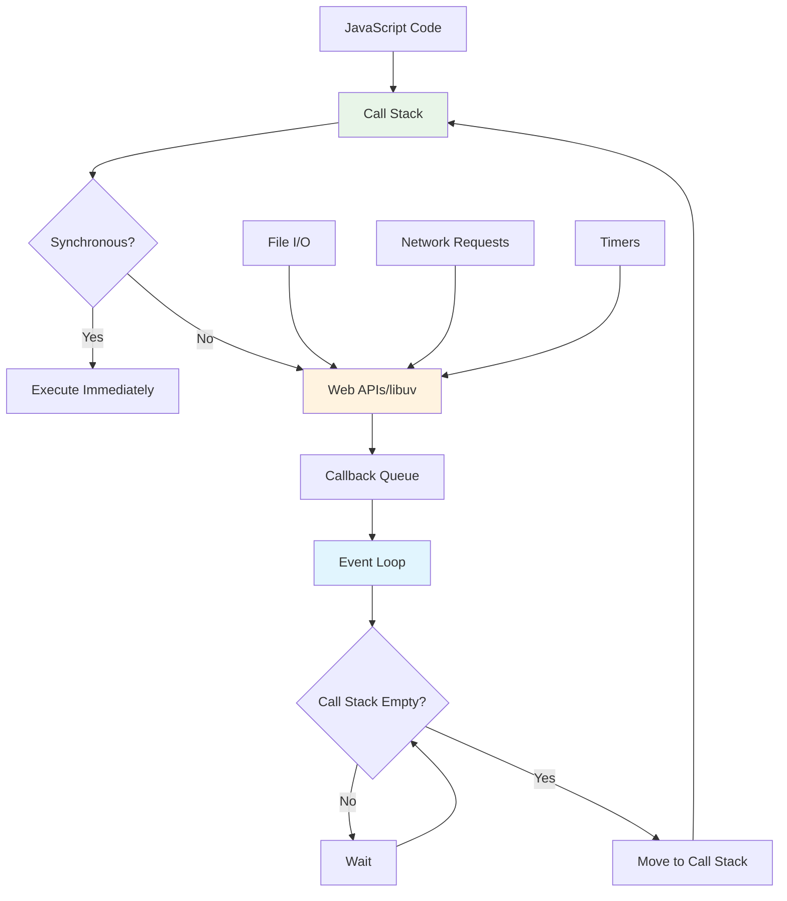

## Pengantar: Membebaskan JavaScript dari Penjara Browser

Bayangkan Node.js sebagai **kendaraan amphibi** yang memungkinkan [[JavaScript]] - yang awalnya hanya bisa "berenang" di lautan browser - untuk "berjalan di darat" sebagai server-side application. Seperti teknologi amphibi yang membuka possibilities baru dengan memungkinkan satu kendaraan beroperasi di dua environment yang berbeda, Node.js membebaskan JavaScript dari keterbatasan browser dan membawanya ke dunia server computing.

Node.js adalah [[JavaScript]] runtime yang dibangun di atas Chrome's V8 JavaScript engine, memungkinkan developers menjalankan [[JavaScript]] code di server-side. Dengan philosophy "JavaScript everywhere", Node.js memungkinkan full-stack development menggunakan satu bahasa pemrograman untuk frontend dan backend.

**Mengapa Node.js Game-Changing?**
- **Unified Language**: Satu bahasa untuk frontend dan backend development
- **Event-Driven Architecture**: Non-blocking I/O untuk high-performance applications
- **Rich Ecosystem**: [[NPM]] dengan jutaan packages siap pakai
- **Rapid Development**: Fast prototyping dan development cycles
- **Scalability**: Excellent untuk real-time applications dan microservices

## Core Architecture: Mesin Event-Driven yang Efisien

### Event Loop - Jantung Non-Blocking Operations

Event loop adalah **jantung Node.js** yang memungkinkan single-threaded application menangani thousands of concurrent connections tanpa blocking.



Event loop memungkinkan Node.js menangani I/O operations secara asynchronous, seperti pelayan restoran yang dapat melayani multiple meja tanpa harus menunggu satu pesanan selesai sebelum mengambil pesanan berikutnya.

### V8 Engine Integration

Node.js menggunakan Google's V8 engine yang sama dengan Chrome browser, memberikan [[Performance Optimization]] dan compatibility yang excellent:

```javascript
// Node.js server sederhana dengan event-driven architecture
const http = require('http');
const fs = require('fs').promises;

// Non-blocking server yang dapat handle ribuan connections
const server = http.createServer(async (req, res) => {
    try {
        // Asynchronous file reading - tidak block event loop
        const data = await fs.readFile('./data.json', 'utf8');
        
        // [[JSON]] parsing dan response
        const jsonData = JSON.parse(data);
        
        res.writeHead(200, { 'Content-Type': 'application/json' });
        res.end(JSON.stringify({
            message: 'Data retrieved successfully',
            data: jsonData,
            timestamp: new Date().toISOString()
        }));
    } catch (error) {
        res.writeHead(500, { 'Content-Type': 'application/json' });
        res.end(JSON.stringify({ error: 'Internal server error' }));
    }
});

// Server dapat handle multiple connections simultaneously
server.listen(3000, () => {
    console.log('Server running on port 3000');
});
```

## Package Management dengan NPM

### NPM Ecosystem - Perpustakaan Global JavaScript

[[NPM]] (Node Package Manager) adalah **perpustakaan global** yang menyediakan akses ke jutaan packages, memungkinkan developers membangun applications dengan standing on the shoulders of giants.

```javascript
// Package.json - manifest aplikasi Node.js
{
    "name": "modern-node-app",
    "version": "1.0.0",
    "description": "Modern Node.js application with best practices",
    "main": "server.js",
    "scripts": {
        "start": "node server.js",
        "dev": "nodemon server.js",
        "test": "jest",
        "build": "webpack --mode production"
    },
    "dependencies": {
        "express": "^4.18.0",
        "mongoose": "^6.0.0",
        "jsonwebtoken": "^8.5.1",
        "bcryptjs": "^2.4.3",
        "cors": "^2.8.5"
    },
    "devDependencies": {
        "nodemon": "^2.0.15",
        "jest": "^27.0.0",
        "supertest": "^6.1.3"
    }
}

// Modern ES6+ Node.js dengan Express framework
import express from 'express';
import mongoose from 'mongoose';
import jwt from 'jsonwebtoken';
import bcrypt from 'bcryptjs';
import cors from 'cors';

const app = express();

// Middleware setup
app.use(cors());
app.use(express.json());

// Database connection dengan error handling
mongoose.connect(process.env.MONGODB_URI)
    .then(() => console.log('Database connected'))
    .catch(err => console.error('Database connection error:', err));

// RESTful API endpoints
app.get('/api/health', (req, res) => {
    res.json({ 
        status: 'healthy', 
        uptime: process.uptime(),
        memory: process.memoryUsage()
    });
});

// Authentication middleware
const authenticateToken = (req, res, next) => {
    const authHeader = req.headers['authorization'];
    const token = authHeader && authHeader.split(' ')[1];
    
    if (!token) {
        return res.sendStatus(401);
    }
    
    jwt.verify(token, process.env.JWT_SECRET, (err, user) => {
        if (err) return res.sendStatus(403);
        req.user = user;
        next();
    });
};

const PORT = process.env.PORT || 3000;
app.listen(PORT, () => {
    console.log(`Server running on port ${PORT}`);
});
```

## Advanced Patterns dan Best Practices

### Microservices Architecture

Node.js excellent untuk microservices karena lightweight nature dan fast startup time:

```javascript
// Microservice untuk user management
import express from 'express';
import { createProxyMiddleware } from 'http-proxy-middleware';

const app = express();

// Service discovery dan load balancing
const services = {
    auth: 'http://auth-service:3001',
    users: 'http://user-service:3002',
    orders: 'http://order-service:3003'
};

// API Gateway pattern
app.use('/api/auth', createProxyMiddleware({
    target: services.auth,
    changeOrigin: true,
    pathRewrite: { '^/api/auth': '' }
}));

app.use('/api/users', createProxyMiddleware({
    target: services.users,
    changeOrigin: true,
    pathRewrite: { '^/api/users': '' }
}));

// Health check untuk service monitoring
app.get('/health', (req, res) => {
    res.json({
        service: 'api-gateway',
        status: 'healthy',
        timestamp: new Date().toISOString(),
        uptime: process.uptime()
    });
});

// Graceful shutdown handling
process.on('SIGTERM', () => {
    console.log('SIGTERM received, shutting down gracefully');
    server.close(() => {
        console.log('Process terminated');
    });
});
```

### Real-Time Applications dengan WebSockets

Node.js sangat powerful untuk real-time applications berkat event-driven architecture:

```javascript
// Real-time chat application dengan Socket.io
import express from 'express';
import { createServer } from 'http';
import { Server } from 'socket.io';
import Redis from 'ioredis';

const app = express();
const server = createServer(app);
const io = new Server(server, {
    cors: { origin: "*" }
});

// Redis untuk scaling across multiple instances
const redis = new Redis(process.env.REDIS_URL);
const pub = new Redis(process.env.REDIS_URL);
const sub = new Redis(process.env.REDIS_URL);

// Socket.io event handling
io.on('connection', (socket) => {
    console.log('User connected:', socket.id);
    
    // Join room
    socket.on('join-room', (roomId) => {
        socket.join(roomId);
        socket.to(roomId).emit('user-joined', {
            userId: socket.id,
            timestamp: new Date().toISOString()
        });
    });
    
    // Handle messages
    socket.on('send-message', async (data) => {
        const message = {
            id: generateMessageId(),
            userId: socket.id,
            content: data.content,
            roomId: data.roomId,
            timestamp: new Date().toISOString()
        };
        
        // Broadcast to room
        io.to(data.roomId).emit('new-message', message);
        
        // Store in Redis untuk persistence
        await redis.lpush(`room:${data.roomId}:messages`, JSON.stringify(message));
    });
    
    // Handle disconnect
    socket.on('disconnect', () => {
        console.log('User disconnected:', socket.id);
    });
});

// Redis pub/sub untuk multi-instance scaling
sub.subscribe('chat-events');
sub.on('message', (channel, message) => {
    const data = JSON.parse(message);
    io.to(data.roomId).emit(data.event, data.payload);
});
```

## Performance Optimization Strategies

### Clustering untuk Multi-Core Utilization

Node.js secara default single-threaded, tapi dapat memanfaatkan multiple cores dengan clustering:

```javascript
// Cluster setup untuk production
import cluster from 'cluster';
import os from 'os';
import process from 'process';

const numCPUs = os.cpus().length;

if (cluster.isPrimary) {
    console.log(`Primary ${process.pid} is running`);
    
    // Fork workers untuk setiap CPU core
    for (let i = 0; i < numCPUs; i++) {
        cluster.fork();
    }
    
    // Handle worker crashes
    cluster.on('exit', (worker, code, signal) => {
        console.log(`Worker ${worker.process.pid} died`);
        console.log('Starting a new worker');
        cluster.fork();
    });
    
    // Graceful shutdown
    process.on('SIGTERM', () => {
        console.log('SIGTERM received, shutting down workers');
        for (const id in cluster.workers) {
            cluster.workers[id].kill();
        }
    });
} else {
    // Worker process - run the actual application
    import('./app.js');
    console.log(`Worker ${process.pid} started`);
}
```

### Memory Management dan Monitoring

```javascript
// Memory monitoring dan optimization
class MemoryMonitor {
    constructor() {
        this.startTime = Date.now();
        this.memoryThreshold = 500 * 1024 * 1024; // 500MB
    }
    
    getMemoryUsage() {
        const usage = process.memoryUsage();
        return {
            rss: this.formatBytes(usage.rss),
            heapTotal: this.formatBytes(usage.heapTotal),
            heapUsed: this.formatBytes(usage.heapUsed),
            external: this.formatBytes(usage.external),
            uptime: Math.floor((Date.now() - this.startTime) / 1000)
        };
    }
    
    checkMemoryLeak() {
        const usage = process.memoryUsage();
        if (usage.heapUsed > this.memoryThreshold) {
            console.warn('Memory usage high:', this.getMemoryUsage());
            
            // Trigger garbage collection jika available
            if (global.gc) {
                global.gc();
                console.log('Garbage collection triggered');
            }
        }
    }
    
    formatBytes(bytes) {
        return Math.round(bytes / 1024 / 1024 * 100) / 100 + ' MB';
    }
    
    startMonitoring(interval = 30000) {
        setInterval(() => {
            this.checkMemoryLeak();
        }, interval);
    }
}

// Usage
const monitor = new MemoryMonitor();
monitor.startMonitoring();
```

## Integration dengan Modern Technologies

### Node.js dengan React Applications

Node.js sering digunakan sebagai backend untuk [[React]] applications, creating full-stack [[JavaScript]] solutions:

```javascript
// API server untuk React application
import express from 'express';
import path from 'path';
import { fileURLToPath } from 'url';

const __filename = fileURLToPath(import.meta.url);
const __dirname = path.dirname(__filename);

const app = express();

// Serve static React build files
app.use(express.static(path.join(__dirname, 'build')));

// API routes
app.get('/api/data', async (req, res) => {
    try {
        // Fetch data dari database atau external API
        const data = await fetchDataFromDatabase();
        res.json(data);
    } catch (error) {
        res.status(500).json({ error: 'Failed to fetch data' });
    }
});

// Server-Side Rendering untuk React (optional)
app.get('*', (req, res) => {
    res.sendFile(path.join(__dirname, 'build', 'index.html'));
});

// [[Performance Optimization]] dengan compression
import compression from 'compression';
app.use(compression());

// Security middleware
import helmet from 'helmet';
app.use(helmet());
```

### Serverless Functions

Node.js excellent untuk serverless functions karena fast cold start times:

```javascript
// AWS Lambda function dengan Node.js
export const handler = async (event, context) => {
    try {
        // Parse request
        const { httpMethod, path, body } = event;
        
        // Handle different HTTP methods
        switch (httpMethod) {
            case 'GET':
                return await handleGet(path);
            case 'POST':
                return await handlePost(JSON.parse(body));
            default:
                return {
                    statusCode: 405,
                    body: JSON.stringify({ error: 'Method not allowed' })
                };
        }
    } catch (error) {
        console.error('Lambda error:', error);
        return {
            statusCode: 500,
            body: JSON.stringify({ error: 'Internal server error' })
        };
    }
};

async function handleGet(path) {
    // Handle GET requests
    return {
        statusCode: 200,
        headers: { 'Content-Type': 'application/json' },
        body: JSON.stringify({ message: 'Success', path })
    };
}
```

## Trade-offs dan Considerations

### When to Use Node.js

| Use Case | Node.js Strength | Alternative |
|----------|------------------|-------------|
| **Real-time Apps** | Event-driven, WebSocket support | Go, Elixir |
| **API Servers** | Fast development, [[JSON]] native | Python, Java |
| **Microservices** | Lightweight, fast startup | Docker containers |
| **Full-stack JS** | Unified language | Separate backend languages |
| **I/O Heavy** | Non-blocking operations | Traditional threading |

### Performance Considerations

**Node.js Excels At:**
- I/O intensive operations
- Real-time applications
- API servers dan microservices
- Rapid prototyping

**Node.js Limitations:**
- CPU-intensive tasks (single-threaded)
- Heavy computational work
- Large monolithic applications

## Ecosystem Integration

### Development Tools

Node.js ecosystem menyediakan excellent [[Developer Experience]] dengan tools seperti:

```javascript
// Modern development setup
{
    "scripts": {
        "dev": "nodemon --exec babel-node src/server.js",
        "build": "babel src -d dist",
        "start": "node dist/server.js",
        "test": "jest --watchAll",
        "lint": "eslint src/",
        "format": "prettier --write src/"
    },
    "devDependencies": {
        "@babel/core": "^7.0.0",
        "@babel/node": "^7.0.0",
        "@babel/preset-env": "^7.0.0",
        "nodemon": "^2.0.0",
        "jest": "^27.0.0",
        "eslint": "^8.0.0",
        "prettier": "^2.0.0"
    }
}
```

## Refleksi: JavaScript Everywhere Revolution

Node.js telah merevolusi web development dengan memungkinkan [[JavaScript]] berjalan di server-side, menciptakan ecosystem "JavaScript everywhere" yang mengubah cara developers membangun applications. Seperti kendaraan amphibi yang membuka possibilities baru, Node.js memungkinkan developers menggunakan satu bahasa untuk entire technology stack.

Integration dengan modern technologies seperti [[React]], [[Machine Learning]] libraries, dan cloud platforms menciptakan ecosystem yang powerful untuk building scalable, real-time applications. Event-driven architecture dan [[NPM]] ecosystem memberikan foundation yang solid untuk rapid development dan [[Performance Optimization]].

Masa depan Node.js terletak pada continued evolution dalam areas seperti [[Performance Optimization]], better [[Threading]] support, dan deeper integration dengan cloud-native technologies. Investasi dalam Node.js adalah investasi dalam unified, efficient development experience yang memungkinkan teams untuk move fast dan build applications yang truly scalable dan maintainable.