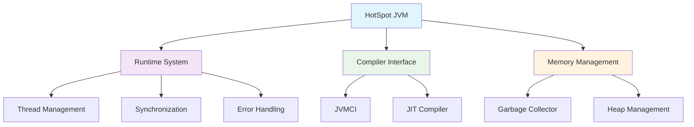
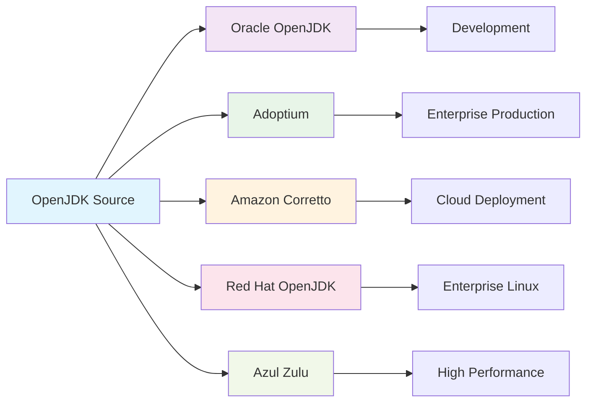
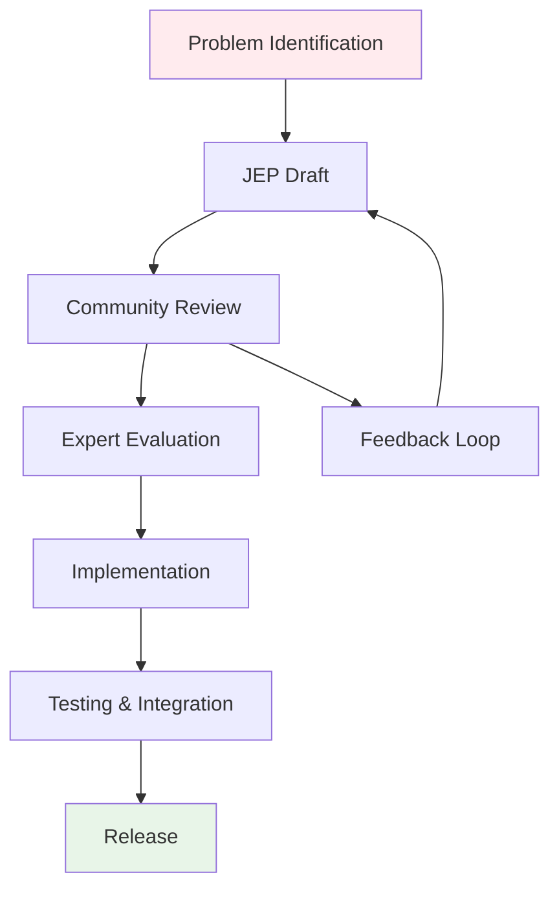

## Pengantar: Bengkel Komunitas yang Membangun Fondasi Java

Bayangkan sebuah bengkel komunitas yang terbuka 24/7, di mana para ahli dari seluruh dunia berkumpul untuk membangun dan memelihara mesin yang menggerakkan jutaan aplikasi. Bengkel ini tidak dimiliki oleh satu perusahaan, melainkan dikelola bersama dengan aturan yang transparan dan demokratis. Inilah **OpenJDK** - sebuah implementasi open source dari [[Java]] Platform Standard Edition yang menjadi fondasi bagi hampir semua distribusi [[JVM]] modern.

OpenJDK bukan sekadar kode sumber terbuka, tetapi ekosistem lengkap yang mencakup runtime environment, compiler, tools, dan class libraries. Seperti blueprint arsitektur yang dapat digunakan berbagai kontraktor untuk membangun gedung dengan spesifikasi yang sama, OpenJDK menyediakan reference implementation yang memungkinkan berbagai vendor menciptakan distribusi Java mereka sendiri.

Mengapa OpenJDK begitu penting? Karena ia memastikan bahwa [[Java]] tetap menjadi platform yang terbuka, inovatif, dan tidak tergantung pada satu vendor tunggal. Dalam dunia di mana vendor lock-in menjadi kekhawatiran utama, OpenJDK memberikan jaminan bahwa ekosistem Java akan terus berkembang secara kolaboratif.

## Arsitektur Inti: Mesin-Mesin di Bengkel

### HotSpot JVM - Jantung Bengkel

HotSpot JVM adalah mesin utama di bengkel OpenJDK, terletak di direktori `src/hotspot` dengan organisasi yang sangat terstruktur:



**Runtime System** bertindak sebagai supervisor bengkel yang mengatur:
- **OSThread abstraction**: Mengelola native OS threads dengan cara yang platform-agnostic
- **VMError handling**: Sistem pelaporan crash yang detail untuk debugging
- **Synchronization primitives**: Mekanisme koordinasi antar thread yang efisien

**JVMCI (JVM Compiler Interface)** memungkinkan compiler berbasis Java untuk berinteraksi langsung dengan HotSpot, seperti memberikan akses khusus kepada spesialis untuk memodifikasi mesin dengan tools canggih mereka sendiri.

### Class Libraries - Perpustakaan Tools

Class libraries OpenJDK diorganisir dalam sistem modular dengan `java.base` sebagai modul fundamental. Seperti rak-rak tools yang terorganisir berdasarkan fungsi, setiap modul memiliki tanggung jawab spesifik dan dependencies yang jelas.

### Development Tools - Peralatan Bengkel

OpenJDK menyediakan suite lengkap development tools:
- **javac**: Compiler yang mengubah source code menjadi bytecode
- **java**: Launcher yang menjalankan aplikasi dengan berbagai opsi konfigurasi
- **JVMTI**: Interface untuk monitoring dan debugging tools

## Ekosistem Distribusi: Berbagai Produk dari Blueprint yang Sama

Seperti berbagai kontraktor yang menggunakan blueprint arsitektur yang sama untuk membangun gedung dengan karakteristik unik, berbagai vendor menciptakan distribusi OpenJDK mereka sendiri:

| Distribusi | Vendor | Karakteristik Utama | Target Use Case |
|------------|--------|-------------------|-----------------|
| **Oracle OpenJDK** | Oracle | Reference implementation resmi | Development dan testing |
| **Adoptium (Eclipse Temurin)** | Eclipse Foundation | Long-term support, multi-platform | Production enterprise |
| **Amazon Corretto** | Amazon | Optimized untuk AWS, gratis | Cloud applications |
| **Red Hat OpenJDK** | Red Hat | Enterprise support, RHEL integration | Enterprise Linux environments |
| **Azul Zulu** | Azul Systems | Performance optimizations | High-performance applications |



Perbedaan utama antar distribusi terletak pada:
- **Support lifecycle**: Durasi dan jenis dukungan yang diberikan
- **Performance optimizations**: Tuning khusus untuk use case tertentu
- **Licensing**: Model lisensi untuk penggunaan komersial
- **Platform support**: Coverage platform dan arsitektur yang didukung

## Proses Development: Aturan Main di Bengkel

### Build System - Mesin Produksi

Build system OpenJDK dirancang dengan filosofi "what, not how" - fokus pada hasil yang diinginkan daripada cara mencapainya. Seperti jalur produksi otomatis di pabrik modern:

**Boot JDK Requirement**: Untuk membangun JDK versi N, diperlukan JDK versi N-1 sebagai "bahan baku". Ini seperti memerlukan mesin yang sudah jadi untuk membuat mesin yang lebih baru.

**Configure Script**: Sistem deteksi otomatis yang memeriksa:
- Native compiler toolchain
- External libraries (FreeType, Fontconfig)
- Platform-specific dependencies
- Build environment setup

**Make Targets**: Tahapan build yang terorganisir:
```bash
make configure  # Setup build environment
make images     # Build complete JDK
make test-tier1 # Run basic verification tests
```

### JEP Process - Sistem Inovasi

Java Enhancement Proposals (JEP) adalah mekanisme formal untuk menambahkan fitur baru, seperti sistem proposal perbaikan di bengkel komunitas:



Contoh JEP yang telah diimplementasi:
- **JEP 378**: Text Blocks (Java 15) - Sintaks string multi-line yang lebih bersih
- **JEP 394**: Pattern Matching untuk instanceof (Java 16) - Simplifikasi type checking
- **JEP 395**: Records (Java 16) - Data classes yang immutable

### Governance Model - Aturan Bengkel

OpenJDK menggunakan model governance yang transparan dan meritokratis:
- **Open contribution**: Siapa saja dapat berkontribusi dengan mengikuti aturan yang jelas
- **GNU GPL v2 + Classpath Exception**: Lisensi yang memastikan kebebasan dan kompatibilitas
- **OpenJDK Developers' Guide**: Panduan resmi untuk kontributor

## Implementasi Praktis: Cara Kerja di Bengkel

### Building dari Source

Proses build OpenJDK mengikuti pola yang konsisten:


```bash
# 1. Clone repository
git clone https://git.openjdk.org/jdk

# 2. Configure build environment
bash configure --with-boot-jdk=/path/to/jdk-N-1

# 3. Build JDK images
make images

# 4. Verify build
./build/*/jdk/bin/java -version

# 5. Run basic tests
make test-tier1
```


**Build Output Structure**:
- `build/<configuration>/jdk/`: Exploded JDK image yang dapat langsung dijalankan
- `build/<configuration>/images/`: Final JDK distribution
- `build/<configuration>/test-results/`: Hasil testing
- `build/<configuration>/support/`: Intermediate build files

### Platform Support Strategy

OpenJDK mendukung multiple platform dengan strategi abstraksi yang elegant:
- **Linux**: Platform utama dengan dukungan penuh
- **macOS**: Native support dengan Apple Silicon optimization
- **Windows**: Memerlukan POSIX layer (Cygwin, MSYS2, WSL)
- **AIX**: Enterprise Unix support

### Performance Considerations

**Hot Path Optimization**: HotSpot JVM menggunakan profiling data untuk mengoptimalkan code paths yang sering dieksekusi, seperti mekanik bengkel yang mengatur tools berdasarkan frekuensi penggunaan.

**Memory Management**: Garbage collector yang adaptive dapat menyesuaikan strategi berdasarkan application behavior dan available resources.

## Refleksi: Kekuatan Kolaborasi Terbuka

OpenJDK membuktikan bahwa model pengembangan open source dapat menghasilkan software enterprise-grade yang robust dan inovatif. Seperti bengkel komunitas yang menghasilkan karya berkualitas tinggi melalui kolaborasi para ahli, OpenJDK menunjukkan bahwa transparansi, standar yang jelas, dan governance yang baik dapat menciptakan ekosistem teknologi yang sustainable.

Keberhasilan OpenJDK terletak pada kemampuannya menyeimbangkan stabilitas enterprise dengan inovasi yang berkelanjutan. Melalui JEP process, komunitas dapat mengusulkan dan mengimplementasikan fitur baru tanpa mengorbankan backward compatibility. Melalui multiple distributions, berbagai vendor dapat mengoptimalkan Java untuk use case spesifik mereka sambil tetap menjaga interoperability.

Bagi developer modern, memahami OpenJDK bukan hanya tentang mengetahui cara kerja [[Java]], tetapi juga tentang menghargai kekuatan kolaborasi open source dalam membangun fondasi teknologi yang kita gunakan setiap hari. OpenJDK adalah bukti nyata bahwa ketika komunitas global bersatu dengan visi yang sama, mereka dapat menciptakan sesuatu yang lebih besar dari jumlah bagian-bagiannya.