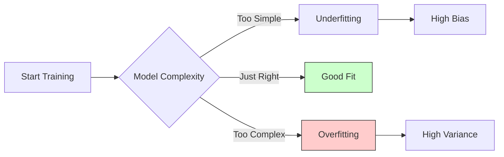

## Pengantar: Penjahit dan Jas "Sempurna"

Bayangkan Anda pergi ke seorang penjahit yang sangat obsesif. Dia tidak hanya mengukur lingkar dada dan pinggang Anda, tetapi juga mengukur posisi dompet di saku belakang, sedikit bungkuk di bahu kiri karena Anda sedang lelah, dan bahkan lipatan baju dalam Anda saat itu.

Dia menjahit jas yang **sangat sempurna** mengikuti semua detail tersebut (Training Data). Saat Anda mencobanya di toko, jas itu melekat tanpa celah sedikitpun. Akurasinya 100% terhadap tubuh Anda *saat itu*.

Namun, minggu depan saat Anda memakainya ke pesta pernikahan (Test Data/Real World):
*   Anda tidak bisa duduk karena jasnya terlalu ketat di bagian dompet (yang sudah Anda pindahkan).
*   Jahitannya robek saat Anda berdiri tegak (karena bungkuk Anda sudah hilang).
*   Jas tersebut tidak bisa dipakai karena ia mempelajari **kebisingan** (noise) dan detail yang tidak relevan, bukan hanya struktur tubuh Anda yang sebenarnya.

Inilah **Overfitting**. Sebuah kondisi di mana model "menghafal" data latihan terlalu detail hingga kehilangan kemampuan untuk melakukan generalisasi pada data baru.

## Mengapa Jas Bisa Terlalu Sempit?

Dalam dunia [[Machine Learning]], overfitting terjadi ketika model terlalu fleksibel atau kompleks dibandingkan dengan jumlah data yang tersedia.

### 1. Kompleksitas Berlebihan (Too Many Features)
Seperti penjahit yang mengukur setiap jerawat dan tahi lalat, model menggunakan parameter yang terlalu banyak untuk menjelaskan pola yang sederhana.
*   **Contoh**: Menggunakan polinomial derajat 10 untuk memprediksi garis lurus.

### 2. Data yang Sedikit (Small Dataset)
Jika penjahit hanya melihat Anda dalam satu pose selama 5 detik, dia akan menganggap posisi tangan Anda yang sedang menggaruk hidung sebagai bagian permanen dari anatomi tubuh Anda.
*   **Realita**: Model menarik kesimpulan besar dari sampel yang terlalu kecil ([[Sampling Bias]]).

### 3. Mempelajari Kebisingan (Noise)
Data seringkali kotor. Overfitting terjadi ketika model menganggap variasi acak (seperti *glitch* sensor atau salah ketik) sebagai pola yang harus dipatuhi.

## Deteksi: Ilusi Kecerdasan

Bagaimana kita tahu jika penjahit kita sudah berlebihan? Kita melihat perbedaan performanya di "Toko" vs "Dunia Nyata".

| Metrik | Indikasi Overfitting | Analogi Penjahit |
| :--- | :--- | :--- |
| **Training Accuracy** | Sangat Tinggi (99-100%) | Jas pas sempurna saat <i>fitting</i>. |
| **Validation/Test Accuracy** | Rendah / Buruk | Jas robek saat dipakai duduk. |
| **Gap** | Besar | Perbedaan kenyamanan drastis. |

> **Diagram**: Keseimbangan kompleksitas. Saat kita bergerak ke kanan (semakin kompleks), error pada data latihan turun (garis biru imajiner), tapi error pada data tes (garis merah) akan mulai naik kembali membentuk kurva U.

## Solusi: Melonggarkan Jahitan

Untuk mencegah jas robek, kita perlu memberitahu penjahit untuk tidak terlalu obsesif.

### 1. Lebih Banyak Data ([[Data Augmentation]])
Minta penjahit mengukur Anda dalam berbagai posisi: duduk, berdiri, berlari. Dengan melihat variasi, dia akan tahu bahwa posisi dompet itu tidak permanen.
*   Dalam [[Computer Vision]], ini berarti memutar, memotong, atau mencerahkan gambar.

### 2. Regularisasi ([[Regularization]])
Ini adalah aturan ketat untuk penjahit: "Jangan pernah membuat jahitan lebih ketat dari 1 cm dari kulit."
*   **L1/L2 Regularization**: Menghukum model jika bobot (parameter) terlalu besar atau kompleks.
*   **Dropout**: Secara acak mengabaikan beberapa neuron selama latihan, memaksa jaringan untuk tidak bergantung pada satu fitur saja (seperti melarang penjahit mengandalkan ukuran bahu kiri saja).

### 3. Sederhanakan Model ([[Pruning]])
Jangan gunakan kain sutra 1000 lapis untuk baju tidur. Kurangi jumlah *layer* atau *node* pada [[Neural Networks]] jika masalahnya sederhana.

### 4. Early Stopping
Berhentilah menjahit saat jas sudah pas. Jangan terus memperbaikinya sampai ke tingkat mikroskopis. Hentikan *training* saat validasi error mulai naik, meskipun training error masih turun.

## Refleksi: Seni Generalisasi

Tujuan akhir dari [[Artificial Intelligence]] bukanlah ingatan fotografis, melainkan pemahaman prinsip. Seperti seorang murid yang tidak menghafal kunci jawaban (Overfitting) tetapi memahami rumus dasarnya, model yang baik adalah model yang bisa beradaptasi dengan soal ujian yang belum pernah ia lihat sebelumnya.

Overfitting adalah pengingat bahwa terkadang, menjadi "kurang sempurna" di laboratorium adalah kunci untuk bertahan hidup di dunia nyata.

---
**Lihat juga**:
*   [[Bias Variance Tradeoff]] - Teori di balik keseimbangan ini.
*   [[Underfitting]] - Kebalikan dari masalah ini (jas karung kentang).
*   [[Cross Validation]] - Cara menguji jas sebelum dijahit mati.
