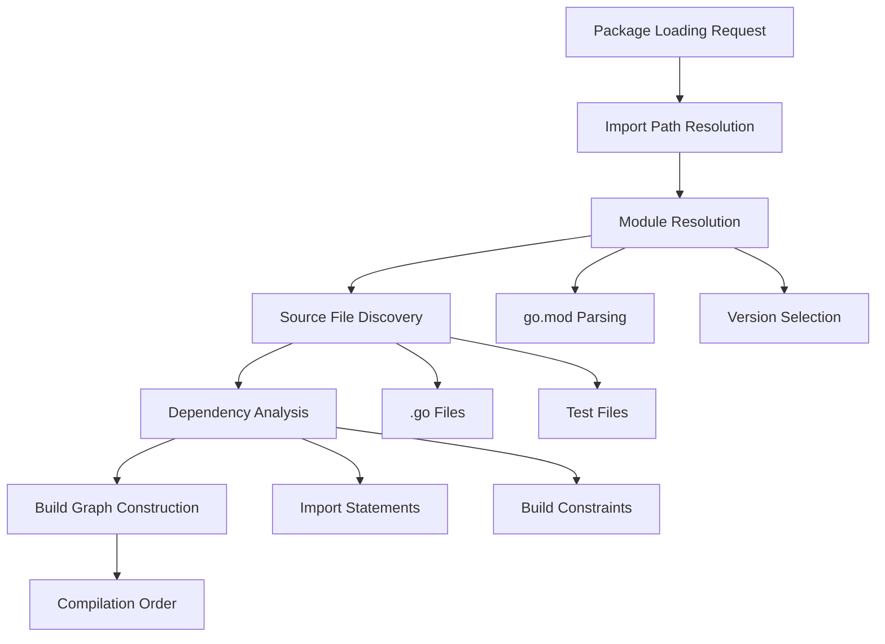

## Pengantar: Logistik Kode Cerdas

Package Loading adalah **sistem transportasi cerdas** yang membawa kode dari berbagai lokasi ke dalam proses kompilasi. Seperti sistem logistik modern yang mengoptimalkan rute pengiriman, package loader memastikan semua dependencies dimuat dengan urutan yang benar dan efisien.

## Arsitektur Loading: Peta Distribusi

### Load.Package Function - Dispatcher Utama
- **Central coordination** untuk package resolution
- Import path resolution ke actual source locations
- Dependency graph construction untuk build planning
- Integration dengan [[Module System]] untuk version resolution



## Loading Process: Alur Kerja Sistematis

### Root Package Identification
- **Starting points** untuk dependency traversal
- Command-line arguments parsing
- Main package detection
- Test package inclusion logic

### Iterative Expansion - Penjelajahan Bertahap
- **loadFromRoots function** manages expansion process
- Parallel work-queue untuk handling imports
- Circular dependency detection dan prevention
- Build constraint evaluation untuk conditional loading

### Import Resolution Pipeline
```go
// Simplified loading pipeline
func LoadPackages(patterns []string) []*Package {
    // 1. Parse patterns dan identify roots
    roots := parsePatterns(patterns)
    
    // 2. Expand dependencies iteratively  
    packages := expandDependencies(roots)
    
    // 3. Resolve import paths
    resolveImports(packages)
    
    // 4. Apply build constraints
    applyBuildConstraints(packages)
    
    return packages
}
```

## Integration dengan Build System

### Module-Aware Loading
- **Module system integration** untuk dependency resolution
- go.mod file parsing dan interpretation
- Replace directive handling untuk local development
- Workspace mode support untuk multi-module projects

### Build Cache Coordination
- **Incremental loading** dengan build cache integration
- Package fingerprinting untuk change detection
- Cached metadata reuse untuk performance
- Invalidation strategies untuk correctness

## Package Metadata Management

### Export Data Utilization
- **Interface information** dari compiled packages
- Type checking acceleration dengan cached exports
- Cross-package optimization opportunities
- Integration dengan [[Go Compiler]] export system

### Build Constraints Processing
| Constraint Type | Example | Purpose |
|----------------|---------|---------|
| OS-specific | `//go:build linux` | Platform targeting |
| Architecture | `//go:build amd64` | CPU architecture |
| Build tags | `//go:build debug` | Feature flags |
| Go version | `//go:build go1.18` | Language features |

## Performance Optimizations

### Parallel Processing
- **Concurrent import resolution** untuk faster loading
- Work-stealing algorithms untuk load balancing
- Dependency-aware scheduling untuk optimal ordering
- Memory-efficient data structures untuk large projects

### Caching Strategies
- **Package metadata caching** across builds
- Import graph memoization
- File system operation optimization
- Network request minimization untuk remote packages

## Error Handling dan Diagnostics

### Import Error Resolution
- **Clear error messages** untuk missing packages
- Suggestion system untuk typos dan alternatives
- Circular dependency reporting dengan cycle visualization
- Build constraint conflict detection

### Debugging Support
```bash
# Package loading debugging
go list -json ./...           # Detailed package info
go mod graph                  # Dependency graph
go list -m all               # Module information
GODEBUG=modload=1 go build   # Verbose loading
```

## Testing Infrastructure Integration

### Test Package Loading
- **Test file discovery** dan organization
- External test package handling (_test suffix)
- Test dependency resolution
- Benchmark dan example function identification

### Coverage Instrumentation
- **Source code modification** untuk coverage tracking
- Import injection untuk coverage runtime
- File coordination untuk coverage data collection
- Integration dengan [[Testing Infrastructure]]

## Advanced Loading Features

### Vendor Directory Support
- **Vendored dependency loading** untuk offline builds
- Vendor vs module priority resolution
- Consistency checking antar vendor dan go.mod
- Migration support dari vendor ke modules

### Plugin Loading (Deprecated)
- **Dynamic library loading** untuk plugins
- Symbol resolution dan type checking
- Runtime plugin management
- Security considerations untuk dynamic code

## Best Practices untuk Package Organization

### Import Path Design
- **Meaningful package names** yang descriptive
- Avoid stuttering (package name repetition)
- Consistent naming conventions
- Clear package boundaries dan responsibilities

### Dependency Management
- **Minimal dependency graphs** untuk faster loading
- Avoid circular dependencies
- Interface segregation untuk loose coupling
- Version pinning strategies untuk stability

---

*Catatan ini mengeksplorasi Package Loading system Go sebagai foundation untuk efficient build process dan dependency management.*