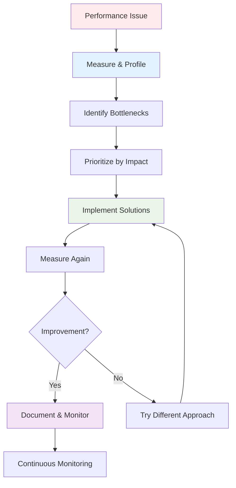

## Pengantar: Mekanik Ahli yang Mengoptimalkan Performa Maksimal

Bayangkan Performance Optimization sebagai **mekanik Formula 1 yang genius** yang dapat menganalisis setiap komponen mesin, mengidentifikasi bottlenecks, dan melakukan fine-tuning untuk mencapai performa maksimal. Seperti mekanik yang mengoptimalkan aerodinamika, weight distribution, dan engine efficiency, performance optimization melibatkan systematic analysis dan improvement dari berbagai aspek system untuk mencapai speed, responsiveness, dan efficiency yang optimal.

Performance Optimization adalah systematic process untuk meningkatkan speed, efficiency, dan responsiveness dari software applications atau systems. Ini melibatkan profiling, analysis, dan targeted improvements pada bottlenecks untuk mencapai optimal resource utilization dan user experience. Dalam konteks modern web development, ini mencakup [[React]] optimization, [[JavaScript]] performance tuning, [[Lazy Loading]] strategies, dan [[Concurrent Features]] implementation.

**Mengapa Performance Optimization Critical?**
- **User Experience**: Faster applications = happier users dan higher retention
- **Business Impact**: 100ms improvement dapat increase conversion rates hingga 1%
- **Resource Efficiency**: Optimal performance mengurangi infrastructure costs
- **Competitive Advantage**: Superior performance menjadi differentiator dalam market**

## Core Principles: Metodologi Tuning Sistematis

### Measurement-First Approach - Diagnosis Sebelum Treatment

Seperti **mekanik yang menggunakan diagnostic tools** sebelum membongkar mesin, performance optimization harus dimulai dengan measurement dan profiling yang akurat.

### Frontend Performance Optimization

**[[React]] Application Optimization:**
- Component memoization dengan React.memo dan useMemo
- [[Lazy Loading]] untuk code splitting dan dynamic imports
- [[Concurrent Features]] untuk non-blocking rendering
- Virtual scrolling untuk large lists

**[[JavaScript]] Performance:**
- Bundle size optimization dan tree shaking
- [[Asynchronous Programming]] untuk non-blocking operations
- [[Memory Management]] untuk preventing memory leaks
- [[Threading]] dengan Web Workers untuk heavy computations

### Backend Performance Strategies

**Database Optimization:**
- Query optimization dan indexing strategies
- Connection pooling dan caching layers
- [[Serialization]] optimization untuk data transfer
- [[JSON]] parsing efficiency improvements

**Server Performance:**
- [[Native Performance]] optimizations
- [[Zero-Copy]] operations untuk data transfer
- Load balancing dan horizontal scaling
- [[Hot Reloading]] untuk development efficiency

## Integration dengan Modern Technologies

Performance optimization dalam era modern web development tidak bisa dipisahkan dari [[Developer Experience]] dan [[Rendering]] strategies. Tools seperti [[WebView]] optimization untuk hybrid apps dan [[Native Code]] integration memerlukan pendekatan holistik yang mempertimbangkan seluruh technology stack.

## Refleksi: Mesin yang Terus Berevolusi

Performance optimization adalah journey, bukan destination. Seperti mekanik Formula 1 yang terus mengembangkan teknologi baru untuk mencapai kecepatan maksimal, developers harus terus belajar dan mengadaptasi teknik-teknik optimization terbaru untuk membangun applications yang truly performant dan user-friendly.

Integration dengan [[Concurrent React]], [[Suspense]], dan modern development practices menciptakan ecosystem yang memungkinkan applications untuk deliver exceptional performance sambil maintaining code quality dan [[Developer Experience]] yang optimal.