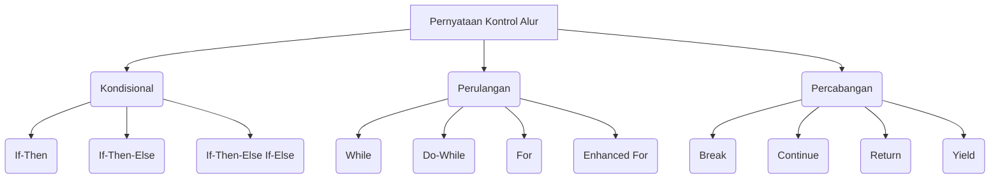

## Pengantar: Sutradara Alur Cerita

Dalam dunia [[Pemrograman|pemrograman]], sebuah program adalah seperti sebuah film dengan alur cerita yang kompleks. [[Pernyataan Kontrol Alur|Pernyataan kontrol alur]] adalah sutradara yang mengarahkan jalannya cerita, memutuskan adegan mana yang akan dimainkan, berapa kali adegan itu diulang, dan kapan sebuah adegan harus dihentikan atau dilewati. Tanpa sutradara ini, cerita akan berjalan secara linier dan monoton. Dengan pernyataan kontrol alur, kita dapat menciptakan narasi yang dinamis, interaktif, dan penuh kejutan, memungkinkan program untuk merespons berbagai skenario. Konten ini akan membahas berbagai pernyataan kontrol alur di Java, berdasarkan panduan dari [[Dev.java|sumber resmi Java]].

## Pernyataan Kondisional: Memilih Adegan

Pernyataan kondisional adalah sutradara yang memutuskan adegan mana yang akan ditampilkan berdasarkan kondisi tertentu. Ini seperti sutradara yang berkata, "Jika hujan, kita syuting adegan di dalam ruangan; jika tidak, kita syuting di luar."

### `if-then`
- Paling dasar, mengeksekusi blok kode hanya jika kondisi `true`.

```java
void applyBrakes() {
    if (isMoving){ // Jika sepeda bergerak
        currentSpeed--; // Kurangi kecepatan
    }
}
```


### `if-then-else`
- Menyediakan jalur eksekusi alternatif jika kondisi `if` adalah `false`.

```java
void applyBrakes() {
    if (isMoving) {
        currentSpeed--;
    } else {
        System.err.println("The bicycle has already stopped!"); // Pesan error jika sudah berhenti
    }
}
```


### `if-then-else if-else`
- Rangkaian kondisi untuk memilih dari beberapa jalur. Hanya satu blok yang akan dieksekusi.

```java
class IfElseDemo {
    public static void main(String[] args) {
        int testscore = 76;
        char grade;

        if (testscore >= 90) {
            grade = 'A';
        } else if (testscore >= 80) {
            grade = 'B';
        } else if (testscore >= 70) {
            grade = 'C';
        } else if (testscore >= 60) {
            grade = 'D';
        } else {
            grade = 'F';
        }
        System.out.println("Grade = " + grade);
    }
}
```


## Pernyataan Perulangan: Mengulang Adegan

Pernyataan perulangan adalah sutradara yang memerintahkan untuk mengulang sebuah adegan berkali-kali sampai kondisi tertentu terpenuhi. Ini seperti mengulang sebuah take sampai sempurna.

### `while`
- Mengeksekusi blok pernyataan secara terus-menerus selama kondisi `true`.

```java
class WhileDemo {
    public static void main(String[] args){
        int count = 1;
        while (count < 11) {
            System.out.println("Count is: " + count);
            count++;
        }
    }
}
```


### `do-while`
- Mirip dengan `while`, tetapi kondisi dievaluasi di akhir, sehingga blok `do` selalu dieksekusi setidaknya sekali.

```java
class DoWhileDemo {
    public static void main(String[] args){
        int count = 1;
        do {
            System.out.println("Count is: " + count);
            count++;
        } while (count < 11);
    }
}
```


### `for`
- Cara ringkas untuk mengulang dalam rentang nilai, sering disebut "for loop".

```java
for (int i = 1; i < 11; i++) {
    System.out.println("Count is: " + i);
}
```


### `for` yang Ditingkatkan (Enhanced `for`)
- Untuk iterasi melalui koleksi dan array, membuat loop lebih ringkas dan mudah dibaca.

```java
int[] numbers = {1,2,3,4,5,6,7,8,9,10};
for (int item : numbers) {
    System.out.println("Count is: " + item);
}
```


## Pernyataan Percabangan: Mengubah Arah Cerita

Pernyataan percabangan adalah sutradara yang dapat mengubah arah cerita secara tiba-tiba, melompati bagian tertentu atau mengakhiri adegan.

### `break`
- Mengakhiri loop `for`, `while`, `do-while`, atau `switch` terdekat. Dapat berlabel untuk mengakhiri loop luar.

```java
// Unlabeled break
for (int i = 0; i < 100; i++) {
    if (i == 50) {
        break; // Keluar dari loop saat i mencapai 50
    }
    System.out.println(i);
}

// Labeled break
search: // Label
for (int i = 0; i < 3; i++) {
    for (int j = 0; j < 3; j++) {
        if (i == 1 && j == 1) {
            break search; // Keluar dari loop luar
        }
        System.out.println("i = " + i + ", j = " + j);
    }
}
```


### `continue`
- Melewatkan iterasi saat ini dari loop `for`, `while`, atau `do-while` dan melanjutkan ke iterasi berikutnya. Dapat berlabel untuk melewatkan iterasi loop luar.

```java
String searchMe = "peter piper picked a peck of pickled peppers";
int max = searchMe.length();
int numPs = 0;

for (int i = 0; i < max; i++) {
    if (searchMe.charAt(i) != 'p') {
        continue; // Lewati jika bukan 'p'
    }
    numPs++;
}
System.out.println("Found " + numPs + " p's in the string.");
```


### `return`
- Keluar dari metode saat ini dan mengembalikan kontrol ke tempat metode dipanggil. Dapat mengembalikan nilai atau tidak (untuk metode `void`).

```java
public int calculateSum(int a, int b) {
    return a + b; // Mengembalikan nilai
}

public void printMessage(String message) {
    System.out.println(message);
    return; // Keluar dari metode void
}
```


### `yield`
- Keluar dari ekspresi `switch` saat ini dan menghasilkan nilai. Digunakan dalam `switch expression` (Java 14+).

```java
String day = "MONDAY";
String result = switch (day) {
    case "MONDAY", "FRIDAY", "SUNDAY" -> "6";
    case "TUESDAY" -> "7";
    case "THURSDAY", "SATURDAY" -> "8";
    case "WEDNESDAY" -> "9";
    default -> {
        yield "Invalid day."; // Menghasilkan nilai dari blok
    }
};
System.out.println(result);
```


## Diagram: Peta Alur Cerita Program

Berikut adalah diagram yang memvisualisasikan berbagai pernyataan kontrol alur, seperti peta alur cerita yang digunakan oleh sutradara:


Diagram di atas menggambarkan "Peta Alur Cerita Program" yang dipimpin oleh "Sutradara Alur Cerita". Kategori utama adalah Pernyataan Kontrol Alur, yang bercabang menjadi Kondisional (memilih adegan), Perulangan (mengulang adegan), dan Percabangan (mengubah arah cerita). Setiap sub-kategori menunjukkan jenis pernyataan spesifik yang telah kita bahas, memberikan gambaran visual tentang bagaimana program dapat mengarahkan alurnya secara dinamis.

## Refleksi: Mengarahkan Simfoni Kode

Sebagai sutradara yang mahir mengarahkan alur cerita sebuah film, seorang programmer yang menguasai pernyataan kontrol alur dapat menciptakan program yang dinamis dan responsif. Setiap pernyataan kondisional adalah keputusan penting yang membentuk narasi, setiap perulangan adalah adegan yang diulang untuk mencapai tujuan, dan setiap percabangan adalah perubahan arah yang strategis. Dengan memahami bagaimana "Sutradara Alur Cerita" ini bekerja, kita tidak hanya menulis kode; kita sedang menyusun sebuah simfoni digital yang kompleks dan menarik. Kemampuan untuk mengontrol alur eksekusi adalah fondasi dari setiap program yang efektif, memungkinkan kita untuk membangun solusi yang cerdas dan adaptif dalam perjalanan [[Belajar Pemrograman|pemrograman]] kita.
