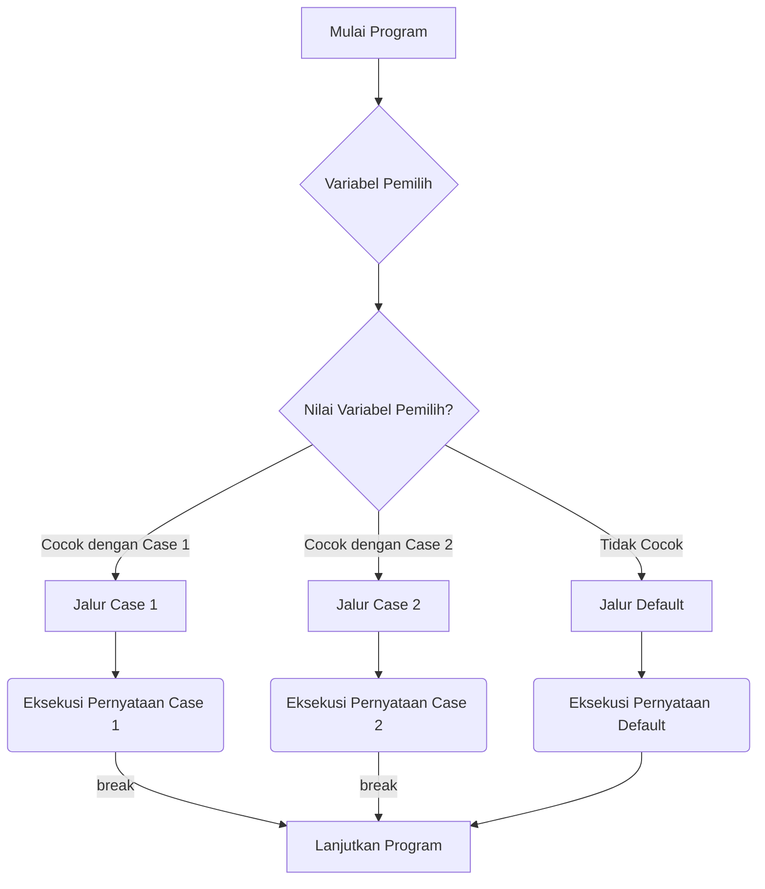

## Pengantar: Pintu Gerbang Pilihan dalam Kode

Dalam dunia [[Pemrograman Java]], seringkali kita dihadapkan pada persimpangan jalan di mana program harus memilih jalur eksekusi berdasarkan kondisi tertentu. Jika [[Pernyataan Kontrol Alur|`if-else`]] ibarat persimpangan tunggal dengan dua arah, maka `switch statement` adalah sebuah "Pintu Gerbang Pilihan" yang megah, menawarkan banyak jalur alternatif yang dapat diambil oleh alur program. Setiap jalur ini mengarah pada serangkaian tindakan yang berbeda, memungkinkan kode kita bereaksi secara dinamis terhadap berbagai skenario.

## Anatomi Pintu Gerbang: Memahami `switch`

`switch statement` adalah salah satu dari lima pernyataan kontrol alur utama dalam bahasa Java. Ia mengambil sebuah variabel "pemilih" (selector variable) sebagai argumen dan menggunakan nilai dari variabel ini untuk memilih jalur eksekusi yang akan dijalankan.

### Kunci Pembuka Pintu: Tipe Data yang Diizinkan

Tidak semua kunci dapat membuka pintu gerbang ini. Variabel pemilih harus dari tipe data tertentu:
- Tipe data primitif: `byte`, `short`, `char`, dan `int`.
- Tipe wrapper: `Character`, `Byte`, `Short`, dan `Integer`.
- Tipe `enum` (enumerated types).
- Tipe `String` (sejak Java SE 7).

Penting untuk diingat bahwa tipe data primitif seperti `boolean`, `long`, `float`, dan `double` **tidak dapat** digunakan sebagai variabel pemilih.

### Jalur-Jalur di Balik Pintu: `case` dan `default`

Setiap jalur di dalam pintu gerbang ini ditandai dengan label `case`. Ketika nilai variabel pemilih cocok dengan salah satu label `case`, program akan memasuki jalur tersebut dan mengeksekusi semua pernyataan yang mengikutinya.

```java
int quarter = 0; // nilai apa pun

String quarterLabel = null;
switch (quarter) {
    case 0: quarterLabel = "Q1 - Winter"; 
            break;
    case 1: quarterLabel = "Q2 - Spring"; 
            break;
    case 2: quarterLabel = "Q3 - Summer"; 
            break;
    case 3: quarterLabel = "Q3 - Summer"; 
            break;
    default: quarterLabel = "Unknown quarter";
};
```

### Penjaga Pintu: Kata Kunci `break`

Tanpa "penjaga pintu" yaitu kata kunci `break`, program akan terus berjalan melalui semua jalur `case` berikutnya setelah menemukan kecocokan pertama. Fenomena ini dikenal sebagai "fall-through". `break` berfungsi untuk menghentikan eksekusi `switch statement` dan melanjutkan alur program setelah blok `switch`.

```java

int month = 8;
List<String> futureMonths = new ArrayList<>();

switch (month) {
    case 1:  futureMonths.add("January");
    case 2:  futureMonths.add("February");
    case 3:  futureMonths.add("March");
    case 4:  futureMonths.add("April");
    case 5:  futureMonths.add("May");
    case 6:  futureMonths.add("June");
    case 7:  futureMonths.add("July");
    case 8:  futureMonths.add("August");
    case 9:  futureMonths.add("September");
    case 10: futureMonths.add("October");
    case 11: futureMonths.add("November");
    case 12: futureMonths.add("December");
             break;
    default: break;
}

```
Meskipun `break` terakhir secara teknis tidak wajib karena alur akan keluar dari `switch`, penggunaannya sangat direkomendasikan untuk kemudahan modifikasi dan mengurangi potensi kesalahan.

### Jalur Darurat: `default`

Jika tidak ada `case` yang cocok dengan nilai variabel pemilih, program akan mencari jalur `default`. Ini adalah "jalur darurat" yang menangani semua nilai yang tidak ditangani secara eksplisit oleh `case` lainnya.

### Pintu Ganda: Multiple `case` Labels

Satu pernyataan dapat memiliki beberapa label `case`, memungkinkan beberapa kondisi memicu tindakan yang sama.

```java
int month = 2;
int year = 2021;
int numDays = 0;

switch (month) {
    case 1: case 3: case 5:   // Januari, Maret, Mei
    case 7: case 8: case 10:  // Juli, Agustus, Oktober
    case 12:
        numDays = 31;
        break;
    case 4: case 6:   // April, Juni
    case 9: case 11:  // September, November
        numDays = 30;
        break;
    case 2: // Februari
        if (((year % 4 == 0) && 
             !(year % 100 == 0))
             || (year % 400 == 0))
            numDays = 29;
        else
            numDays = 28;
        break;
    default:
        // IO.println("Invalid month."); // Asumsi IO.println adalah metode output
        System.out.println("Bulan tidak valid.");
        break;
}
```

## Memilih Pintu Gerbang atau Persimpangan: `switch` vs `if-then-else`

Memutuskan antara `switch statement` dan [[Pernyataan Kontrol Alur|`if-then-else`]] bergantung pada keterbacaan dan jenis ekspresi yang diuji.
- `if-then-else` dapat menguji ekspresi berdasarkan rentang nilai atau kondisi kompleks.
- `switch statement` hanya menguji ekspresi berdasarkan nilai tunggal (integer, `enum`, atau `String`).

Contoh yang bisa ditulis dengan `switch`:
```java
int month = 1; // bulan apa pun
if (month == 1) {
    System.out.println("January");
} else if (month == 2) {
    System.out.println("February");
} // ... dan seterusnya
```

Contoh yang **tidak bisa** ditulis dengan `switch` karena tidak mendukung label tipe `boolean`:
```java
int temperature = -5; // suhu apa pun
if (temperature < 0) {
    System.out.println("Air adalah es");
} else if (temperature < 100){
    System.out.println("Air adalah cairan");
} else {
    System.out.println("Air adalah uap");
}
```

## Pintu Gerbang dengan Label Teks: Menggunakan `String`

Sejak Java SE 7, `String` dapat digunakan sebagai tipe untuk label `case`. Perbandingan `String` dilakukan seolah-olah menggunakan metode `String.equals()`. Untuk menangani kasus huruf besar/kecil, `String` pemilih seringkali dikonversi ke huruf kecil terlebih dahulu.

```java
String month = "January"; // bulan apa pun
int monthNumber = -1;

switch (month.toLowerCase()) {
    case "january":
        monthNumber = 1;
        break;
    case "february":
        monthNumber = 2;
        break;
    // ... kasus lainnya
    default:
        monthNumber = 0; // Bulan tidak dikenal
        break;
}
System.out.println("Nomor bulan: " + monthNumber);
```

## Pintu Gerbang yang Rapuh: Variabel Pemilih `null`

Jika variabel pemilih `switch statement` adalah objek dan nilainya `null`, maka `switch statement` akan melempar `NullPointerException`. Penting untuk melindungi kode dari variabel pemilih `null` untuk menghindari kesalahan runtime.

## Peta Pintu Gerbang Pilihan

Berikut adalah visualisasi sederhana tentang bagaimana `switch statement` bekerja sebagai "Pintu Gerbang Pilihan":


**Penjelasan Diagram:**
Diagram ini menggambarkan alur kerja `switch statement`. Program dimulai, kemudian nilai dari "Variabel Pemilih" dievaluasi. Berdasarkan nilai tersebut, program akan memilih salah satu "Jalur Case" yang sesuai. Jika tidak ada `case` yang cocok, "Jalur Default" akan diambil. Setelah pernyataan di jalur yang dipilih dieksekusi, `break` akan mengarahkan alur program untuk "Lanjutkan Program" setelah blok `switch`.

## Refleksi: Fleksibilitas Sang Sutradara

`switch statement` adalah alat yang ampuh dalam gudang senjata seorang [[Pengembang Perangkat Lunak|developer]] Java. Ia memberikan cara yang elegan dan terstruktur untuk menangani banyak pilihan, mirip dengan seorang sutradara yang mengarahkan aktor-aktornya ke adegan yang berbeda berdasarkan naskah. Dengan memahami cara kerja "Pintu Gerbang Pilihan" ini, kita dapat menulis kode yang lebih bersih, lebih mudah dibaca, dan lebih efisien dalam mengelola alur eksekusi program. Ini adalah salah satu fondasi penting dalam membangun [[Aplikasi]] yang responsif dan logis.
