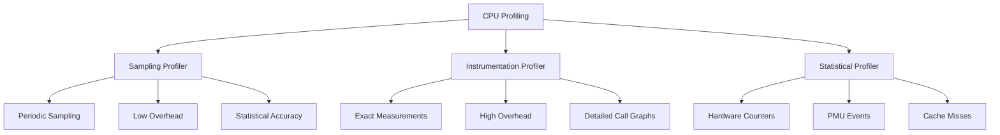
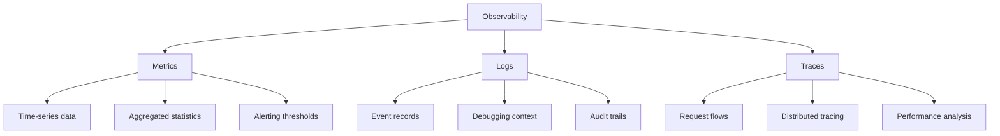
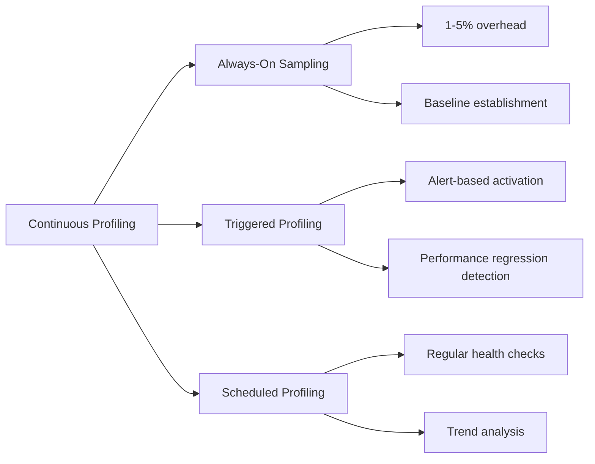
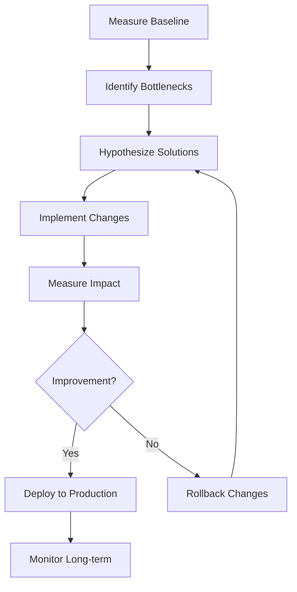
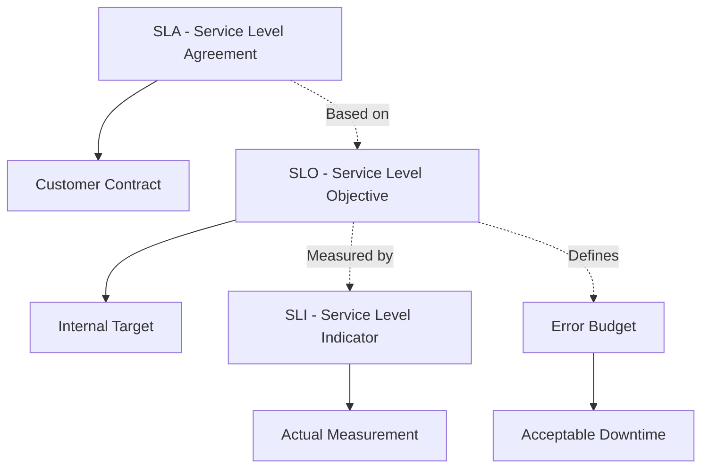

## Pengantar: Medical Check-up Digital

Profiling and Metrics adalah **dokter spesialis yang memantau kesehatan aplikasi**. Seperti dokter yang menggunakan berbagai alat diagnostik untuk memahami kondisi pasien, profiling tools memberikan insight mendalam tentang performa aplikasi, penggunaan resource, dan bottleneck yang mungkin terjadi.

## Jenis-Jenis Profiling: Spesialisasi Medis

### CPU Profiling - Kardiolog Digital
CPU profiling seperti **kardiolog yang memantau detak jantung sistem** - menganalisis di mana CPU time dihabiskan dan mengidentifikasi hotspots dalam kode.



### Memory Profiling - Ahli Gizi Sistem
| Profiling Type | Focus Area | Tools Example |
|----------------|------------|---------------|
| **Heap Profiling** | Memory allocation patterns | Valgrind, AddressSanitizer |
| **Leak Detection** | Memory leaks identification | LeakSanitizer, Instruments |
| **Fragmentation Analysis** | Memory layout optimization | jemalloc profiling |
| **GC Analysis** | Garbage collection behavior | GCViewer, GC logs |

## Profiling Techniques: Metodologi Diagnosis

### Sampling vs Instrumentation
Sampling profiling seperti **mengukur tekanan darah secara berkala**, sementara instrumentation seperti **memasang monitor jantung 24 jam**.

```
Sampling Profiler:
- Low overhead (1-5%)
- Statistical accuracy
- Good for production
- May miss short events

Instrumentation Profiler:  
- High overhead (10-100x)
- Exact measurements
- Development/testing only
- Catches all events
```

### Call Graph Analysis
```mermaid
graph TD
    A[main()] --> B[processData()]
    A --> C[initSystem()]
    B --> D[parseInput()]
    B --> E[computeResult()]
    E --> F[heavyComputation()]
    E --> G[cacheResult()]
    
    F -.->|90% CPU time| H[Performance Bottleneck]
```

## Modern Profiling Tools: Peralatan Medis Canggih

### Language-Specific Profilers
- **Java**: JProfiler, YourKit, async-profiler
- **Python**: cProfile, py-spy, memory_profiler  
- **C/C++**: gprof, perf, Intel VTune
- **JavaScript**: Chrome DevTools, clinic.js
- **Go**: go tool pprof, trace viewer

### System-Level Profilers
```bash
# Linux perf - Swiss Army Knife
perf record -g ./myapp          # Record with call graphs
perf report                     # Analyze results
perf top                        # Real-time profiling
perf stat ./myapp              # Hardware counters

# Intel VTune - Professional Grade
vtune -collect hotspots ./myapp
vtune -collect memory-access ./myapp
vtune -collect threading ./myapp
```

## Metrics Collection: Vital Signs Monitoring

### Application Metrics - Tanda Vital Aplikasi
| Metric Category | Examples | Purpose |
|----------------|----------|---------|
| **Throughput** | Requests/second, Transactions/minute | Capacity planning |
| **Latency** | Response time, Processing time | User experience |
| **Error Rates** | 4xx/5xx errors, Exception counts | Reliability |
| **Resource Usage** | CPU, Memory, Disk, Network | Infrastructure planning |

### Business Metrics - Health Indicators
- **Conversion rates** untuk e-commerce applications
- **User engagement** metrics untuk social platforms  
- **Revenue per user** untuk subscription services
- **Customer satisfaction** scores

## Observability Stack: Rumah Sakit Digital

### The Three Pillars


### Modern Observability Tools
- **Prometheus + Grafana**: Metrics collection dan visualization
- **ELK Stack**: Elasticsearch, Logstash, Kibana untuk logs
- **Jaeger/Zipkin**: Distributed tracing systems
- **OpenTelemetry**: Unified observability framework

## Performance Analysis Methodologies

### USE Method - Utilization, Saturation, Errors
Seperti **medical triage system** yang memprioritaskan masalah berdasarkan severity:

1. **Utilization**: How busy is the resource?
2. **Saturation**: How much extra work is queued?
3. **Errors**: Are there any error events?

### RED Method - Rate, Errors, Duration
Focus pada **user-facing metrics**:
- **Rate**: Requests per second
- **Errors**: Error rate percentage  
- **Duration**: Response time distribution

## Continuous Profiling: Health Monitoring 24/7

### Production Profiling Strategies


### Cloud-Native Profiling
- **Kubernetes integration** dengan sidecar containers
- **Service mesh observability** dengan Istio/Linkerd
- **Serverless profiling** untuk AWS Lambda, Google Cloud Functions
- **Container-aware profiling** dengan Docker insights

## Performance Optimization Workflow

### Measurement-Driven Optimization


### Common Optimization Patterns
| Pattern | Technique | Impact |
|---------|-----------|--------|
| **Caching** | Reduce expensive computations | High |
| **Batching** | Reduce I/O operations | Medium-High |
| **Lazy Loading** | Defer expensive operations | Medium |
| **Connection Pooling** | Reuse expensive resources | Medium |
| **Compression** | Reduce network/storage overhead | Low-Medium |

## Advanced Profiling Techniques

### Flame Graphs - Visual Diagnosis
Flame graphs seperti **X-ray yang menunjukkan struktur internal** performance bottlenecks:

```
Width = Time spent in function
Height = Call stack depth
Color = Different functions/modules
Hottest paths = Widest flames
```

### Differential Profiling
- **Before/after comparisons** untuk measuring optimization impact
- **A/B testing** dengan performance metrics
- **Regression detection** dalam CI/CD pipelines
- **Historical trending** untuk capacity planning

## Alerting dan SLA Management

### SLI/SLO/SLA Framework


### Intelligent Alerting
- **Anomaly detection** dengan machine learning
- **Alert fatigue prevention** dengan smart grouping
- **Escalation policies** berdasarkan severity
- **Runbook automation** untuk common issues

## Best Practices untuk Production

### Profiling Hygiene
- **Minimal overhead** dalam production (< 5%)
- **Sampling strategies** untuk large-scale systems
- **Data retention policies** untuk storage management
- **Privacy considerations** untuk sensitive data

### Team Culture
- **Performance budgets** dalam development process
- **Regular performance reviews** seperti code reviews
- **Shared responsibility** untuk system health
- **Learning from incidents** dengan blameless postmortems

---

*Catatan ini mengeksplorasi Profiling and Metrics sebagai essential practices untuk maintaining healthy, performant systems dalam modern software development.*