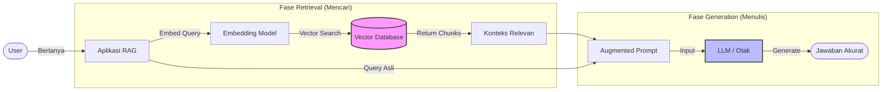

## Pengantar: Mahasiswa Genius dan Ujian Buku Terbuka

Bayangkan sebuah **[[LLM]]** (Large Language Model) seperti seorang mahasiswa genius yang memiliki ingatan luar biasa, namun "membeku" pada tanggal tertentu (saat pelatihan selesai). Jika Anda bertanya tentang peristiwa terkini atau data perusahaan pribadi, mahasiswa ini akan mencoba menebak jawabannya agar terlihat pintar—fenomena yang kita kenal sebagai **[[Hallucination]]** (berhalusinasi).

**RAG (Retrieval-Augmented Generation)** mengubah aturan mainnya. Alih-alih memaksa mahasiswa tersebut menjawab hanya dengan mengandalkan ingatan (Closed-Book Exam), kita memberinya akses ke perpustakaan referensi yang terpercaya (Open-Book Exam) saat menjawab pertanyaan.

## Mekanisme: Tiga Fase Ujian

Dalam arsitektur RAG, proses menjawab pertanyaan dibagi menjadi tiga langkah kognitif utama:

### 1. Indexing (Menyusun Buku Teks)
Sebelum ujian dimulai, kita harus merapikan materi. Data mentah (PDF, Docx, Web) dipecah menjadi potongan kecil (*chunks*) dan diterjemahkan menjadi koordinat matematika melalui proses **[[Embeddings]]**. Potongan-potongan ini kemudian disimpan dalam **[[Vector Database]]**, yang berfungsi sebagai "indeks perpustakaan" yang sangat efisien.

### 2. Retrieval (Mencari Halaman yang Relevan)
Saat pertanyaan diajukan (*Query*), sistem tidak langsung menjawab. Sistem bertindak seperti pustakawan:
*   Menerjemahkan pertanyaan menjadi koordinat makna.
*   Mencari potongan teks di **[[Vector Database]]** yang memiliki "kemiripan makna" (*semantic similarity*) paling dekat dengan pertanyaan.
*   Mengambil Top-K potongan teks yang paling relevan.

### 3. Generation (Menulis Jawaban)
Sistem kemudian menggabungkan **Pertanyaan Awal** + **Halaman Referensi** yang ditemukan, lalu menyerahkannya kepada **[[LLM]]**.
> *"Jawab pertanyaan ini berdasarkan referensi berikut..."*

Hasilnya adalah jawaban yang akurat, faktual, dan dapat dilacak sumbernya.

## Visualisasi: Alur Kerja Pengetahuan

Berikut adalah bagaimana data mengalir dari pertanyaan pengguna hingga menjadi jawaban yang terverifikasi.

*Penjelasan Diagram: Pengguna memberikan pertanyaan, sistem mencari "contekan" di database vektor, lalu menyuapkan contekan tersebut bersama pertanyaan ke LLM untuk dirangkai menjadi kalimat manusia.*

## Perbandingan: Belajar Hafalan vs. Buka Buku

Seringkali orang bingung memilih antara **[[Fine-Tuning]]** dan **RAG**. Mari kita gunakan analogi belajar.

| Fitur | [[Fine-Tuning]] (Belajar Hafalan) | [[RAG]] (Ujian Buku Terbuka) |
| :--- | :--- | :--- |
| **Metafora** | Belajar materi baru sampai hafal di luar kepala. | Membawa buku referensi saat ujian. |
| **Kekuatan** | Mengubah *gaya bicara* atau *perilaku* model. | Menambah *pengetahuan faktual* baru/privat. |
| **Update Data** | Sulit (harus pelatihan ulang/retrain). | Mudah (tinggal update/tambah dokumen di database). |
| **Akurasi** | Bisa berhalusinasi jika lupa. | Tinggi, karena berdasarkan referensi teks. |
| **Biaya** | Mahal (komputasi tinggi). | Relatif murah (hanya biaya storage & inference). |

## Refleksi: Jembatan Pengetahuan

RAG bukanlah tentang membuat AI menjadi lebih pintar secara kognitif, melainkan membuat AI lebih **berpengetahuan** dan **jujur**. Dalam ekosistem **[[Artificial Intelligence]]** modern, RAG adalah jembatan yang menghubungkan kemampuan bahasa yang fasih dengan fakta dunia nyata yang terus berubah.

Tanpa RAG, AI adalah penyair yang pandai membual. Dengan RAG, AI adalah analis riset yang teliti.
