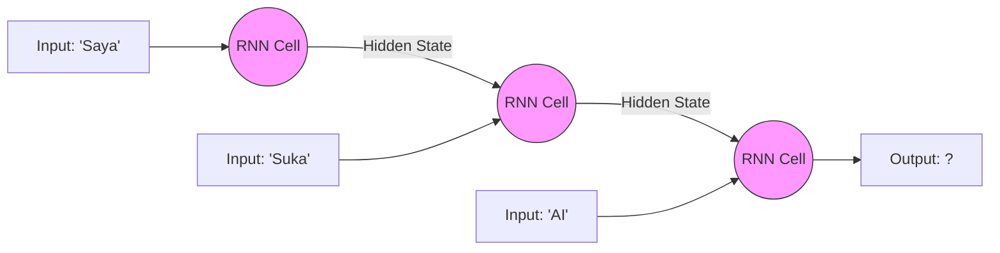

## Pengantar: Sang Pelari Estafet
Bayangkan sebuah **Lari Estafet** di mana setiap pelari tidak hanya membawa tongkat, tetapi juga "pesan" yang dibisikkan oleh pelari sebelumnya.
*   Pelari 1 berlari, lalu membisikkan pesan ke Pelari 2.
*   Pelari 2 menggabungkan pesan Pelari 1 dengan apa yang dia lihat sendiri, lalu membisikkan ke Pelari 3.
*   Dan seterusnya.

**Recurrent Neural Network (RNN)** bekerja persis seperti ini. Ia memproses data secara **berurutan (sekuensial)**. Berbeda dengan [[Transformer Architecture]] yang seperti pertemuan meja bundar (semua bicara sekaligus), RNN adalah antrian panjang di mana informasi dioper dari satu langkah waktu (time step) ke langkah berikutnya.

## Mekanisme Utama: The Loop

Kekuatan utama RNN adalah memiliki **Ingatan Jangka Pendek (Hidden State)**.
*   **Input**: Kata saat ini (misal: "makan").
*   **Hidden State (t-1)**: Konteks dari masa lalu (misal: "Saya", "sedang").
*   **Output**: Prediksi kata selanjutnya ("nasi").

Karena sifatnya yang berulang (recurrent), RNN sangat cocok untuk data yang memiliki urutan waktu, seperti:
*   Teks (kalimat adalah urutan kata).
*   Audio (suara adalah urutan gelombang).
*   Data saham (harga adalah urutan waktu).

## Masalah: Vanishing Gradient (Pikun)
Masalah terbesar dalam lari estafet pesan ini adalah **Lupa**.
*   Jika antriannya sangat panjang (misal: 100 pelari), Pelari ke-100 hampir pasti lupa apa pesan asli dari Pelari 1.
*   Dalam istilah teknis, ini disebut **Vanishing Gradient Problem**. Saat RNN mencoba belajar dari kesalahan di akhir kalimat, koreksinya "menghilang" sebelum sampai ke awal kalimat.
*   Akibatnya: RNN "Polos" buruk dalam memahami konteks panjang (misal: novel).

## Evolusi: Tas Punggung Memori (LSTM & GRU)
Untuk mengatasi kepikunan ini, diciptakan varian yang lebih canggih.

### 1. LSTM (Long Short-Term Memory)
Analogi: Pelari kini diberi **Buku Catatan** dan **Pena**.
*   Dia bisa memilih untuk **Mencatat** hal penting (Input Gate).
*   Dia bisa memilih untuk **Melupakan** hal tidak penting (Forget Gate).
*   Dia bisa memilih bagian mana yang mau **Dibaca** sekarang (Output Gate).
Dengan mekanisme "gerbang" (gate) ini, informasi penting bisa disimpan jauh lebih lama.

### 2. GRU (Gated Recurrent Unit)
Versi lebih sederhana dan efisien dari LSTM. Anggap saja buku catatannya lebih tipis tapi fungsinya mirip.

## Visualisasi: Alur Waktu

*Diagram di atas menunjukkan proses "Unrolling" (membuka gulungan) RNN, di mana output masa lalu menjadi input masa kini.*

## RNN di Era Modern?
Meskipun [[Transformer Architecture]] telah menggantikan RNN untuk sebagian besar tugas [[LLM]] karena kemampuannya memproses paralel, konsep RNN sedang "bangkit kembali" dalam bentuk baru.
*   Arsitektur seperti **Mamba** atau **RWKV** mencoba menggabungkan efisiensi RNN (hemat memori) dengan performa Transformer. Mereka adalah "Pelari Estafet Super Cepat" yang tidak mudah lupa.

## Refleksi: Pentingnya Urutan
RNN mengajarkan kita bahwa dalam bahasa, **urutan adalah segalanya**. "Ibu Budi" berbeda dengan "Budi Ibu". Meskipun kini kita punya metode yang lebih canggih, prinsip dasar "mengingat masa lalu untuk memprediksi masa depan" tetap menjadi fondasi kecerdasan buatan sekuensial.
