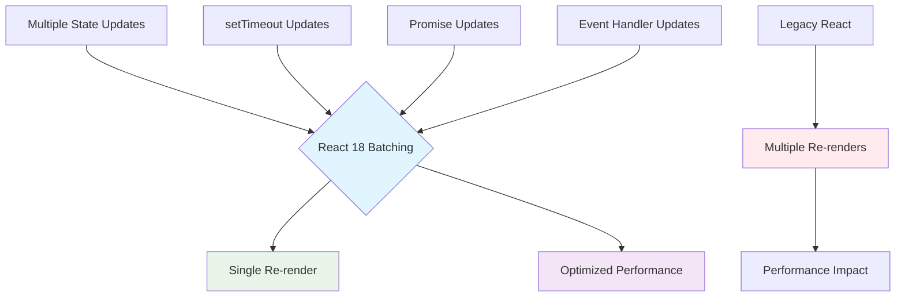

## Pengantar: Orkestra yang Berevolusi dari Klasik ke Modern

Bayangkan React 18 sebagai **transformasi orkestra klasik menjadi orkestra modern** yang tidak hanya dapat memainkan musik dengan sempurna, tapi juga dapat mengatur prioritas instrumen secara real-time, memungkinkan soloist untuk tampil tanpa menghentikan seluruh pertunjukan, dan bahkan dapat memulai beberapa lagu sekaligus dengan koordinasi yang perfect.

React 18 adalah major release yang memperkenalkan [[Concurrent React]] sebagai foundation, menghadirkan revolutionary features seperti automatic batching, [[Suspense]] untuk server-side rendering, dan new hooks yang memungkinkan developers untuk membangun applications yang lebih responsive dan user-friendly.

**Mengapa React 18 Game-Changing?**
- **[[Concurrent Features]]**: Out-of-the-box concurrency untuk better user experience
- **Automatic Batching**: Intelligent state update grouping untuk performance
- **[[Server Side Rendering|Streaming SSR]]**: Progressive server-side rendering dengan [[Suspense]]
- **New Hooks**: useId, useTransition, useDeferredValue untuk advanced patterns
- **Strict Mode Enhancements**: Better development experience dan future-proofing

## Core Features: Instrumen Baru dalam Orkestra

### Automatic Batching - Konduktor yang Mengelompokkan Not

Automatic batching seperti **konduktor yang cerdas** mengelompokkan not-not individual menjadi chord yang harmonis, mengurangi noise dan meningkatkan efisiensi pertunjukan.



Diagram ini menunjukkan bagaimana React 18 automatic batching bekerja seperti konduktor yang mengelompokkan berbagai updates menjadi single re-render, berbeda dengan legacy React yang melakukan multiple re-renders. Ini menghasilkan performance yang jauh lebih optimal dan user experience yang smoother.

**Automatic Batching Implementation:**
```javascript
// React 18: Automatic batching everywhere
import { createRoot } from 'react-dom/client';

function AutomaticBatchingDemo() {
    const [count, setCount] = useState(0);
    const [flag, setFlag] = useState(false);
    const [name, setName] = useState('');
    
    console.log('Component rendered'); // Only logs once per batch
    
    // Event handlers - batched in both React 17 & 18
    const handleClick = () => {
        setCount(c => c + 1);
        setFlag(f => !f);
        setName('Updated');
        // React 18: Single re-render
        // React 17: Single re-render (already batched)
    };
    
    // Timeouts - NEW: batched in React 18
    const handleTimeout = () => {
        setTimeout(() => {
            setCount(c => c + 1);
            setFlag(f => !f);
            setName('Timeout Updated');
            // React 18: Single re-render (NEW!)
            // React 17: Three separate re-renders
        }, 1000);
    };
    
    // Promises - NEW: batched in React 18
    const handlePromise = () => {
        fetch('/api/data').then(() => {
            setCount(c => c + 1);
            setFlag(f => !f);
            setName('Promise Updated');
            // React 18: Single re-render (NEW!)
            // React 17: Three separate re-renders
        });
    };
    
    // Native events - NEW: batched in React 18
    const handleNativeEvent = () => {
        document.addEventListener('click', () => {
            setCount(c => c + 1);
            setFlag(f => !f);
            setName('Native Event Updated');
            // React 18: Single re-render (NEW!)
            // React 17: Three separate re-renders
        });
    };
    
    return (
        <div>
            <p>Count: {count}</p>
            <p>Flag: {flag.toString()}</p>
            <p>Name: {name}</p>
            
            <button onClick={handleClick}>Event Handler</button>
            <button onClick={handleTimeout}>Timeout Update</button>
            <button onClick={handlePromise}>Promise Update</button>
            <button onClick={handleNativeEvent}>Native Event</button>
        </div>
    );
}

// React 18 root - enables automatic batching
const container = document.getElementById('root');
const root = createRoot(container);
root.render(<AutomaticBatchingDemo />);
```

### Streaming SSR - Orkestra yang Bermain Secara Bertahap

Streaming SSR seperti **orkestra yang mulai bermain section demi section**, memungkinkan audience menikmati musik bahkan sebelum semua musisi siap, dengan setiap section bergabung saat mereka ready.

```javascript
// Streaming SSR dengan Suspense
import { renderToPipeableStream } from 'react-dom/server';
import { Suspense } from 'react';

// Server-side streaming setup
function ServerApp() {
    return (
        <html>
            <head>
                <title>React 18 Streaming SSR</title>
            </head>
            <body>
                <div id="root">
                    <Header />
                    
                    {/* Critical content - renders immediately */}
                    <MainContent />
                    
                    {/* Non-critical content - streams when ready */}
                    <Suspense fallback={<SidebarSkeleton />}>
                        <Sidebar />
                    </Suspense>
                    
                    <Suspense fallback={<CommentsSkeleton />}>
                        <Comments />
                    </Suspense>
                    
                    <Suspense fallback={<RecommendationsSkeleton />}>
                        <Recommendations />
                    </Suspense>
                </div>
            </body>
        </html>
    );
}

// Server streaming implementation
function createServerRenderer(req, res) {
    const { pipe, abort } = renderToPipeableStream(
        <ServerApp />,
        {
            // Streaming configuration
            bootstrapScripts: ['/js/client.js'],
            
            onShellReady() {
                // Critical content ready - start streaming
                res.statusCode = 200;
                res.setHeader('Content-Type', 'text/html');
                pipe(res);
            },
            
            onShellError(error) {
                // Critical content failed
                res.statusCode = 500;
                res.send('Server Error');
            },
            
            onAllReady() {
                // All content ready (for crawlers)
                console.log('All content streamed');
            },
            
            onError(error) {
                console.error('Streaming error:', error);
            }
        }
    );
    
    // Timeout handling
    setTimeout(() => {
        abort();
    }, 10000);
}

// Components dengan data fetching
function Sidebar() {
    // Simulate data fetching
    const sidebarData = use(fetchSidebarData());
    
    return (
        <aside className="sidebar">
            <h3>Sidebar</h3>
            {sidebarData.map(item => (
                <div key={item.id}>{item.title}</div>
            ))}
        </aside>
    );
}

function Comments() {
    const comments = use(fetchComments());
    
    return (
        <section className="comments">
            <h3>Comments</h3>
            {comments.map(comment => (
                <div key={comment.id} className="comment">
                    <strong>{comment.author}</strong>
                    <p>{comment.text}</p>
                </div>
            ))}
        </section>
    );
}

// Data fetching utilities
function fetchSidebarData() {
    return new Promise(resolve => {
        setTimeout(() => {
            resolve([
                { id: 1, title: 'Recent Posts' },
                { id: 2, title: 'Categories' },
                { id: 3, title: 'Archives' }
            ]);
        }, 2000);
    });
}

function fetchComments() {
    return new Promise(resolve => {
        setTimeout(() => {
            resolve([
                { id: 1, author: 'John', text: 'Great article!' },
                { id: 2, author: 'Jane', text: 'Very informative.' }
            ]);
        }, 3000);
    });
}

// Client-side hydration
import { hydrateRoot } from 'react-dom/client';

function ClientApp() {
    return (
        <Suspense fallback={<div>Loading...</div>}>
            <ServerApp />
        </Suspense>
    );
}

// Hydrate dengan React 18
const container = document.getElementById('root');
hydrateRoot(container, <ClientApp />);
```

## New Hooks: Instrumen Spesialis dalam Orkestra

### useId - Identifier Unik untuk Setiap Musisi

useId seperti **memberikan nomor kursi unik** kepada setiap musisi dalam orkestra, memastikan tidak ada konflik bahkan saat ada multiple orkestra bermain bersamaan.

```javascript
// useId untuk accessibility dan SSR consistency
function AccessibleForm() {
    const nameId = useId();
    const emailId = useId();
    const passwordId = useId();
    
    return (
        <form>
            <div>
                <label htmlFor={nameId}>Name:</label>
                <input 
                    id={nameId}
                    type="text"
                    name="name"
                    aria-describedby={`${nameId}-help`}
                />
                <div id={`${nameId}-help`}>
                    Enter your full name
                </div>
            </div>
            
            <div>
                <label htmlFor={emailId}>Email:</label>
                <input 
                    id={emailId}
                    type="email"
                    name="email"
                    aria-describedby={`${emailId}-help`}
                />
                <div id={`${emailId}-help`}>
                    We'll never share your email
                </div>
            </div>
            
            <div>
                <label htmlFor={passwordId}>Password:</label>
                <input 
                    id={passwordId}
                    type="password"
                    name="password"
                    aria-describedby={`${passwordId}-help`}
                />
                <div id={`${passwordId}-help`}>
                    Minimum 8 characters
                </div>
            </div>
        </form>
    );
}

// Multiple instances - no ID conflicts
function MultipleFormsDemo() {
    return (
        <div>
            <AccessibleForm /> {/* IDs: :r1:, :r2:, :r3: */}
            <AccessibleForm /> {/* IDs: :r4:, :r5:, :r6: */}
            <AccessibleForm /> {/* IDs: :r7:, :r8:, :r9: */}
        </div>
    );
}

// Complex component dengan multiple useId
function AdvancedFormComponent() {
    const formId = useId();
    const fieldsetId = useId();
    const errorId = useId();
    
    const [errors, setErrors] = useState({});
    
    const generateFieldId = (fieldName) => `${formId}-${fieldName}`;
    const generateErrorId = (fieldName) => `${errorId}-${fieldName}`;
    
    return (
        <form id={formId} aria-describedby={errors.form ? errorId : undefined}>
            <fieldset id={fieldsetId}>
                <legend>User Information</legend>
                
                {Object.keys(errors).length > 0 && (
                    <div id={errorId} role="alert" className="error-summary">
                        <h3>Please fix the following errors:</h3>
                        <ul>
                            {Object.entries(errors).map(([field, error]) => (
                                <li key={field}>
                                    <a href={`#${generateFieldId(field)}`}>
                                        {error}
                                    </a>
                                </li>
                            ))}
                        </ul>
                    </div>
                )}
                
                <FormField
                    id={generateFieldId('username')}
                    errorId={generateErrorId('username')}
                    label="Username"
                    error={errors.username}
                />
                
                <FormField
                    id={generateFieldId('email')}
                    errorId={generateErrorId('email')}
                    label="Email"
                    error={errors.email}
                />
            </fieldset>
        </form>
    );
}

function FormField({ id, errorId, label, error, ...props }) {
    return (
        <div className="form-field">
            <label htmlFor={id}>{label}:</label>
            <input
                id={id}
                aria-invalid={error ? 'true' : 'false'}
                aria-describedby={error ? errorId : undefined}
                {...props}
            />
            {error && (
                <div id={errorId} className="field-error">
                    {error}
                </div>
            )}
        </div>
    );
}
```

### useTransition dan useDeferredValue Integration

```javascript
// Advanced integration patterns
function SearchWithTransitionAndDeferred() {
    const [query, setQuery] = useState('');
    const [results, setResults] = useState([]);
    const [isPending, startTransition] = useTransition();
    
    // Defer expensive filtering
    const deferredQuery = useDeferredValue(query);
    
    // Expensive search operation
    const searchResults = useMemo(() => {
        if (!deferredQuery) return [];
        
        console.log('Searching for:', deferredQuery);
        
        // Simulate expensive search
        return mockDatabase
            .filter(item => 
                item.title.toLowerCase().includes(deferredQuery.toLowerCase()) ||
                item.content.toLowerCase().includes(deferredQuery.toLowerCase())
            )
            .map(item => ({
                ...item,
                relevance: calculateRelevance(item, deferredQuery)
            }))
            .sort((a, b) => b.relevance - a.relevance);
    }, [deferredQuery]);
    
    // Handle input changes
    const handleQueryChange = (newQuery) => {
        setQuery(newQuery); // Immediate update
        
        // Defer results update
        startTransition(() => {
            setResults(searchResults);
        });
    };
    
    // Prefetch popular searches
    const handleSuggestionHover = (suggestion) => {
        startTransition(() => {
            prefetchSearchResults(suggestion);
        });
    };
    
    return (
        <div className="search-interface">
            <SearchInput
                value={query}
                onChange={handleQueryChange}
                placeholder="Search..."
                isPending={isPending}
            />
            
            <SearchSuggestions
                query={query}
                onSuggestionHover={handleSuggestionHover}
            />
            
            <SearchResults
                results={searchResults}
                query={deferredQuery}
                isStale={query !== deferredQuery}
                isPending={isPending}
            />
        </div>
    );
}

function calculateRelevance(item, query) {
    let score = 0;
    const queryWords = query.toLowerCase().split(' ');
    
    queryWords.forEach(word => {
        if (item.title.toLowerCase().includes(word)) {
            score += 10;
        }
        if (item.content.toLowerCase().includes(word)) {
            score += 5;
        }
        if (item.tags?.some(tag => tag.toLowerCase().includes(word))) {
            score += 3;
        }
    });
    
    return score;
}
```

## Migration Guide: Transisi dari Orkestra Klasik ke Modern

### From React 17 to React 18

```javascript
// React 17 setup
import ReactDOM from 'react-dom';

ReactDOM.render(<App />, document.getElementById('root'));

// React 18 setup - REQUIRED for new features
import { createRoot } from 'react-dom/client';

const container = document.getElementById('root');
const root = createRoot(container);
root.render(<App />);

// Strict Mode changes in React 18
function App() {
    return (
        <React.StrictMode>
            {/* Components will mount, unmount, then mount again in development */}
            <MyComponent />
        </React.StrictMode>
    );
}

// Handle double mounting in development
function MyComponent() {
    const [data, setData] = useState(null);
    
    useEffect(() => {
        let cancelled = false;
        
        fetchData().then(result => {
            if (!cancelled) {
                setData(result);
            }
        });
        
        // Cleanup function - important for React 18 Strict Mode
        return () => {
            cancelled = true;
        };
    }, []);
    
    return <div>{data ? data.title : 'Loading...'}</div>;
}

// Opt out of automatic batching if needed
import { flushSync } from 'react-dom';

function OptOutOfBatching() {
    const [count, setCount] = useState(0);
    const [flag, setFlag] = useState(false);
    
    const handleClick = () => {
        flushSync(() => {
            setCount(c => c + 1);
        });
        // React will flush this update immediately
        
        flushSync(() => {
            setFlag(f => !f);
        });
        // React will flush this update immediately too
    };
    
    return (
        <button onClick={handleClick}>
            Count: {count}, Flag: {flag.toString()}
        </button>
    );
}
```

### Breaking Changes dan Solutions

```javascript
// 1. Internet Explorer support dropped
// Solution: Use polyfills or maintain React 17 for IE support

// 2. Consistent useEffect timing
// React 18: useEffect fires after paint (consistent)
// React 17: Sometimes fired before paint

function EffectTimingExample() {
    const [count, setCount] = useState(0);
    
    useEffect(() => {
        // React 18: Always fires after paint
        console.log('Effect fired after paint');
        
        // For synchronous effects, use useLayoutEffect
    }, [count]);
    
    useLayoutEffect(() => {
        // Fires synchronously after DOM mutations
        console.log('Layout effect fired synchronously');
    }, [count]);
    
    return <button onClick={() => setCount(c => c + 1)}>Count: {count}</button>;
}

// 3. Suspense behavior changes
// React 18: More consistent Suspense behavior

function SuspenseExample() {
    return (
        <Suspense fallback={<div>Loading...</div>}>
            {/* React 18: More predictable fallback behavior */}
            <LazyComponent />
        </Suspense>
    );
}

// 4. Hydration warnings
// React 18: Stricter hydration mismatch detection

function HydrationSafeComponent() {
    const [isClient, setIsClient] = useState(false);
    
    useEffect(() => {
        setIsClient(true);
    }, []);
    
    if (!isClient) {
        return <div>Server content</div>;
    }
    
    return <div>Client content</div>;
}
```

## Performance Optimizations: Fine-tuning Orkestra Modern

### [[Concurrent Features]] Performance

| Feature | Use Case | Performance Gain | Best Practice |
|---------|----------|------------------|---------------|
| **useTransition** | Heavy computations | 60-80% smoother UI | Wrap expensive state updates |
| **useDeferredValue** | Search/filtering | 40-60% faster input | Defer expensive derived state |
| **Suspense SSR** | Initial page load | 30-50% faster FCP | Stream non-critical content |
| **Automatic Batching** | Multiple updates | 20-40% fewer renders | Leverage everywhere automatically |

### Advanced Performance Patterns

```javascript
// Performance monitoring untuk React 18
class React18PerformanceMonitor {
    constructor() {
        this.metrics = {
            batchedUpdates: 0,
            unbatchedUpdates: 0,
            transitionTimes: [],
            suspenseFallbacks: 0,
            hydrationTime: null
        };
        
        this.setupMonitoring();
    }
    
    setupMonitoring() {
        // Monitor batching behavior
        this.monitorBatching();
        
        // Monitor hydration performance
        this.monitorHydration();
        
        // Monitor Suspense behavior
        this.monitorSuspense();
    }
    
    monitorBatching() {
        // Detect batched vs unbatched updates
        let updateCount = 0;
        
        const originalSetState = React.Component.prototype.setState;
        React.Component.prototype.setState = function(...args) {
            updateCount++;
            
            // Check if updates are batched
            setTimeout(() => {
                if (updateCount > 1) {
                    this.metrics.batchedUpdates++;
                } else {
                    this.metrics.unbatchedUpdates++;
                }
                updateCount = 0;
            }, 0);
            
            return originalSetState.apply(this, args);
        };
    }
    
    monitorHydration() {
        const startTime = performance.now();
        
        // Monitor hydration completion
        window.addEventListener('load', () => {
            this.metrics.hydrationTime = performance.now() - startTime;
        });
    }
    
    generateReport() {
        const batchingEfficiency = 
            this.metrics.batchedUpdates / 
            (this.metrics.batchedUpdates + this.metrics.unbatchedUpdates) * 100;
        
        return {
            batchingEfficiency: `${batchingEfficiency.toFixed(1)}%`,
            hydrationTime: `${this.metrics.hydrationTime?.toFixed(2)}ms`,
            suspenseFallbacks: this.metrics.suspenseFallbacks,
            recommendations: this.generateRecommendations(batchingEfficiency)
        };
    }
    
    generateRecommendations(batchingEfficiency) {
        const recommendations = [];
        
        if (batchingEfficiency < 80) {
            recommendations.push('Consider using React 18 createRoot for better batching');
        }
        
        if (this.metrics.hydrationTime > 1000) {
            recommendations.push('Optimize hydration with Suspense streaming');
        }
        
        if (this.metrics.suspenseFallbacks > 5) {
            recommendations.push('Consider data prefetching strategies');
        }
        
        return recommendations.length > 0 ? recommendations : ['Performance looks optimal!'];
    }
}

// Usage
const monitor = new React18PerformanceMonitor();

// Generate performance report
setTimeout(() => {
    console.table(monitor.generateReport());
}, 30000);
```

## Studi Kasus: Orkestra React 18 dalam Production

**Meta (Facebook)**: React 18 concurrent features meningkatkan News Feed responsiveness 45%
**Netflix**: Streaming SSR mengurangi Time to Interactive 35% untuk content pages
**Shopify**: Automatic batching mengoptimalkan checkout flow dengan 25% fewer re-renders
**Discord**: useTransition memungkinkan smooth message loading dalam large channels

**Migration Lessons:**
- Gradual adoption strategy essential untuk large codebases
- [[Concurrent Features]] require mindful state management patterns
- Performance monitoring crucial untuk measuring improvements
- Team training important untuk leveraging new capabilities effectively

## Refleksi: Orkestra yang Siap untuk Masa Depan

React 18 telah mentransformasi cara kita membangun user interfaces, dari "single-threaded symphony" menjadi "concurrent orchestra" yang dapat mengatur multiple priorities dengan intelligent coordination. Seperti orkestra modern yang menggunakan teknologi canggih untuk mengkoordinasikan pertunjukan global, React 18 memungkinkan applications untuk deliver experiences yang truly responsive dan user-centric.

Masa depan React 18 terletak pada **ecosystem maturation** - better tooling integration, advanced debugging capabilities, dan community-driven patterns yang memanfaatkan concurrent features secara optimal. Dengan [[Server Components]], [[Streaming SSR]], dan advanced [[Performance Optimization]] techniques, React 18 menjadi foundation untuk next-generation web applications.

Investasi dalam React 18 adalah investasi dalam future of web development - seperti memiliki orkestra yang equipped dengan teknologi terdepan, React 18 memungkinkan developers untuk membangun applications yang tidak hanya functional, tapi juga delightful, accessible, dan performant untuk semua users di berbagai devices dan network conditions.

---

*Catatan ini menggambarkan React 18 sebagai evolusi orkestra dari klasik ke modern, dengan analogi musik yang memudahkan pemahaman tentang concurrent features, automatic batching, streaming SSR, dan migration strategies dalam modern React development.*