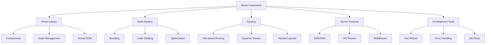

# Apa itu React Framework?

React Framework adalah layer tambahan di atas React library yang menyediakan struktur, konvensi, dan fitur-fitur tambahan untuk membangun aplikasi web yang lebih kompleks dan production-ready.

## Perbedaan React Library vs React Framework

### React Library
React sendiri adalah **library** untuk membangun user interfaces, khususnya untuk:
- Membuat komponen UI yang reusable
- Mengelola state aplikasi
- Handling events dan lifecycle
- Virtual DOM untuk performa optimal

### React Framework
React Framework menambahkan layer di atas React library dengan:
- **Routing system** - Navigasi antar halaman
- **Build tools** - Bundling, compilation, optimization
- **Server-side rendering** - SEO dan performa
- **File conventions** - Struktur proyek yang konsisten
- **Development tools** - Hot reload, debugging
- **Production optimizations** - Code splitting, caching

## Mengapa Butuh React Framework?

### 1. Kompleksitas Setup
Membangun aplikasi React dari nol memerlukan konfigurasi yang kompleks:

```javascript
// Manual setup yang diperlukan tanpa framework:
// - Webpack configuration
// - Babel setup
// - ESLint configuration  
// - Development server
// - Production build process
// - Code splitting
// - Asset optimization
```

### 2. Best Practices Built-in
Framework menyediakan best practices secara default:
- File structure yang konsisten
- Performance optimizations
- Security considerations
- SEO-friendly setup

### 3. Developer Experience
- Hot module replacement
- Error boundaries
- Development tools
- TypeScript support out-of-the-box

## Popular React Frameworks

### [[NextJS]]
- **Full-stack framework** dengan SSR/SSG
- **File-based routing**
- **API routes** untuk backend functionality
- **Built-in optimizations** (images, fonts, scripts)
- **Deployment** terintegrasi dengan Vercel

### Gatsby
- **Static site generator** fokus pada performa
- **GraphQL** data layer
- **Plugin ecosystem** yang kaya
- **Progressive Web App** features

### Remix
- **Full-stack framework** dengan fokus pada web standards
- **Nested routing**
- **Data loading** yang optimal
- **Progressive enhancement**

### Create React App (CRA)
- **Starter template** untuk React applications
- **Zero configuration** setup
- **Build scripts** yang sudah dikonfigurasi
- **Testing** setup included

## Kapan Menggunakan Framework vs Library

### Gunakan React Library Ketika:
- Membangun komponen untuk aplikasi existing
- Butuh kontrol penuh atas build process
- Aplikasi sederhana dengan requirements khusus
- Integrating React ke dalam aplikasi non-React

### Gunakan React Framework Ketika:
- Membangun aplikasi web lengkap
- Butuh SEO optimization
- Memerlukan server-side rendering
- Tim development yang besar
- Deadline yang ketat

## Arsitektur React Framework



## Fitur Umum React Framework

### 1. Routing System
```typescript
// File-based routing (Next.js style)
pages/
├── index.tsx          // Route: /
├── about.tsx          // Route: /about
├── blog/
│   ├── index.tsx      // Route: /blog
│   └── [slug].tsx     // Route: /blog/[slug]
└── api/
    └── users.ts       // API Route: /api/users
```

### 2. Data Fetching
```typescript
// Server-side data fetching
export async function getServerSideProps() {
  const data = await fetch('https://api.example.com/data')
  return {
    props: { data }
  }
}

// Static generation
export async function getStaticProps() {
  const posts = await getPosts()
  return {
    props: { posts },
    revalidate: 60 // ISR - revalidate every 60 seconds
  }
}
```

### 3. Built-in Optimizations
```typescript
// Image optimization
import Image from 'next/image'

function Gallery() {
  return (
    <Image
      src="/hero.jpg"
      alt="Hero"
      width={800}
      height={600}
      priority // Load immediately
      placeholder="blur" // Show blur while loading
    />
  )
}

// Font optimization
import { Inter } from 'next/font/google'

const inter = Inter({ subsets: ['latin'] })

export default function Layout({ children }) {
  return (
    <html className={inter.className}>
      <body>{children}</body>
    </html>
  )
}
```

### 4. Development Experience
```typescript
// Hot module replacement
if (module.hot) {
  module.hot.accept()
}

// Error boundaries
function ErrorBoundary({ children }) {
  return (
    <ErrorBoundary
      fallback={<div>Something went wrong</div>}
      onError={(error) => console.log(error)}
    >
      {children}
    </ErrorBoundary>
  )
}
```

## Memilih React Framework yang Tepat

### Pertimbangan Utama

#### 1. Jenis Aplikasi
- **Static sites** → Gatsby, Next.js (SSG)
- **Dynamic apps** → Next.js, Remix
- **E-commerce** → Next.js dengan Shopify/Stripe
- **Blogs/CMS** → Gatsby, Next.js

#### 2. Performance Requirements
- **SEO critical** → Next.js, Gatsby
- **Real-time apps** → Next.js dengan WebSocket
- **Large datasets** → Remix dengan optimized data loading

#### 3. Team Expertise
- **React beginners** → Create React App, Next.js
- **Full-stack developers** → Next.js, Remix
- **Static site focus** → Gatsby

#### 4. Deployment Target
- **Vercel** → Next.js (optimal)
- **Netlify** → Gatsby, Next.js
- **Traditional hosting** → Static export
- **Self-hosted** → Any framework

## Best Practices dengan React Framework

### 1. Project Structure
```
src/
├── components/        # Reusable UI components
│   ├── ui/           # Basic components (Button, Input)
│   └── features/     # Feature-specific components
├── pages/            # Route components
├── hooks/            # Custom React hooks
├── utils/            # Utility functions
├── styles/           # Global styles
└── types/            # TypeScript definitions
```

### 2. Performance Optimization
```typescript
// Code splitting
const DynamicComponent = dynamic(() => import('./HeavyComponent'), {
  loading: () => <Spinner />,
  ssr: false
})

// Memoization
const ExpensiveComponent = memo(({ data }) => {
  const processedData = useMemo(() => 
    processLargeDataset(data), [data]
  )
  
  return <div>{processedData}</div>
})
```

### 3. State Management
```typescript
// Context for global state
const AppContext = createContext()

// Custom hooks for state logic
function useAuth() {
  const [user, setUser] = useState(null)
  
  const login = useCallback(async (credentials) => {
    const user = await authenticate(credentials)
    setUser(user)
  }, [])
  
  return { user, login }
}
```

## Migrasi dari Library ke Framework

### Langkah Migrasi

#### 1. Assessment
- Evaluasi aplikasi existing
- Identifikasi pain points
- Tentukan target framework

#### 2. Incremental Migration
```typescript
// Gradual migration approach
// 1. Setup framework di folder baru
// 2. Migrate komponen satu per satu
// 3. Update routing secara bertahap
// 4. Migrate state management
// 5. Update build process
```

#### 3. Testing Strategy
- Unit tests untuk komponen
- Integration tests untuk pages
- E2E tests untuk user flows
- Performance testing

## Kesimpulan

React Framework menyediakan foundation yang solid untuk membangun aplikasi React yang scalable dan maintainable. Dengan memilih framework yang tepat, developer dapat:

- **Fokus pada business logic** daripada boilerplate
- **Mendapatkan best practices** secara default
- **Meningkatkan developer experience**
- **Optimasi performa** otomatis
- **Deployment** yang lebih mudah

**Rekomendasi**:
- **Pemula**: Mulai dengan [[NextJS]] atau Create React App
- **Production apps**: [[NextJS]] untuk full-stack, Gatsby untuk static
- **Learning**: Coba berbagai framework untuk memahami trade-offs

---

**Related Notes:**
- [[NextJS]] - Framework React yang populer
- [[Server Side Rendering]] - Rendering di server
- [[Static Site Generation]] - Generate static files
- [[Web Development]] - Pengembangan web modern

**External Links:**
- [[React Documentation::https://react.dev]]
- [[Next.js Framework::https://nextjs.org]]
- [[Gatsby Framework::https://www.gatsbyjs.com]]